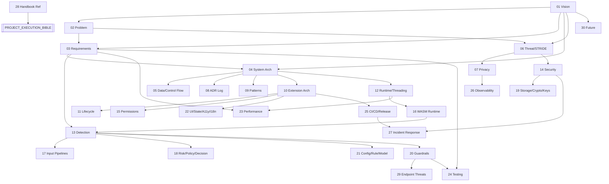

# 00 — MASTER INDEX & REPOSITORY MAP

**Document ID:** SS-BP-000
**Classification:** Internal Engineering — Principal Review
**Version:** 1.1.0
**Last Updated:** 2026-07-12
**Owner:** Technical Program Manager, Principal Platform Architect
**Purpose:** The single entry point to the Sentinel Shield AI engineering blueprint repository. Defines the authoritative document set, the source-of-truth hierarchy, reading order, and the cross-document dependency graph.

**Series status (v1.1.0):** All PART_01–PART_30 files are present on disk. See `FINAL_COMPLETENESS_AUDIT.md` for verification of defects DEF-01…DEF-07, endpoint coverage, and cross-references.

**Implementation gate:** `ARCHITECTURE_FREEZE_v1.0.md` — **PRODUCTION ARCHITECTURE CERTIFIED / IMPLEMENTATION APPROVED / DESIGN FREEZE COMPLETE**.  
Obey `DESIGN_OWNERSHIP_MATRIX.md` (single owners + canonical constants). Contradictions closed in `SINGLE_SOURCE_OF_TRUTH_REPORT.md`. Traceability: `REQUIREMENTS_TRACEABILITY_MATRIX.md`.

---

## 1. Source-of-Truth Hierarchy

The repository contains three tiers of documents. When two documents conflict, the higher-authority tier wins.

| Tier | Documents | Authority |
|---|---|---|
| **1. Blueprints** | `blueprint/PART_NN_*.md` | **Authoritative** for the browser extension (the product). Each subsystem's engineering contract. |
| **2. Handbook** | `handbook/PROJECT_EXECUTION_BIBLE.md` | Authoritative for *how the team works* (process, order, gates). Never overrides a blueprint's technical contract. |
| **3. Master Plan** | `implementation_plan.md` | High-level companion / onboarding narrative covering 50 topics. Where it disagrees with a `PART_NN`, the `PART_NN` wins. Backend/API/DB sections are **Phase-4-optional** (enterprise), not core. |

Conflict resolution escalates to the Engineering Director (see handbook).

---

## 2. Complete Blueprint Series (30 Parts)

Legend: **[EXISTING]** present before the audit · **[NEW]** created in the audit cycle.

| Part | Title | Status | Primary Domain |
|---|---|---|---|
| 00 | Master Index & Repository Map | [NEW] | Meta |
| — | Repository Audit Report | [NEW] | Meta |
| 01 | Executive Vision | [EXISTING] | Product |
| 02 | Real-World Problem Analysis | [EXISTING] | Security research |
| 03 | Product Requirements | [EXISTING] | Product |
| 04 | System Architecture | [EXISTING] | Architecture |
| 05 | Data Flow & Control Flow (Diagrams) | [NEW] | Architecture |
| 06 | Threat Model, STRIDE & Abuse Cases | [NEW] | Security |
| 07 | Privacy & Data Governance | [NEW] | Privacy |
| 08 | Architectural Decision Records (Log) | [NEW] | Architecture |
| 09 | Design Patterns & Engineering Principles | [NEW] | Architecture |
| 10 | Browser Extension Architecture | [EXISTING] | Extension |
| 11 | Extension Lifecycle | [NEW] | Extension |
| 12 | Runtime Pipeline, Threading & Memory Model | [NEW] | Runtime |
| 13 | Detection Engine | [EXISTING] | Detection |
| 14 | Security | [EXISTING] | Security |
| 15 | Permissions & Sandboxing | [NEW] | Extension |
| 16 | WASM Runtime | [NEW] | Runtime |
| 17 | Input Pipelines (OCR/PDF/Image/Clipboard/Paste/Drag-Drop/Archive/Screen) | [NEW] | Detection |
| 18 | Risk, Policy, Decision & Redaction Engines | [NEW] | Detection |
| 19 | Storage, Encryption & Key Management | [NEW] | Security |
| 20 | Guardrails (Bypass Library) | [EXISTING] | Security |
| 21 | Configuration, Rule, Signature & Model Management | [NEW] | Detection |
| 22 | UI Component System, State, Accessibility & i18n | [NEW] | Frontend |
| 23 | Performance Budget, Benchmarks, Load & Stress | [NEW] | Performance |
| 24 | Testing Strategy & Test Case Library | [NEW] | QA |
| 25 | CI/CD, Build, Release Engineering & Versioning | [NEW] | DevOps |
| 26 | Observability & Telemetry | [NEW] | DevOps |
| 27 | Incident Response, Runbooks & Post-Mortems | [NEW] | DevOps/Security |
| 28 | Engineering Handbook (Reference) | [NEW] | Process |
| 29 | Endpoint Interception Threat Models | [NEW] | Security |
| 30 | Future Extensibility & Roadmap | [NEW] | Product |

---

## 3. Reading Order by Role

| Role | Recommended Order |
|---|---|
| **New engineer (Day 1)** | Handbook → 00 → 01 → 04 → 05 → 09 → then their subsystem |
| **Detection engineer** | 02 → 13 → 17 → 18 → 21 → 20 → 24 |
| **Extension engineer** | 10 → 11 → 12 → 15 → 16 → 22 |
| **Security reviewer** | Audit Report → 06 → 07 → 14 → 19 → 20 → 29 → 27 |
| **Privacy reviewer** | 07 → 01 §NOBJ → 19 → 26 |
| **DevOps / release** | 25 → 26 → 27 → 11 |
| **QA** | 03 → 24 → 23 → 20 → 29 |
| **Performance** | 23 → 12 → 16 → 17 |
| **TPM / leadership** | 01 → 03 → Audit Report → 30 → Handbook |

---

## 4. Document Dependency Graph

---

## 5. Standard Subsystem Template (Mandate Step 4)

Every subsystem-describing blueprint (parts 11, 12, 15, 16, 17, 18, 19, 21, 22) documents each subsystem against these **20 fields**. Reviewers check for all 20.

1. Purpose
2. Responsibilities
3. Public Interfaces
4. Internal Interfaces
5. Data Flow
6. Control Flow
7. Lifecycle
8. Dependencies
9. Memory Usage
10. CPU Budget
11. Latency Budget
12. Failure Modes
13. Recovery Strategy
14. Security Concerns
15. Privacy Concerns
16. Performance Concerns
17. Testing Strategy
18. Production Checklist
19. Future Improvements
20. Open Risks (register entry)

## 6. Standard Endpoint Template (Mandate Step 5)

Every interception endpoint (paste, file-upload, drag-drop, clipboard, screen-capture, programmatic-input) in PART_29 documents these **14 fields**:

1. Attack Surface
2. Threat Model
3. Abuse Cases
4. Known Bypasses
5. Potential Future Bypasses
6. Detection Strategy
7. Mitigation Strategy
8. Implementation Order
9. Performance Cost
10. Expected Accuracy
11. False Positive Analysis
12. False Negative Analysis
13. Stress Test Strategy
14. Regression Test Strategy

---

## 7. Diagram Standard

All diagrams are authored in **Mermaid** (renderable in GitHub, VS Code, Cursor). ASCII diagrams in EXISTING docs are retained for now but are superseded by the Mermaid equivalents in PART_05. New docs never use ASCII art for flows, state machines, or graphs.

Required diagram inventory (mandate Step 6) and its home document:

| Diagram | Home |
|---|---|
| System Architecture | 05 |
| Runtime Flow | 05 |
| Extension Lifecycle | 11 |
| Service Worker Lifecycle | 11 |
| Offscreen Document Flow | 11 / 16 |
| OCR Pipeline | 17 |
| Detection Pipeline | 05 / 13 |
| Risk / Decision / Policy Engine | 18 |
| Thread Model | 12 |
| Event Flow | 05 |
| State Machine | 11 |
| Sequence Diagrams (scan) | 05 |
| Deployment Diagram | 25 |
| CI/CD Pipeline | 25 |
| Browser Permission Graph | 15 |
| Storage Architecture | 19 |
| Dependency / Module Dependency Graph | 09 / 25 |
| Build Pipeline | 25 |

---

## 8. Document Metadata Convention

Every blueprint begins with the same header block (ID `SS-BP-NNN`, Classification, Version, Last Updated, Owner, Reviewers) and ends with a Production Checklist and Future Improvements section. This convention is enforced in review (see PART_28 §Documentation Standard).

---

## 9. Defect Tracking

The must-fix defects DEF-01…DEF-07 (see Repository Audit Report §4) are resolved in their owner documents. Each owner document contains a "Resolved Defects" note where applicable. No document may reference a non-existent document (CI doc-lint check, PART_25).
