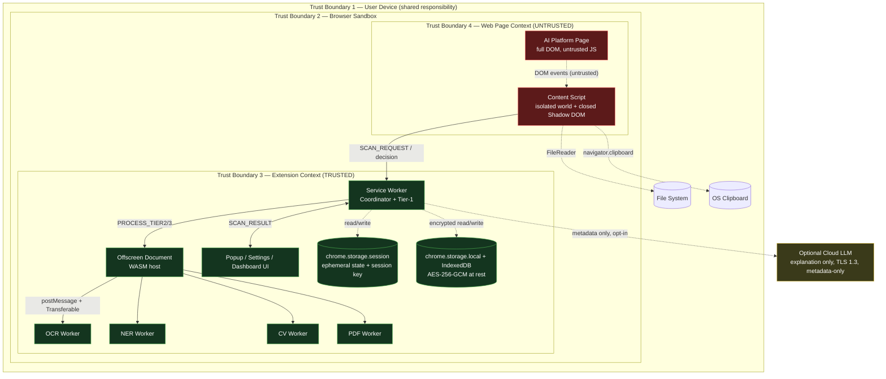
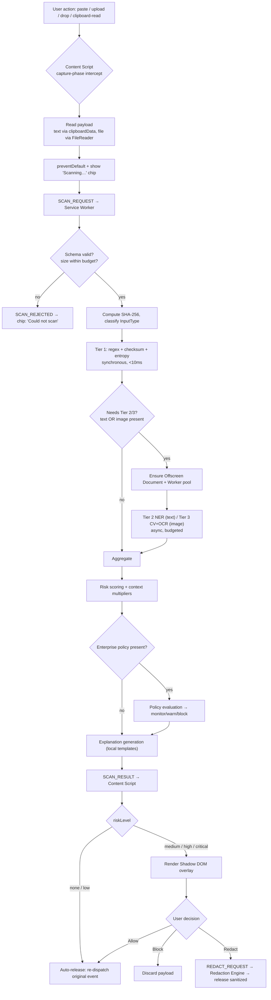
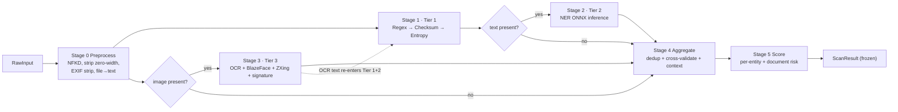
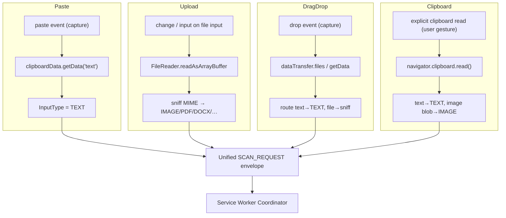
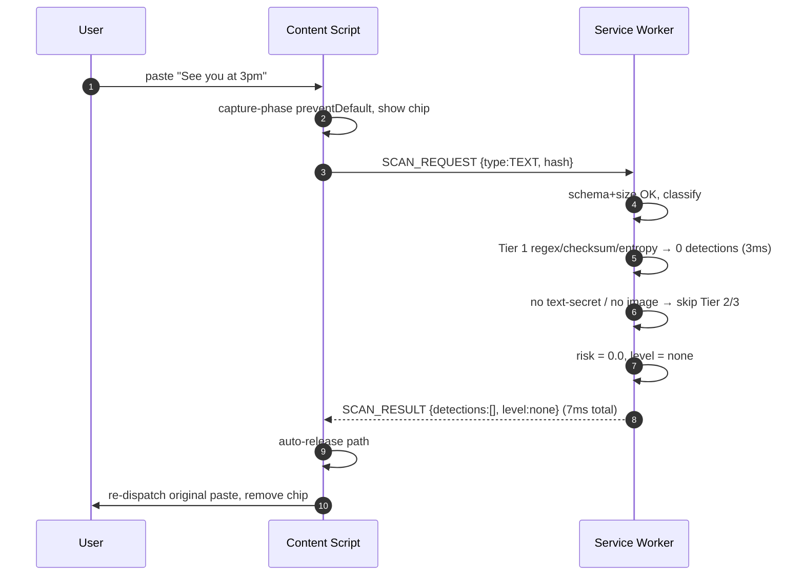
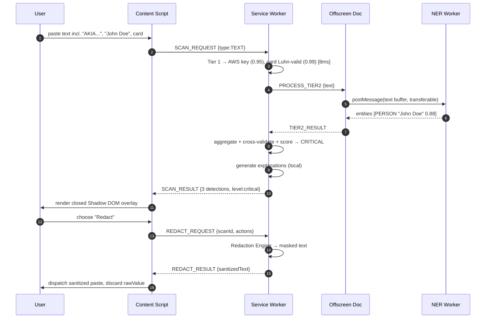
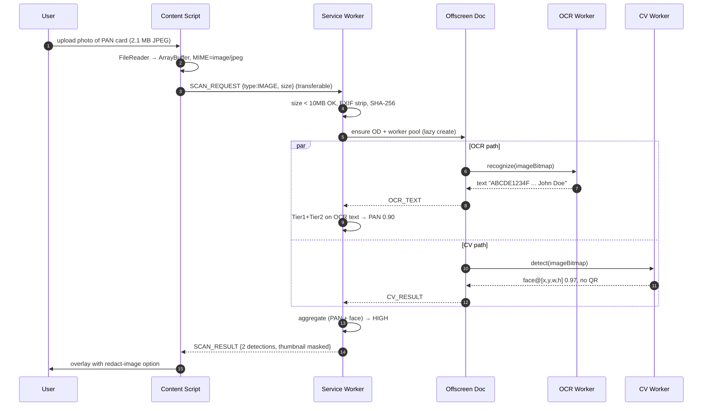
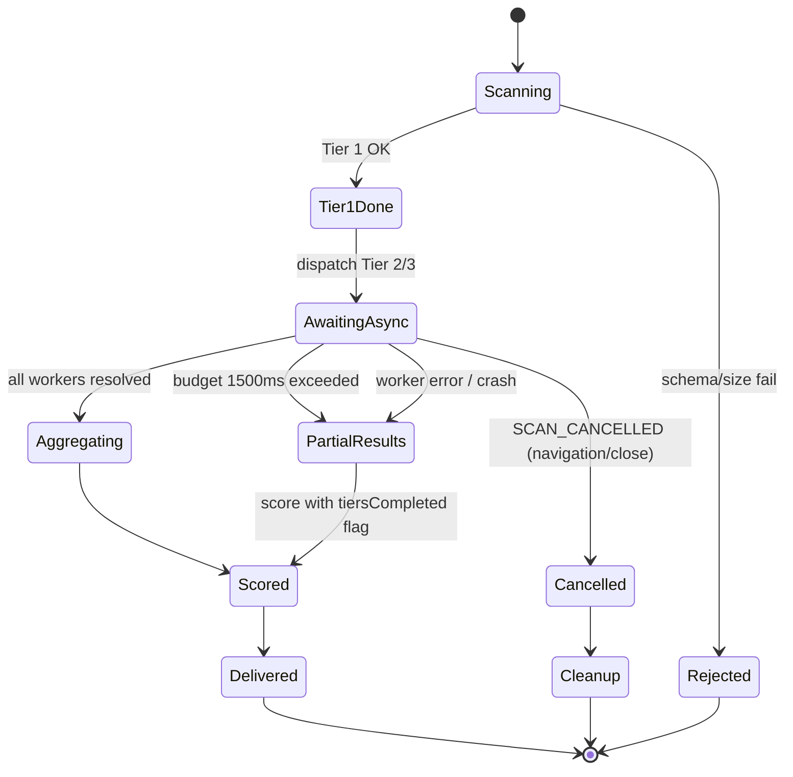
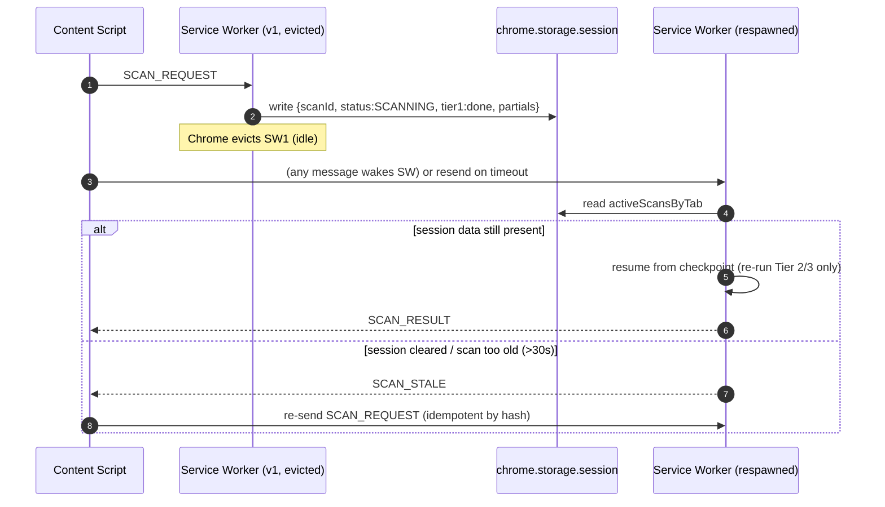
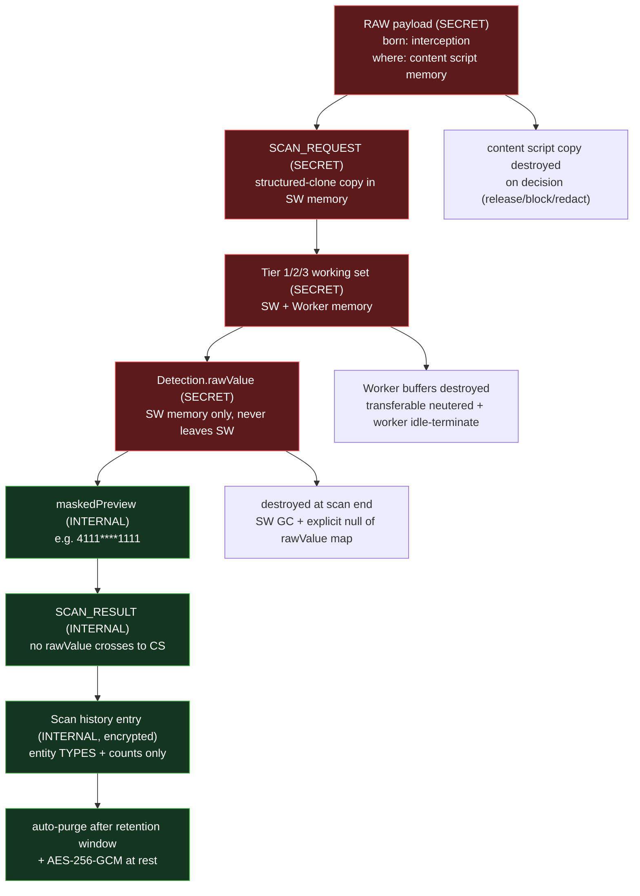

# PART 05 — DATA FLOW & CONTROL FLOW

**Document ID:** SS-BP-005
**Classification:** Internal Engineering — Principal Review
**Version:** 1.0.0
**Last Updated:** 2026-07-12
**Owner:** Principal Platform Architect, Principal Runtime Engineer
**Reviewers:** Principal Security Architect, Distinguished AI Engineer, Principal Performance Engineer

---

## Executive Summary

This is the diagram-centric reference for Sentinel Shield AI. It renders — in Mermaid, never ASCII — every flow that matters: the component graph across trust boundaries, the end-to-end runtime scan, the detection pipeline, the four interception event flows (paste, upload, drag-drop, clipboard), and the control-flow branches for errors, timeouts, cancellation, and Service-Worker-restart resumption. It closes with a data-classification flow that tracks every byte of sensitive data — where it is born, how long it lives, and exactly where it is destroyed.

The subsystem documented here against the standard 20-field template (see `c:\Users\shria\Desktop\Sentinal shield\blueprint\00_MASTER_INDEX.md` §5) is **the scan pipeline** — the logical path a unit of outbound data travels from interception in the content script to a released, blocked, or redacted outcome. This document supersedes the ASCII trust-boundary and data-flow diagrams in `c:\Users\shria\Desktop\Sentinal shield\blueprint\PART_04_SYSTEM_ARCHITECTURE.md` §4.2 and §6.3.

---

## 1. Dependencies

| Dependency | Type | What this document consumes |
|---|---|---|
| `c:\Users\shria\Desktop\Sentinal shield\blueprint\PART_04_SYSTEM_ARCHITECTURE.md` | Authoritative | Component inventory, trust boundaries, Coordinator-Processor model |
| `c:\Users\shria\Desktop\Sentinal shield\blueprint\PART_13_DETECTION_ENGINE.md` | Authoritative | Tier ordering, pipeline stages, confidence scoring |
| `c:\Users\shria\Desktop\Sentinal shield\blueprint\PART_01_EXECUTIVE_VISION.md` | Authoritative | Design principles, NOBJ-005 (no raw PII persisted), IPC envelope |
| Chrome Manifest V3 API | Platform constraint | Service Worker lifetime, offscreen document, `chrome.storage.session` |

---

## 2. System Architecture — Component Graph Across Trust Boundaries

Every node is placed inside the trust boundary that owns it. Solid edges are typed IPC; dashed edges are storage or file-system access. Note the invariant: the content script never talks to the offscreen document directly.

**Boundary-crossing controls.** Every arrow that crosses a trust boundary is validated:

| Crossing | Direction | Control |
|---|---|---|
| AI Page → Content Script | inbound (untrusted) | Capture-phase listeners; no page JS can read our isolated world; closed Shadow DOM |
| Content Script → Service Worker | inbound to trusted | JSON-Schema validation; `sender.tab.id` set by receiver, never by sender; rate limit **`MAX_SCANS_PER_MIN_PER_TAB=20`** (`DESIGN_OWNERSHIP_MATRIX.md` §3) |
| Service Worker → Offscreen | intra-trusted | Structured-clone payloads; result objects `Object.freeze`d |
| Offscreen → Worker | intra-trusted | Transferable `ArrayBuffer` (zero-copy); worker cannot touch `chrome.*` |
| Service Worker → Cloud LLM | outbound | TLS 1.3, cert validation, entity-type metadata only, opt-in |

---

## 3. Runtime Flow — End-to-End Scan

**Global budget.** A single per-scan processing budget of **1500 ms** governs the entire async portion (Tier 2 + Tier 3 + aggregation). If the budget is exceeded, the coordinator returns partial results with `tiersCompleted` reflecting only what finished (see ADR-025 in `PART_08`). Tier 1 is never subject to the budget because it is synchronous and sub-10ms.

---

## 4. Detection Pipeline (Logical Tiers)

The OCR loop is deliberate: text extracted from an image is fed back through Tier 1 and Tier 2 so that a credit-card number photographed on a card is Luhn-validated exactly like a pasted one.

---

## 5. Event Flow — The Four Interception Endpoints

All four endpoints normalize to a single `SCAN_REQUEST` envelope (see `PART_01` §8), so the coordinator has exactly one entry contract regardless of interception source. Per-endpoint attack surface and bypass analysis lives in `PART_29`.

---

## 6. Sequence Diagram — Clean Paste Released

For a clean input the user perceives no overlay and near-zero latency (P50 ~7 ms). The overlay is reserved for `medium+` risk per Principle 7 (human-in-the-loop only where it matters).

---

## 7. Sequence Diagram — Risky Paste → Overlay → Redact

The `rawValue` of each detection exists only inside the Service Worker for the lifetime of the scan and is never returned to the content script (only `maskedPreview` crosses back). The redaction is performed in the trusted context; the content script receives only the sanitized string.

---

## 8. Sequence Diagram — File Upload With OCR

OCR (≤2500 ms budget) and CV (≤550 ms budget) run in parallel on separate workers. The coordinator awaits both under the 1500 ms async budget with OCR granted an extended sub-budget for image inputs (documented in `PART_23`); if OCR exceeds it, CV + Tier 1 results are still returned.

---

## 9. Control Flow — Error, Timeout, and Cancellation Branches

| Branch | Trigger | Coordinator action | User-visible outcome |
|---|---|---|---|
| Rejected | Schema/size invalid | Drop scan, log (allowlisted) | Chip: "Could not scan — released" (individual) |
| PartialResults (timeout) | Async budget 1500 ms exceeded | Cancel pending worker promises, score what completed | Overlay flagged "partial scan" |
| PartialResults (worker error) | Worker `onerror` / rejected promise | Respawn worker for next scan, return other tiers | Overlay flagged "partial scan" |
| Cancelled | Tab navigation / close | Abort scan, discard partials; workers finish but results dropped | No overlay |
| Fail-open / Fail-closed | Terminal failure in delivery | Individual → release; Enterprise `block` → hold | Per policy |

**Fail-open vs fail-closed** (ADR-030 in `PART_08`): individual installs release on unrecoverable failure to preserve productivity; enterprise installs in `block` mode hold the payload and show a blocking overlay. This is a single branch keyed on `enforcementMode`.

---

## 10. Control Flow — Service-Worker-Restart Resumption

MV3 Service Workers are evicted after ~30 s idle or 5 min hard cap. Scan state is externalized to `chrome.storage.session` so an in-flight scan survives eviction.

The content script arms a 30 s response timeout on every `SCAN_REQUEST`; if no result arrives it re-sends. Requests are idempotent (keyed by SHA-256 input hash), so a resend after eviction cannot double-process or produce two overlays.

---

## 11. Data Classification Flow — Lifetime and Destruction

This is the privacy heart of the document: what sensitive data exists at each hop, its classification, its lifetime, and where it is destroyed. Nothing raw is ever persisted (NOBJ-005).

| Hop | Data | Classification | Lifetime | Destruction mechanism |
|---|---|---|---|---|
| Content script | Raw text/file bytes | SECRET | Until user decision | Dereferenced on release/block/redact; overlay removed |
| IPC envelope | Raw payload copy | SECRET | Duration of transit + scan | GC after coordinator finishes; never written to disk |
| SW working set | Normalized text, buffers | SECRET | Duration of scan | GC at scan completion |
| `Detection.rawValue` | Exact matched value | SECRET | Duration of scan (SW only) | Explicit `null` + map cleared before `SCAN_RESULT` |
| Worker buffers | Image/text `ArrayBuffer` | SECRET | Duration of worker task | Transferable neutered on return; worker idle-terminated at 60 s |
| `maskedPreview` | Masked value | INTERNAL | Life of result/history | Purged with history |
| Scan history | Entity types + counts | INTERNAL | Retention window | AES-256-GCM at rest; auto-purge |
| Cloud LLM (opt-in) | Entity-type metadata | INTERNAL | Request lifetime | Never includes raw value; TLS 1.3 |

**Invariant enforced in CI:** `SCAN_RESULT` and any persisted structure are asserted to contain no field carrying a raw value. `rawValue` is typed as SW-internal and stripped by a freezing serializer before the message crosses back to the content script.

---

## 12. The Scan Pipeline as a Subsystem — 20-Field Template

### 12.1 Purpose
Transport a unit of outbound data from interception to a released/blocked/redacted outcome, applying multi-tier detection, risk scoring, and (optional) policy, while never persisting raw sensitive values.

### 12.2 Responsibilities
Interception normalization; schema/size gating; tier orchestration; budget enforcement; aggregation; scoring; explanation; policy; result delivery; state checkpointing; deterministic teardown of sensitive data.

### 12.3 Public Interfaces
`SCAN_REQUEST`, `SCAN_RESULT`, `REDACT_REQUEST`, `REDACT_RESULT`, `SCAN_CANCELLED`, `SCAN_STALE`, `SCAN_REJECTED` — all conforming to the `PART_01` §8 envelope with `type`, `id`, `timestamp`, `source`, `tabId`, `payload`.

### 12.4 Internal Interfaces
`Detector.detect(ProcessedInput)`, `Preprocessor.process(RawInput)`, `ResultAggregator.aggregate(Detection[])`, `RiskScorer.score(...)`, `PolicyEngine.evaluate(...)`, `StorageManager.appendHistory(...)`.

### 12.5 Data Flow
See §3 (runtime), §4 (pipeline), §11 (classification). Text and image paths converge at Aggregate (§4).

### 12.6 Control Flow
See §9 (errors/timeouts/cancellation) and §10 (SW restart). Single 1500 ms async budget; synchronous Tier 1 exempt.

### 12.7 Lifecycle
Created on `SCAN_REQUEST`; checkpointed to `chrome.storage.session`; destroyed on delivery or cancellation. Offscreen document and workers are lazily created and idle-terminated at 60 s.

### 12.8 Dependencies
`detection-engine` (pure), `shared-types`, Chrome offscreen/storage APIs, WASM runtimes (Tesseract, ONNX, TF.js, ZXing).

### 12.9 Memory Usage

| Phase | SW | Offscreen | Workers | Total |
|---|---|---|---|---|
| Idle | 5 MB | 0 (not created) | 0 | 12 MB |
| Text scan (10 KB) | 15 MB | 20 MB | 50 MB (NER) | ~90 MB |
| Image scan (1080p) | 15 MB | 20 MB | 120 MB (OCR) + 50 MB (CV) | ~210 MB |
| Peak (OCR+NER concurrent) | 30 MB | 20 MB | 200 MB | ~340 MB |

### 12.10 CPU Budget
Tier 1 ≤ 10 ms (single-thread SW); NER ≤ 150 ms (worker); OCR ≤ 2500 ms (worker); CV ≤ 550 ms (worker); aggregation + scoring ≤ 10 ms.

### 12.11 Latency Budget

| Input | P50 | P99 |
|---|---|---|
| Clean text 1 KB | 7 ms | 50 ms |
| Risky text 10 KB (Tier 1+2) | 120 ms | 200 ms |
| Image 1080p (OCR+CV) | 1300 ms | 3000 ms |
| PDF 10 text pages | 400 ms | 1000 ms |

### 12.12 Failure Modes
Worker crash (tier lost), OD crash (all WASM tiers lost), SW eviction (state in session), IndexedDB corruption (history reset), model cache corruption (re-extract from bundle), async budget exceeded (partial results).

### 12.13 Recovery Strategy
Respawn worker (<3 s); recreate OD (<5 s); resume from session checkpoint (<1 s); idempotent resend by hash; fail-open (individual) / fail-closed (enterprise block).

### 12.14 Security Concerns
Message spoofing (verify `sender.tab`); prototype pollution (parse/reserialize + schema); ReDoS (validated patterns, 1 MB cap); WASM sandbox (accepted residual, browser-sandboxed).

### 12.15 Privacy Concerns
Raw values never persisted, never cross back to content script, never sent to cloud. See §11 classification and destruction invariants.

### 12.16 Performance Concerns
Cold-start OD + worker init adds one-time ~300 ms; mitigated by lazy creation + 60 s keep-alive. Global budget prevents runaway inference.

### 12.17 Testing Strategy
Unit (each stage), integration (IPC round-trips, resumption), E2E Playwright (paste→overlay→redact), performance (budget assertions), chaos (kill SW mid-scan, kill worker mid-inference).

### 12.18 Production Checklist
See §13.

### 12.19 Future Improvements
See §14.

### 12.20 Open Risks (register)

| ID | Risk | Severity | Owner | Mitigation status |
|---|---|---|---|---|
| RISK-05-1 | OCR budget overrun on 4K screenshots | Medium | Runtime Eng | Downscale to 1080p before OCR — planned P2 |
| RISK-05-2 | Session state loss on browser crash mid-scan | Low | Platform Arch | Idempotent resend covers; accepted |
| RISK-05-3 | Overlay race on rapid multi-paste | Medium | Extension Eng | Per-tab scan mutex — implemented |

---

## 13. Production Checklist

- [ ] All Mermaid diagrams render in GitHub, VS Code, and Cursor without syntax error
- [ ] `SCAN_RESULT` provably contains no `rawValue` (CI assertion)
- [ ] 1500 ms async budget enforced and unit-tested for partial-result path
- [ ] SW-restart resumption verified by chaos test (kill SW mid-scan)
- [ ] Idempotent resend verified (double `SCAN_REQUEST` → single overlay)
- [ ] Data-classification destruction points covered by tests (rawValue nulled, buffers neutered)
- [ ] Cancellation on navigation discards partials and removes chip
- [ ] Fail-open (individual) and fail-closed (enterprise block) branches tested
- [ ] Per-tab scan mutex prevents concurrent-scan overlay races
- [ ] Memory budget verified at ≤340 MB peak over 500-scan soak

## 14. Future Improvements

| Improvement | Flow impact |
|---|---|
| Streaming Tier 1 on partial paste | Begin regex before full payload assembled; earlier chip feedback |
| WebGPU NER path | Cuts Tier 2 latency ~3x (150 ms → 50 ms); adds capability-detection branch |
| Speculative OD warm-up on AI-platform navigation | Removes cold-start ~300 ms from first image scan |
| Per-entity incremental delivery | Show high-confidence detections in overlay before slow tiers finish |
