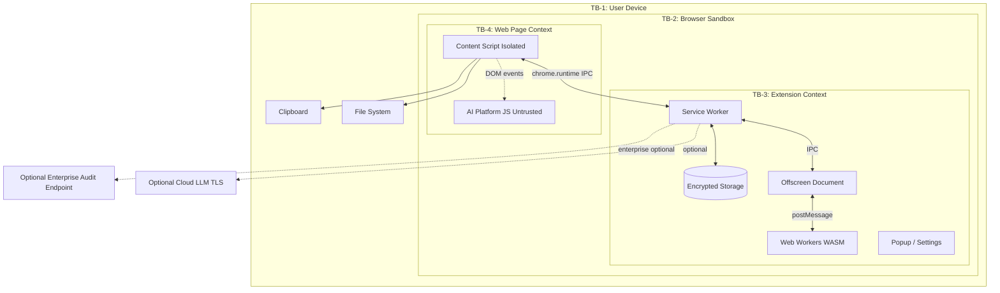
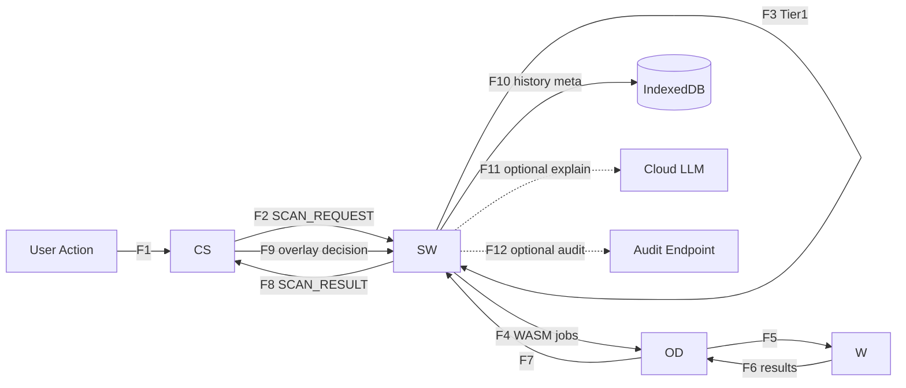
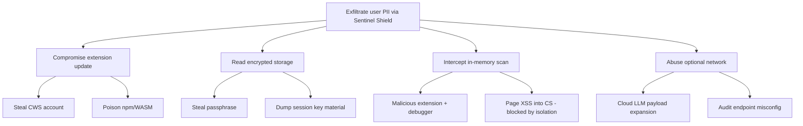
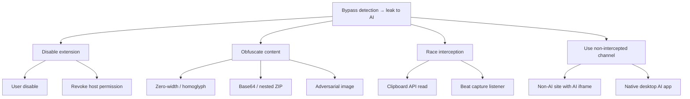

# PART 06 — THREAT MODEL, STRIDE & ABUSE CASES

**Document ID:** SS-BP-006
**Classification:** Internal Engineering — Principal Review
**Version:** 1.0.0
**Last Updated:** 2026-07-12
**Owner:** Principal Security Architect, Threat Intelligence Researcher
**Reviewers:** Principal Privacy Engineer, Principal Browser Security Engineer, Principal Detection Engineer

---

## Executive Summary

This document is the formal threat model for Sentinel Shield AI. It enumerates assets, trust boundaries, STRIDE analysis per component, data-flow threats, attack trees, abuse cases, OWASP/ASVS/MITRE mappings, and a residual-risk register. Endpoint-specific interception threats are detailed in PART_29. Bypass catalog is in PART_20. Security controls are in PART_14 and PART_19.

---

## 1. Objectives

| ID | Objective |
|---|---|
| OBJ-001 | Identify every asset that, if compromised, breaks the product's privacy promise |
| OBJ-002 | Produce a complete STRIDE analysis for every trust-boundary crossing |
| OBJ-003 | Map residual risks to owners and mitigation documents |
| OBJ-004 | Provide attack trees that drive PART_20 guardrails and PART_24 regression tests |

---

## 2. Dependencies

| Dependency | Type |
|---|---|
| PART_01_EXECUTIVE_VISION.md | Trust boundaries, non-objectives |
| PART_02_REAL_WORLD_PROBLEM_ANALYSIS.md | Threat actors, scenarios |
| PART_04_SYSTEM_ARCHITECTURE.md | Component inventory |
| PART_14_SECURITY.md | Controls inventory |
| PART_19_STORAGE_ENCRYPTION_KEY_MANAGEMENT.md | Crypto assumptions |
| PART_20_GUARDRAILS.md | Bypass catalog |
| PART_29_ENDPOINT_INTERCEPTION_THREAT_MODELS.md | Per-endpoint models |

---

## 3. Assets

| Asset ID | Asset | Sensitivity | If Compromised |
|---|---|---|---|
| A-01 | Raw paste/upload content in memory during scan | Critical | Direct PII/secret exposure |
| A-02 | Detection results (entity types + masked previews) | High | Reveals user behavior / data categories |
| A-03 | Encryption key material (session / derived) | Critical | Decrypts all stored history |
| A-04 | User passphrase (never persisted) | Critical | Full storage compromise |
| A-05 | WASM binaries & ML models | High | Supply-chain → silent exfil or false negatives |
| A-06 | Extension code (content script, SW, offscreen) | High | Bypass detection or steal clipboard |
| A-07 | chrome.storage.local / IndexedDB ciphertext | High | Offline offline-attack if key available |
| A-08 | Enterprise managed policy | High | Weaken enforcement mode to monitor |
| A-09 | Optional cloud-LLM request payload | Medium | Entity-type metadata only; still privacy-sensitive |
| A-10 | Chrome Web Store publisher account | Critical | Malicious update push to all users |

---

## 4. Threat Actors

| Actor | Capability | Motivation | Primary Targets |
|---|---|---|---|
| Inadvertent user | Low | Convenience | Own data via AI paste |
| Malicious AI platform | High (server) | Data harvesting | Content after release |
| Malicious extension | Medium | Credential theft | Storage, IPC, clipboard |
| Adversarial content author | Medium | Bypass detection | Detection engine (A-05/A-06) |
| Physical thief / disk dump | High | Espionage | A-03, A-07 |
| Supply-chain attacker | High | Mass compromise | npm deps, WASM, CWS account |
| Insider (enterprise admin) | Medium | Policy abuse | A-08, audit endpoints |

---

## 5. Trust Boundaries

| Boundary | Crossing Controls |
|---|---|
| TB-4 → TB-3 | Closed Shadow DOM; no `externally_connectable`; capture-phase listeners; schema-validated IPC |
| TB-3 internal | Source verification via `MessageSender`; rate limits; Object.freeze on results |
| TB-3 → Network | TLS 1.3; entity types only; no raw PII; CSP `connect-src` allowlist |
| Device → Disk | AES-256-GCM; no raw PII fields in schema |

---

## 6. Data Flow Diagram & Per-Flow Threats

| Flow | Data | Threats | Mitigations |
|---|---|---|---|
| F1 | Raw clipboard/file | Page races CS; clipboard API bypass | `document_start` + capture; PART_29 |
| F2 | ArrayBuffer + metadata | Spoofed messages; oversized payload | Schema + size limits + rate limit |
| F3–F7 | Text/image in Workers | DoS via ReDoS/ZIP bomb; WASM integrity | PART_12 budget; PART_16 hash verify |
| F8 | Detections + risk | Tamper results in transit | Frozen objects; internal IPC only |
| F9 | User action | Forced allow via DOM spoof | Closed Shadow DOM; nonce on re-dispatch |
| F10 | Entity types only | Disk theft; other extension read | Encryption; no `externally_connectable` |
| F11 | Entity type list | Prompt injection; metadata leak | Hardcoded prompt; types only; discard contradicting responses |
| F12 | Audit metadata | Misconfigured endpoint; PII leakage | Admin config only; schema forbids raw values |

---

## 7. STRIDE Analysis by Component

### 7.1 Content Script

| STRIDE | Threat | Mitigation |
|---|---|---|
| S | Page impersonates overlay UI | Closed Shadow DOM; host element `all: initial` |
| T | Page removes overlay / mutates events | Re-inject observer; nonce on approved re-dispatch |
| R | User denies pasting after warn | Local history of decision types only |
| I | Page reads scan payload via `window` | Isolated world; no shared globals |
| D | MutationObserver flood | Debounce 100ms; max 100 mutations/batch |
| E | Page escalates into extension | Impossible without extension bug; no `externally_connectable` |

### 7.2 Service Worker

| STRIDE | Threat | Mitigation |
|---|---|---|
| S | Foreign extension message | `sender.id === chrome.runtime.id` |
| T | Prototype pollution in JSON | Schema validation; `additionalProperties: false` |
| R | Missing audit of block decisions | Structured audit events (enterprise) |
| I | Logs contain PII | Allowlist structured logging (PART_26 / DEF-04) |
| D | Scan flood | **`MAX_SCANS_PER_MIN_PER_TAB=20`** + `MAX_IPC_MSG_PER_MIN_PER_TAB=30` (`DESIGN_OWNERSHIP_MATRIX.md` §3); global processing budget |
| E | Handler executes untrusted code | No `eval`; typed handlers map |

### 7.3 Offscreen Document & Workers

| STRIDE | Threat | Mitigation |
|---|---|---|
| S | N/A (internal only) | — |
| T | Corrupted WASM binary | SHA-256 before instantiate (PART_16) |
| R | Worker crash without log | Health status + ring buffer |
| I | Memory dump of Worker heap | Minimize PII lifetime; terminate Worker after job |
| D | OOM / infinite OCR | Timeouts; memory ceilings; Worker terminate |
| E | WASM escape | Accepted residual: browser sandbox |

### 7.4 Storage

| STRIDE | Threat | Mitigation |
|---|---|---|
| S | Managed policy spoof | Only Chrome delivers `storage.managed` |
| T | Ciphertext bit-flip | AES-GCM auth tag fails decrypt |
| R | History wipe by malware | Enterprise SIEM copy (optional) |
| I | Disk theft | Passphrase tier / Argon2id (PART_19) |
| D | Quota exhaustion | Auto-purge oldest; fail soft |
| E | Schema injection of raw PII field | CI schema audit; typed stores |

### 7.5 Optional Cloud LLM Call

| STRIDE | Threat | Mitigation |
|---|---|---|
| S | MITM | TLS 1.3; certificate validation |
| T | Response injection | Discard if contradicts local detection |
| I | Metadata inference | Minimal type list; no values/URLs |
| D | Hang | 10s AbortController; template fallback |

---

## 8. Attack Trees

Mitigations for ROOT2 leaves are in PART_20 and PART_29. ROOT1 leaves map to PART_14, PART_19, PART_25, PART_27.

---

## 9. Abuse Cases (Misuse Cases)

| ID | Misuse | Actor | Impact | Control |
|---|---|---|---|---|
| AC-01 | User repeatedly clicks Allow Anyway on critical secrets | Inadvertent user | Data leak with warning | Enterprise block mode; audit log |
| AC-02 | Admin sets enforcementMode=monitor for all | Insider | Silent monitoring only | Dual-control policy change (org process) |
| AC-03 | Attacker pastes ZIP bomb | Adversary | DoS | PART_12 budget + PART_17 ZIP limits |
| AC-04 | User enables cloud LLM and pastes secrets | User | Entity types still leak | Clear UX; types-only payload |
| AC-05 | Typosquat extension mimics Sentinel Shield | Attacker | Credential harvest | Trademark; CWS monitoring |
| AC-06 | Developer disables CS via DevTools | User | Local bypass | Accepted for individual; enterprise force-install |
| AC-07 | Flood paste events to exhaust Workers | Adversary | Degraded detection | Rate limit + queue depth 10 |
| AC-08 | Craft ISBN-like numbers to cause FP fatigue | Adversary | User disables product | Context filters; allowlist |

---

## 10. OWASP / ASVS / MITRE Mapping

| Control Area | OWASP Top 10 (Web) | ASVS | MITRE ATT&CK | Our Control |
|---|---|---|---|---|
| Injection | A03 | V5 Input Validation | — | JSON Schema on all IPC |
| Broken access | A01 | V4 Access Control | — | No external connect; sender checks |
| Cryptographic failures | A02 | V6 Crypto | T1552 | AES-GCM; Argon2id/PBKDF2-600k |
| Vulnerable components | A06 | V14 Config | T1195 | Pin deps; npm audit; WASM hashes |
| Security logging | A09 | V7 Error Handling | — | Allowlist structured logs |
| SSRF / network | A10 | V12 Files | — | Minimal connect-src |
| Defense evasion | — | — | T1562 | Force-install; permission monitors |
| Credential access | — | — | T1555 | Never store raw secrets detected |

---

## 11. Residual Risk Register

| Risk ID | Description | L | I | Residual | Owner Doc | Owner Role |
|---|---|---|---|---|---|---|
| RR-01 | Clipboard API read bypasses paste handler | M | M | Accepted v1; document UX | PART_29 | Extension eng |
| RR-02 | WASM sandbox escape (browser bug) | L | C | Accepted; depend on Chrome | PART_16 | Security |
| RR-03 | Memory dump during active scan | L | H | Minimize lifetime | PART_12 | Runtime |
| RR-04 | Platform DOM race on exotic editors | M | H | Adapter fallbacks | PART_17/29 | Extension |
| RR-05 | NER/CV adversarial evasion | M | M | Multi-tier + user review | PART_20/29 | Detection |
| RR-06 | Supply-chain npm compromise | M | C | Minimal deps; CI audit | PART_25 | DevOps |
| RR-07 | CWS account compromise | L | C | FIDO2 + two-person | PART_27 | Security |
| RR-08 | Enterprise audit endpoint MITM | L | M | TLS; pinned hosts | PART_07/26 | Privacy |
| RR-09 | User ignores all warnings | H | H | Product limit; enterprise block | PART_01 | Product |
| RR-10 | Session key material in storage.session | M | H | Short-lived; passphrase tier | PART_19 | Security |

---

## 12. Security Review Gates (This Document)

A change that alters trust boundaries, IPC schemas, network egress, crypto, or permissions must:

1. Update this threat model (assets/flows/STRIDE)
2. Update PART_14 controls if new control required
3. Add/adjust PART_24 tests for new abuse cases
4. Receive security-lead approval (handbook §17)

---

## 13. Testing Strategy

| Test Type | Scope |
|---|---|
| Threat-driven cases | Each AC-0N has ≥1 automated or manual test |
| Attack-tree leaves | Mapped to PART_20 bypass tests |
| Negative IPC tests | Foreign sender, oversized payload, unknown type |
| Crypto failure tests | Wrong key, bit-flipped ciphertext, corrupt WASM hash |

---

## 14. Acceptance Criteria

- [ ] All assets A-01…A-10 have ≥1 threat and mitigation
- [ ] STRIDE complete for CS, SW, OD/Workers, Storage, Cloud
- [ ] Attack trees cover exfil and bypass roots
- [ ] Residual risks have owners and document links
- [ ] No unmapped network egress

---

## 15. Production Checklist

- [ ] Threat model reviewed by Principal Security Architect
- [ ] Residual register reviewed with TPM
- [ ] PART_20 and PART_29 cross-links verified
- [ ] Abuse cases reflected in QA test plans
- [ ] External pen-test scope derived from this document

---

## 16. Future Improvements

| Improvement | How to Implement |
|---|---|
| Continuous threat-model CI | Store assets/flows as YAML; PR bot fails if new IPC type lacks STRIDE row |
| Formal DFD tooling | Maintain Mermaid as source; export to threat-modeling tool quarterly |
| Red-team exercise pack | Convert attack trees into annual tabletop scripts (PART_27) |
| Browser-bug watch | Subscribe to Chrome security bullets; triage SharedArrayBuffer/WASM CVEs within 72h |
