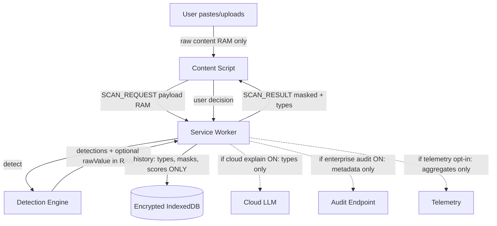

# PART 07 — PRIVACY & DATA GOVERNANCE

**Document ID:** SS-BP-007
**Classification:** Internal Engineering — Principal Review
**Version:** 1.0.0
**Last Updated:** 2026-07-12
**Owner:** Principal Privacy Engineer
**Reviewers:** Principal Security Architect, Legal Counsel (advisory), Staff Product Engineer

---

## Executive Summary

Sentinel Shield AI is a privacy product. This Privacy Impact Assessment (PIA) and data-governance specification prove that core detection never transmits user content, that raw PII is never persisted, and that every optional network path is narrowly scoped, consent-gated, and free of raw values. Cross-references: PART_19 (storage/crypto), PART_26 (telemetry), PART_14 (security).

---

## 1. Objectives

| ID | Objective |
|---|---|
| OBJ-001 | Inventory every data element the extension creates, stores, or transmits |
| OBJ-002 | Prove data minimization: raw detected values never leave RAM to durable storage |
| OBJ-003 | Define retention, erasure, consent, and lawful-basis posture |
| OBJ-004 | Reconcile optional enterprise audit egress with "zero network in detection" |

---

## 2. Dependencies

| Dependency | Type |
|---|---|
| PART_01_EXECUTIVE_VISION.md | Principles NOBJ-005, Principle 1 |
| PART_03_PRODUCT_REQUIREMENTS.md | NFR-PRIV-* |
| PART_06_THREAT_MODEL_STRIDE_ABUSE.md | Assets & network flows |
| PART_19_STORAGE_ENCRYPTION_KEY_MANAGEMENT.md | Encryption & retention mechanics |
| PART_26_OBSERVABILITY_AND_TELEMETRY.md | Opt-in telemetry design |

---

## 3. Design Principles (Privacy)

| Principle | Enforcement |
|---|---|
| Local-first detection | CI forbids `fetch`/`XMLHttpRequest`/`WebSocket` in `detection-engine` |
| No raw PII at rest | Storage schema has no field for raw values; CI schema audit |
| Consent for any network | Cloud LLM and telemetry require explicit user/admin action |
| Purpose limitation | Stored history used only for user dashboard / enterprise audit |
| Storage limitation | Default 30-day purge; max 90 days |
| Transparency | Onboarding + settings explain what is and is not collected |

---

## 4. Data Inventory

| Element | Category | Created | Stored | Encrypted | Retention | Access | Lawful Basis (EU analogy) |
|---|---|---|---|---|---|---|---|
| Raw paste/file bytes | Sensitive content | Content script | Memory only during scan | N/A (ephemeral) | Until scan complete + user decision | Extension process only | Legitimate interest / consent for protection |
| Raw detected value | PII/secret | Detector | Memory only in `Detection.rawValue?` | N/A | Discarded after overlay closes | Never persisted | Same |
| Masked preview | Pseudonymized | Aggregator | IndexedDB history | AES-GCM | 30d default (1–90) | User; enterprise audit meta | Same |
| Entity type + confidence | Metadata | Detector | IndexedDB | AES-GCM | 30d default | User / admin audit | Same |
| Risk score / level | Metadata | Risk engine | IndexedDB | AES-GCM | 30d default | User / admin | Same |
| User decision (allow/block/redact) | Behavioral meta | Overlay | IndexedDB | AES-GCM | 30d default | User / admin | Same |
| Platform hostname (e.g. chatgpt.com) | Usage meta | CS | History record | AES-GCM | 30d default | User / admin | Same |
| Settings (sensitivity, toggles) | Config | Settings UI | chrome.storage.local | AES-GCM | Until uninstall / wipe | User; managed override | Contract / consent |
| Allowlist entries | Config | User | local | AES-GCM | Until removed | User | Consent |
| Encryption salt / KDF params | Crypto meta | CryptoManager | local | Plain (not secret) | Lifetime | Extension | Necessary |
| Session key material (no passphrase) | Crypto | CryptoManager | chrome.storage.session | OS process memory | Browser session | Extension | Necessary |
| Model files / WASM | Binary assets | Bundle / cache | IndexedDB cache | Integrity-hashed | Until update | Extension | N/A |
| Local log ring buffer | Ops | Logger | Memory (session) | N/A | ≤1000 entries or SW death | Dev tools (user) | Legitimate interest |
| Opt-in telemetry aggregates | Analytics | Metrics | Local then network | TLS in transit | Vendor retention ≤90d | Telemetry backend | Consent |
| Cloud LLM request | Entity type list | Explainer | Not stored | TLS | Provider policy | Cloud provider | Consent |
| Enterprise audit event | Compliance meta | Decision engine | Local queue → SIEM | TLS | Org policy | Admin | Legitimate interest / contract |
| Managed policy JSON | Enterprise config | MDM/CBCM | chrome.storage.managed | Platform | Org controlled | Extension read-only | Employer authority |

**Proof of minimization:** No inventory row stores raw PII/secrets on disk. Any PR introducing a durable field for raw values fails the PART_25 storage-schema audit.

---

## 5. Privacy-Annotated Data Flow

Dashed edges are **optional**, **off by default** (except enterprise audit when admin configures it), and **never carry raw values**.

---

## 6. Retention & Auto-Purge

| Store | Default | Configurable Range | Purge Trigger |
|---|---|---|---|
| Scan history | 30 days | 1–90 days | Daily alarm + on write if over quota |
| Local metrics counters | 7 days rolling | Fixed | Ring / daily reset |
| Model cache | Until extension update | N/A | Version mismatch invalidates |
| Log ring buffer | Session | N/A | SW terminate |
| Enterprise audit queue | Until ACK (max 7 days) | Admin | Drop with local error event if undeliverable |

**User erasure:** Settings → Privacy → "Clear All History" and "Reset Extension Data" wipe IndexedDB history and re-init keys (passphrase forgot = wipe; no recovery). Uninstall removes extension storage.

---

## 7. Consent Model

| Feature | Default | Consent Mechanism |
|---|---|---|
| Local detection | On (product core) | Install + onboarding disclosure |
| Host permission per platform | Off until grant | `chrome.permissions.request` on gesture |
| Cloud LLM explanations | Off | Explicit toggle + API key entry |
| Telemetry | Off | Explicit toggle; shown what is collected |
| Enterprise audit | Off for individuals | Admin managed policy only |
| Passphrase encryption | Off (session key) | Optional strengthen in Settings |

Children: product is not directed at children under 16. No age gate in v1; enterprise deployments follow org policy.

---

## 8. Optional Network Paths — Privacy Carve-Outs

### 8.1 Cloud LLM Explanations

| Rule | Specification |
|---|---|
| Payload | Array of `{ entityType, confidenceBucket, riskLevel }` — **no raw values, no file names, no URLs, no user text** |
| Prompt | Hardcoded template in extension bundle |
| Response handling | If response contradicts local detection, discard; show local template |
| Transport | HTTPS only; CSP `connect-src` updated only when feature enabled |
| Logging | Do not log request/response bodies |

### 8.2 Enterprise Audit Logging (Reconciles with "Zero Network in Detection")

**Detection pipeline** remains network-free. Audit egress is a **separate post-decision channel**:

1. Decision completes locally (allow/block/redact)
2. If `auditLogEndpoint` present in managed policy, enqueue event
3. Event schema: `{ timestamp, orgId, userIdHash, eventType, entityTypes[], riskLevel, platform, userAction, extensionVersion }`
4. Batch every 60s or 50 events; TLS 1.3; fail closed to local queue (not to blocking detection)
5. Schema validation rejects any property resembling raw values

### 8.3 Telemetry (See PART_26)

OFF by default. Aggregates only (counts, latency histograms). Differential privacy with ε ≤ 1.0 for count queries. Kill switch via managed policy.

---

## 9. Regulatory Posture

| Framework | Posture |
|---|---|
| GDPR | Local processing; DPIA-ready via this PIA; Art. 17 erasure via Clear All; no sale of data |
| CCPA/CPRA | No "sell"/"share" of personal info; deletion via Clear All; disclose categories in privacy policy |
| India DPDP | Local processing; sensitive personal data not transmitted for detection |
| HIPAA | Not a covered entity tool by default; enterprise customers remain responsible for BAAs if they transmit audit meta |
| PCI-DSS | Card data never stored; Luhn detection only in memory |

This document does not constitute legal advice. Privacy counsel must sign the published privacy policy before CWS launch.

---

## 10. DSAR / Right to Erasure

| Request | Handling |
|---|---|
| Access | User exports history JSON from Dashboard (encrypted decrypt → export types/masks only) |
| Delete | Clear All History / Reset Extension Data |
| Portability | JSON/CSV export of history metadata |
| Objection to processing | Disable platform protection; uninstall |
| Enterprise DSAR | Org process on SIEM; extension cannot delete remote copies |

---

## 11. Privacy Reviewer Q&A

| Question | Answer |
|---|---|
| Does detection send content to your servers? | No. Zero network in detection-engine; CI enforced. |
| Do you store credit card numbers? | No. Only masked previews like `4111****1111` and entity type. |
| What if user sets a passphrase and forgets it? | Wipe encrypted data; re-init. No recovery by design. |
| Why optional cloud LLM? | Natural-language explanations only; types only; off by default. |
| Can another extension read history? | No `externally_connectable`; ciphertext at rest; isolated extension ID. |
| Incognito? | Same code; session storage separate; user must enable extension in Incognito. |
| Do you fingerprint users for telemetry? | No stable advertising ID; rotating install salt; DP noise. |
| Enterprise audit vs privacy promise? | Admin-configured; metadata only; separate from detection path. |

---

## 12. Failure Modes (Privacy)

| Failure | Privacy Impact | Recovery |
|---|---|---|
| Logger accidentally stringifies detection | Potential PII in ring buffer | Allowlist logger forbids free-text production fields (PART_26) |
| History export includes unexpected field | Data oversharing | Export schema whitelist |
| Telemetry enabled by malware flipping storage | Unwanted aggregates leave device | Managed policy can force telemetry off; integrity of settings |
| Cloud LLM feature left on | Metadata egress | Clear settings UX; badge indicator |

---

## 13. Testing Strategy

| Test | Pass Criteria |
|---|---|
| Static: no network in detection-engine | CI grep / ESLint |
| Storage schema audit | No raw-value fields |
| Encryption on write | Records decrypt only with key |
| Clear All | IndexedDB history empty; models may remain |
| Cloud payload inspector | Fixture asserts types-only JSON |
| Telemetry default | Fresh install → zero network calls in 10 min idle |

---

## 14. Acceptance Criteria

- [ ] Data inventory complete and reviewed by privacy engineer
- [ ] Raw PII never persisted (automated test)
- [ ] Retention defaults enforced
- [ ] Optional network paths documented and off by default
- [ ] Privacy policy published matching this PIA
- [ ] DSAR paths implemented in UI

---

## 15. Production Checklist

- [ ] Privacy counsel review of PIA + public policy
- [ ] CWS privacy practices form matches inventory
- [ ] Telemetry and cloud LLM screenshots/docs accurate
- [ ] Enterprise audit schema reviewed
- [ ] Erasure paths QA'd on Chrome/Edge/Brave

---

## 16. Future Improvements

| Improvement | How to Implement |
|---|---|
| Formal DPIA template export | Generate PDF from this inventory YAML in `tools/privacy/` |
| On-device differential privacy for dashboard charts | Apply Laplace noise to displayed aggregates when sharing screenshots |
| Automatic privacy nutrition label | Build CWS disclosure JSON from inventory source of truth |
| Regional entity packs without identity | Download country rule packs as data-only via CWS update, not remote code |
