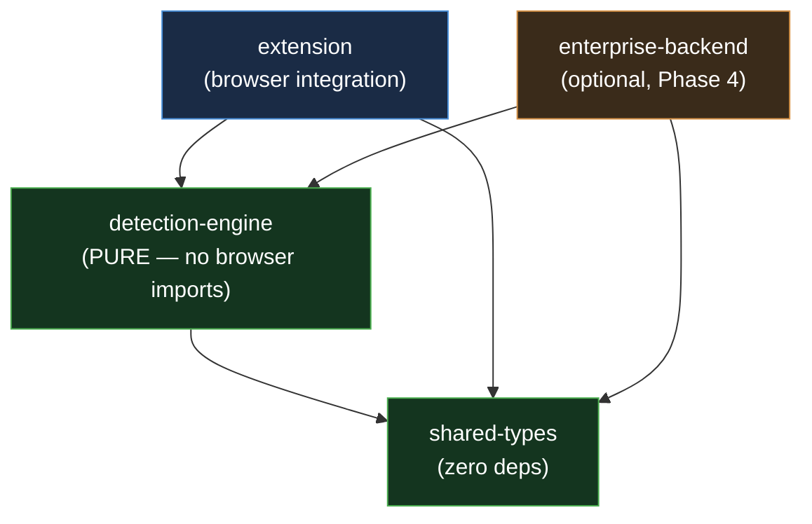
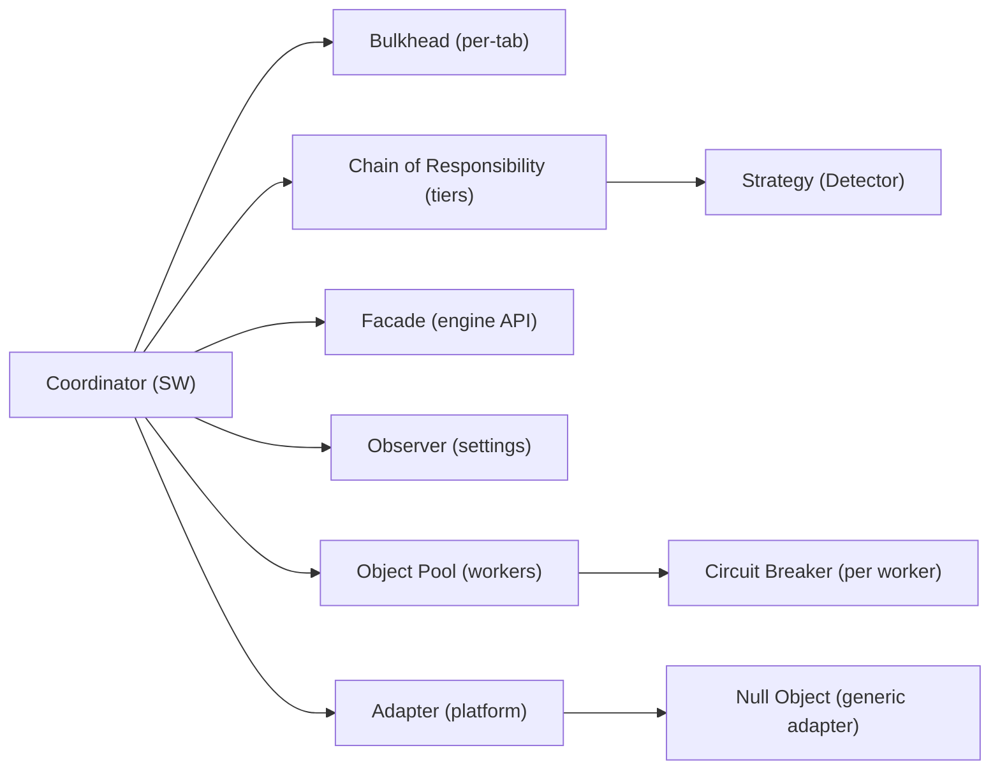

# PART 09 — DESIGN PATTERNS & ENGINEERING PRINCIPLES

**Document ID:** SS-BP-009
**Classification:** Internal Engineering — Principal Review
**Version:** 1.0.0
**Last Updated:** 2026-07-12
**Owner:** Principal Software Architect, Distinguished Engineer
**Reviewers:** Principal Security Architect, Principal Detection Engineer, Staff Frontend Engineer

---

## Executive Summary

This document is the pattern language of Sentinel Shield AI. It names every design pattern the codebase relies on, states its intent, shows exactly where it is used, gives a real TypeScript sketch, and identifies the anti-pattern each choice prevents. It then codifies the SOLID application, the module dependency rules (with a Mermaid dependency graph), the enforced "`detection-engine` is pure" rule, the naming conventions, the typed error hierarchy, and a curated anti-patterns table. Every reviewer — from Chrome Security to Palo Alto Networks — should be able to open any file and predict its shape from this document alone.

---

## 1. Dependencies

| Dependency | Type | What this document builds on |
|---|---|---|
| `c:\Users\shria\Desktop\Sentinal shield\blueprint\PART_04_SYSTEM_ARCHITECTURE.md` | Authoritative | Component inventory, Coordinator-Processor model, `Detector` interface |
| `c:\Users\shria\Desktop\Sentinal shield\blueprint\PART_08_ARCHITECTURAL_DECISION_RECORDS.md` | Authoritative | ADR-005 (coordinator), ADR-028 (worker pool), ADR-021 (fail modes) |
| `c:\Users\shria\Desktop\Sentinal shield\blueprint\PART_13_DETECTION_ENGINE.md` | Authoritative | Tier interfaces, aggregation, scoring |
| `c:\Users\shria\Desktop\Sentinal shield\blueprint\PART_01_EXECUTIVE_VISION.md` | Authoritative | Design principles, purity rule enforcement |

---

## 2. Pattern Catalog Overview

| # | Pattern | Category | Primary site | Prevents |
|---|---|---|---|---|
| 1 | Coordinator / Mediator | Behavioral | Service Worker | Component mesh / N² coupling |
| 2 | Strategy | Behavioral | `Detector` implementations | `switch`-on-type sprawl |
| 3 | Chain of Responsibility | Behavioral | Tier 1→2→3 execution | Monolithic detection function |
| 4 | Adapter | Structural | Platform adapters | Per-site branching in core |
| 5 | Observer | Behavioral | `storage.onChanged` | Polling / stale settings |
| 6 | Object Pool | Creational | Worker pool | Worker create/destroy thrash |
| 7 | Circuit Breaker | Behavioral | Failing worker guard | Repeated calls to a dead worker |
| 8 | Bulkhead | Structural | Per-tab scan isolation | One tab starving all others |
| 9 | Facade | Structural | `detection-engine` public API | Callers reaching into internals |
| 10 | Null Object | Behavioral | `GenericPlatformAdapter` | Null checks at every call site |

---

## 3. Patterns in Detail

### 3.1 Coordinator / Mediator — Service Worker

**Intent:** Centralize control so components communicate through one hub instead of directly with each other (ADR-005). **Where used:** the Service Worker mediates content script ↔ offscreen ↔ workers ↔ storage. **Anti-pattern prevented:** an agent mesh where every component knows every other, producing N² coupling and distributed state.

```typescript
// extension/src/sw/coordinator.ts
export class ScanCoordinator {
  constructor(
    private readonly tier1: Tier1Detector,
    private readonly offscreen: OffscreenGateway,
    private readonly scorer: RiskScorer,
    private readonly store: StorageManager,
  ) {}

  async handleScanRequest(req: ScanRequest, sender: MessageSender): Promise<ScanResult> {
    const tabId = sender.tab?.id ?? throwProtocol("missing tab");   // source set by receiver
    const input = await this.preprocess(req.payload);
    const tier1 = this.tier1.detect(input);                          // synchronous, <10ms
    const asyncTiers = input.needsAsync
      ? await this.offscreen.run(input, { budgetMs: 1500 })          // Tier 2/3
      : [];
    const scored = this.scorer.score(aggregate([...tier1, ...asyncTiers]), input.context);
    await this.store.appendHistory(toHistoryEntry(scored));          // types + counts only
    return freeze(scored);
  }
}
```

### 3.2 Strategy — The `Detector` Interface

**Intent:** Make every detection algorithm interchangeable behind one contract (`PART_04` §7.1). **Where used:** `RegexDetector`, `NerDetector`, `EntropyDetector`, `CvDetector` all implement `Detector`. **Anti-pattern prevented:** a giant `switch (detectorKind)` that must be edited for every new detector.

```typescript
// shared-types/src/detector.ts
export interface Detector {
  readonly name: string;
  readonly supportedInputTypes: readonly InputType[];
  initialize(): Promise<void>;
  detect(input: ProcessedInput): Promise<readonly Detection[]>;
  isReady(): boolean;
  shutdown(): Promise<void>;
}

// detection-engine/src/tier2/ner-detector.ts
export class NerDetector implements Detector {
  readonly name = "ner";
  readonly supportedInputTypes = ["text"] as const;
  #session?: InferenceSession;
  async initialize() { this.#session = await InferenceSession.create(MODEL_BYTES); }
  isReady() { return this.#session !== undefined; }
  async detect(input: ProcessedInput) { return this.#run(input.text); }
  async shutdown() { this.#session = undefined; }
  #run(text: string): readonly Detection[] { /* tokenize → infer → BIO merge */ return []; }
}
```

New detectors are added by implementing the interface and registering — zero changes to the coordinator (Open/Closed, §4).

### 3.3 Chain of Responsibility — Tiered Detection

**Intent:** Pass input along an ordered chain where each tier handles what it can and forwards the rest (ADR-008). **Where used:** Tier 1 (deterministic) → Tier 2 (NER) → Tier 3 (CV), with short-circuit when nothing remains ambiguous. **Anti-pattern prevented:** one monolithic `detectEverything()` that mixes fast and slow logic and cannot degrade gracefully.

```typescript
// detection-engine/src/pipeline/tier-chain.ts
export interface TierHandler {
  readonly tier: DetectionTier;
  shouldRun(ctx: PipelineContext): boolean;
  run(ctx: PipelineContext): Promise<readonly Detection[]>;
}

export async function runChain(
  handlers: readonly TierHandler[],
  ctx: PipelineContext,
  budget: Budget,
): Promise<readonly Detection[]> {
  const out: Detection[] = [];
  for (const h of handlers) {
    if (!h.shouldRun(ctx)) continue;
    if (budget.exceeded()) break;                 // partial-result path (ADR-019)
    out.push(...await withTimeout(h.run(ctx), budget.remaining()));
  }
  return out;
}
```

### 3.4 Adapter — Platform Adapters

**Intent:** Translate each AI platform's unique DOM into a uniform interception surface. **Where used:** `ChatGptAdapter`, `ClaudeAdapter`, `GeminiAdapter`, `CopilotAdapter`. **Anti-pattern prevented:** `if (host === "chat.openai.com") … else if …` scattered through the content script.

```typescript
// extension/src/content/adapters/platform-adapter.ts
export interface PlatformAdapter {
  readonly id: string;
  matches(url: URL): boolean;
  findComposer(): HTMLElement | null;      // where the user types
  findFileInputs(): readonly HTMLInputElement[];
  reDispatch(payload: OutboundPayload): void;   // release after scan
}

// extension/src/content/adapters/chatgpt-adapter.ts
export class ChatGptAdapter implements PlatformAdapter {
  readonly id = "chatgpt";
  matches(url: URL) { return /(^|\.)chatgpt\.com$/.test(url.hostname); }
  findComposer() { return document.querySelector<HTMLElement>("#prompt-textarea"); }
  findFileInputs() { return [...document.querySelectorAll<HTMLInputElement>('input[type=file]')]; }
  reDispatch(p: OutboundPayload) { /* platform-specific event synthesis */ }
}
```

### 3.5 Observer — `chrome.storage.onChanged`

**Intent:** React to settings/policy changes as events instead of polling. **Where used:** popup, content scripts, and coordinator subscribe to settings changes; enterprise policy updates propagate the same way. **Anti-pattern prevented:** polling `storage.get` on a timer, causing stale config and wasted wakeups.

```typescript
// extension/src/shared/settings-observer.ts
export function observeSettings(onChange: (s: Settings) => void): () => void {
  const listener = (changes: Record<string, chrome.storage.StorageChange>, area: string) => {
    if (area === "local" && changes["settings"]) onChange(changes["settings"].newValue as Settings);
  };
  chrome.storage.onChanged.addListener(listener);
  return () => chrome.storage.onChanged.removeListener(listener);   // always return an unsubscribe
}
```

### 3.6 Object Pool — Worker Pool

**Intent:** Reuse expensive worker instances instead of creating/destroying them per scan (ADR-028). **Where used:** the offscreen document pools one worker per modality, lazily created, idle-terminated at 60 s. **Anti-pattern prevented:** create-a-worker-per-scan thrash (model reload each time; memory churn).

```typescript
// extension/src/offscreen/worker-pool.ts
export class WorkerPool {
  #workers = new Map<Modality, PooledWorker>();
  acquire(m: Modality): PooledWorker {
    let w = this.#workers.get(m);
    if (!w || w.state === "terminated") { w = this.#spawn(m); this.#workers.set(m, w); }
    w.touch();                                   // reset idle timer
    return w;
  }
  #spawn(m: Modality): PooledWorker {
    const worker = new Worker(WORKER_URL[m], { type: "module" });
    return new PooledWorker(worker, () => this.#workers.delete(m)); // self-evict on idle
  }
}
```

### 3.7 Circuit Breaker — Failing Worker Guard

**Intent:** Stop calling a component that keeps failing; give it time to recover, then probe. **Where used:** wraps each worker so repeated crashes trip the breaker and the coordinator returns partial results without hammering a dead worker. **Anti-pattern prevented:** retry storms that burn the whole scan budget on a broken worker.

```typescript
// detection-engine/src/resilience/circuit-breaker.ts
export class CircuitBreaker {
  #failures = 0;
  #openedAt = 0;
  constructor(private readonly threshold = 3, private readonly cooldownMs = 30_000) {}
  get state(): "closed" | "open" | "half-open" {
    if (this.#failures < this.threshold) return "closed";
    return Date.now() - this.#openedAt > this.cooldownMs ? "half-open" : "open";
  }
  async run<T>(fn: () => Promise<T>): Promise<T> {
    if (this.state === "open") throw new WorkerUnavailableError("circuit open");
    try { const r = await fn(); this.#failures = 0; return r; }
    catch (e) { if (++this.#failures >= this.threshold) this.#openedAt = Date.now(); throw e; }
  }
}
```

### 3.8 Bulkhead — Per-Tab Scan Isolation

**Intent:** Partition resources so a failure or flood in one tab cannot sink the others. **Where used:** each tab has its own scan slot and mutex; global concurrency is capped (max 3 concurrent, rest FIFO-queued per `PART_04` §8). **Anti-pattern prevented:** one runaway tab (20 rapid pastes) starving every other tab's scans.

```typescript
// extension/src/sw/bulkhead.ts
export class ScanBulkhead {
  #perTab = new Map<number, Semaphore>();        // 1 in-flight scan per tab
  #global = new Semaphore(3);                     // global concurrency ceiling
  async run<T>(tabId: number, task: () => Promise<T>): Promise<T> {
    const tab = this.#perTab.get(tabId) ?? this.#perTab.set(tabId, new Semaphore(1)).get(tabId)!;
    await tab.acquire(); await this.#global.acquire();
    try { return await task(); }
    finally { this.#global.release(); tab.release(); }
  }
}
```

### 3.9 Facade — `detection-engine` Public API

**Intent:** Expose one small, stable surface and hide the tier/aggregator/scorer internals. **Where used:** `createDetectionEngine()` returns a `DetectionEngine` facade; the extension never imports tier internals directly. **Anti-pattern prevented:** callers wiring up private classes, coupling the extension to internal refactors.

```typescript
// detection-engine/src/index.ts  (the ONLY public entry)
export interface DetectionEngine {
  scan(input: RawInput, opts?: ScanOptions): Promise<ScanResult>;
  isReady(): boolean;
}
export function createDetectionEngine(config: EngineConfig): DetectionEngine {
  const pipeline = new DetectionPipeline(config);   // internals stay private
  return {
    scan: (input, opts) => pipeline.detect(input, opts),
    isReady: () => pipeline.isReady(),
  };
}
// Internal modules are NOT re-exported: no `export * from "./tier1"` etc.
```

### 3.10 Null Object — `GenericPlatformAdapter`

**Intent:** Provide a do-nothing-but-valid adapter so callers never branch on "no adapter". **Where used:** when a page matches no specific adapter, `GenericPlatformAdapter` supplies safe defaults (generic composer/file-input discovery). **Anti-pattern prevented:** `adapter?.findComposer()` null checks sprinkled through the content script.

```typescript
// extension/src/content/adapters/generic-platform-adapter.ts
export class GenericPlatformAdapter implements PlatformAdapter {
  readonly id = "generic";
  matches() { return true; }                                   // last in the resolution order
  findComposer() { return document.querySelector<HTMLElement>("textarea, [contenteditable=true]"); }
  findFileInputs() { return [...document.querySelectorAll<HTMLInputElement>('input[type=file]')]; }
  reDispatch(p: OutboundPayload) { /* standard clipboard/DnD synthesis */ }
}
export function resolveAdapter(url: URL, all: readonly PlatformAdapter[]): PlatformAdapter {
  return all.find(a => a.id !== "generic" && a.matches(url)) ?? new GenericPlatformAdapter();
}
```

---

## 4. SOLID Application

| Principle | Application in Sentinel Shield |
|---|---|
| **Single Responsibility** | `RegexEngine` changes only when patterns change; `RiskScorer` only when scoring changes; the coordinator only when orchestration changes (`PART_04` §3). |
| **Open/Closed** | New detectors, platform adapters, and file formats are added by implementing `Detector` / `PlatformAdapter` — no edits to the pipeline or coordinator (§3.2, §3.4). |
| **Liskov Substitution** | Every `Detector` honors the same contract: `detect` returns `readonly Detection[]`, never throws for "no match" (returns `[]`), and `isReady()` gates calls. A mock detector is fully substitutable in tests. |
| **Interface Segregation** | `Detector`, `PlatformAdapter`, `TierHandler`, and `StorageManager` are separate narrow interfaces; no component depends on methods it does not call. |
| **Dependency Inversion** | The coordinator depends on the `Detector`/`RiskScorer` abstractions injected via its constructor (§3.1), not on concrete `NerDetector`. High-level policy does not import low-level detail. |

---

## 5. Module Dependency Rules

### 5.1 Dependency Graph



### 5.2 Allowed / Forbidden Edges

| Rule | Direction | Enforcement |
|---|---|---|
| `shared-types` imports nothing internal | — | Turborepo graph + ESLint `no-restricted-imports` |
| `detection-engine` → `shared-types` only | allowed | Package `dependencies` allowlist |
| `detection-engine` → `extension` | **forbidden** | Turborepo graph fails; ESLint boundary rule |
| `detection-engine` → any browser API | **forbidden** | Custom ESLint rule (see §6) |
| `extension` → `detection-engine`, `shared-types` | allowed | — |
| `extension` → `enterprise-backend` | **forbidden** | Package boundary (`PART_01` Principle 4) |
| Content script → `chrome.storage` directly | **forbidden** | Custom ESLint rule; must go through `StorageManager` in SW |

---

## 6. The "detection-engine is Pure" Rule and Its Enforcement

**Rule:** `packages/detection-engine` contains only pure logic. It must not import `chrome.*`, `window`, `document`, `navigator`, `fetch`, `XMLHttpRequest`, `WebSocket`, `Worker`, `localStorage`, or any DOM/network API. It receives bytes and returns detections; nothing else.

**Why it matters:** purity is what makes the engine testable in plain Node (ADR-016), reusable in Electron/VS Code (`PART_04` §16), and provably network-free (`PART_01` Principle 1). It is the single most reviewer-visible invariant in the codebase.

**Enforcement (defense in depth):**

```javascript
// eslint.config.js  (applied only to packages/detection-engine/**)
export default [{
  files: ["packages/detection-engine/**/*.ts"],
  rules: {
    "no-restricted-globals": ["error",
      "window", "document", "navigator", "localStorage", "fetch",
      "XMLHttpRequest", "WebSocket", "Worker", "chrome"],
    "no-restricted-imports": ["error", { patterns: ["*/extension/*", "*/enterprise-backend/*"] }],
  },
}];
```

| Layer | Check |
|---|---|
| Compile | `detection-engine` `tsconfig` excludes `dom` and `webworker` libs — DOM types don't even resolve. |
| Lint | `no-restricted-globals` / `no-restricted-imports` (above) fail the build on any browser reference. |
| Graph | Turborepo dependency graph rejects an edge from `detection-engine` to `extension`. |
| CI grep | A static check greps the built bundle for `fetch(`, `chrome.`, `new Worker` and fails on any hit. |
| Test | The full unit suite runs under Node with **no** JSDOM — a stray DOM call throws `ReferenceError`. |

---

## 7. Naming Conventions

| Element | Convention | Example |
|---|---|---|
| Files | `kebab-case.ts` | `ner-detector.ts`, `worker-pool.ts` |
| Classes / Interfaces / Types | `PascalCase` (no `I` prefix) | `RegexEngine`, `Detector`, `ScanResult` |
| Functions / methods / vars | `camelCase` | `runChain`, `resolveAdapter` |
| Constants (module-level) | `UPPER_SNAKE_CASE` | `MAX_INPUT_BYTES`, `WORKER_URL` |
| Enums / union members | `PascalCase` type, `SCREAMING_SNAKE` string values | `type MessageType`; `"SCAN_REQUEST"` |
| Private class fields | `#field` (hard-private) | `#session`, `#workers` |
| Booleans | `is/has/should/can` prefix | `isReady`, `hasText`, `shouldRun` |
| Async functions | verb, returns `Promise` | `detect`, `appendHistory` |
| Error classes | `*Error` suffix, extend `SentinelError` | `ProtocolError`, `WorkerUnavailableError` |
| Message types | `NOUN_VERB` past/imperative | `SCAN_REQUEST`, `SCAN_RESULT`, `REDACT_REQUEST` |

---

## 8. Error-Handling Patterns — Typed Error Hierarchy

**Principle:** errors are typed, carry a stable machine-readable `code`, and never carry raw PII (ADR-012). Callers switch on `code`/`instanceof`, never on message strings.

```typescript
// shared-types/src/errors.ts
export abstract class SentinelError extends Error {
  abstract readonly code: string;                 // stable, allowlisted for logging
  readonly recoverable: boolean;
  constructor(message: string, recoverable: boolean) {
    super(message);
    this.name = new.target.name;
    this.recoverable = recoverable;
  }
}

export class ProtocolError extends SentinelError {           // bad/hostile IPC message
  readonly code = "E_PROTOCOL"; constructor(m: string) { super(m, false); }
}
export class BudgetExceededError extends SentinelError {     // async budget hit (ADR-019)
  readonly code = "E_BUDGET"; constructor(m: string) { super(m, true); }
}
export class WorkerUnavailableError extends SentinelError {  // circuit open / crash (§3.7)
  readonly code = "E_WORKER"; constructor(m: string) { super(m, true); }
}
export class ModelLoadError extends SentinelError {          // NER/OCR init failed
  readonly code = "E_MODEL"; constructor(m: string) { super(m, true); }
}
export class StorageError extends SentinelError {            // IndexedDB/crypto failure
  readonly code = "E_STORAGE"; constructor(m: string) { super(m, true); }
}
```

**Handling rules:**

| Situation | Rule |
|---|---|
| Recoverable error (`recoverable: true`) | Degrade to next tier / partial results; never abort the whole scan (`PART_13` §13). |
| Non-recoverable (`ProtocolError`) | Reject message, log `code` only, do not process. |
| Terminal failure at delivery | Fail-open (individual) / fail-closed (enterprise) per ADR-021. |
| Logging | Log `error.code`, `error.recoverable`, and allowlisted context — never `error.message` interpolated with input, never `rawValue`. |
| "No match" | Is **not** an error: detectors return `[]`. Exceptions are reserved for genuine failures. |

---

## 9. Curated Anti-Patterns Table

| Anti-pattern | Why it is banned | Enforced by / replaced with |
|---|---|---|
| God Service Worker (all logic inline) | Untestable, violates SRP | Coordinator delegates to injected collaborators (§3.1) |
| `switch (entityType)` across the codebase | Every new entity edits many files | Strategy `Detector` (§3.2) |
| `console.log(userText)` | Leaks PII into logs | Allowlist structured logging (ADR-012); lint bans interpolated log args |
| Throwing on "no detection" | Confuses control flow with errors | Return `[]` (§8) |
| `any` at IPC boundaries | Defeats type safety; hides malformed payloads | `strict` TS (ADR-015) + Ajv validation (ADR-027) |
| Worker-per-scan | Model reload + memory churn | Object Pool (§3.6) |
| Retry loop on a dead worker | Burns the scan budget | Circuit Breaker (§3.7) |
| Shared unbounded scan queue | One tab starves others | Bulkhead + per-tab semaphore (§3.8) |
| `detection-engine` importing `chrome.*` | Breaks purity, testability, offline proof | Purity rule + ESLint/graph/CI (§6) |
| Deep imports into engine internals | Couples callers to refactors | Facade single entry (§3.9) |
| `adapter?.method()` null checks everywhere | Noise, missed branches | Null Object adapter (§3.10) |
| Polling `storage.get` on a timer | Stale config, wasted wakeups | Observer on `storage.onChanged` (§3.5) |
| Catch-all `catch (e) {}` swallow | Hides recoverable/non-recoverable distinction | Typed hierarchy + explicit handling (§8) |

---

## 10. Pattern Interaction Map



The coordinator is the composition root: it wires the bulkhead, the tier chain (which resolves detectors by Strategy), the engine Facade, the settings Observer, and the worker Object Pool (each worker guarded by a Circuit Breaker). Platform Adapters — with the Null Object fallback — live in the content script and feed normalized events into the coordinator.

---

## 11. Production Checklist

- [ ] Every pattern in §2 has a real implementation matching its sketch (no stubs)
- [ ] `detection-engine` purity enforced at compile, lint, graph, CI-grep, and test layers (§6)
- [ ] All `Detector` implementations return `[]` (never throw) for "no match" (LSP, §4)
- [ ] Coordinator receives collaborators via injection; no `new ConcreteDetector()` inside it (DIP)
- [ ] Worker pool reuses instances and idle-terminates at 60 s (§3.6, ADR-028)
- [ ] Circuit breaker trips at 3 failures and half-opens after 30 s (§3.7)
- [ ] Per-tab bulkhead + global concurrency ceiling verified under 20-tab flood (§3.8)
- [ ] Typed error hierarchy used everywhere; no string-message switching (§8)
- [ ] Logging carries only allowlisted fields and error codes (ADR-012)
- [ ] Naming conventions enforced by ESLint/Prettier config (§7)
- [ ] Module dependency rules pass Turborepo graph + boundary lint (§5)

## 12. Future Improvements

| Improvement | Pattern impact |
|---|---|
| Plugin detectors (enterprise custom rules) | Strategy + a Registry pattern for third-party `Detector`s with sandboxing |
| Visitor over the detection tree for reporting | Adds a Visitor to walk aggregated detections without touching detector classes |
| Command pattern for user decisions (undo redact) | Wrap allow/block/redact as reversible `Command`s |
| Backpressure via reactive streams | Replace ad-hoc queue with an Observable pipeline while keeping Bulkhead semantics |
