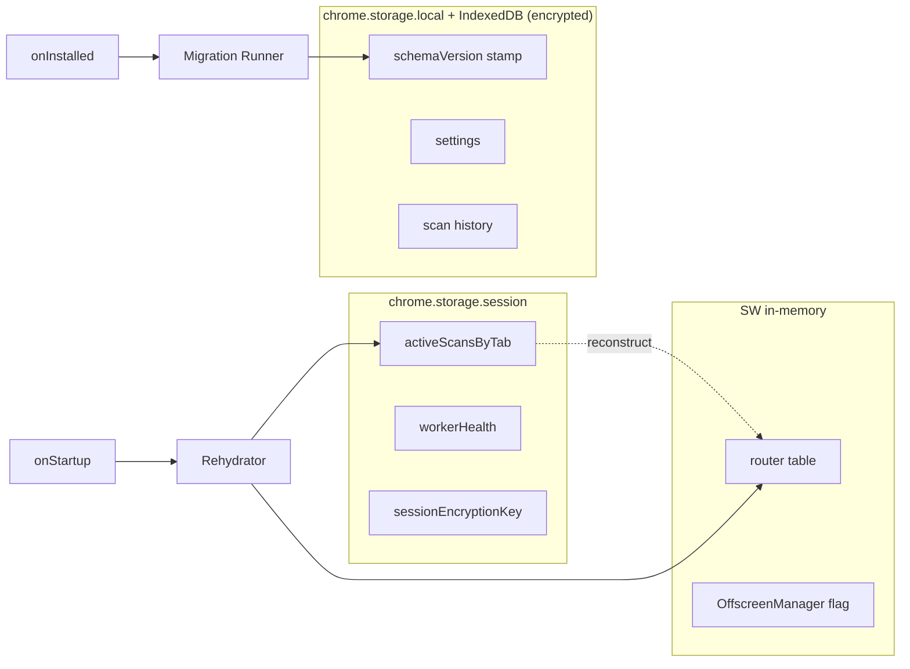
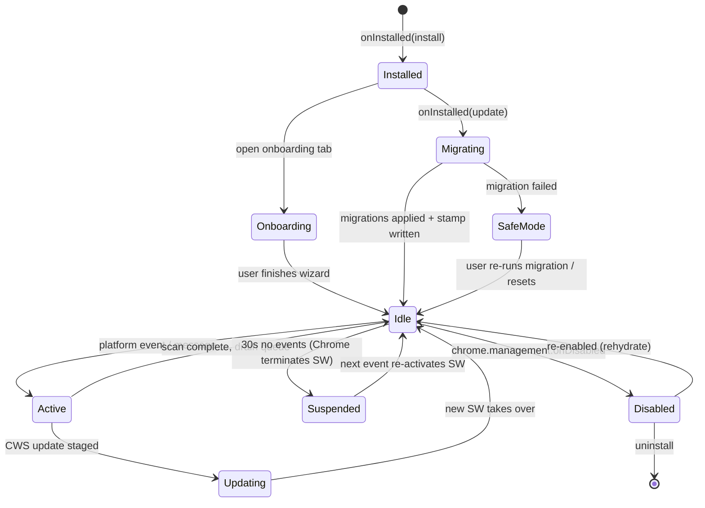
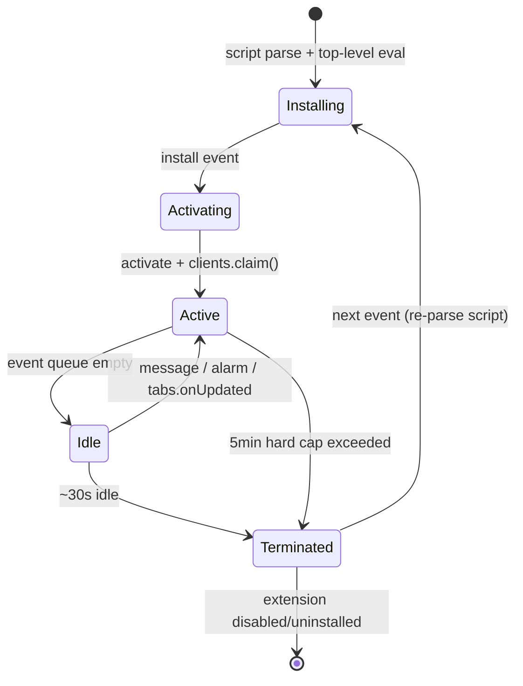
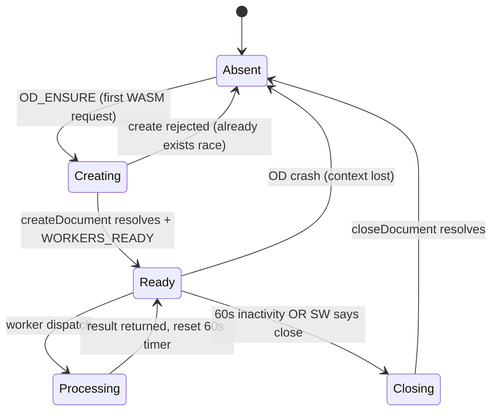
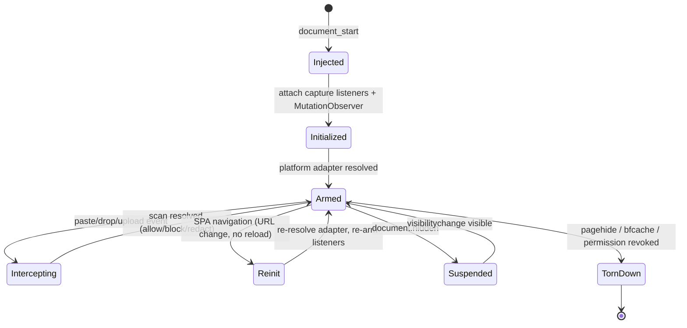
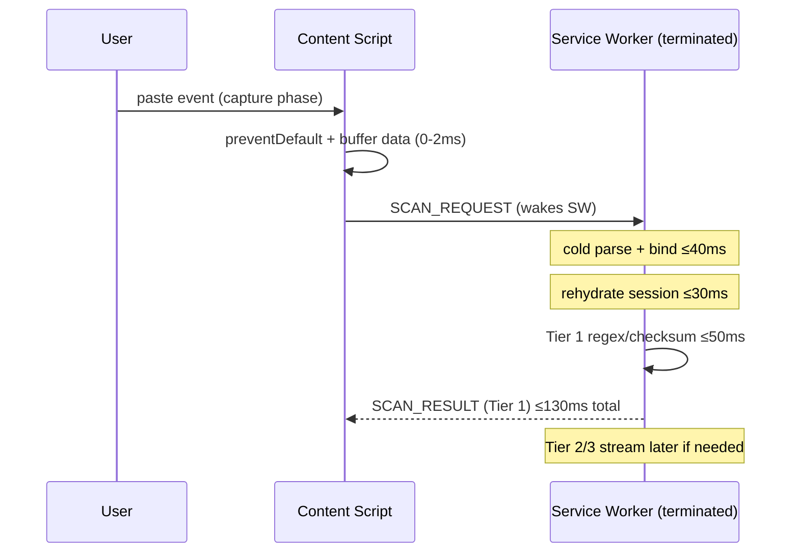

# PART 11 — EXTENSION LIFECYCLE

**Document ID:** SS-BP-011
**Classification:** Internal Engineering — Principal Review
**Version:** 1.0.0
**Last Updated:** 2026-07-12
**Owner:** Principal Browser Security Engineer, Chrome Extension Specialist
**Reviewers:** Principal Platform Architect, Principal Security Architect, DevOps Release Engineer

---

## Executive Summary

This document is the authoritative lifecycle contract for the Sentinel Shield AI extension. It specifies every state every extension context can occupy, every legal transition between those states, and the precise recovery behavior for every transition that can fail. Manifest V3 makes the Service Worker ephemeral and the Offscreen Document singleton, so correct lifecycle handling is the difference between an extension that silently drops scans and one that is provably resilient. Every design here assumes **zero network availability**: model weights, rule packs, and WASM binaries are bundled in the extension package, and no lifecycle transition may block on a network fetch. This document satisfies the 20-field subsystem template (00_MASTER_INDEX.md §5) with the subsystem being *the extension lifecycle coordinator*.

---

## 1. Field 1 — Purpose

| ID | Purpose Statement |
|---|---|
| PUR-01 | Define the complete, deterministic lifecycle for all four extension contexts (extension-wide, Service Worker, Offscreen Document, Content Script). |
| PUR-02 | Guarantee correctness across Service Worker termination and re-activation, the defining constraint of Manifest V3. |
| PUR-03 | Specify a versioned, forward-compatible storage schema migration strategy that survives updates and downgrades. |
| PUR-04 | Guarantee full offline operation: every lifecycle transition completes with zero network dependency. |
| PUR-05 | Bound cold-start latency to under 500 ms from event wake to first-scan readiness. |
| PUR-06 | Define enable/disable, update, and rollback procedures that never corrupt persisted user data. |

---

## 2. Field 2 — Responsibilities

| Responsibility | Owning Context |
|---|---|
| First-install onboarding trigger | Service Worker (`onInstalled`) |
| Storage schema migration | Service Worker (migration runner) |
| Dynamic content-script (re)registration | Service Worker |
| Offscreen Document create/close arbitration | Service Worker (`OffscreenManager`) |
| Content script init / SPA re-init / teardown | Content Script |
| In-flight scan draining across update | Service Worker + Content Script |
| Keep-alive scheduling | Service Worker (`chrome.alarms`) |
| Downgrade-safe write discipline | Storage Manager |

---

## 3. Field 3 — Public Interfaces

These are the runtime hooks the lifecycle coordinator binds. All are idempotent — Chrome may deliver `onStartup` and `onInstalled` in either order, and may replay events after a crash.

```typescript
// background/lifecycle/index.ts
import { runMigrations } from './migration-runner';
import { registerEnabledPlatforms } from './registration';
import { openOnboarding } from './onboarding';

chrome.runtime.onInstalled.addListener(async (details) => {
  switch (details.reason) {
    case 'install':
      await bootstrapFreshInstall();   // seed defaults, open onboarding
      break;
    case 'update':
      await runMigrations(details.previousVersion ?? '0.0.0', CURRENT_SCHEMA_VERSION);
      break;
    case 'chrome_update':
    case 'shared_module_update':
      break; // no-op: our state is version-stamped, nothing to do
  }
  await registerEnabledPlatforms(); // idempotent: unregisters stale IDs first
});

chrome.runtime.onStartup.addListener(async () => {
  // Browser (re)launch. chrome.storage.session is empty here.
  await rehydrateSessionState();
  await registerEnabledPlatforms();
});

chrome.runtime.onSuspend.addListener(() => {
  // Best-effort flush only. Chrome grants no async time here.
  flushPendingWritesSync();
});
```

| Interface | Trigger | Guarantee |
|---|---|---|
| `onInstalled` | Install, update, Chrome update | Runs migration + registration exactly once per version transition |
| `onStartup` | Browser launch | Rehydrates ephemeral state; never assumes `storage.session` populated |
| `onSuspend` | SW about to terminate | Synchronous flush only; no async work survives |
| `chrome.management.onEnabled/onDisabled` | User toggles extension | Observed by the browser, not by us; disable tears down all contexts |

---

## 4. Field 4 — Internal Interfaces

| Internal Call | From → To | Payload |
|---|---|---|
| `MIGRATION_RUN` | `onInstalled` → migration runner | `{ from: SemVer, to: SchemaVersion }` |
| `PLATFORM_REGISTER` | lifecycle → `chrome.scripting` | `RegisteredContentScript[]` |
| `SW_ALIVE_PING` | keep-alive alarm → SW | `{ ts: number }` |
| `OD_ENSURE` | scan coordinator → `OffscreenManager` | `void` |
| `CS_LIFECYCLE` | content script → SW | `{ phase: 'init'\|'spa-nav'\|'teardown', tabId }` |

---

## 5. Field 5 — Data Flow

The lifecycle subsystem moves three kinds of state: **persistent** (`chrome.storage.local` + IndexedDB, encrypted, survives everything), **ephemeral** (`chrome.storage.session`, survives SW restart but not browser restart), and **transient** (in-memory SW globals, survive nothing). The migration runner reads and rewrites only persistent state. The rehydrator reconstructs transient state from ephemeral + persistent state on every wake.



---

## 6. Field 6 — Control Flow: Overall Extension State Machine



**SafeMode** is a first-class state: if a migration throws, the extension refuses to run detection (fail-safe) and surfaces a repair action in the popup, rather than operating on a schema it does not understand.

---

## 7. Field 7 — Lifecycle (Per-Context State Machines)

### 7.1 Service Worker Lifecycle

Chrome terminates an idle MV3 Service Worker after ~30 seconds of inactivity (hard cap of 5 minutes even under load). Every wake must be treated as a cold start.



| Transition | Work Performed | Failure Mode | Recovery |
|---|---|---|---|
| Installing → Activating | Parse module, bind listeners at top level | Top-level throw → SW dead | Chrome retries on next event; CI lint forbids async top-level work |
| Activating → Active | `clients.claim()`, rehydrate session | Rehydrate reads corrupt session | Treat as empty; rebuild from persistent store |
| Active → Idle | Persist scan checkpoints | Write races with termination | Writes are atomic single-key `set`; last-writer-wins is safe |
| Idle → Terminated | none (Chrome-initiated) | In-flight scan orphaned | Content script holds a 30s ACK timer; re-sends `SCAN_REQUEST` |
| Terminated → Installing | Full re-parse | Missing bundled asset | Asset integrity checked at build; runtime falls back to Tier 1 |

**Critical rule:** all `addListener` calls execute synchronously at the top level of the SW module. Registering a listener inside a promise callback loses events fired before the promise resolves.

### 7.2 Offscreen Document Lifecycle

Exactly one Offscreen Document may exist per extension. It is created lazily on the first WASM request and closed after 60 s of inactivity (see PART_10 §7.1, PART_04 ADR-006).



| Transition | Failure Mode | Recovery |
|---|---|---|
| Absent → Creating | `createDocument` rejects: "Only a single offscreen document may be created" | Query `getContexts`; adopt the existing OD instead of failing |
| Creating → Ready | Worker WASM instantiation throws | Return Tier-1-only result; mark `workerHealth=ERROR`; retry next request |
| Ready → Absent (crash) | OD context silently lost | SW health-ping detects missing context; recreate on next `OD_ENSURE` |

### 7.3 Content Script Lifecycle

Registered dynamically per platform at `document_start`, isolated world (PART_10 §5.1). Must survive SPA route changes without a full document reload.



| Transition | Failure Mode | Recovery |
|---|---|---|
| Injected → Initialized | Listener attach throws | Global error boundary re-attaches; badge warns |
| Armed → Reinit (SPA) | Missed URL change | SW `tabs.onUpdated` re-messages CS; CS also self-detects via History API patch |
| Armed → Suspended | Observer keeps running (battery drain) | Observer disconnected on `visibilitychange`; reconnected on return |
| Armed → TornDown (bfcache) | Stale listeners on restore | `pageshow.persisted` handler re-initializes from scratch |

---

## 8. Field 8 — Dependencies

| Dependency | Type | Lifecycle Role |
|---|---|---|
| PART_10 Browser Extension Architecture | Doc | Context definitions, injection strategy |
| PART_04 System Architecture | Doc | Trust boundaries, state externalization |
| PART_15 Permissions & Sandboxing | Doc | Registration requires host permission grant |
| PART_19 Storage/Crypto/Keys | Doc | Encrypted persistence for migration state |
| `chrome.runtime` / `chrome.scripting` / `chrome.offscreen` / `chrome.alarms` | Platform API | All transitions |

---

## 9. Field 9 — Memory Usage

| Context | Idle | Peak During Transition | Notes |
|---|---|---|---|
| Service Worker (rehydrate) | 5 MB | 18 MB | Migration reads full settings blob into memory once |
| Migration runner | — | +4 MB | Bounded: migrates one key namespace at a time, not whole DB |
| Offscreen Document (creating) | 0 → 5 MB | 50 MB | Worker WASM instantiation dominates |
| Content Script (init) | 2 MB | 5 MB | Observer + adapter tables |

---

## 10. Field 10 — CPU Budget

| Transition | Budget | Rationale |
|---|---|---|
| SW cold parse + listener bind | < 40 ms | Bundle kept < 300 KB; no top-level async |
| Session rehydrate | < 30 ms | Single `storage.session.get` + object rebuild |
| Migration step (per version) | < 50 ms | Pure in-memory transform; no re-encryption of history rows |
| Registration of N platforms | < 20 ms | `registerContentScripts` batched in one call |
| Content script init | < 50 ms | Matches PART_10 §12 |

---

## 11. Field 11 — Latency Budget (Cold-Start Optimization)

The end-to-end **cold-start target is < 500 ms** from platform event to "ready to scan."



| Segment | Budget |
|---|---|
| Event capture + buffer | 2 ms |
| SW wake (parse + bind) | 40 ms |
| Session rehydrate | 30 ms |
| Tier 1 detection | 50 ms |
| IPC roundtrip overhead | 8 ms |
| **Cold-start critical path** | **≤ 130 ms** |
| Offscreen create (only if WASM needed) | +200 ms (off critical path, streamed) |

Cold-start optimizations: (1) SW bundle tree-shaken and < 300 KB; (2) zero async top-level work; (3) WASM/model assets memory-mapped lazily, never at wake; (4) Tier 1 result returned before Tier 2/3 so the user is never blocked on the Offscreen Document.

---

## 12. Field 12 — Failure Modes

| # | Failure | Lifecycle Phase | Impact |
|---|---|---|---|
| FM-01 | Top-level exception in SW script | SW install | SW never activates; no interception |
| FM-02 | Migration throws mid-run | Update | Schema in unknown state |
| FM-03 | Partial migration (crash between keys) | Update | Mixed old/new schema |
| FM-04 | `registerContentScripts` fails (permission revoked) | Any | No CS on that platform |
| FM-05 | Offscreen "single document" race | WASM request | Duplicate-create rejection |
| FM-06 | SW terminated mid-scan | Active | Content script left waiting |
| FM-07 | Downgrade to older version reads newer schema | Rollback | Potential crash / data loss |
| FM-08 | `storage.session` cleared unexpectedly | Wake | Lost active-scan checkpoints |
| FM-09 | Alarm keep-alive throttled by OS | Idle | Slower first scan |
| FM-10 | bfcache restore with stale listeners | CS restore | Double interception |

---

## 13. Field 13 — Recovery Strategy

| # | Recovery |
|---|---|
| FM-01 | CI static check bans top-level `await`/async side effects; runtime wraps init in try/catch and reports `SAFE_MODE` to badge |
| FM-02 | Migrations run inside a **transaction envelope**: schema stamp is written **last**, only after all steps succeed. On throw, stamp stays at old version → migration re-runs next wake (idempotent) |
| FM-03 | Each migration step is idempotent and keyed; runner records `lastCompletedStep`; resumes from there |
| FM-04 | `permissions.onRemoved` unregisters the script and greys the badge; re-request flow in PART_15 |
| FM-05 | Query `getContexts` first, adopt existing OD (PART_10 §7.1) |
| FM-06 | Content script arms a 30 s ACK timer; on timeout re-sends `SCAN_REQUEST`, which re-wakes the SW; scan state reloaded from `storage.session` |
| FM-07 | Forward-compat write rule (§16.3): unknown fields preserved, never assumed; downgrade reads a strict subset |
| FM-08 | Rehydrator treats empty session as cold; content scripts re-drive any pending scans |
| FM-09 | Keep-alive is an optimization only; correctness never depends on it (ADR-011) |
| FM-10 | `pageshow.persisted === true` triggers full teardown + re-init; idempotent listener attach guards double-binding |

---

## 14. Field 14 — Security Concerns

| Concern | Mitigation |
|---|---|
| Malicious page forces rapid SW wake/terminate churn to exhaust CPU | Rate limiter (PART_04 §12); wake work bounded to < 130 ms |
| Migration reads attacker-influenced storage | Only extension-writable stores are migrated; managed policy is read-only; all values schema-validated before use |
| Downgrade attack to reintroduce a patched-out rule schema | Rollback publishes a signed CWS build only; storage forward-compat prevents state weaponization |
| Content script re-injection after permission revocation | Chrome removes CS automatically on revocation; SW verifies grant before re-register |
| Onboarding page phishing (fake first-run) | Onboarding is an extension page (`chrome-extension://`), not web content; origin is verifiable |

---

## 15. Field 15 — Privacy Concerns

| Concern | Mitigation |
|---|---|
| Migration logs leaking PII from history rows | Migration operates on encrypted blobs by key; never decrypts scan payloads to migrate metadata |
| First-install telemetry before consent | No network calls at install; telemetry strictly opt-in (PART_26), default off |
| Version stamp fingerprinting | Version stamp stored locally only; never transmitted |
| Session key persistence | Session encryption key lives only in `storage.session`, wiped on browser restart (PART_04 §6.4) |

---

## 16. Field 16 — Performance Concerns & Key Mechanisms

### 16.1 Storage Schema Migration Runner

```typescript
// background/lifecycle/migration-runner.ts
export const CURRENT_SCHEMA_VERSION = 4;

type Migration = {
  readonly to: number;
  readonly describe: string;
  apply(db: StorageFacade): Promise<void>; // MUST be idempotent
};

const MIGRATIONS: readonly Migration[] = [
  { to: 2, describe: 'settings.sensitivity number → enum',      apply: m2 },
  { to: 3, describe: 'add allowlist namespace',                 apply: m3 },
  { to: 4, describe: 'split scanHistory into IndexedDB store',  apply: m4 },
];

export async function runMigrations(_prevVersion: string, target: number): Promise<void> {
  const meta = await storage.get('schemaMeta');
  let current = meta?.schemaVersion ?? 1;
  const done = new Set<number>(meta?.completedSteps ?? []);

  try {
    for (const mig of MIGRATIONS) {
      if (mig.to <= current || done.has(mig.to)) continue;
      await mig.apply(storage);           // idempotent transform
      done.add(mig.to);
      await storage.set('schemaMeta', {   // checkpoint per step
        schemaVersion: current, completedSteps: [...done],
      });
    }
    // Stamp is written LAST — the transaction-envelope guarantee.
    await storage.set('schemaMeta', {
      schemaVersion: target, completedSteps: [], migratedAt: Date.now(),
    });
  } catch (err) {
    await storage.set('lifecycleState', { mode: 'SAFE_MODE', reason: String(err) });
    throw err; // stamp untouched → migration re-runs next wake
  }
}
```

### 16.2 Keep-Alive Strategy — ADR-011

**ADR-011: Alarm-Based Keep-Alive vs. Pure Ephemeral**

**Context:** MV3 terminates idle SWs in ~30 s. A cold start adds ~40 ms parse latency to the first scan after idle.

**Alternatives:**

| Alternative | Pros | Cons |
|---|---|---|
| Pure ephemeral (no keep-alive) | Zero background CPU/battery; simplest; CWS-friendly | ~40 ms cold-start penalty after each idle |
| `chrome.alarms` every 30 s (min period is 30 s in MV3) | SW warm more often; faster first scan | Background wakes drain battery; reviewers scrutinize; still not guaranteed warm |
| Persistent connection (`runtime.connect`) heartbeat | Keeps SW alive while a port is open | Fragile, considered an anti-pattern, breaks on tab close |
| WebSocket/`fetch` loop | Warm SW | Forbidden offline; policy violation; battery cost |

**Decision:** **Pure ephemeral is the default.** An **optional** `chrome.alarms` warm-up (30 s period) is enabled *only* while a protected AI tab is focused, and disabled otherwise.

**Rationale:** Correctness never depends on the SW being warm (§13 FM-09). The 40 ms cold-start cost is inside our 130 ms budget, so keep-alive is a UX nicety, not a requirement. Scoping the alarm to focused protected tabs limits battery cost and passes CWS review (no perpetual background activity).

```typescript
// Enable warm-up only when a protected tab is focused.
chrome.tabs.onActivated.addListener(async ({ tabId }) => {
  const tab = await chrome.tabs.get(tabId);
  if (isProtectedPlatform(tab.url)) {
    chrome.alarms.create('sw-warm', { periodInMinutes: 0.5 });
  } else {
    chrome.alarms.clear('sw-warm');
  }
});
chrome.alarms.onAlarm.addListener((a) => { if (a.name === 'sw-warm') { /* touch */ } });
```

### 16.3 Rollback & Downgrade Forward-Compatibility

**Rollback procedure (Chrome Web Store only):**

1. Halt rollout of the bad version in the CWS dashboard.
2. Re-publish the last known-good `.zip` with a **higher** version number (CWS forbids re-using a version; e.g. `1.4.2` fixes bad `1.4.1` by shipping `1.4.3` == contents of `1.4.0`).
3. Users auto-update forward to the re-published good build; no user action needed.

**Downgrade safety (forward-compat write rule):** Because a user may sideload or receive an older build during a staged rollback, older code must not corrupt newer state.

| Rule | Enforcement |
|---|---|
| Never `set` a whole namespace object; write per-field | Storage Manager API only exposes field-scoped writes |
| Preserve unknown fields on read-modify-write | Reader merges `{...unknownFields, ...knownFields}` |
| Readers validate and **ignore** fields they don't understand | Zod `.passthrough()` schemas |
| Downgrade never rewrites the schema stamp downward | Migration runner only advances the stamp |

---

## 17. Field 17 — Testing Strategy

| Test | Scope | Tool |
|---|---|---|
| SW cold-start timing | Wake → Tier 1 result < 130 ms | Playwright + `performance.now` harness |
| Migration idempotency | Run each migration twice; assert stable state | Vitest |
| Migration crash-resume | Kill between steps; assert resume from checkpoint | Vitest + fault injection |
| Downgrade compat | Write v4 state, load v3 code, assert no corruption | Vitest fixture matrix |
| Offscreen single-doc race | Fire 10 concurrent `OD_ENSURE`; assert one OD | Playwright |
| SPA re-init | Route change without reload; assert listeners re-armed | Playwright on ChatGPT/Claude |
| In-flight scan across update | Trigger scan, stage update, assert completion | Playwright with two loaded builds |
| bfcache restore | Back/forward; assert no double interception | Playwright |
| Offline boot | Network disabled; assert full function | Playwright with `offline` context |

---

## 18. Field 18 — Production Checklist

- [ ] SW module has zero top-level async side effects (CI static check)
- [ ] All `addListener` calls are synchronous at module top level
- [ ] `onInstalled(install)` opens onboarding exactly once
- [ ] `onInstalled(update)` runs migration runner with transaction-envelope stamp
- [ ] Migration runner verified idempotent and crash-resumable
- [ ] Downgrade forward-compat rule enforced by Storage Manager API
- [ ] Cold-start critical path measured < 130 ms on reference hardware
- [ ] Offscreen Document create/close/recreate verified under race
- [ ] Content script SPA re-init verified on all enabled platforms
- [ ] Full offline operation verified (0 network, bundled assets only)
- [ ] Keep-alive alarm scoped to focused protected tabs only
- [ ] SafeMode reachable and recoverable from popup
- [ ] Rollback runbook rehearsed (re-publish higher version number)

---

## 19. Field 19 — Future Improvements

| Improvement | Impact |
|---|---|
| Declarative migration DSL with codegen | Eliminates hand-written migration bugs |
| SW warm-up via `chrome.runtime.getContexts` prefetch hints | Further shave cold-start below 100 ms |
| Background migration progress UI | Better UX for large history migrations |
| `chrome.sidePanel` lifecycle integration | Persistent status surface across navigations |
| Cross-device settings sync via `chrome.storage.sync` (opt-in, encrypted) | Portable config with downgrade-safe schema |

---

## 20. Field 20 — Open Risks (Register)

| Risk ID | Description | Likelihood | Impact | Mitigation / Owner |
|---|---|---|---|---|
| RISK-11-01 | Chrome shortens SW idle timeout below 30 s in a future release | Medium | Low | Correctness is timeout-independent; monitor Chrome release notes / Extension Eng |
| RISK-11-02 | A migration on a very large history store exceeds SW time budget | Low | Medium | Chunked, resumable migration; move heavy rows to IndexedDB cursor batches / Storage |
| RISK-11-03 | User sideloads an old build causing downgrade edge case | Low | Medium | Forward-compat write rule; strict passthrough validation / Extension Eng |
| RISK-11-04 | Alarm keep-alive flagged in CWS review as background activity | Low | Low | Scoped to focused protected tabs; documented justification / Release Eng |
| RISK-11-05 | Offscreen Document adoption race under extreme concurrency | Low | Low | `getContexts` guard + single-flight lock / Extension Eng |

---

**Resolved Defects:** none assigned to this document.
**Cross-references:** PART_04 §6.4 (state), PART_10 §6–7 (SW/OD), PART_15 (permission-gated registration), PART_19 (encrypted storage), PART_25 (release/rollback), PART_26 (telemetry consent).
