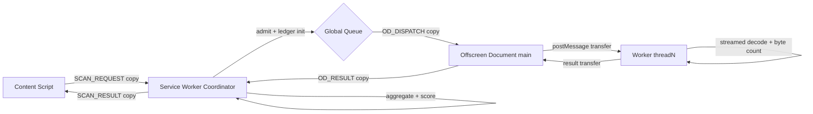
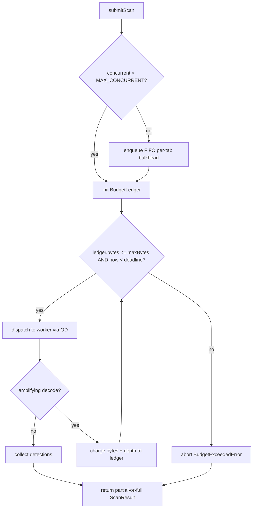
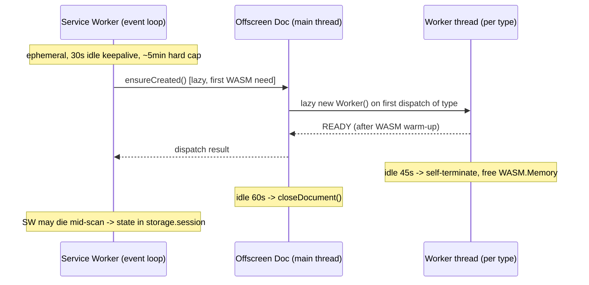
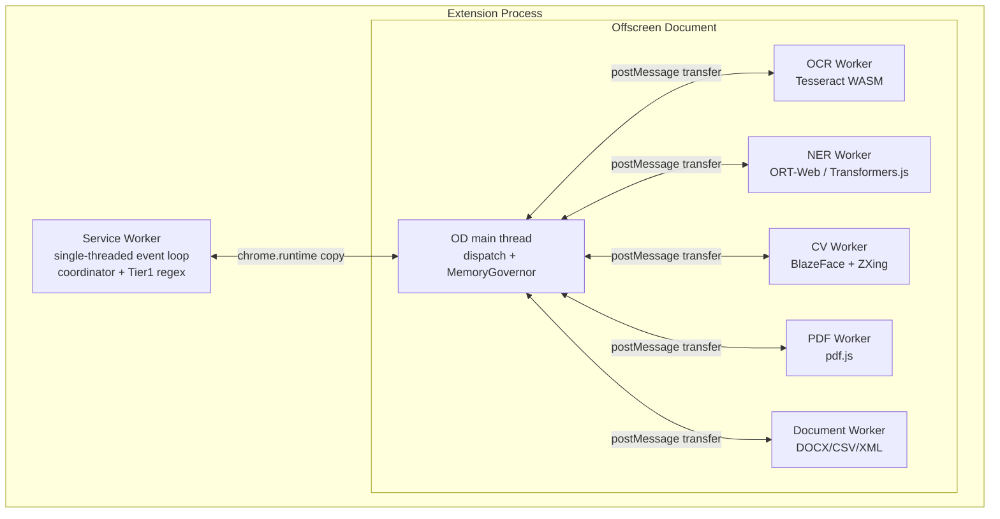

# PART 12 — RUNTIME PIPELINE, THREADING & MEMORY MODEL

**Document ID:** SS-BP-012
**Classification:** Internal Engineering — Principal Review
**Version:** 1.0.0
**Last Updated:** 2026-07-12
**Owner:** Principal Performance Engineer, Principal Platform Architect
**Reviewers:** Principal Browser Security Engineer, Distinguished AI Engineer, Principal Detection Engineer

---

## Executive Summary

This document is the concurrency, threading, memory, streaming, error-handling, and failure-recovery bible for Sentinel Shield AI. Manifest V3 gives us a single-threaded, ephemeral Service Worker (SW) that cannot spawn `Worker`s, and one Offscreen Document (OD) that can. All WASM-heavy work (Tesseract.js OCR, ONNX Runtime Web / Transformers.js NER, TensorFlow.js BlazeFace CV, pdf.js, ZXing) runs on Web Worker threads hosted by the OD. This document specifies exactly how threads are modeled, how the worker pool behaves under load, how cross-tab concurrency is bounded, how memory is capped and reclaimed, how large files are streamed, how errors propagate across IPC hops, and how the system recovers from every failure class.

It resolves **DEF-05**: a single global per-scan processing budget (max bytes scanned **and** max wall-clock) enforced by the SW coordinator, bounding all recursive/amplifying decode paths (Base64 re-scan, archive extraction, nested archives, OCR-of-PDF-page-images).

---

## 1. Purpose

| ID | Purpose |
|---|---|
| PUR-01 | Define the authoritative thread model across SW, OD main thread, and N worker threads |
| PUR-02 | Specify the worker pool (lazy spawn, idle-timeout, one-in-flight-per-type, bounded queue, per-tab fairness) |
| PUR-03 | Bound cross-tab concurrency and apply backpressure without deadlock or starvation |
| PUR-04 | Enforce a single global per-scan processing budget over all amplifying decode paths (DEF-05) |
| PUR-05 | Define memory ceilings, reclamation, zero-copy transfer, and detached-buffer discipline |
| PUR-06 | Define the streaming pipeline for large files with byte-accurate accounting |
| PUR-07 | Define the typed error hierarchy, propagation across IPC hops, timeout matrix, and recovery matrix |

---

## 2. Responsibilities

| Responsibility | Owner Component |
|---|---|
| Admission control, scan lifecycle, global budget enforcement | Service Worker (Coordinator) |
| Worker lifecycle, dispatch, one-in-flight-per-type, transfer | Offscreen Document (WorkerPool) |
| WASM execution, streaming decode, byte counting | Worker threads |
| Backpressure signalling, queue depth reporting | OD → SW via `chrome.runtime` |
| Cancellation fan-out on navigation/timeout | Service Worker → OD → Workers |
| Memory watermark monitoring and worker reclamation | Offscreen Document (MemoryGovernor) |

---

## 3. Public Interfaces

```typescript
// shared-types/runtime.ts

export interface ScanTicket {
  readonly scanId: string;
  readonly tabId: number;
  readonly kind: InputKind;                 // 'text' | 'image' | 'pdf' | 'archive' | 'document'
  readonly byteLength: number;
  readonly enqueuedAt: number;              // epoch ms
  readonly deadlineAt: number;              // enqueuedAt + WALL_CLOCK_BUDGET_MS
  readonly abortSignal: AbortSignal;        // fires on nav, timeout, budget exhaustion
}

export interface ProcessingBudget {
  readonly maxBytesScanned: number;         // hard cap across ALL decode expansion
  readonly maxWallClockMs: number;          // hard cap wall-clock per scan
  readonly maxDecodeDepth: number;          // recursion guard for archives/base64
  readonly maxDerivedArtifacts: number;     // e.g., PDF pages rasterized to images
}

export interface BudgetLedger {
  bytesScanned: number;                     // monotonically increasing
  decodeDepth: number;
  derivedArtifacts: number;
  readonly startedAt: number;
  readonly budget: ProcessingBudget;
}
```

The coordinator exposes `submitScan(ticket): Promise<ScanResult>` and `cancelScan(scanId, reason): void`. The OD exposes `dispatch(type, transferable, signal): Promise<WorkerResult>`.

---

## 4. Internal Interfaces

| Hop | Channel | Payload | Transfer semantics |
|---|---|---|---|
| Content Script → SW | `chrome.runtime.sendMessage` | `SCAN_REQUEST` (structured clone) | Copy (cross-process) |
| SW → OD | `chrome.runtime.sendMessage` | `OD_DISPATCH` (structured clone) | Copy (cross-process; **no** `Transferable` across `chrome.runtime`) |
| OD main → Worker | `worker.postMessage(buf, [buf])` | `ArrayBuffer` | **Zero-copy transfer** (buffer detached) |
| Worker → OD main | `postMessage(result, [result.buffer])` | result buffer | Zero-copy transfer back |
| OD → SW | `chrome.runtime.sendMessage` | `OD_RESULT` | Copy |

**Critical constraint:** `chrome.runtime` messaging does **not** support `Transferable`; every SW↔OD hop is a full structured-clone copy. Therefore large binary payloads are counted against the byte budget at the SW→OD hop and transferred zero-copy **only** on the OD→Worker hop.

---

## 5. Data Flow



---

## 6. Control Flow



---

## 7. Lifecycle



Thread model in one diagram:



---

## 8. Dependencies

| Dependency | Type |
|---|---|
| PART_04_SYSTEM_ARCHITECTURE.md | Coordinator-Processor model, OD-as-hub (ADR-006) |
| PART_10_BROWSER_EXTENSION_ARCHITECTURE.md | SW lifecycle, OD manager, worker pool skeleton |
| PART_16_WASM_RUNTIME.md | WASM.Memory growth, SIMD/threads detection, COI resolution (DEF-03) |
| PART_13_DETECTION_ENGINE.md | Tier definitions and per-tier latency budgets |
| Chrome Offscreen API (Chrome ≥ 120) | Platform constraint |

---

## 9. Worker Pool Design

### 9.1 Rules

| Rule | Value | Rationale |
|---|---|---|
| Spawn strategy | Lazy — worker created on first dispatch of its type | Avoid 200–350ms WASM warm-up cost until needed |
| Concurrency per type | **One in-flight per worker type** | WASM instances are memory-heavy; two OCR jobs would exceed the 120MB OCR ceiling |
| Idle termination | 45s per worker (staggered from OD's 60s) | Reclaim WASM.Memory before OD teardown |
| Queue depth per type | 8 | Beyond this → `QueueOverflowError`, caller told to retry |
| Fairness | Round-robin across tabs within a type's queue | Prevent one tab monopolizing OCR |
| Restart budget | Max 3 respawns / 60s per type | Crash-loop breaker → mark type `DEGRADED` |

### 9.2 Implementation

```typescript
// offscreen/worker-pool.ts
interface QueueItem {
  tabId: number;
  payload: ArrayBuffer;
  signal: AbortSignal;
  resolve: (r: WorkerResult) => void;
  reject: (e: Error) => void;
}

class WorkerPool {
  #entries = new Map<WorkerType, { worker: Worker; status: 'idle' | 'busy'; lastUsed: number }>();
  #queues = new Map<WorkerType, QueueItem[]>();
  #rrCursor = new Map<WorkerType, number>();      // fairness cursor per type
  #restarts = new Map<WorkerType, number[]>();     // respawn timestamps
  static readonly MAX_QUEUE_DEPTH = 8;
  static readonly IDLE_MS = 45_000;

  dispatch(type: WorkerType, payload: ArrayBuffer, signal: AbortSignal): Promise<WorkerResult> {
    if (signal.aborted) return Promise.reject(new ScanAbortedError('pre-dispatch'));
    const q = this.#queues.get(type) ?? [];
    if (q.length >= WorkerPool.MAX_QUEUE_DEPTH) {
      return Promise.reject(new QueueOverflowError(type, q.length));
    }
    return new Promise<WorkerResult>((resolve, reject) => {
      const item: QueueItem = { tabId: currentTabId(), payload, signal, resolve, reject };
      signal.addEventListener('abort', () => this.#drop(type, item), { once: true });
      q.push(item);
      this.#queues.set(type, q);
      this.#pump(type);
    });
  }

  #pump(type: WorkerType): void {
    const entry = this.#ensureWorker(type);
    if (entry.status === 'busy') return;
    const item = this.#nextFair(type);            // round-robin across tabs
    if (!item) return;
    entry.status = 'busy';
    entry.lastUsed = Date.now();
    const timer = setTimeout(() => this.#onTimeout(type, item), TIMEOUTS[type]);
    entry.worker.onmessage = (e) => {
      clearTimeout(timer);
      entry.status = 'idle';
      item.resolve(e.data);
      this.#pump(type);                           // serve next queued item
    };
    entry.worker.onerror = (err) => {
      clearTimeout(timer);
      this.#respawn(type, err);
      item.reject(new WorkerCrashError(type, err.message));
    };
    entry.worker.postMessage(item.payload, [item.payload]); // zero-copy, buffer detached
  }

  #nextFair(type: WorkerType): QueueItem | undefined {
    const q = this.#queues.get(type);
    if (!q?.length) return undefined;
    const cursor = (this.#rrCursor.get(type) ?? 0);
    const tabs = [...new Set(q.map(i => i.tabId))].sort();
    const tab = tabs[cursor % tabs.length];
    this.#rrCursor.set(type, cursor + 1);
    const idx = q.findIndex(i => i.tabId === tab);
    return q.splice(idx, 1)[0];
  }
}
```

---

## 10. Cross-Tab Concurrency & Backpressure

| Control | Value | Enforced by |
|---|---|---|
| Max concurrent scans (global) | **3** | SW admission gate |
| Per-tab in-flight scans (bulkhead) | **1** | SW per-tab lock |
| Global FIFO queue depth | **32** | SW; excess → `SCAN_REJECTED_BUSY` |
| Per-tab queued scans | **4** | SW; excess coalesces to latest input |
| Cancellation on navigation | Immediate | `chrome.tabs.onUpdated` / `onRemoved` → `AbortController.abort()` |
| Backpressure signal | OD reports queue depth ≥ 6 → SW pauses admission | OD → SW `OD_BACKPRESSURE` |

Navigation cancellation fans out across all hops: SW aborts the `ScanTicket`, sends `OD_CANCEL(scanId)`, OD posts `{cancel:true}` to the busy worker and drops queued items for that scan. Workers poll the cancel flag between decode chunks (see §12) to abort mid-stream.

---

## 11. DEF-05 — Single Global Per-Scan Processing Budget

**Decision:** One `BudgetLedger` per `scanId`, created by the SW at admission, threaded through **every** amplifying operation. Both a byte ceiling and a wall-clock ceiling are enforced; whichever trips first aborts the scan and returns partial results.

### 11.1 The numbers

| Budget | Value | Notes |
|---|---|---|
| `maxBytesScanned` | **64 MB** total across all expansion | Original bytes + every decoded/derived byte counted once |
| `maxWallClockMs` | **20,000 ms** per scan (hard) | From admission to final aggregation |
| `maxDecodeDepth` | **3** | e.g., zip → inner zip → file = depth 3; deeper is refused |
| `maxDerivedArtifacts` | **50** | PDF pages rasterized to images, archive members, etc. |
| Base64 re-scan expansion cap | decoded bytes charged 1:1 to `bytesScanned`; refused if it would exceed 64 MB | Prevents Base64 amplification bomb |
| Single-file post-decompression cap | **16 MB** | A member inside an archive cannot exceed this even if budget remains |
| Compression ratio guard | abort if any stream exceeds **100:1** expansion | Zip-bomb defense |

### 11.2 Enforcement

```typescript
// background/budget.ts
export class BudgetError extends ScanError {}
export class BudgetBytesExceeded extends BudgetError {}
export class BudgetTimeExceeded extends BudgetError {}
export class DecodeDepthExceeded extends BudgetError {}

const DEFAULT_BUDGET: ProcessingBudget = {
  maxBytesScanned: 64 * 1024 * 1024,
  maxWallClockMs: 20_000,
  maxDecodeDepth: 3,
  maxDerivedArtifacts: 50,
};

export class Ledger {
  bytesScanned = 0; decodeDepth = 0; derivedArtifacts = 0;
  readonly startedAt = Date.now();
  constructor(readonly budget = DEFAULT_BUDGET) {}

  charge(bytes: number): void {
    if (Date.now() - this.startedAt > this.budget.maxWallClockMs)
      throw new BudgetTimeExceeded(`wall-clock ${this.budget.maxWallClockMs}ms exceeded`);
    if (this.bytesScanned + bytes > this.budget.maxBytesScanned)
      throw new BudgetBytesExceeded(`byte ceiling ${this.budget.maxBytesScanned} exceeded`);
    this.bytesScanned += bytes;
  }
  enterDecode(): void {
    if (++this.decodeDepth > this.budget.maxDecodeDepth)
      throw new DecodeDepthExceeded(`depth ${this.budget.maxDecodeDepth} exceeded`);
  }
  exitDecode(): void { this.decodeDepth--; }
  deriveArtifact(): void {
    if (++this.derivedArtifacts > this.budget.maxDerivedArtifacts)
      throw new BudgetBytesExceeded(`derived-artifact cap ${this.budget.maxDerivedArtifacts} exceeded`);
  }
}
```

### 11.3 Abort behavior

On any `BudgetError` the coordinator:
1. Fires the scan's `AbortController` (cancels in-flight worker + drops that scan's queued items).
2. Returns a `ScanResult` marked `partial: true`, `abortReason: <error.name>`, with all detections gathered **before** the trip.
3. Surfaces a UI note: "Scan stopped — input too large/complex; results are partial." (fail-open for individuals, fail-closed for enterprise block-mode → holds data and shows "unable to fully scan").

---

## 12. Streaming Pipeline for Large Files

Large inputs are never fully materialized twice. Files stream through chunked reads with per-chunk budget charging and cooperative cancellation.

```typescript
// offscreen/stream-scan.ts
async function* chunk(stream: ReadableStream<Uint8Array>, size = 256 * 1024) {
  const reader = stream.getReader();
  let carry = new Uint8Array(0);
  for (;;) {
    const { done, value } = await reader.read();
    if (done) { if (carry.length) yield carry; return; }
    // merge carry + value, emit fixed-size windows for stable regex boundaries
    let buf = concat(carry, value);
    while (buf.length >= size) { yield buf.subarray(0, size); buf = buf.subarray(size); }
    carry = buf;
  }
}

async function streamScan(stream: ReadableStream<Uint8Array>, ledger: Ledger, signal: AbortSignal) {
  for await (const c of chunk(stream)) {
    if (signal.aborted) throw new ScanAbortedError('navigation');
    ledger.charge(c.byteLength);            // byte-accurate accounting
    await scanChunk(c);                      // Tier1 regex with 64-byte overlap window
  }
}
```

| Streaming rule | Value |
|---|---|
| Chunk size | 256 KB |
| Overlap window (boundary-spanning entities) | 64 bytes |
| Decompression | Streaming via `DecompressionStream('gzip'|'deflate')`; byte-count **output**, enforce 100:1 ratio guard |
| Backpressure | `ReadableStream` native — reader pulls only when worker is idle |
| Blob URLs | **Forbidden.** Use `ArrayBuffer`/`Uint8Array` + transfer. Blob URLs leak (must be `revokeObjectURL`'d) and defeat zero-copy |

---

## 13. Memory Usage & Management

### 13.1 Per-component ceilings

| Component | Idle | Active | Hard ceiling | Reclamation trigger |
|---|---|---|---|---|
| Service Worker | 5 MB | 15 MB | 30 MB | Drop `partialResults` after delivery |
| OD main thread | 5 MB | 20 MB | 50 MB | Close OD after 60s idle |
| OCR Worker | 0 | 80 MB | **120 MB** | Terminate after 45s idle or on `WASM.Memory` > 96 MB |
| NER Worker | 0 | 50 MB | **80 MB** | Terminate after 45s idle |
| CV Worker | 0 | 30 MB | **50 MB** | Terminate after 45s idle |
| PDF Worker | 0 | 40 MB | **64 MB** | Terminate after 45s idle |
| **Total extension** | 12 MB | 200 MB | **340 MB** | MemoryGovernor evicts LRU worker over watermark |

### 13.2 Governance rules

- **Zero-copy transfer:** every OD↔Worker binary hop uses `Transferable` (`postMessage(buf, [buf])`), detaching the source buffer. Reading a detached buffer throws — treated as a `DetachedBufferError` bug, never swallowed.
- **When workers are terminated to reclaim memory:** (a) 45s idle; (b) `WASM.Memory` for a type crosses its watermark (OCR 96 MB, NER 64 MB); (c) global extension estimate (`performance.measureUserAgentSpecificMemory()` when available, else heuristic sum) crosses 300 MB → evict the LRU idle worker.
- **GC pressure:** avoid retaining `ArrayBuffer` references after transfer; null out result buffers post-aggregation; do not cache decoded images — re-derive from source if needed within budget.
- **Detached-buffer handling:** callers must not reuse a transferred buffer. A `try/catch` around post-transfer access maps `TypeError: detached` → `DetachedBufferError` for observability.

---

## 14. CPU Budget

| Operation | Thread | Budget |
|---|---|---|
| SW message routing | SW event loop | < 1 ms |
| SW Tier 1 regex (10 KB) | SW event loop | < 20 ms |
| Budget ledger charge | SW event loop | < 0.01 ms |
| OD dispatch overhead | OD main | < 5 ms |
| Worker warm-up (WASM instantiate, cached) | Worker | < 350 ms |
| Chunk scan (256 KB) | Worker | < 40 ms |

The SW event loop must never block > 50 ms; any operation exceeding this is moved to a worker.

---

## 15. Latency Budget

| Operation | Budget (p50) | Budget (p95) |
|---|---|---|
| Admission → dispatch | 3 ms | 10 ms |
| OCR inference (1080p, single-thread WASM) | 3,800 ms | 6,000 ms |
| OCR inference (SIMD+threads WASM) | 2,500 ms | 4,200 ms |
| NER inference (512 tokens) | 150 ms | 300 ms |
| CV BlazeFace (1080p) | 50 ms | 90 ms |
| End-to-end text scan (10 KB) | 60 ms | 200 ms |
| End-to-end image scan (1080p) | 2,800 ms | 6,500 ms |
| Cancellation fan-out (nav) | 15 ms | 50 ms |

> **OCR re-baseline (linked to DEF-03):** because we ship **single-thread** WASM as the guaranteed baseline (see PART_16), the OCR budget baseline is **3,800 ms p50**, not 2,500 ms. The 2,500 ms figure applies only when cross-origin isolation + threaded WASM are confirmed available.

---

## 16. Failure Modes

| Failure | Detection | Blast radius |
|---|---|---|
| Worker crash (WASM trap / OOM) | `worker.onerror` | One tier for one scan |
| OD crash | dispatch timeout + `getContexts()` empty | All WASM tiers |
| SW restart mid-scan | new SW boot; `storage.session` shows in-progress scan | In-memory ledger lost |
| OOM (worker) | `RangeError` on `WASM.Memory.grow` | One worker |
| Queue overflow | depth ≥ 8 (type) / 32 (global) | New scans rejected |
| Budget exceeded | `BudgetError` from ledger | Current scan → partial |
| Detached buffer reuse | `TypeError` on access | Programming bug, one scan |

---

## 17. Recovery Strategy

| Failure | Recovery steps | Time to recovery |
|---|---|---|
| Worker crash | Terminate handle, delete from pool, respawn on next dispatch (max 3/60s), return partial (Tier 1 held by SW) | < 3 s |
| OD crash | SW detects via failed dispatch, `chrome.offscreen.closeDocument()` (idempotent), `ensureCreated()`, re-dispatch once; if second failure → return Tier 1 only | < 5 s |
| SW restart mid-scan | New SW reads `storage.session.activeScansByTab`; if input still present → re-admit and **re-scan**. If input bytes are gone: content script receives `SCAN_INTERRUPTED`, **holds** the payload, shows overlay “Scan interrupted — Review before send” with Allow/Block/Redact. **Forbidden:** silent re-dispatch of unscanned data (ADR-036). | < 1 s |
| OOM (worker) | Catch `RangeError`, terminate worker (frees `WASM.Memory`), reduce input via streaming/downscale, retry once at lower resolution | < 4 s |
| Crash-loop (type) | After 3 respawns/60s → mark type `DEGRADED`, skip that tier, surface "reduced protection" badge | Immediate degrade |
| Budget exceeded | Return partial per §11.3 | Immediate |

Recovery is **centralized in the coordinator** (per ADR-005): workers never self-heal peers.

---

## 18. Typed Error Hierarchy & IPC Propagation

```typescript
// shared-types/errors.ts
export class ScanError extends Error { constructor(msg: string, readonly scanId?: string) { super(msg); this.name = new.target.name; } }
export class BudgetError extends ScanError {}
export class BudgetBytesExceeded extends BudgetError {}
export class BudgetTimeExceeded extends BudgetError {}
export class DecodeDepthExceeded extends BudgetError {}
export class ScanAbortedError extends ScanError {}         // navigation/user cancel
export class WorkerError extends ScanError {}
export class WorkerTimeoutError extends WorkerError {}
export class WorkerCrashError extends WorkerError {}
export class QueueOverflowError extends WorkerError {}
export class OffscreenUnavailableError extends ScanError {}
export class DetachedBufferError extends ScanError {}
export class WasmInstantiationError extends ScanError {}   // owned by PART_16
```

**Propagation across IPC hops:** `Error` objects do not survive structured clone with their class. Each hop serializes to `{ name, message, scanId, hop }` and the receiver rehydrates via a `name → constructor` registry. Stack traces are dropped at the boundary; a correlation `scanId` links log lines across SW/OD/Worker.

```typescript
function serializeError(e: unknown, hop: string): SerializedError {
  const err = e instanceof ScanError ? e : new ScanError(String(e));
  return { name: err.name, message: err.message, scanId: err.scanId, hop };
}
function rehydrate(s: SerializedError): ScanError {
  const Ctor = ERROR_REGISTRY[s.name] ?? ScanError;
  const e = new Ctor(s.message, s.scanId); (e as any).hop = s.hop; return e;
}
```

---

## 19. Timeout Matrix

| Operation | Timeout | On timeout |
|---|---|---|
| SW message handler (overall) | 30,000 ms | `sendResponse({error:'TIMEOUT'})` |
| Per-scan wall-clock (DEF-05) | 20,000 ms | Abort → partial |
| OCR worker dispatch | 30,000 ms | Terminate + respawn |
| NER worker dispatch | 15,000 ms | Terminate + respawn |
| CV worker dispatch | 10,000 ms | Terminate + respawn |
| PDF worker dispatch | 30,000 ms | Terminate + respawn |
| Document worker dispatch | 10,000 ms | Terminate + respawn |
| OD creation | 5,000 ms | `OffscreenUnavailableError` → Tier 1 only |
| Worker warm-up (first WASM) | 8,000 ms | Mark type `DEGRADED` |
| SW→OD round trip (health) | 2,000 ms | Treat OD as crashed |

Per-operation timeouts are always **shorter** than or equal to the scan wall-clock budget so the budget is the outer bound.

---

## 20. Security, Privacy & Performance Concerns

**Security Concerns:** Zip/Base64 bombs are bounded by the byte + depth + ratio guards (§11). Workers run WASM in the browser sandbox with no `chrome.*` access. Cancellation prevents a navigated-away tab's data from lingering in worker memory. Buffer transfer means raw sensitive bytes exist in exactly one thread at a time.

**Privacy Concerns:** Raw input buffers are never persisted; they live in worker memory only for the scan duration and are released on completion/abort. `scanId` correlation logs carry no payload bytes. Detached buffers guarantee the SW copy is gone once transferred.

**Performance Concerns:** The single-in-flight-per-type rule caps peak memory but serializes same-type work; the bounded queue + fairness prevents starvation. Lazy spawn trades first-scan latency (warm-up) for steady-state memory. The 300 MB governor watermark prevents Chrome from killing the OD under memory pressure.

---

## 21. Testing Strategy

| Test | Scope | Tool |
|---|---|---|
| Budget unit tests | byte/time/depth/ratio trips, partial-result shape | Vitest |
| Fairness test | 5 tabs flooding OCR → round-robin service order | Vitest |
| Backpressure test | 40 concurrent submits → 32 queued, 8 rejected | Vitest |
| Zip-bomb corpus | 42.zip, nested 1000:1 streams → aborts within budget | Vitest + fixtures |
| Worker crash injection | force WASM trap → respawn + partial | Playwright + fault worker |
| SW restart mid-scan | force SW eviction → resume **or** SCAN_INTERRUPTED hold (never silent release) | Playwright |
| Memory soak | 500 scans → no leak, stays < 340 MB peak | Custom harness + `measureUserAgentSpecificMemory` |
| Cancellation race | navigate during OCR → fan-out < 50 ms, buffers freed | Playwright |

---

## 22. Production Checklist

- [ ] Global concurrency (3) and per-tab bulkhead (1) enforced and tested
- [ ] FIFO queue depth limits (32 global / 8 per type) enforced
- [ ] Round-robin fairness verified across ≥ 5 tabs
- [ ] DEF-05 budget (64 MB / 20 s / depth 3 / 50 artifacts) enforced on every decode path
- [ ] Base64, single archive, nested archive, PDF-page-OCR all charge the ledger
- [ ] Zip-bomb and 100:1 ratio guard verified against corpus
- [ ] Zero-copy transfer confirmed (source buffers detached) on all OD↔Worker hops
- [ ] No Blob URLs anywhere in the binary path
- [ ] Memory ceilings and 300 MB governor watermark verified under soak
- [ ] Timeout matrix wired; every timeout ≤ scan wall-clock
- [ ] Typed errors serialize/rehydrate correctly across all IPC hops
- [ ] Recovery matrix time-to-recovery targets met in fault-injection tests
- [ ] OCR budget re-baselined to single-thread (3,800 ms p50) unless COI confirmed

---

## 23. Future Improvements

| Improvement | Impact |
|---|---|
| Adaptive concurrency (raise from 3 when device has ≥ 8 cores + ≥ 8 GB RAM) | Higher throughput on capable machines |
| Per-type worker warm pool (keep NER warm) | Removes 150–300ms warm-up on frequent text scans |
| `SharedArrayBuffer` ring buffer for streaming (post-COI) | Eliminates per-chunk copy on OD↔Worker |
| Cooperative scheduler with priority (interactive paste > background archive) | Better perceived latency |
| WASM memory pooling / reuse across scans | Avoids repeated `WASM.Memory` grow/shrink churn |

---

## 24. Open Risks (Register Entry)

| ID | Risk | Likelihood | Impact | Mitigation | Owner |
|---|---|---|---|---|---|
| RISK-12-01 | OD single-instance bottleneck under many tabs | Medium | Medium | Global concurrency cap + fairness; adaptive concurrency (future) | Perf |
| RISK-12-02 | `measureUserAgentSpecificMemory` unavailable → heuristic memory estimate drifts | Medium | Low | Conservative ceilings + idle termination as backstop | Perf |
| RISK-12-03 | Budget too tight rejects legitimate large PDFs | Low | Medium | Enterprise-configurable budget (bounded 16–128 MB) | Detection |
| RISK-12-04 | SW eviction during long OCR loses ledger | Medium | Low | Ledger checkpoint to `storage.session` every 2 s | Platform |
