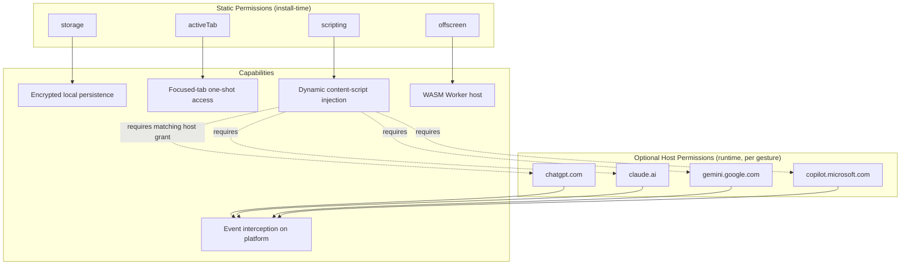
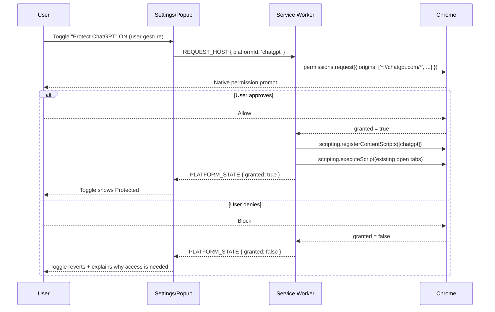
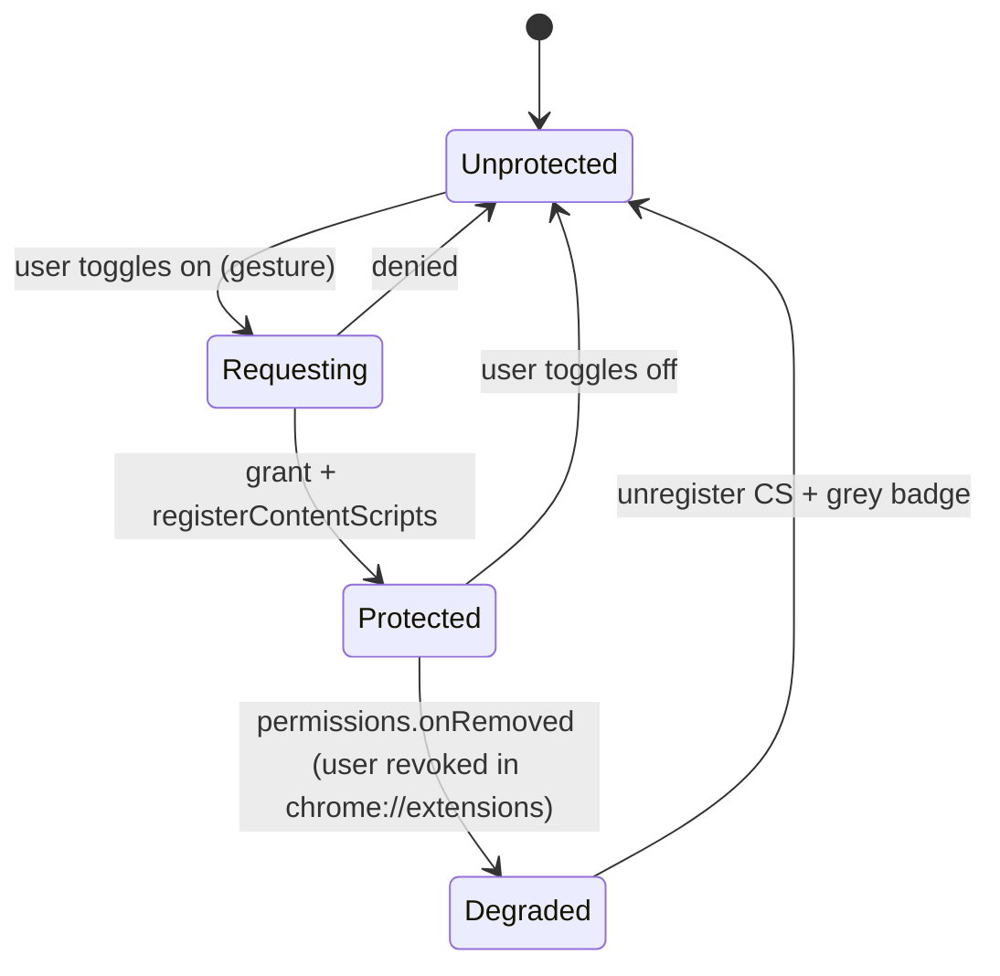
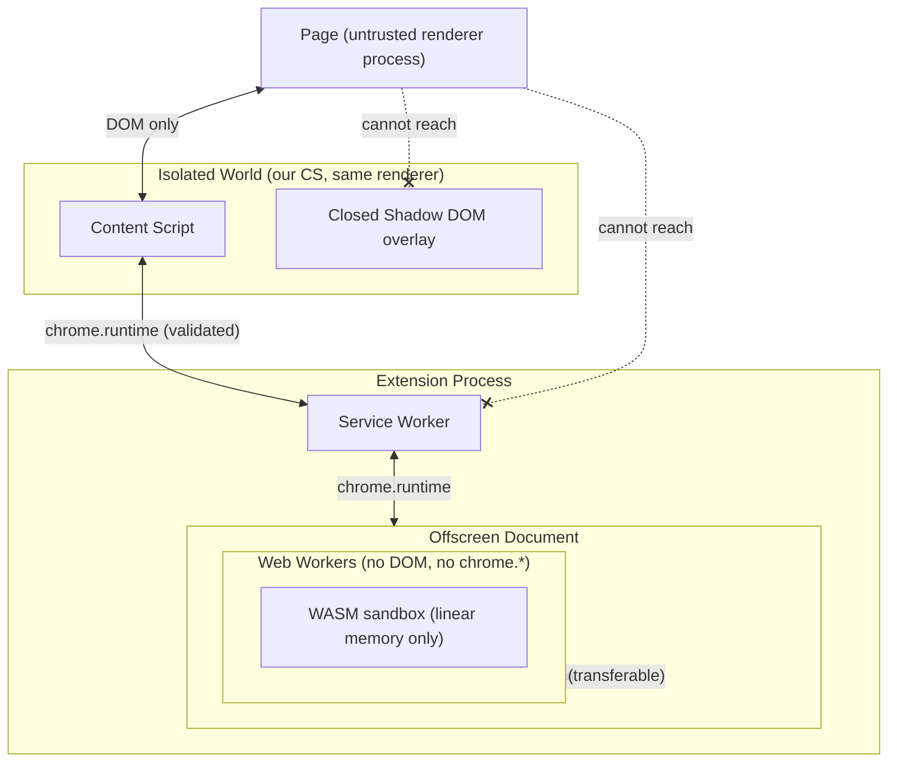

# PART 15 — PERMISSIONS & SANDBOXING

**Document ID:** SS-BP-015
**Classification:** Internal Engineering — Principal Review
**Version:** 1.0.0
**Last Updated:** 2026-07-12
**Owner:** Principal Browser Security Engineer, Principal Security Architect
**Reviewers:** Chrome Extension Specialist, Privacy Reviewer, Principal Platform Architect

---

## Executive Summary

This document defines the complete permission model and sandboxing posture for Sentinel Shield AI. The product's central promise — that it inspects data *before* it leaves the browser — makes it, by construction, a high-privilege observer of the user's most sensitive input. That privilege is contained through aggressive least-privilege: only four static permissions, all host access optional and requested per-platform on an explicit user gesture, and layered sandboxing (process isolation, isolated world, closed Shadow DOM, Worker and Offscreen isolation, and the WASM sandbox). This document is written to pass a hostile permission review by Chrome Web Store, Apple, Palo Alto, Cloudflare, Microsoft, and OpenAI security teams simultaneously. It satisfies the 20-field subsystem template (00_MASTER_INDEX.md §5) for *the permission and sandboxing subsystem*.

---

## 1. Field 1 — Purpose

| ID | Purpose Statement |
|---|---|
| PUR-01 | Enumerate every permission held, and justify each against a least-privilege standard. |
| PUR-02 | Prove that no broader permission (e.g., `tabs`, `<all_urls>`) is required. |
| PUR-03 | Define the dynamic host-permission request UX, gated on an explicit user gesture. |
| PUR-04 | Specify graceful degradation on permission revocation. |
| PUR-05 | Document the full sandboxing model and the trust boundary each layer enforces. |
| PUR-06 | Provide a Chrome Web Store permission-review readiness checklist. |

---

## 2. Field 2 — Responsibilities

| Responsibility | Owner |
|---|---|
| Static permission minimization | Manifest author / Security review |
| Optional host-permission request & revoke flow | Service Worker + Settings UI |
| CSP definition and enforcement | Manifest + build pipeline |
| `web_accessible_resources` exposure minimization | Manifest author |
| Sandbox boundary enforcement | Content Script, Offscreen Document, Workers |
| Incognito behavior policy | Service Worker |

---

## 3. Field 3 — Public Interfaces (Permission Inventory)

### 3.1 Static Permissions (granted at install)

| Permission | Held? | Justification | Least-Privilege Rationale |
|---|---|---|---|
| `storage` | ✅ | Encrypted settings, allowlist, scan history metadata, model cache index | Local only; no host or network reach; cannot read page content |
| `activeTab` | ✅ | One-shot access to the focused tab when the user clicks the toolbar action | Strictly narrower than `tabs`; access is transient and gesture-scoped |
| `scripting` | ✅ | `chrome.scripting.registerContentScripts()` for dynamic per-platform injection | Enables injection *only* where a matching host permission is already granted |
| `offscreen` | ✅ | Create the singleton Offscreen Document to host WASM Workers (ADR-006) | Grants no host or data access; purely a runtime-context capability |

### 3.2 Optional Host Permissions (requested at runtime, per platform)

Requested individually via `chrome.permissions.request()` on a user gesture. Never bundled, never requested at install.

| Pattern | Unlocks |
|---|---|
| `*://chatgpt.com/*`, `*://chat.openai.com/*` | Interception on ChatGPT |
| `*://claude.ai/*` | Interception on Claude |
| `*://gemini.google.com/*` | Interception on Gemini |
| `*://copilot.microsoft.com/*`, `*://github.com/copilot*` | Interception on Copilot |
| `*://chat.deepseek.com/*`, `*://perplexity.ai/*`, `*://grok.com/*` | Interception on other supported platforms |

### 3.3 Optional Permissions (feature-gated)

| Permission | Requested When | Justification |
|---|---|---|
| `clipboardRead` | User enables clipboard-paste deep scan | Only if the platform requires reading structured clipboard beyond the paste event payload |

### 3.4 Deliberately EXCLUDED Permissions (least-privilege proof)

| Permission | Why NOT Requested |
|---|---|
| `tabs` | Would expose URL/title of **all** tabs. We only need the active tab (`activeTab`) and URL matching for enabled platforms (via granted host permission). Privacy risk with no benefit. |
| `<all_urls>` / broad host | Would let us read every site. We request only specific AI-platform origins the user opts into. |
| `history` | We never read browsing history. No feature requires it. |
| `webNavigation` | SPA/URL changes are detected via `chrome.tabs.onUpdated` + in-page History API observation; `webNavigation` would grant cross-site navigation visibility we don't need. |
| `downloads` | We inspect uploads *before* they leave; we never manage the user's downloads. |
| `cookies` | We never read or set cookies; interception is on input events, not credentials. |
| `webRequest` / `declarativeNetRequest` | We do not block or rewrite network traffic; prevention is at the input layer, not the wire. (Listed as future-only in PART_10 §18.) |
| `management` | We do not enumerate or control other extensions. |
| `nativeMessaging` | No native host; defeats "just install" UX (PART_04 ADR-006). |
| `bookmarks`, `geolocation`, `notifications*` | No feature requires them. (*notifications may be added later, explicitly, if escalation UX needs it.) |
| `externally_connectable` | No external page may message us — closes a message-injection vector (PART_04 §4.1). |
| `update_url` | Updates only via Chrome Web Store; no self-hosted update channel (PART_10 §4.2). |

---

## 4. Field 4 — Internal Interfaces

| Call | From → To | Payload |
|---|---|---|
| `REQUEST_HOST` | Settings UI → SW | `{ platformId }` |
| `chrome.permissions.request` | SW → Chrome | `{ origins: string[] }` |
| `chrome.permissions.onRemoved` | Chrome → SW | `{ origins: string[] }` |
| `PLATFORM_STATE` | SW → Popup/Settings | `{ platformId, granted: boolean }` |

---

## 5. Field 5 — Data Flow & Browser Permission Graph



The graph encodes the key invariant: `scripting` alone unlocks nothing on any site — injection is only possible where a **runtime host grant** already exists.

---

## 6. Field 6 — Control Flow: Dynamic Host-Permission Request UX



**Gesture requirement:** `chrome.permissions.request()` throws unless called synchronously from a user gesture handler. The toggle's click handler calls it directly; no `await` precedes the request call.

```typescript
// settings/platform-toggle.ts — request MUST originate from the gesture
toggle.addEventListener('click', () => {
  const origins = PLATFORMS[platformId].urlPatterns;
  chrome.permissions.request({ origins }).then(async (granted) => {
    if (!granted) { revertToggle(platformId); return; }
    await chrome.runtime.sendMessage({ type: 'REQUEST_HOST', platformId });
  });
});
```

---

## 7. Field 7 — Lifecycle: Revocation Detection & Graceful Degradation



```typescript
// background/permissions.ts
chrome.permissions.onRemoved.addListener(async ({ origins }) => {
  const platformIds = platformsForOrigins(origins);
  for (const id of platformIds) {
    await chrome.scripting.unregisterContentScripts({ ids: [`sentinel-shield-${id}`] })
      .catch(() => {}); // Chrome may already have removed CS on revocation
    await setPlatformEnabled(id, false);
  }
  await refreshBadge(); // grey = unprotected
});
```

**Graceful degradation contract:** on revocation the extension (1) stops all interception on that origin, (2) greys the badge for affected tabs, (3) surfaces a one-line "Protection disabled — re-enable" in the popup, and (4) never fails open by silently continuing to run injected code Chrome has already torn down.

---

## 8. Field 8 — activeTab Semantics

| Property | Behavior |
|---|---|
| Grant trigger | User clicks the toolbar action (or an extension command) |
| Scope | The single, currently-focused tab, for that invocation |
| Expiry | Revoked on navigation or tab switch; not persistent |
| What it grants | Ability to `scripting.executeScript`/read the active tab's content **for that gesture** |
| Why we hold it | Lets the user run a one-shot manual scan on any tab (even non-preconfigured ones) without granting a permanent host permission |
| What it does **not** grant | Any background access, any other tab, any persistent presence |

`activeTab` is the manual-scan escape hatch; continuous protection always uses an explicit optional host grant.

---

## 9. Field 9 — Sandboxing Model

| Layer | Boundary Enforced | Mechanism |
|---|---|---|
| **Process isolation** | Renderer (page) vs. extension process | Chrome site isolation; SW/OD run in the extension process, distinct from tab renderer |
| **Isolated world** | Our content-script JS vs. page JS | Separate V8 context sharing the DOM only; page cannot read our variables/functions (PART_10 §5.1) |
| **Closed Shadow DOM** | Our overlay DOM vs. page DOM/CSS/JS | `attachShadow({ mode: 'closed' })`; page JS cannot reach `shadowRoot`; page CSS cannot style it (PART_10 §5.4) |
| **Worker isolation** | Detection compute vs. document context | Web Workers have no DOM, no `chrome.*`; communicate only via `postMessage` |
| **Offscreen isolation** | WASM host vs. SW | Singleton document; reachable only via `chrome.runtime` messaging from SW; content scripts can never address it directly (PART_04 §6.2) |
| **WASM sandbox** | Model execution vs. host | Linear-memory sandbox; no syscalls, no DOM, no network; bounded memory (PART_04 §12) |



---

## 10. Field 10 — CPU Budget (permission/sandbox operations)

| Operation | Budget |
|---|---|
| `permissions.request` handling (post-grant registration) | < 20 ms |
| `permissions.onRemoved` teardown | < 15 ms |
| Isolated-world context creation (Chrome-managed) | negligible |
| Closed Shadow DOM attach | < 5 ms (within PART_10 §12 overlay budget) |
| `postMessage` transfer to Worker | < 5 ms (zero-copy transferable) |

---

## 11. Field 11 — Latency & 12 — Memory Notes

Permission operations are off the scan critical path (they happen at toggle time, not per-scan). Sandbox boundaries add no measurable per-scan latency beyond the IPC hops already budgeted in PART_04 §10. Memory overhead is dominated by the WASM sandbox linear memory (PART_04 §11), not by the isolation layers themselves.

---

## 13. Field 13 — CSP Specification & Justification

**`content_security_policy.extension_pages`:**

```json
{
  "content_security_policy": {
    "extension_pages": "script-src 'self' 'wasm-unsafe-eval'; object-src 'self'; connect-src 'self'; img-src 'self' data: blob:; style-src 'self'; base-uri 'none'; frame-ancestors 'none'"
  }
}
```

| Directive | Value | Justification |
|---|---|---|
| `script-src` | `'self' 'wasm-unsafe-eval'` | Only bundled scripts run. `'wasm-unsafe-eval'` is the **narrowest** directive permitting `WebAssembly.compile`; `'unsafe-eval'` is forbidden in MV3 and unnecessary. No remote or inline script. |
| `object-src` | `'self'` | Blocks plugin/`<embed>`/`<object>` injection vectors. |
| `connect-src` | `'self'` (default, offline) | Extension is offline-first; no outbound connections. **When** the optional cloud-explanation feature is enabled, the build swaps in `connect-src 'self' https://<pinned-cloud-endpoint>` — a single pinned HTTPS origin, never a wildcard. |
| `img-src` | `'self' data: blob:` | Overlay renders bundled icons and in-memory `blob:`/`data:` previews (redaction thumbnails); no remote images. |
| `style-src` | `'self'` | No inline styles on extension pages; overlay styles are bundled strings inside closed Shadow DOM. |
| `base-uri` | `'none'` | Prevents `<base>` hijacking of relative URLs. |
| `frame-ancestors` | `'none'` | Extension pages cannot be framed (clickjacking defense). |

**Connect-src policy note:** the default shipped CSP has `connect-src 'self'` so a security reviewer can verify the extension makes zero network calls. The cloud variant is a separate build flavor with the endpoint pinned at build time and documented in PART_25.

---

## 14. Field 14 — `web_accessible_resources` Exposure Analysis

```json
{
  "web_accessible_resources": [
    {
      "resources": ["public/models/*", "public/wasm/*", "src/offscreen/index.html"],
      "matches": []
    }
  ]
}
```

| Resource | Why Exposed | Exposure Analysis |
|---|---|---|
| `public/wasm/*` | WASM binaries fetched by Workers via extension URL | `matches: []` means **no web origin** can request them; only extension contexts can. Prevents fingerprinting by pages probing resource existence. |
| `public/models/*` | Model weights loaded by Workers | Same `matches: []` restriction; not web-reachable. |
| `src/offscreen/index.html` | Loaded by `chrome.offscreen.createDocument` | Must be listed for the offscreen API, but `matches: []` blocks any page from framing/loading it. |

**Key hardening:** `matches: []` (empty) is the safest possible value — resources are addressable only from within the extension, closing the classic WAR fingerprinting/CSRF vector. No content script or page needs these URLs directly.

---

## 15. Field 15 — Privacy Concerns

| Concern | Mitigation |
|---|---|
| Broad host access could read unrelated sites | Only opted-in AI origins granted, per gesture; everything else invisible to us |
| `activeTab` overreach | Transient, gesture-scoped, single tab; auto-expires |
| WAR fingerprinting (pages detecting the extension) | `matches: []` makes resources non-web-accessible |
| Incognito data leakage | Split incognito, no persistence (see §17) |
| Cloud endpoint exfiltration | Off by default; when on, single pinned origin in `connect-src`; payload is user-reviewed (PART_07) |

---

## 16. Field 16 — Security Concerns

| Concern | Mitigation |
|---|---|
| Message injection from web pages | No `externally_connectable`; SW validates `sender.tab` (PART_04 §4.1) |
| CSP bypass via inline/remote script | `script-src 'self' 'wasm-unsafe-eval'` only; no inline, no remote |
| Overlay tampering by page JS | Closed Shadow DOM; page cannot access `shadowRoot` |
| Privilege creep over releases | Permission diff gate in CI (PART_25): any new permission blocks release pending security sign-off |
| Host-permission phishing | Native Chrome prompt (not our UI) makes the actual grant; we cannot forge it |
| WASM sandbox escape | Browser-enforced linear-memory sandbox; no syscalls; accepted residual risk (PART_04 §12) |

---

## 17. Field 17 — Incognito Behavior

| Aspect | Policy |
|---|---|
| Mode | `"incognito": "split"` — a separate extension instance runs for incognito windows |
| Persistence | No scan history or settings writes from the incognito instance; `storage.local` writes suppressed, only `storage.session`-equivalent in-memory state used |
| Host permissions | Must be granted separately for incognito (Chrome requires the "Allow in Incognito" toggle); absent it, no interception in incognito |
| Detection | Full detection still runs in-memory so protection is not lost, but nothing touches disk |
| Teardown | All incognito state discarded when the last incognito window closes |

Split mode ensures incognito browsing never contaminates persistent state and vice-versa, matching user expectation that incognito leaves no trace.

---

## 18. Field 18 — Production Checklist / Chrome Web Store Permission-Review Readiness

- [ ] Manifest declares exactly four static permissions: `storage`, `activeTab`, `scripting`, `offscreen`
- [ ] Zero broad host permissions in `permissions`; all hosts under `optional_host_permissions`
- [ ] Every optional host request originates from a synchronous user gesture
- [ ] Justification string ready for each permission (CWS review field)
- [ ] `web_accessible_resources` use `matches: []` (not web-reachable)
- [ ] Shipped CSP uses `connect-src 'self'` (provably offline); cloud variant documented separately
- [ ] `'wasm-unsafe-eval'` present, `'unsafe-eval'` absent
- [ ] `externally_connectable` and `update_url` absent
- [ ] `permissions.onRemoved` handler tears down injection + greys badge
- [ ] Incognito set to `split`; no disk writes verified in incognito
- [ ] CI permission-diff gate blocks undeclared new permissions
- [ ] Privacy policy + single-purpose description match declared permissions
- [ ] Screencast/demo prepared showing per-platform opt-in flow for reviewers

---

## 19. Field 19 — Future Improvements

| Improvement | Impact |
|---|---|
| `chrome.declarativeNetRequest` (optional) | Last-resort network block for confirmed-block decisions (PART_10 §18) |
| Per-origin runtime CSP reporting endpoint | Detect CSP violations in the field (privacy-preserving, opt-in) |
| `notifications` permission (explicit) | Richer escalation UX for revocation/critical detections |
| Enterprise force-install with pre-granted hosts via managed policy | Zero-click platform enablement in managed fleets |
| Firefox permission model port | WebExtension optional-permission differences (PART_10 §18) |

---

## 20. Field 20 — Open Risks (Register)

| Risk ID | Description | Likelihood | Impact | Mitigation / Owner |
|---|---|---|---|---|
| RISK-15-01 | Chrome tightens `optional_host_permissions` UX, changing grant flow | Medium | Medium | Abstract request behind `PermissionService`; monitor Chrome releases / Extension Eng |
| RISK-15-02 | Reviewer flags `activeTab` + `scripting` combination as broad | Low | Medium | Documented least-privilege rationale + demo; escalate with justification / Security |
| RISK-15-03 | Cloud-variant `connect-src` origin compromised | Low | High | Certificate pinning, single pinned origin, opt-in only, payload review / Security |
| RISK-15-04 | WASM sandbox escape via 0-day | Very Low | High | Rely on Chrome sandbox; rapid model/binary update path (PART_21) / Security |
| RISK-15-05 | Incognito split mode misconfiguration leaks state | Low | High | Automated test asserts zero disk writes in incognito / QA |

---

**Resolved Defects:** none assigned to this document.
**Cross-references:** PART_04 §4 (trust boundaries, threats), PART_10 §4–5 (manifest, injection), PART_11 (permission-gated registration lifecycle), PART_07 (privacy governance), PART_19 (encryption), PART_25 (permission-diff CI gate), PART_26 (telemetry).
