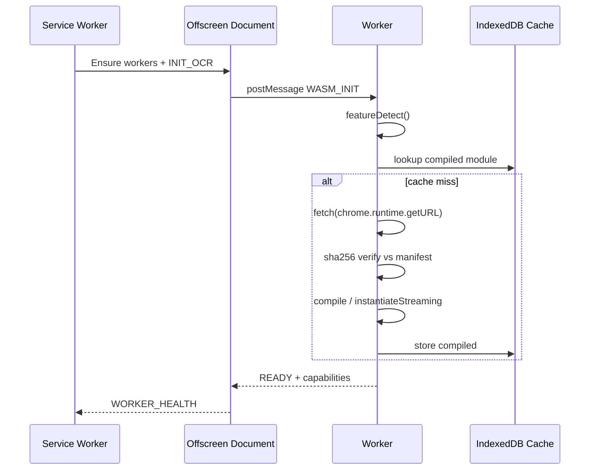
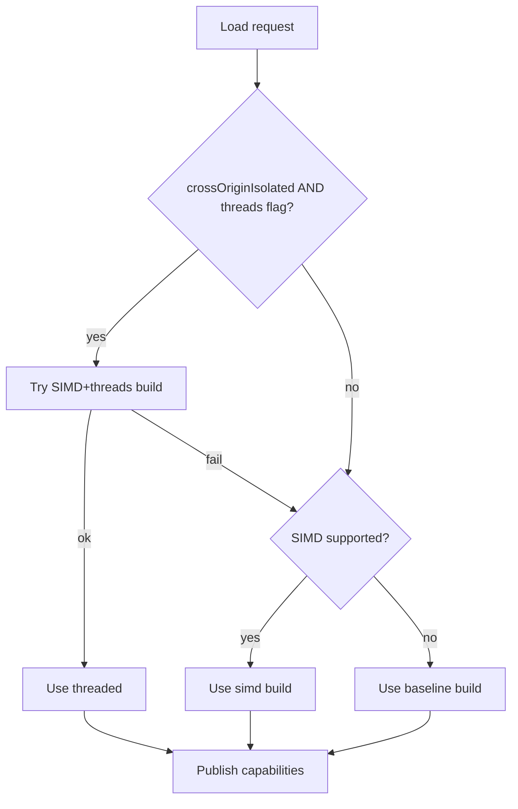

# PART 16 — WASM RUNTIME

**Document ID:** SS-BP-016
**Classification:** Internal Engineering — Principal Review
**Version:** 1.0.0
**Last Updated:** 2026-07-12
**Owner:** Principal Platform Architect, Staff Performance Engineer
**Reviewers:** Principal Security Architect, Principal Detection Engineer

---

## Executive Summary

This document specifies how Sentinel Shield loads, verifies, executes, and recovers WebAssembly modules used for OCR, NER, CV, and barcode decode. It resolves audit defect **DEF-03** (cross-origin isolation / SharedArrayBuffer for threaded WASM) with an explicit decision and fallback ladder.

---

## Resolved Defects

| ID | Resolution |
|---|---|
| **DEF-03** | **Decision: Prefer single-thread SIMD WASM for v1.0.** Extension pages and the offscreen document do **not** enable full cross-origin isolation (`Cross-Origin-Embedder-Policy: require-corp`) in v1 because MV3 offscreen documents and content-script worlds make COEP brittle and block some CDN-free asset loads. OCR P99 budget remains **&lt; 3000ms** on reference hardware using `tesseract-core-simd.wasm` (single-threaded SIMD). Threaded builds (`-threaded` + SharedArrayBuffer) are a **Phase-2 opt-in** behind a feature flag that requires: (1) offscreen document served with COOP `same-origin` + COEP `require-corp` via extension page headers where supported, (2) feature detection of `crossOriginIsolated === true`, (3) automatic fallback to SIMD single-thread if isolation is false. |

---

## 1. Purpose

Provide a secure, integrity-verified, lazy-loaded WASM execution environment inside Offscreen Document Web Workers with deterministic fallbacks when SIMD, threads, or WebGPU are unavailable.

## 2. Responsibilities

- Fetch and verify WASM binaries (SHA-256)
- Feature-detect SIMD / threads / WebGPU
- Instantiate modules with memory ceilings
- Cache compiled artifacts
- Report health to Service Worker
- Enforce instantiate timeouts and crash recovery

## 3. Public Interfaces

```typescript
interface WasmRuntime {
  initialize(moduleId: WasmModuleId): Promise<void>;
  isReady(moduleId: WasmModuleId): boolean;
  getCapabilities(): WasmCapabilities;
  instantiate(moduleId: WasmModuleId): Promise<WebAssembly.Instance>;
  shutdown(moduleId: WasmModuleId): Promise<void>;
}

type WasmModuleId =
  | 'tesseract-core'
  | 'ort-wasm'
  | 'zxing'
  | 'opencv-lite'; // optional subset; may be omitted if CV uses TF.js BlazeFace only

interface WasmCapabilities {
  simd: boolean;
  threads: boolean;
  crossOriginIsolated: boolean;
  webgpu: boolean;
  selectedTier: 'simd+threads' | 'simd' | 'baseline';
}
```

## 4. Internal Interfaces

- `IntegrityManifest` — build-generated JSON of path → sha256
- `CompiledModuleCache` — IndexedDB store `wasm-cache`
- Worker protocol: `{ type: 'WASM_INIT' | 'WASM_EXEC' | 'WASM_ERROR', moduleId, payload }`

## 5. Data Flow



## 6. Control Flow — Feature Detection Ladder



| Tier | Artifact example | Expected OCR 1080p P99 | Notes |
|---|---|---|---|
| simd+threads | `tesseract-core-simd-threaded.wasm` | ~1500–2200ms | Phase-2; requires COI |
| simd (v1 default) | `tesseract-core-simd.wasm` | &lt; 3000ms | Production default |
| baseline | `tesseract-core.wasm` | &lt; 5000ms | Degraded; warn user |

## 7. Lifecycle

1. Offscreen created lazily (PART_11)
2. First WASM job → Worker spawn → `initialize`
3. Idle 60s → OD may close; Workers terminate; next job cold-starts
4. Integrity failure → do not instantiate; health=ERROR; fall back to Tier-1-only scan
5. Extension update → invalidate `wasm-cache` when manifest version changes

## 8. Dependencies

| Dependency | Role |
|---|---|
| PART_12_RUNTIME_THREADING_MEMORY.md | Worker pool, budgets |
| PART_13_DETECTION_ENGINE.md | Consumers (OCR/NER/CV) |
| PART_14_SECURITY.md | Integrity + CSP `wasm-unsafe-eval` |
| PART_10_BROWSER_EXTENSION_ARCHITECTURE.md | Offscreen host |
| Build pipeline PART_25 | Hash manifest generation |

## 9. Module Inventory

| Module | Approx Size | Used By | Load Strategy |
|---|---|---|---|
| Tesseract core SIMD | ~4–6MB | OCR Worker | Lazy on first image/PDF scan |
| Tesseract eng.traineddata | ~2–4MB | OCR | Lazy; cache IndexedDB |
| ONNX Runtime Web WASM | ~3–8MB | NER Worker | Lazy on first NER |
| DistilBERT INT8 ONNX | ~12MB | NER | Lazy; cache |
| ZXing WASM | &lt;1MB | CV Worker | Lazy on image with QR path |
| BlazeFace (TF.js graph) | &lt;1MB | CV | Lazy |

**Package budget:** all WASM+models &lt; 25MB compressed extension (NFR-SIZE-001).

## 10. Memory Usage

| State | Budget |
|---|---|
| Per WASM module idle (not loaded) | 0 |
| Tesseract active | ≤ 120MB Worker |
| ORT + model active | ≤ 80MB Worker |
| ZXing active | ≤ 30MB |
| Growth ceiling `WebAssembly.Memory` | Cap initial pages; `maximum` pages set so Worker ≤ 256MB |

On exceed: terminate Worker, return partial results, health=ERROR.

## 11. CPU Budget

| Operation | Budget |
|---|---|
| SHA-256 verify 8MB | &lt; 50ms |
| compileStreaming SIMD module | &lt; 500ms cold |
| Cached instantiate | &lt; 100ms |

## 12. Latency Budget

| Path | Budget |
|---|---|
| Cold first OCR (incl. load) | &lt; 5s first time; then &lt; 3s |
| Warm OCR 1080p | &lt; 3000ms P99 |
| NER 512 tokens WASM | &lt; 150ms P99 |
| Integrity fail fast | &lt; 100ms to error |

## 13. Failure Modes

| Failure | Impact | Recovery |
|---|---|---|
| Hash mismatch | Module blocked | Log; use Tier-1 only; alert health |
| instantiate throws | Engine down | Retry once; then disable for session |
| OOM during OCR | Job fail | Terminate Worker; respawn; partial scan |
| Missing SIMD | Slower path | Baseline build + UX degraded banner |
| COI false while threads requested | No SAB | Fall back simd single-thread |

## 14. Recovery Strategy

1. Worker `onerror` / `onmessageerror` → terminate
2. OD notifies SW health
3. SW completes scan with tiers available
4. Next request respawns Worker (max 3 consecutive init failures → session disable)

## 15. Security Concerns

- CSP: `script-src 'self' 'wasm-unsafe-eval'` only
- No remote WASM URLs — only `chrome.runtime.getURL`
- Hash manifest embedded at build; signed as part of extension package
- Do not pass raw user strings into WASM exports beyond necessary buffers; prefer transferable ArrayBuffers

## 16. Privacy Concerns

- Models/WASM cache contain no user PII
- Never upload WASM crash dumps containing input buffers
- Clear input ArrayBuffers (fill 0) after job when feasible

## 17. Performance Concerns

- Avoid main-thread compile; always Worker
- Prefer `WebAssembly.instantiateStreaming` when Response available; else compile
- WebGPU for ORT when `navigator.gpu` present — detect and prefer; fallback WASM

## 18. Integrity Verification

```typescript
async function verifyAndCompile(
  path: string,
  expectedSha256: string
): Promise<WebAssembly.Module> {
  const url = chrome.runtime.getURL(path);
  const res = await fetch(url);
  const buf = await res.arrayBuffer();
  const hash = await crypto.subtle.digest('SHA-256', buf);
  const hex = [...new Uint8Array(hash)]
    .map((b) => b.toString(16).padStart(2, '0'))
    .join('');
  if (hex !== expectedSha256) {
    throw new WasmIntegrityError(path, expectedSha256, hex);
  }
  return WebAssembly.compile(buf);
}
```

Build step `tools/generate-wasm-hashes.ts` writes `public/wasm/integrity.json`.

## 19. Cross-Origin Isolation (Phase-2 Threads)

When enabling threads:

| Header / Check | Value |
|---|---|
| `Cross-Origin-Opener-Policy` | `same-origin` |
| `Cross-Origin-Embedder-Policy` | `require-corp` |
| Runtime check | `globalThis.crossOriginIsolated === true` |
| Extension note | Apply to offscreen HTML via meta/headers as supported by Chrome version; document in PART_25 |

If headers cannot be applied → **do not load threaded build**.

## 20. Testing Strategy

| Test | Criteria |
|---|---|
| Integrity mismatch | Instantiation refused |
| Ladder | Force simd false → baseline selected |
| Memory ceiling | Synthetic growth → Worker terminate |
| Cold/warm latency | Within budgets on reference HW |
| No network | WASM fetch only extension URLs |

## 21. Production Checklist

- [ ] integrity.json generated in CI and bundled
- [ ] SIMD default path validated on Chrome ≥ 120
- [ ] Threaded path feature-flagged off for v1.0
- [ ] OCR/NER budgets met on i5 + 8GB
- [ ] CSP reviewed for wasm-unsafe-eval necessity
- [ ] Cache invalidation on version bump tested

## 22. Open Risks

| Risk | Mitigation |
|---|---|
| Browser WASM CVEs | Pin Chrome min version; monitor advisories |
| Large eng.traineddata download-on-first-use latency | Bundle English; optional langs later via CWS update |
| WebGPU driver bugs | Capability try/catch; fallback ORT WASM |

## 23. Future Improvements

| Improvement | How to Implement |
|---|---|
| Enable simd+threads default | Land COI on offscreen; flip flag; re-benchmark; keep simd fallback |
| WASI-like tighter ABI | Wrap exports behind allowlisted call gates in Worker |
| Model streaming download for optional langs | Data-only packs in extension update; verify hashes; no remote code |
| Shared module registry | Single `WasmRuntime` singleton in OD used by all Workers via MessageChannel |
