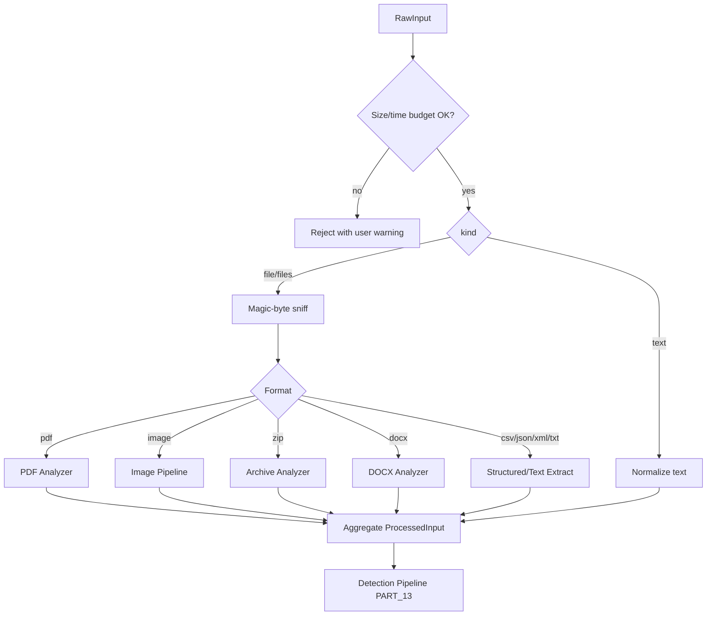
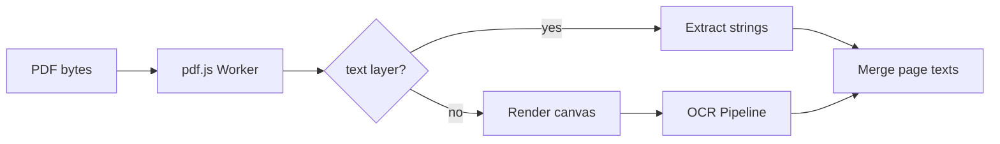
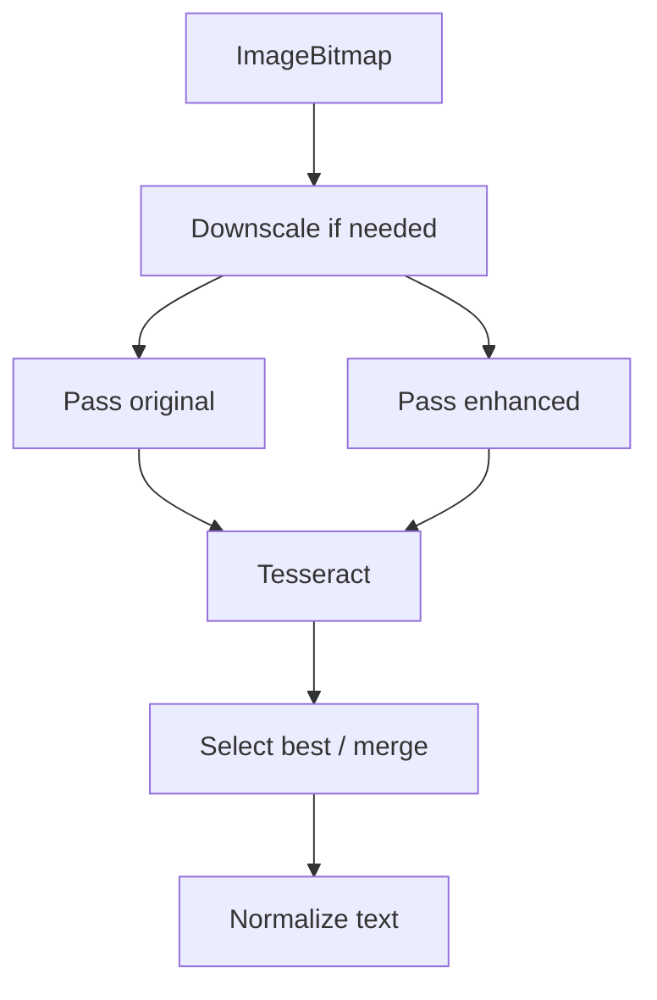

# PART 17 — INPUT PIPELINES

**Document ID:** SS-BP-017
**Classification:** Internal Engineering — Principal Review
**Version:** 1.0.0
**Last Updated:** 2026-07-12
**Owner:** Principal Chrome Extension Engineer, Principal Detection Engineer
**Reviewers:** Principal Security Architect, Staff Performance Engineer

---

## Executive Summary

This document specifies every input acquisition and preprocessing pipeline: paste, file upload, drag-drop, clipboard, document routing, PDF, OCR, image, archive, structured data, and DOCX. Global per-scan processing budgets are enforced by PART_12. Bypass defenses reference PART_20. Endpoint threats reference PART_29.

---

## 1. Purpose

Convert untrusted user input from AI-platform pages into normalized `ProcessedInput` for the detection pipeline without letting content reach the page until the user decides.

## 2. Responsibilities

- Intercept paste / change / drop at capture phase
- Read files safely (size, magic bytes, timeouts)
- Route by MIME + magic to analyzers
- Normalize text (zero-width strip, NFKD, homoglyph map)
- Hand off images to OCR/CV Workers
- Respect PART_12 global scan budget (bytes + wall-clock)

## 3. Public Interfaces

```typescript
interface InputRouter {
  route(raw: RawInput): Promise<ProcessedInput>;
}

interface RawInput {
  kind: 'text' | 'file' | 'files' | 'image-bitmap';
  text?: string;
  files?: File[];
  mimeHint?: string;
  platformId: string;
  tabId: number;
  scanId: string;
}

interface ProcessedInput {
  scanId: string;
  texts: ReadonlyArray<{ source: string; value: string }>;
  images: ReadonlyArray<{ source: string; bitmap: ImageBitmap; width: number; height: number }>;
  context: { platformId: string; isCodeLikely: boolean };
  warnings: string[];
  bytesConsumed: number;
}
```

## 4. Internal Interfaces

- `MagicSniffer.sniff(buf: ArrayBuffer): MimeType`
- `Normalizer.normalizeText(s: string): string` (PART_20 rules)
- Analyzer workers via Offscreen (PART_12 / PART_16)

## 5. Data Flow — Input Router



## 6. Control Flow Notes

- All analyzers check remaining budget before each page/file
- Abort → return partial `ProcessedInput` + warning `PARTIAL_SCAN`
- Password-protected containers → no decrypt; user warning only

## 7. Lifecycle

Pipelines are stateless functions invoked per scan. Workers are pooled (PART_12). Content-script interceptors register on inject and tear down on navigation (PART_11).

## 8. Dependencies

PART_10, PART_12, PART_13, PART_16, PART_20, PART_29.

## 9–11. Shared Budgets

| Limit | Value |
|---|---|
| Max single file | 50MB |
| Max image dimension | 4000px (downscale) |
| Max PDF pages | 500 |
| Max PDF time | 30s |
| ZIP compressed | 50MB |
| ZIP decompressed | 200MB |
| ZIP files | 1000 |
| ZIP depth | 3 |
| ZIP ratio | 100:1 |
| Text input max | 1MB (chunk above) |
| Global scan wall-clock | PART_12 (default 45s) |
| Global scan bytes | PART_12 (default 250MB logical) |

Memory/CPU: analyzer Workers per PART_12 ceilings.

---

## Pipeline A — Paste

| Field | Spec |
|---|---|
| Purpose | Intercept clipboard paste into AI inputs before platform handlers |
| Responsibilities | Capture-phase `paste` on `document`; extract `text/plain`; preventDefault; scan; re-dispatch or overlay |
| Public Interfaces | `onPaste(ev: ClipboardEvent): void` |
| Internal Interfaces | SCAN_REQUEST; overlay; `reDispatchText` |
| Data Flow | Event → text → SW → result → allow/block/redact |
| Control Flow | If `__sentinelShieldApproved` nonce present → ignore; else intercept |
| Lifecycle | Bound at `document_start`; rebound on SPA nav |
| Dependencies | PlatformAdapter (PART_10) |
| Memory | &lt; 5MB CS |
| CPU | Handler &lt; 5ms |
| Latency | Extract &lt; 2ms; overlay after scan |
| Failure Modes | Handler throw → rebind; fail-open individual |
| Recovery | Global try/catch; log allowlist event |
| Security | stopImmediatePropagation; closed overlay |
| Privacy | Text only in RAM |
| Performance | No sync XHR |
| Testing | ChatGPT/Claude/Gemini paste E2E |
| Production Checklist | Capture phase verified |
| Future | AST concat resolution for split secrets (PART_30) |
| Open Risks | ProseMirror controlled editors — use adapter `reDispatchText` |

**React/ProseMirror fallback:** If synthetic ClipboardEvent is ignored, set text via adapter (`execCommand`/`InputEvent`/`textContent`+`input` event). If all fail → keep block + instruct user to use Redact &amp; Send output copy.

---

## Pipeline B — File Upload

| Field | Spec |
|---|---|
| Purpose | Intercept `<input type="file">` selections |
| Responsibilities | MutationObserver; capture `change`; read ArrayBuffer; scan; release files |
| Public Interfaces | `attachFileListener(input)` |
| Internal Interfaces | DataTransfer clone OR block+instruct fallback |
| Data Flow | FileList → buffers → router → overlay |
| Control Flow | Multi-file: queue per PART_12 |
| Lifecycle | Observer on; pause when tab hidden |
| Dependencies | Magic sniffer; analyzers |
| Memory | Stream one file at a time when &gt; 10MB |
| CPU | ReadAsArrayBuffer |
| Latency | 1MB &lt; 100ms; 10MB &lt; 500ms read |
| Failure Modes | Site re-renders input (React) |
| Recovery | **Primary:** DataTransfer clone replace. **Fallback:** do not release; overlay "Download redacted / copy path unsupported — remove file and use Redact" |
| Security | Magic vs extension mismatch → warn |
| Privacy | No Blob URL for sensitive bytes |
| Performance | Transferables to OD |
| Testing | Dynamic file input creation |
| Production Checklist | Fallback UX copy reviewed |
| Future | showOpenFilePicker hook if platforms adopt |
| Open Risks | RR-04 exotic editors |

---

## Pipeline C — Drag-and-Drop

| Field | Spec |
|---|---|
| Purpose | Intercept file/text drops |
| Responsibilities | Capture `drop`/`dragover` preventDefault when AI drop target |
| Public Interfaces | `onDrop(ev: DragEvent)` |
| Internal Interfaces | Same router as files/text |
| Data Flow | dataTransfer.files / getData('text/plain') → scan |
| Control Flow | If both text+files, scan all within budget |
| Lifecycle | Document-level listeners |
| Dependencies | Generic adapter |
| Memory / CPU / Latency | Same as upload/paste |
| Failure Modes | Nested drop zones stopPropagation early — capture phase mitigates |
| Recovery | Retarget document capture |
| Security / Privacy / Performance | Same as B/A |
| Testing | OS file manager drop + cross-tab |
| Production Checklist | dragover preventDefault so drop fires |
| Future | Directory drop support with depth limit 2 |
| Open Risks | Directory drops large trees — enforce file count |

---

## Pipeline D — Clipboard

| Field | Spec |
|---|---|
| Purpose | Cover paste path; document Clipboard API gap |
| Responsibilities | Paste event path (primary). Do **not** claim to intercept `navigator.clipboard.readText()` by the page |
| Public Interfaces | Same as Paste |
| Mitigation | Settings tip: clear clipboard after copying secrets; enterprise policy note |
| Future bypass attempt | Inject page-world hook — **rejected for v1** (breaks isolation; CWS risk). Revisit Phase 3 with isolated world limitations documented |
| Testing | Manual Clipboard API case → known limitation test |
| Open Risks | PART_06 RR-01 |

---

## Pipeline E — Screen Capture

| Field | Spec |
|---|---|
| Purpose | Out of scope for v1.0 |
| Exact reason | `getDisplayMedia` requires prominent permission UX, expands attack surface, and AI platforms rarely accept live capture streams as the primary leak path; screenshots arrive as image uploads (covered by Image/OCR) |
| Future design (Phase 5) | Optional toolbar action → `getDisplayMedia` → grab 1 frame → Image Pipeline → revoke stream immediately; never record video; max 1 frame per invocation; no audio |
| Acceptance when built | Stream stopped in `finally`; frame in RAM only; same OCR budgets |

---

## Pipeline F — Document / Text Extraction Router

| Field | Spec |
|---|---|
| Purpose | Dispatch by sniffed type |
| Magic table | See §Magic Bytes |
| Failure | Unknown binary → warn "unsupported format"; do not pass through silently in enterprise block mode |

### Magic Bytes

| Format | Signature | Action |
|---|---|---|
| PDF | `%PDF` | PDF Analyzer |
| PNG | `89 50 4E 47` | Image |
| JPEG | `FF D8 FF` | Image |
| WebP | `RIFF....WEBP` | Image |
| ZIP/DOCX | `PK\x03\x04` | ZIP vs DOCX via `[Content_Types].xml` |
| UTF-8 text | No magic / printable | Text normalize |
| JSON | printable + parse | Structured |
| GZIP | `1F 8B` | Reject or gunzip once if policy allows (v1: reject) |

---

## Pipeline G — PDF Analyzer

| Field | Spec |
|---|---|
| Purpose | Extract text; OCR scanned pages |
| pdf.js config | `disableJavaScript: true`, `disableAutoFetch: true`, `disableStream: true`, `disableFontFace: true` |
| Data Flow | Load → per page getTextContent → if empty render canvas → OCR |
| Limits | 50MB, 500 pages, 30s, budget-aware |
| Security | Worker sandbox; terminate on throw |
| Privacy | No remote font fetch |
| Testing | Text PDF + scanned PDF + malicious corpus |
| Failure | Password `/Encrypt` → user warning |



---

## Pipeline H — OCR Pipeline

| Field | Spec |
|---|---|
| Purpose | Extract text from bitmaps |
| Preprocess | Grayscale → contrast → Otsu binarize → deskew ±15° |
| Multi-pass | Original + enhanced; keep higher mean confidence |
| Engine | Tesseract.js WASM (PART_16 simd default) |
| Downscale | max(side) &gt; 4000 → scale |
| Latency | &lt; 3000ms 1080p P99 |
| Memory | ≤ 120MB Worker |
| Failure | Low Laplacian variance → blur warning |
| Testing | Clear / rotated / low-contrast / blur |



---

## Pipeline I — Image Pipeline

| Field | Spec |
|---|---|
| Purpose | Decode, strip EXIF, route OCR+CV |
| EXIF | Strip before any persist; decode via `createImageBitmap` |
| Route | Always OCR if text likely; CV for face/QR/signature (PART_13) |
| Formats | PNG/JPEG/WebP/TIFF/BMP |
| Failure | Corrupt image → warning |

---

## Pipeline J — CV Handoff

Hands `ImageBitmap` to CV Worker. Detection semantics in PART_13; risk in PART_18. This pipeline only owns transfer + timeout (10s).

---

## Pipeline K — Archive Analyzer

| Field | Spec |
|---|---|
| Purpose | Safe ZIP extract + per-file route |
| Method | Streaming decompress with byte counter |
| Bomb limits | 50MB / 200MB / 1000 files / depth 3 / 100:1 |
| Nested ZIP | Recurse ≤ depth 3; depth 4 → warn incomplete |
| Security | Reject symlink-like paths (`../`) |
| Testing | PART_20 ZIP bomb cases |

---

## Pipeline L — Structured Data (CSV/JSON/XML)

| Field | Spec |
|---|---|
| CSV | Row cells → text blobs |
| JSON | Recursive string values |
| XML | Text nodes + attribute values |
| Depth | JSON/XML max depth 32 |
| Then | Normalize + detection |

---

## Pipeline M — DOCX Analyzer

| Field | Spec |
|---|---|
| Purpose | Extract `word/document.xml` `w:t` + headers/footers/tables |
| Method | ZIP open → XML parse (no macros executed) |
| Encryption | If EncryptionInfo → password warning |
| Testing | Tables, lists, headers |

---

## 12. Failure Modes (Global)

| Failure | Recovery |
|---|---|
| Budget exhausted mid-PDF | Return pages done + PARTIAL_SCAN |
| Worker crash | Respawn; skip remaining heavy pages |
| Unsupported type | User warning; enterprise block holds |

## 13. Recovery Strategy

Coordinator owns retries (PART_12). Content script never retries forever — max 1 automatic rescan on SW restart if checkpoint exists.

## 14–16. Security / Privacy / Performance

No Blob URLs for secrets; transferables; magic sniff; PART_12 budgets; EXIF strip; password files unscanned.

## 17. Testing Strategy

Per-pipeline unit tests + Playwright E2E on live platforms + PART_20 bypass corpus + malicious PDF/ZIP packs.

## 18. Production Checklist

- [ ] All magic types routed
- [ ] ZIP bomb limits enforced
- [ ] PDF JS disabled
- [ ] Upload fallback UX verified on React apps
- [ ] OCR budget met
- [ ] Screen capture explicitly out of scope in release notes
- [ ] Clipboard API limitation documented in UI help

## 19. Future Improvements

| Item | How |
|---|---|
| Directory drop | `webkitGetAsEntry` with file cap 100 |
| Optional language OCR packs | Data-only via CWS update + hash |
| Video frame scan | PART_30 design |
| Page-world clipboard hook | Rejected until isolation-safe design passes CWS review |

## 20. Open Risks

RR-01 clipboard API; RR-04 controlled inputs; residual OCR evasion (PART_20).
