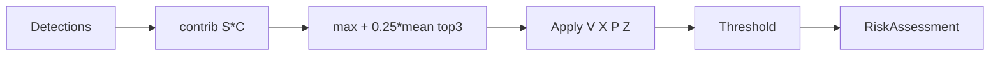
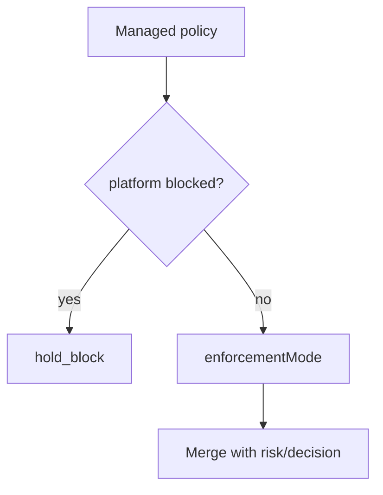
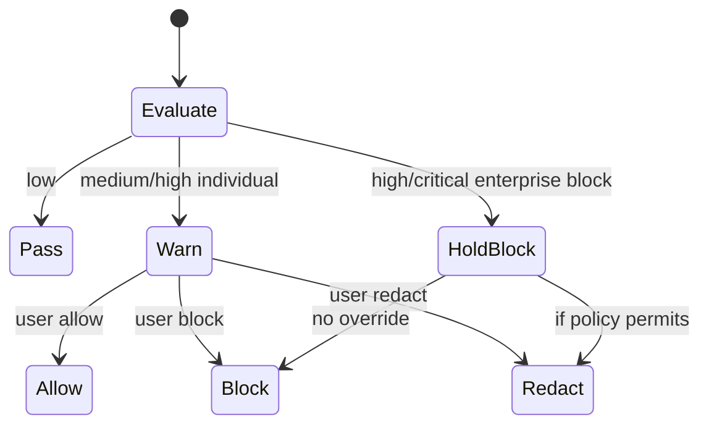
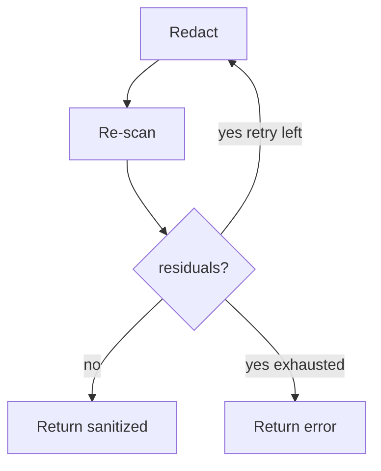

# PART 18 — RISK, POLICY, DECISION & REDACTION ENGINES

**Document ID:** SS-BP-018
**Classification:** Internal Engineering — Principal Review
**Version:** 1.0.0
**Last Updated:** 2026-07-12
**Owner:** Principal Detection Engineer, Principal Security Architect
**Reviewers:** Distinguished AI Engineer, Staff Product Engineer

---

## Executive Summary

After detection (PART_13), four pure/deterministic engines produce user-visible outcomes: **Risk** (numeric score), **Policy** (enterprise rules), **Decision** (allow/warn/block/redact), and **Redaction** (sanitize content). Risk math is fully specified here so audits and tests need no tribal knowledge.

---

## Shared Interface

```typescript
interface EngineContext {
  platformId: string;
  enforcementMode: 'monitor' | 'warn' | 'block';
  sensitivity: 'low' | 'medium' | 'high' | 'maximum';
  isCodeContext: boolean;
  entityCount: number;
}

type RiskLevel = 'low' | 'medium' | 'high' | 'critical';
type UserAction = 'allow' | 'block' | 'redact';
type SystemAction = 'pass' | 'warn' | 'hold_block' | 'force_redact';
```

---

# A. RISK ENGINE

## Purpose
Convert aggregated detections into a document-level risk score ∈ [0,1] and RiskLevel.

## Responsibilities
Per-entity severity, confidence weighting, multipliers, aggregation, thresholding. **No ML** — deterministic for auditability.

## Public Interfaces

```typescript
interface RiskEngine {
  score(detections: readonly Detection[], ctx: EngineContext): RiskAssessment;
}

interface RiskAssessment {
  riskScore: number; // 0..1
  riskLevel: RiskLevel;
  perEntity: ReadonlyArray<{ entityType: string; contribution: number }>;
  multipliers: { volume: number; context: number; platform: number; sensitivity: number };
}
```

## Scoring Math (Authoritative)

### Base severity S(e)

| Entity category | Examples | S(e) |
|---|---|---|
| Critical secrets | AWS key, private key, DB URL with creds, live Stripe sk | 1.00 |
| Gov ID checksummed | Aadhaar, SSN | 0.95 |
| Payment instruments | Luhn card, IBAN | 0.95 |
| High secrets | ghp_, sk-proj, JWT session | 0.90 |
| Financial account meta | IFSC, UPI | 0.70 |
| Medical / legal doc class | classifier hit | 0.75 |
| Contact | phone, email | 0.45 |
| Visual face | BlazeFace | 0.60 |
| Signature | contour | 0.55 |
| QR decoded sensitive | depends on inner scan | max(inner, 0.50) |
| Informational | sk_test_, pk_live publishable | 0.15 |

### Confidence weight C(e)

`C(e) = clamp(detection.confidence, 0, 1)`  
Checksum-validated entities use C ≥ 0.95 by construction (PART_13).

### Entity contribution

`contrib(e) = S(e) * C(e)`

### Multipliers

| Multiplier | Formula |
|---|---|
| Volume V | `1 + min(0.35, 0.03 * max(0, N - 1))` where N = entity count |
| Context X | `1.10` if `isCodeContext` and any secret-class entity; else `1.00`; `0.85` if majority marked test/example |
| Platform P | `1.05` for consumer AI (chatgpt/claude/gemini/deepseek); `1.00` default; `0.95` for enterprise-tier hosts if flagged in config |
| Sensitivity Z | low 0.85 / medium 1.00 / high 1.10 / maximum 1.20 |

### Aggregation

```
raw = max_e(contrib(e)) + 0.25 * mean(top3 contrib)
score = clamp(raw * V * X * P * Z, 0, 1)
```

Using max + tempered mean prevents 50 emails from outranking one AWS key while still reflecting volume.

### Thresholds → RiskLevel

| score | Level |
|---|---|
| &lt; 0.35 | low |
| 0.35–0.54 | medium |
| 0.55–0.79 | high |
| ≥ 0.80 | critical |

### Worked Example 1 — Single Luhn card

- S=0.95, C=0.99 → contrib=0.9405  
- N=1 → V=1; X=1; P=1.05; Z=1  
- raw=0.9405; score=0.987 → **critical**

### Worked Example 2 — Three emails

- contrib≈0.45 each; max=0.45; mean top3=0.45; raw=0.45+0.1125=0.5625  
- V=1.06; score≈0.596 → **high** (sensitivity medium)

### Worked Example 3 — Stripe test key only

- S=0.15, C=0.98 → 0.147; score≈0.15 → **low** (informational UX)

## Failure / Recovery
Empty detections → score 0 / low. Invalid confidence → treat as 0 and log.

## Testing
Golden-vector tests for examples 1–3; property test score monotonic in S and C.

## Mermaid



---

# B. POLICY ENGINE

## Purpose
Evaluate enterprise managed policy overlays on detections and risk.

## Responsibilities
Load `chrome.storage.managed`; apply rules; never execute remote code — **data-only** rules.

## Public Interfaces

```typescript
interface PolicyEngine {
  evaluate(input: {
    detections: readonly Detection[];
    risk: RiskAssessment;
    platformId: string;
  }): PolicyDecision;
}

interface PolicyDecision {
  enforcementMode: 'monitor' | 'warn' | 'block';
  matchedRuleIds: string[];
  disableUserOverrides: boolean;
  customMessage?: string;
}
```

## Policy Schema (JSON)

```json
{
  "enforcementMode": "warn",
  "sensitivityLevel": "high",
  "allowedPlatforms": ["chatgpt.com", "claude.ai"],
  "blockedPlatforms": [],
  "requiredDetectors": ["secrets", "gov_id", "payment"],
  "customPatterns": [
    { "id": "org-badge", "regex": "ACME-[0-9]{8}", "severity": 0.8, "flags": "i" }
  ],
  "auditLogEndpoint": "https://siem.example.com/ingest",
  "disableUserOverrides": true,
  "telemetryForceOff": true
}
```

**Custom patterns:** RE2-safe subset only; compiled in SW; ReDoS tests required; **not** arbitrary JS.

## Evaluation Order

1. If platform in `blockedPlatforms` → force block (no upload)
2. Apply `enforcementMode`
3. Evaluate `customPatterns` as additional detections (fed back to risk or separate critical flag)
4. `disableUserOverrides` hides Allow in UI when mode=block

## Mermaid



---

# C. DECISION ENGINE

## Purpose
Map risk × policy × product mode → system action while preserving human-in-the-loop for individuals.

## Decision Matrix

| RiskLevel | Mode monitor | Mode warn (default individual) | Mode block (enterprise) |
|---|---|---|---|
| low | pass (silent or badge) | pass | pass |
| medium | pass + log | **warn** (overlay) | **warn** |
| high | pass + log | **warn** | **hold_block** until admin-allowed path |
| critical | pass + log | **warn** | **hold_block** |

Individual default = warn. Fail-open: if engine throws → warn with partial results (individual) / hold_block (enterprise block mode).

Human-in-the-loop: overlay always shown for warn; block mode still shows reason.

```typescript
interface DecisionEngine {
  decide(risk: RiskAssessment, policy: PolicyDecision): {
    systemAction: SystemAction;
    allowUserAllow: boolean;
    allowUserRedact: boolean;
  };
}
```

## Mermaid



---

# D. REDACTION ENGINE

## Purpose
Produce sanitized text/files that re-scan to zero residual detections (or document exceptions).

## Public Interfaces

```typescript
interface RedactionEngine {
  redactText(text: string, detections: readonly Detection[]): Promise<string>;
  redactImage(bitmap: ImageBitmap, regions: ImagePosition[]): Promise<Blob>;
  redactPdf(pdf: ArrayBuffer, plan: RedactionPlan): Promise<ArrayBuffer>;
}
```

## Text Algorithm

1. Sort detections by start index descending
2. Replace each span with placeholder `{{ENTITY_TYPE_#}}` (length-stable optional padding)
3. Re-run Tier-1 (+ NER if available) on result
4. If residuals → second pass; if still residual → fail closed to block (enterprise) or warn user

## Image Algorithm

1. Draw opaque rectangles (risk color) over boxes expanded 4px
2. Re-encode PNG/JPEG **without** EXIF
3. Optional OCR verify on redacted image — if text still reads entity, expand boxes 50% and retry once

## PDF Algorithm

**True removal, not annotation-only:** rasterize affected pages at 144 DPI, burn rectangles, rebuild PDF with pdf-lib or equivalent; discard original page content streams for those pages. Metadata `/Info` scrubbed.

## Verification Loop



## Failure Modes
Partial redaction failure → do not release original in block mode.

## Privacy
Placeholders never embed raw values. Temporary buffers zeroed after.

## Testing
Golden files: card in text; face image; scanned PDF with PAN; verify residual=0.

---

## Cross-Cutting Budgets

| Engine | Latency | Memory |
|---|---|---|
| Risk | &lt; 5ms | &lt; 1MB |
| Policy | &lt; 5ms | &lt; 1MB |
| Decision | &lt; 1ms | negligible |
| Redact text 10KB | &lt; 20ms | &lt; 5MB |
| Redact image 1080p | &lt; 200ms | &lt; 50MB |
| Redact PDF 10 pages | &lt; 5s | &lt; 150MB |

---

## Production Checklist

- [ ] Golden risk vectors in CI
- [ ] Policy schema validated; custom regex ReDoS-checked
- [ ] Decision matrix unit-tested exhaustively
- [ ] Redaction residual=0 tests for text/image/PDF
- [ ] Fail-open / fail-closed paths tested
- [ ] Placeholders localized via PART_22 i18n keys

---

## Future Improvements

| Item | How |
|---|---|
| Calibrate thresholds quarterly | Run PART_24 corpus; adjust T only via versioned config pack |
| Org-specific severity table | Managed storage data map entityType→S |
| Vector PDF redaction without raster | Incremental; keep raster fallback |
