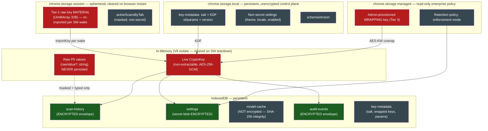
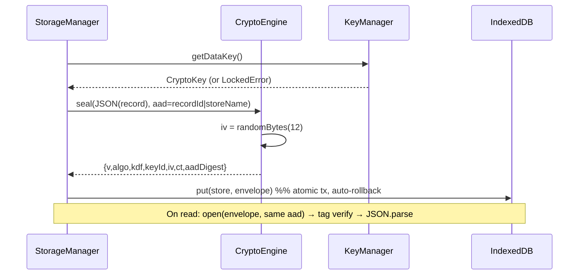
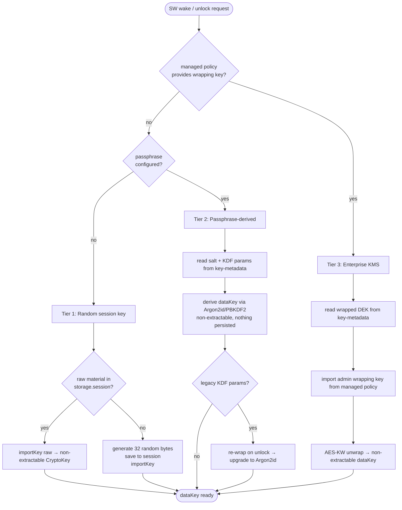

# PART 19 — STORAGE, ENCRYPTION & KEY MANAGEMENT

**Document ID:** SS-BP-019
**Classification:** Internal Engineering — Principal Review
**Version:** 1.0.0
**Last Updated:** 2026-07-12
**Owner:** Principal Security Architect, Principal Storage Engineer
**Reviewers:** Principal Privacy Engineer, Principal Browser Security Engineer, Distinguished AI Engineer

---

## Executive Summary

This document is the authoritative engineering contract for how Sentinel Shield AI persists data and protects it at rest. It is the owner document for the two P0 correctness defects raised in the Repository Audit Report (§4): **DEF-01** (a non-extractable `CryptoKey` cannot survive a Service Worker process restart) and **DEF-02** (PBKDF2 @ 100k iterations is below 2026 OWASP guidance). Both are resolved here with corrected, production-ready code.

The design goal is uncompromising: **raw PII never touches disk.** Sentinel Shield persists only entity *types*, *masked previews* (e.g., `4111********1111`), *confidence scores*, encrypted metadata, and cached ML models. Every persisted record that could conceivably carry sensitive text is sealed with AES-256-GCM under a key the extension can lose but an attacker cannot recover from disk alone. The system is local-first and fully offline; there is no server-side key escrow and — by explicit design — **no passphrase recovery**.

This subsystem is documented against the standard 20-field template (`00_MASTER_INDEX.md` §5).

---

## Resolved Defects

| ID | Defect (as filed) | Resolution in this document | Section |
|---|---|---|---|
| **DEF-01** | A non-extractable `CryptoKey` cannot be reliably persisted in `chrome.storage.session` across a Service Worker **process** restart. The old design (PART_04 §6.4, PART_14 §2.2) claimed a live non-extractable key survives in session storage. | **Corrected.** For the no-passphrase tier we persist the **raw 256-bit key material** (`Uint8Array`) in `chrome.storage.session` and re-`importKey` a fresh **non-extractable** `CryptoKey` on every SW wake. For the passphrase tier **nothing secret is persisted** — the key is re-derived on unlock. An Offscreen-Document-hosted live key is documented as the alternative and rejected with rationale. | §6, §7 |
| **DEF-02** | PBKDF2 @ 100,000 iterations is below 2026 minimums. | **Corrected.** **Argon2id (m=19 MiB, t=2, p=1)** via the audited `hash-wasm` library is the **primary** KDF; **PBKDF2-HMAC-SHA256 @ 600,000 iterations** is the Web-Crypto-native fallback when WASM is unavailable. KDF id + params + version are stored in the salt record; a re-wrap-on-next-unlock migration upgrades legacy 100k users transparently. | §8, §9 |

> **Why the old DEF-01 claim was wrong.** `chrome.storage.session` serializes values with the **structured clone algorithm**. A `CryptoKey` object *is* structured-clonable, so a naive test appears to work — but the clone is only valid within a living JavaScript realm. When the MV3 Service Worker is torn down (idle > 30 s, or an OS process kill) and later re-spawned, the session value is **rehydrated from a serialized form in a new V8 isolate**; the opaque key handle no longer references live key material and cannot be used for `crypto.subtle.decrypt`. A **non-extractable** key by definition cannot be re-serialized to its raw bytes to reconstruct it. The only reliable primitive that survives the round-trip is the **raw key material as bytes** — which is exactly what Tier 1 now stores, and which is re-imported into a fresh non-extractable key on each wake.

---

## 1. Purpose

Provide a single, verifiable specification for: (a) which storage tier holds which data and whether it is encrypted; (b) the exact IndexedDB schema and encrypted-record envelope; (c) the three-tier key hierarchy with the corrected session-key handling; (d) key rotation, crypto-agility, and passphrase lifecycle; (e) the enterprise KMS unwrap flow; (f) retention, quota, and migration; and (g) the schema-level and CI enforcement that guarantees raw PII is never persisted.

---

## 2. Responsibilities

| # | Responsibility |
|---|---|
| R-01 | Own the read/write path for `chrome.storage.{session,local,managed}` and IndexedDB. |
| R-02 | Encrypt every sensitive record with AES-256-GCM before it leaves memory. |
| R-03 | Manage the key lifecycle across all three tiers (create, import, derive, rotate, wipe). |
| R-04 | Bind ciphertext to its logical record via AAD (anti-substitution). |
| R-05 | Enforce crypto-agility: every record self-describes its algo, KDF, and schema version. |
| R-06 | Enforce retention and quota policy (oldest-first eviction, quota-error recovery). |
| R-07 | Run forward-only storage migrations with a version guard. |
| R-08 | Guarantee — structurally and in CI — that no schema field can hold raw PII values. |

---

## 3. Public Interfaces

```typescript
// packages/extension/src/storage/StorageManager.ts

export interface StorageManager {
  init(): Promise<void>;

  // Scan history (encrypted). record.entities carry TYPE + masked preview + confidence only.
  putScan(record: ScanHistoryInput): Promise<string>;      // returns scanId
  getScan(scanId: string): Promise<ScanHistoryRecord | null>;
  listScans(opts: ListOpts): Promise<ScanHistoryRecord[]>;
  deleteScan(scanId: string): Promise<void>;

  // Settings (mixed: non-secret plaintext + secret encrypted blob).
  getSettings(): Promise<Settings>;
  patchSettings(patch: Partial<Settings>): Promise<void>;

  // Model cache (integrity-hashed, not secret → not encrypted; see §5.3).
  putModel(id: string, bytes: ArrayBuffer, meta: ModelMeta): Promise<void>;
  getModel(id: string): Promise<{ bytes: ArrayBuffer; meta: ModelMeta } | null>;

  // Audit trail (encrypted).
  appendAudit(event: AuditEvent): Promise<void>;

  // Retention / maintenance.
  enforceRetention(): Promise<PurgeReport>;
  estimateQuota(): Promise<StorageEstimate>;
}

export interface KeyManager {
  unlock(passphrase?: string): Promise<UnlockResult>; // Tier 1/2/3 auto-selected
  isUnlocked(): boolean;
  changePassphrase(oldPass: string, newPass: string): Promise<void>;
  forgetAndWipe(): Promise<void>;                      // "forgot passphrase" = destroy
  rotateDataKey(): Promise<RotationReport>;
  getActiveKeyMeta(): KeyMetadata;
}
```

---

## 4. Internal Interfaces

| Interface | Consumer | Contract |
|---|---|---|
| `CryptoEngine.seal(plaintext, aad)` | `StorageManager` | Returns `EncryptedEnvelope`; never logs plaintext. |
| `CryptoEngine.open(envelope, aad)` | `StorageManager` | Throws `DecryptionError` on tag mismatch; never returns partial. |
| `KeyManager.getDataKey()` | `CryptoEngine` | Returns the live in-memory `CryptoKey`; throws `LockedError` if not unlocked. |
| `IdbGateway.tx(stores, mode)` | `StorageManager` | Single atomic IndexedDB transaction wrapper; auto-rollback. |
| `SessionKeyStore.{save,load,clear}` | `KeyManager` | Reads/writes raw key material in `chrome.storage.session` (Tier 1 only). |
| `ManagedPolicy.read()` | `KeyManager` | Reads read-only `chrome.storage.managed` enterprise policy (Tier 3). |

---

## 5. Data Flow

### 5.1 Storage Architecture Diagram



### 5.2 Tier / Encryption Matrix

| Data | Tier | Encrypted? | Cleared When | Rationale |
|---|---|---|---|---|
| Raw PII values | (none — memory only) | n/a | SW teardown | Never persisted; leaves the isolate only as masked preview. |
| Tier-1 raw key material | `storage.session` | No (memory-only store) | Browser restart | Session store is not disk-backed; disk theft yields nothing. |
| Active scan state (masked) | `storage.session` | No | Browser restart | No secrets; survives SW restart within a session. |
| Salt + KDF params + version | `storage.local` + IDB `key-metadata` | No | Explicit wipe | Public inputs to KDF; safe in the clear. |
| Non-secret settings | `storage.local` + IDB `settings` | No | Explicit change | Theme/locale/enabled flags are not sensitive. |
| Secret settings (cloud tokens, API keys) | IDB `settings` | **Yes** (AES-256-GCM) | Explicit change / wipe | Sensitive credentials. |
| Scan history (types + masked + confidence) | IDB `scan-history` | **Yes** | Retention / wipe | Defense-in-depth even though values are masked. |
| Audit events | IDB `audit-events` | **Yes** | Retention / wipe | May reference file names / origins. |
| ML model binaries | IDB `model-cache` | No (SHA-256 integrity) | Version bump / eviction | Public model weights; integrity, not secrecy, matters. |
| Enterprise policy + wrapping key | `storage.managed` | Read-only (admin-controlled) | MDM push | Provisioned and rotated by the enterprise. |

### 5.3 Encrypt-on-write / decrypt-on-read



---

## 6. Control Flow — Key Hierarchy (3 Tiers, Corrected)



### 6.1 Tier semantics

| Tier | Key source | Persisted secret | Survives browser restart? | Threat coverage |
|---|---|---|---|---|
| **1 — No passphrase (default)** | `crypto.getRandomValues(32)` | Raw material in `storage.session` only | No (by design — data becomes unreadable, then purged) | Disk theft, other-extension disk access. |
| **2 — User passphrase** | Argon2id/PBKDF2(passphrase, salt) | **Nothing** (salt+params are public) | Only after user re-enters passphrase | Disk theft + offline brute-force + memory-at-rest. |
| **3 — Enterprise KMS** | AES-KW unwrap of DEK using admin wrapping key from `storage.managed` | Wrapped DEK in IDB; wrapping key delivered by MDM | Yes, while device is enrolled | Full enterprise key custody + centralized rotation/revocation. |

---

## 7. Corrected Key Initialization (DEF-01)

```typescript
// packages/extension/src/storage/KeyManager.ts
const SESSION_KEY_FIELD = 'ss_tier1_key_material'; // raw bytes, session-only
const KEY_META_ID = 'active';

export class KeyManagerImpl implements KeyManager {
  #dataKey: CryptoKey | null = null;
  #meta: KeyMetadata | null = null;

  /** Called on every Service Worker wake AND on explicit unlock. */
  async unlock(passphrase?: string): Promise<UnlockResult> {
    const managed = await ManagedPolicy.read();
    if (managed?.wrappingKeyB64) return this.#unlockEnterprise(managed);   // Tier 3
    if (passphrase) return this.#unlockPassphrase(passphrase);             // Tier 2
    return this.#unlockRandom();                                           // Tier 1
  }

  /** TIER 1 — CORRECTED: persist raw MATERIAL, re-import a non-extractable key per wake. */
  async #unlockRandom(): Promise<UnlockResult> {
    const bag = await chrome.storage.session.get(SESSION_KEY_FIELD);
    let material: Uint8Array;
    if (bag[SESSION_KEY_FIELD] instanceof Array || bag[SESSION_KEY_FIELD]?.length === 32) {
      // session stores numeric arrays after structured clone; normalize to bytes
      material = Uint8Array.from(bag[SESSION_KEY_FIELD]);
    } else {
      material = crypto.getRandomValues(new Uint8Array(32));
      // Store RAW BYTES (survives SW process restart within the session), NOT a CryptoKey.
      await chrome.storage.session.set({ [SESSION_KEY_FIELD]: Array.from(material) });
    }
    this.#dataKey = await crypto.subtle.importKey(
      'raw', material, { name: 'AES-GCM', length: 256 },
      /* extractable */ false, ['encrypt', 'decrypt'],
    );
    material.fill(0); // scrub the transient copy
    this.#meta = await this.#loadOrInitMeta('tier1');
    return { tier: 1, requiresPassphrase: false };
  }

  /** TIER 2 — nothing secret persisted; re-derive on unlock. */
  async #unlockPassphrase(passphrase: string): Promise<UnlockResult> {
    this.#meta = await this.#loadOrInitMeta('tier2');
    this.#dataKey = await deriveDataKey(passphrase, this.#meta.kdf); // §8
    if (isLegacyKdf(this.#meta.kdf)) await this.#reWrapToModernKdf(passphrase); // §9 migration
    return { tier: 2, requiresPassphrase: true };
  }

  /** TIER 3 — AES-KW unwrap using admin-provisioned wrapping key. */
  async #unlockEnterprise(policy: ManagedPolicyView): Promise<UnlockResult> {
    this.#meta = await this.#loadOrInitMeta('tier3');
    const wrappingKey = await crypto.subtle.importKey(
      'raw', b64ToBytes(policy.wrappingKeyB64!),
      { name: 'AES-KW' }, false, ['unwrapKey'],
    );
    this.#dataKey = await crypto.subtle.unwrapKey(
      'raw', b64ToBytes(this.#meta.wrappedDekB64!), wrappingKey,
      { name: 'AES-KW' }, { name: 'AES-GCM', length: 256 },
      /* extractable */ false, ['encrypt', 'decrypt'],
    );
    return { tier: 3, requiresPassphrase: false };
  }

  getDataKey(): CryptoKey {
    if (!this.#dataKey) throw new LockedError('Key not unlocked');
    return this.#dataKey;
  }
}
```

> **Alternative considered (and rejected): hold the live key in the Offscreen Document.**
> The Offscreen Document is longer-lived than the SW and *can* hold a live non-extractable `CryptoKey` in its own realm. We reject it as the *primary* mechanism because (a) the OD is created lazily and closed after 60 s of inactivity (PART_04 ADR-006), so it is not guaranteed to be alive when the SW needs to decrypt; (b) routing every seal/open through the OD adds an IPC hop to the hot storage path; and (c) Chrome may still evict the OD under memory pressure. The raw-material-in-session approach is simpler, has no extra IPC, and is correct across process restarts. The OD-hosted key remains a documented Future Improvement for a "hardened" mode that never writes any key bytes to `storage.session`.

---

## 8. Encrypted Record Envelope, AAD & KDF (DEF-02)

### 8.1 Envelope format

Every encrypted record is a self-describing envelope. Crypto-agility is achieved by carrying `v`, `algo`, and `kdf` in the record itself, so a future algorithm change is a pure additive migration.

```typescript
export interface EncryptedEnvelope {
  v: 1;                       // envelope schema version
  algo: 'AES-256-GCM';        // AEAD cipher
  keyId: string;              // which data key sealed this (rotation support)
  iv: string;                 // base64, 12 random bytes (96-bit GCM nonce)
  ct: string;                 // base64, ciphertext || 128-bit GCM tag
  aad: { store: string; id: string; recV: number }; // bound, see §8.2
}
```

### 8.2 AAD usage (anti-substitution)

The GCM Additional Authenticated Data binds each ciphertext to *where it lives*, so an attacker cannot copy a valid ciphertext from one record id into another and have it decrypt. The AAD is the canonical serialization of `{store, id, recV}` — it is authenticated but not encrypted, and decryption fails with a tag mismatch if any of these change.

```typescript
export class CryptoEngine {
  constructor(private keys: KeyManager) {}

  async seal(plaintext: string, aad: EnvelopeAad): Promise<EncryptedEnvelope> {
    const key = this.keys.getDataKey();
    const iv = crypto.getRandomValues(new Uint8Array(12));
    const aadBytes = canonicalAad(aad); // stable key order → deterministic bytes
    const ct = await crypto.subtle.encrypt(
      { name: 'AES-GCM', iv, additionalData: aadBytes, tagLength: 128 },
      key, new TextEncoder().encode(plaintext),
    );
    return {
      v: 1, algo: 'AES-256-GCM', keyId: this.keys.getActiveKeyMeta().keyId,
      iv: bytesToB64(iv), ct: bytesToB64(new Uint8Array(ct)), aad,
    };
  }

  async open(env: EncryptedEnvelope, aad: EnvelopeAad): Promise<string> {
    if (env.algo !== 'AES-256-GCM') throw new DecryptionError(`Unknown algo ${env.algo}`);
    const key = this.keys.getDataKeyById(env.keyId); // supports old key during rotation
    const pt = await crypto.subtle.decrypt(
      { name: 'AES-GCM', iv: b64ToBytes(env.iv), additionalData: canonicalAad(aad), tagLength: 128 },
      key, b64ToBytes(env.ct),
    ); // throws on tag mismatch (tamper, wrong key, or wrong aad)
    return new TextDecoder().decode(pt);
  }
}
```

### 8.3 Key derivation — Argon2id primary, PBKDF2 fallback

```typescript
// packages/extension/src/storage/kdf.ts
import { argon2id } from 'hash-wasm'; // audited WASM; SIMD build pinned by SHA-256 (PART_16)

export type KdfParams =
  | { id: 'argon2id'; v: 2; saltB64: string; m: 19456; t: 2; p: 1; }   // m in KiB = 19 MiB
  | { id: 'pbkdf2';   v: 2; saltB64: string; iterations: 600000; hash: 'SHA-256'; }
  | { id: 'pbkdf2';   v: 1; saltB64: string; iterations: 100000; hash: 'SHA-256'; }; // LEGACY

export async function deriveDataKey(passphrase: string, kdf: KdfParams): Promise<CryptoKey> {
  const salt = b64ToBytes(kdf.saltB64);
  let raw: Uint8Array;
  if (kdf.id === 'argon2id') {
    raw = await argon2id({
      password: passphrase, salt, parallelism: kdf.p, iterations: kdf.t,
      memorySize: kdf.m, hashLength: 32, outputType: 'binary',
    });
  } else {
    const base = await crypto.subtle.importKey(
      'raw', new TextEncoder().encode(passphrase), 'PBKDF2', false, ['deriveBits'],
    );
    const bits = await crypto.subtle.deriveBits(
      { name: 'PBKDF2', salt, iterations: kdf.iterations, hash: kdf.hash }, base, 256,
    );
    raw = new Uint8Array(bits);
  }
  const key = await crypto.subtle.importKey(
    'raw', raw, { name: 'AES-GCM', length: 256 }, /* extractable */ false, ['encrypt', 'decrypt'],
  );
  raw.fill(0);
  return key;
}

export function defaultKdf(argon2Available: boolean): KdfParams {
  const saltB64 = bytesToB64(crypto.getRandomValues(new Uint8Array(16)));
  return argon2Available
    ? { id: 'argon2id', v: 2, saltB64, m: 19456, t: 2, p: 1 }
    : { id: 'pbkdf2', v: 2, saltB64, iterations: 600000, hash: 'SHA-256' };
}

export const isLegacyKdf = (k: KdfParams): boolean =>
  k.id === 'pbkdf2' && k.v === 1; // 100k → must upgrade on next unlock
```

### 8.4 KDF parameter justification

| KDF | Params | 2026 basis | Cost on target hardware |
|---|---|---|---|
| Argon2id (primary) | m=19 MiB, t=2, p=1 | OWASP Password Storage Cheat Sheet (2026) minimum for Argon2id | ~45–70 ms per derivation on a 2023-class laptop; memory-hard → GPU/ASIC brute-force resistant. |
| PBKDF2-HMAC-SHA256 (fallback) | 600,000 iterations | OWASP 2026 minimum for PBKDF2-HMAC-SHA256 | ~250–400 ms per derivation; used only where WASM/Argon2 is unavailable. |
| PBKDF2 @ 100k (**legacy, banned for new records**) | — | Below 2026 minimum (DEF-02) | Accepted only long enough to re-wrap; see §9. |

---

## 9. Key Rotation, Crypto-Agility & KDF Migration

### 9.1 Crypto-agility

Because each envelope carries `v`, `algo`, `keyId`, and each salt record carries `kdf.id`/`kdf.v`, the reader dispatches on the record's own metadata. Introducing (e.g.) AES-256-GCM-SIV or XChaCha20-Poly1305 later requires only: add the branch to `open()`, bump `defaultAlgo`, and let re-encrypt-on-read upgrade records opportunistically.

### 9.2 Re-encrypt-on-read strategy

```typescript
async function readAndUpgrade(store: string, id: string): Promise<string> {
  const env = await idb.get(store, id);
  const pt = await crypto.open(env, { store, id, recV: env.aad.recV });
  const activeKeyId = keys.getActiveKeyMeta().keyId;
  if (env.keyId !== activeKeyId || env.algo !== DEFAULT_ALGO) {
    const upgraded = await crypto.seal(pt, { store, id, recV: env.aad.recV });
    await idb.put(store, { ...upgraded }); // lazy re-wrap under current key/algo
  }
  return pt;
}
```

### 9.3 Data-key rotation

Rotation generates a new data key, records it in `key-metadata` as `active`, and retains the previous key (by `keyId`) so old envelopes still open. Records migrate lazily via §9.2, plus a bounded background sweep (200 records per idle callback) so retained keys can eventually be retired.

### 9.4 Legacy KDF migration (DEF-02 users)

Any account created under PBKDF2 @ 100k is detected by `isLegacyKdf`. On the next successful unlock (the user proves the passphrase), the manager derives the old key, generates fresh **Argon2id** params, re-derives the new key, and re-encrypts the small `key-metadata` proof record + flips subsequent writes to the new key. No data loss, no user prompt — the upgrade is invisible.

```mermaid
sequenceDiagram
    participant U as User
    participant KM as KeyManager
    U->>KM: unlock(passphrase)
    KM->>KM: derive key with legacy PBKDF2-100k
    KM->>KM: detect kdf.v == 1 (legacy)
    KM->>KM: generate Argon2id params (new salt)
    KM->>KM: derive new key; set active keyId
    KM->>KM: persist new KdfParams (v2) + wrapped verifier
    Note over KM: existing records upgrade lazily on read (§9.2)
```

---

## 10. Passphrase Lifecycle

| Operation | Behavior | Secret persisted? |
|---|---|---|
| **Set** (Tier 1 → Tier 2) | Generate Argon2id salt, derive key, re-encrypt all existing Tier-1 records under the new key, clear the Tier-1 material from `storage.session`. | No |
| **Change** | Verify old passphrase (derive + open verifier), derive new key from new salt, re-wrap the verifier and rotate the data key (§9.3). | No |
| **Unlock** | Re-derive key from stored salt+params; nothing new persisted. | No |
| **Forgot = Wipe** | **No recovery by design.** `forgetAndWipe()` deletes all encrypted IDB stores + salt + `storage.session`/`storage.local` secrets, then re-initializes as fresh Tier 1. | n/a |

```typescript
async forgetAndWipe(): Promise<void> {
  await idb.clearStores(['scan-history', 'settings', 'audit-events', 'key-metadata']);
  await chrome.storage.session.clear();
  await chrome.storage.local.remove(['key-metadata', 'secretSettings']);
  this.#dataKey = null;
  await this.#unlockRandom(); // start over as Tier 1
}
```

There is deliberately **no passphrase hint, no security questions, no server escrow**. A verifier record (a known constant sealed under the data key) lets us distinguish "wrong passphrase" from "corrupt data" without ever storing the passphrase.

---

## 11. Enterprise KMS Tier (Concrete Mechanism)

**Mechanism:** An admin provisions a 256-bit **wrapping key** (KEK) to managed devices via `chrome.storage.managed` (Group Policy / MDM). Sentinel Shield generates a random 256-bit **data key** (DEK), wraps it with the KEK using **AES-KW (RFC 3394)**, and stores the *wrapped* DEK in IDB `key-metadata`. The plaintext DEK never leaves memory; the KEK never leaves managed storage.

| Step | Actor | Action |
|---|---|---|
| 1 | Enterprise admin | Pushes `sentinelShield.wrappingKeyB64` (KEK) + retention policy via MDM to `storage.managed` (read-only to the extension). |
| 2 | Extension (first run) | Generates DEK (`getRandomValues(32)`), imports as non-extractable AES-GCM key. |
| 3 | Extension | Imports KEK as `AES-KW` `wrapKey`; wraps DEK; stores `wrappedDekB64` in `key-metadata`. |
| 4 | Extension (each wake) | Reads KEK from managed policy, reads `wrappedDekB64`, `unwrapKey` → non-extractable DEK. |
| 5 | Admin (rotation/revocation) | Pushes a new KEK; extension re-wraps DEK under new KEK on next unlock. Removing the KEK renders local data unreadable (deprovisioning). |

```typescript
async function provisionEnterpriseDek(kekB64: string): Promise<string> {
  const kek = await crypto.subtle.importKey('raw', b64ToBytes(kekB64), { name: 'AES-KW' }, false, ['wrapKey']);
  const dek = await crypto.subtle.generateKey({ name: 'AES-GCM', length: 256 }, /* extractable */ true, ['encrypt','decrypt']);
  const wrapped = await crypto.subtle.wrapKey('raw', dek, kek, { name: 'AES-KW' });
  return bytesToB64(new Uint8Array(wrapped)); // stored as key-metadata.wrappedDekB64
}
```

> Note: the DEK is generated `extractable: true` **only** for the one-time wrap, then discarded; the operational DEK used for seal/open is always re-imported `extractable: false` after unwrap (§7 `#unlockEnterprise`).

---

## 12. Complete IndexedDB Schema

**Database:** `sentinel-shield` · **Version:** `3` (see §14 migrations).

| Object store | keyPath | Indexes | Encrypted? |
|---|---|---|---|
| `scan-history` | `scanId` | `by_ts` (timestamp), `by_risk` (riskLevel), `by_platform` (platform) | Yes (`enc` field) |
| `settings` | `key` | — | Secret blob only (`enc`) |
| `model-cache` | `modelId` | `by_lastUsed` (lastUsedTs) | No (SHA-256 integrity) |
| `audit-events` | `eventId` | `by_ts` (timestamp), `by_type` (type) | Yes (`enc` field) |
| `key-metadata` | `id` | — | No (public KDF inputs; wrapped DEK) |

### 12.1 Record shapes

```typescript
// scan-history — NOTE: no field can hold a raw value (see §15)
interface ScanHistoryRecord {
  scanId: string;              // uuid
  timestamp: number;
  platform: string;            // e.g., "chatgpt.com"
  riskLevel: 'low' | 'medium' | 'high' | 'critical';
  riskScore: number;           // 0..1
  entityTypeCounts: Record<string, number>; // { CREDIT_CARD: 2, EMAIL: 1 }
  enc: EncryptedEnvelope;      // seals the DETAILED (still masked) entity list
}
// Sealed plaintext inside `enc` (never on disk in the clear):
interface ScanHistoryDetail {
  entities: Array<{
    entityType: string;        // TYPE only
    entitySubtype: string;
    confidence: number;        // 0..1
    maskedPreview: string;     // e.g., "4111********1111" — MASKED, never raw
    source: 'regex' | 'ner' | 'entropy' | 'cv' | 'rule';
  }>;
}

interface SettingsRecord { key: string; enc?: EncryptedEnvelope; plain?: unknown; }

interface ModelCacheRecord {
  modelId: string; bytes: ArrayBuffer; sha256: string;
  version: string; sizeBytes: number; lastUsedTs: number;
}

interface AuditEventRecord {
  eventId: string; timestamp: number; type: string; // 'UNLOCK'|'ROTATE'|'WIPE'|'PURGE'...
  enc: EncryptedEnvelope;      // seals actor/context (may include origin, file name)
}

interface KeyMetadataRecord {
  id: 'active' | string;       // keyId
  tier: 1 | 2 | 3;
  keyId: string;
  kdf?: KdfParams;             // Tier 2
  wrappedDekB64?: string;      // Tier 3
  schemaVersion: number;
  createdTs: number;
  verifierEnv?: EncryptedEnvelope; // sealed known-constant to validate unlock
}
```

### 12.2 Store creation

```typescript
function upgrade(db: IDBDatabase, oldV: number): void {
  if (oldV < 1) {
    const sh = db.createObjectStore('scan-history', { keyPath: 'scanId' });
    sh.createIndex('by_ts', 'timestamp'); sh.createIndex('by_risk', 'riskLevel');
    db.createObjectStore('settings', { keyPath: 'key' });
    const mc = db.createObjectStore('model-cache', { keyPath: 'modelId' });
    mc.createIndex('by_lastUsed', 'lastUsedTs');
    db.createObjectStore('key-metadata', { keyPath: 'id' });
  }
  if (oldV < 2) {
    const ae = db.createObjectStore('audit-events', { keyPath: 'eventId' });
    ae.createIndex('by_ts', 'timestamp'); ae.createIndex('by_type', 'type');
  }
  if (oldV < 3) {
    const tx = (db as unknown as { transaction: Function }).transaction;
    // v3: add by_platform index to scan-history (populated by migration, §14)
  }
}
```

---

## 13. Data Retention & Auto-Purge

| Policy | Default | Enterprise override (managed) |
|---|---|---|
| Max scan-history records | 5,000 | policy-defined |
| Max scan-history age | 90 days | policy-defined |
| Max audit-events | 10,000 / 180 days | policy-defined |
| Soft quota target | 80% of `navigator.storage.estimate().quota` | same |
| Eviction order | Oldest-first (by `by_ts`) | same |

```typescript
async enforceRetention(): Promise<PurgeReport> {
  const { usage = 0, quota = 1 } = await navigator.storage.estimate();
  const report: PurgeReport = { byAge: 0, byCount: 0, byQuota: 0 };
  await idb.tx(['scan-history'], 'readwrite', async (store) => {
    // 1) age-based
    const cutoff = Date.now() - RETENTION_MS;
    report.byAge = await deleteByIndexRange(store, 'by_ts', IDBKeyRange.upperBound(cutoff));
    // 2) count-based (oldest-first)
    report.byCount = await trimToCount(store, 'by_ts', MAX_SCANS);
    // 3) quota-based (oldest-first until under soft target)
    if (usage / quota > SOFT_QUOTA) {
      report.byQuota = await trimUntilUnderQuota(store, 'by_ts', SOFT_QUOTA);
    }
  });
  return report;
}
```

### 13.1 Quota error handling

`IndexedDB` write paths catch `QuotaExceededError` and `DOMException` (`AbortError` from disk pressure). On quota errors the manager: (1) evicts the oldest 10% of `scan-history`, (2) evicts least-recently-used `model-cache` entries (they are re-fetchable from the extension package), and (3) retries the write once. If it still fails, the write fails closed with a user-visible non-blocking warning; **no plaintext is buffered to a fallback store.**

---

## 14. Storage Migration & Versioning

- **DB version:** monotonically increasing integer (`sentinel-shield` v3). `onupgradeneeded` runs forward-only migrations; downgrades are refused (the extension detects a higher on-disk version and enters read-only degraded mode rather than corrupting data).
- **Schema version:** a separate `schemaVersion` in `storage.local` + `key-metadata` tracks *record-shape* changes independent of the IDB structural version, enabling record-level lazy migration.
- **Migration guard:** each migration is idempotent and wrapped in the single `versionchange` transaction; a failure rolls the whole upgrade back (no partial schema).

| From → To | Change | Migration |
|---|---|---|
| v1 → v2 | Add `audit-events` store | Create store + indexes. |
| v2 → v3 | Add `by_platform` index; envelope `v:1` | Backfill `platform` on existing scans from sealed detail during idle sweep; default `unknown`. |

---

## 15. "Raw PII Never Persisted" Enforcement

Defense is **structural**, not just conventional:

1. **Type-level:** `ScanHistoryRecord`/`ScanHistoryDetail` have no `rawValue` field. `Detection.rawValue` (PART_04 §7.2) is `?` and lives only in memory; a `toPersistable(detection)` mapper explicitly drops it.
2. **Runtime guard:** every object handed to `putScan`/`appendAudit` passes `assertNoRawPii()` which (a) rejects any key named `rawValue`/`raw`/`plaintext`, and (b) runs the PART_14 `PIISanitizer` over serialized *non-encrypted* fields and throws if it detects an unmasked entity shape.

```typescript
function assertNoRawPii(obj: unknown): void {
  const json = JSON.stringify(obj);
  if (/"raw(Value)?"\s*:/.test(json) || /"plaintext"\s*:/.test(json))
    throw new SchemaViolation('raw value field present in persistable record');
  const masked = new PIISanitizer().sanitize(json);
  if (masked !== json) throw new SchemaViolation('unmasked PII detected in non-encrypted field');
}
```

3. **CI storage-schema audit (PART_25 gate):** a test walks every `create*Store`/persistable interface and fails the build if any persisted (non-`enc`) field is typed to hold free text that could carry a raw value, or if the string `rawValue` appears in any object written to IDB in integration tests.

```typescript
// tests/storage-schema-audit.test.ts (runs in CI, blocking)
it('no persistable record type exposes a raw value field', () => {
  for (const shape of PERSISTABLE_SHAPES)
    expect(Object.keys(shape)).not.toEqual(expect.arrayContaining(['rawValue', 'raw', 'plaintext']));
});
it('integration writes contain only masked previews', async () => {
  const written = await captureAllIdbWrites(runFullScanFixture);
  for (const rec of written) expect(JSON.stringify(rec)).not.toMatch(RAW_PII_CORPUS_REGEX);
});
```

---

## 16. Dependencies

| Dependency | Purpose | Pinned |
|---|---|---|
| Web Crypto API (`crypto.subtle`) | AES-256-GCM, AES-KW, PBKDF2, SHA-256 | Platform |
| `hash-wasm` (Argon2id) | Memory-hard KDF (primary) | Exact version; WASM SHA-256 verified (PART_16) |
| IndexedDB | Persistent encrypted records + model cache | Platform |
| `chrome.storage.{session,local,managed}` | Ephemeral key material, control plane, enterprise policy | Platform |
| PART_14 `PIISanitizer` | Runtime raw-PII guard | Internal |

---

## 17. Memory Usage / CPU Budget / Latency Budget

| Metric | Budget | Notes |
|---|---|---|
| Live key + engine footprint | < 1 MB | One 32-byte key + small buffers. |
| Argon2id peak memory | 19 MiB transient | Freed immediately after derivation. |
| `seal`/`open` (1 KB record) | < 2 ms CPU | Dominated by JSON encode + GCM. |
| Argon2id derivation | 45–70 ms | Once per unlock, not per record. |
| PBKDF2 (600k) derivation | 250–400 ms | Fallback path only. |
| IDB write (single record) | < 8 ms | Single atomic transaction. |
| `listScans` (50 records, decrypt) | < 60 ms | Batched; decrypt off the render path. |
| Retention sweep | < 25 ms / idle callback | Bounded to 200 records per callback. |

---

## 18. Failure Modes & Recovery Strategy

| Failure | Detection | Recovery |
|---|---|---|
| SW restart loses live key | `getDataKey()` → `LockedError` | Re-run `unlock()` on wake (§7): Tier 1 re-imports session material; Tier 2 prompts; Tier 3 re-unwraps. |
| Session key material missing (browser restart) | Empty `storage.session` | Tier 1 generates a fresh key; **old encrypted history is unreadable → purged** (documented behavior). |
| GCM tag mismatch on read | `open()` throws | Distinguish tamper vs wrong-key via verifier; surface as recoverable "cannot decrypt this record", skip it, continue. |
| Argon2 WASM unavailable | `hash-wasm` import fails | Fall back to PBKDF2-600k; record `kdf.id='pbkdf2'` so future reads derive correctly. |
| IDB `QuotaExceededError` | Write rejection | Evict oldest + LRU model cache, retry once, else fail-closed (no plaintext buffer). §13.1 |
| IDB corruption | Open/transaction error | Reset to defaults, wipe encrypted stores, re-init Tier 1 (graceful degradation, PART_04 §9). |
| Higher on-disk DB version | `open()` version check | Enter read-only degraded mode; never downgrade-migrate. |
| Managed KEK removed (deprovision) | `unwrapKey` fails | Data is intentionally unreadable; prompt admin re-enrollment or wipe. |

---

## 19. Security Concerns

| Threat | Handling |
|---|---|
| **Disk theft** | All sensitive IDB records are AES-256-GCM. Tier 1 key material lives only in memory-backed `storage.session` (never disk); Tier 2 persists nothing secret; Tier 3 keeps only a wrapped DEK. Cold disk yields ciphertext + public salts only. |
| **Offline brute-force of passphrase** | Argon2id (m=19 MiB, t=2, p=1) memory-hardness; PBKDF2-600k fallback. Random 16-byte salt per user. |
| **Other-extension access** | Extensions cannot read each other's `chrome.storage` or IndexedDB (per-extension origin isolation). `sender.id` checks (PART_14 §2.3) block cross-extension IPC. |
| **Ciphertext substitution** | AAD binds every ciphertext to `{store, id, recV}`; a moved/renamed record fails the GCM tag check. |
| **Memory dump / runtime compromise** | Tier 2/3 minimize key residency; transient raw buffers are `fill(0)` scrubbed; keys are non-extractable so they can't be exported via `crypto.subtle.exportKey`. Residual runtime-attack risk from the same extension context is accepted (documented in PART_14 §2.2). |
| **Key reuse / nonce collision** | 96-bit random IV per encryption; key rotation caps records per key well below GCM's safe 2³² invocations. |
| **Downgrade attack on KDF** | `isLegacyKdf` forces upgrade on unlock; new writes never use legacy params. |

---

## 20. Privacy Concerns · Performance Concerns · Testing Strategy · Production Checklist · Future Improvements · Open Risks

### 20.1 Privacy Concerns

- Only entity **types**, **masked previews**, and **confidence** are stored; raw values are structurally excluded (§15).
- Zero network egress from this subsystem (local-first). Enterprise audit export, if enabled, is governed by PART_07 and is out of scope here.
- `forgetAndWipe()` gives users a hard delete with no recoverable residue.

### 20.2 Performance Concerns

- KDF cost is paid once per unlock, never per record.
- Decryption is kept off the render path (batch decrypt in the SW, send masked view to UI).
- Retention sweeps and re-encrypt-on-read are bounded and run in idle callbacks to avoid jank.

### 20.3 Testing Strategy

| Test | Scope | Tool |
|---|---|---|
| Envelope round-trip (seal→open) incl. AAD tamper | CryptoEngine | Vitest |
| DEF-01 SW-restart simulation (drop realm, reload session material) | KeyManager | Vitest + fake-chrome |
| Argon2id ↔ PBKDF2 fallback + legacy 100k migration | KDF | Vitest |
| AES-KW enterprise unwrap with rotated KEK | Tier 3 | Vitest |
| Retention/quota eviction (age/count/quota) | StorageManager | Vitest + fake-indexeddb |
| **Storage-schema audit (raw-PII)** blocking gate | Schema/CI | Vitest (PART_25) |
| Migration v1→v2→v3 idempotency + rollback | IdbGateway | Vitest |
| E2E: scan → persist → reload → history renders masked | Full | Playwright |

### 20.4 Production Checklist

- [ ] All sensitive IDB stores write only `EncryptedEnvelope`; no plaintext columns.
- [ ] Tier 1 stores raw **material** (not a `CryptoKey`) in `storage.session`; re-import verified across simulated SW restart (DEF-01).
- [ ] Argon2id primary with m=19 MiB/t=2/p=1; PBKDF2-600k fallback; 100k banned for new records (DEF-02).
- [ ] Legacy-KDF migration upgrades on next unlock with zero data loss.
- [ ] AAD binds ciphertext to `{store,id,recV}`; substitution test passes.
- [ ] Enterprise AES-KW unwrap works and honors KEK rotation/removal.
- [ ] Retention + quota eviction verified; `QuotaExceededError` path fails closed.
- [ ] CI storage-schema audit is green and blocking.
- [ ] `forgetAndWipe()` leaves no recoverable secret in session/local/IDB.
- [ ] Migrations forward-only; higher on-disk version → read-only degraded mode.

### 20.5 Future Improvements

| Improvement | Impact |
|---|---|
| Offscreen-Document-hosted live key ("hardened mode") | Tier 1 never writes any key bytes to `storage.session`. |
| XChaCha20-Poly1305 via WASM as an alternate AEAD | Crypto-agility hedge; larger nonce space. |
| WebAuthn PRF-derived key tier | Passphrase-less strong tier bound to a hardware authenticator. |
| Per-record compression before encryption | Lower IDB footprint for large scan histories. |
| Deterministic re-key sweep scheduler | Faster retirement of retained rotation keys. |

### 20.6 Open Risks (Register Entry)

| ID | Risk | Likelihood | Impact | Mitigation / Owner |
|---|---|---|---|---|
| OR-19-01 | Same-context runtime compromise can read the live key from memory. | Low | High | Non-extractable keys, minimal residency, hardened-mode roadmap. Owner: Sec Arch. |
| OR-19-02 | Argon2 WASM supply-chain risk. | Low | High | Pinned version + SHA-256 verification (PART_16); PBKDF2 fallback. Owner: Storage Eng. |
| OR-19-03 | User loses passphrase → permanent data loss (by design). | Medium | Medium | Clear onboarding warning; no escrow is intentional. Owner: Privacy Eng. |
| OR-19-04 | Enterprise KEK mismanagement locks out fleet. | Low | High | Rotation runbook (PART_27); dual-KEK grace window. Owner: Sec Arch. |
```