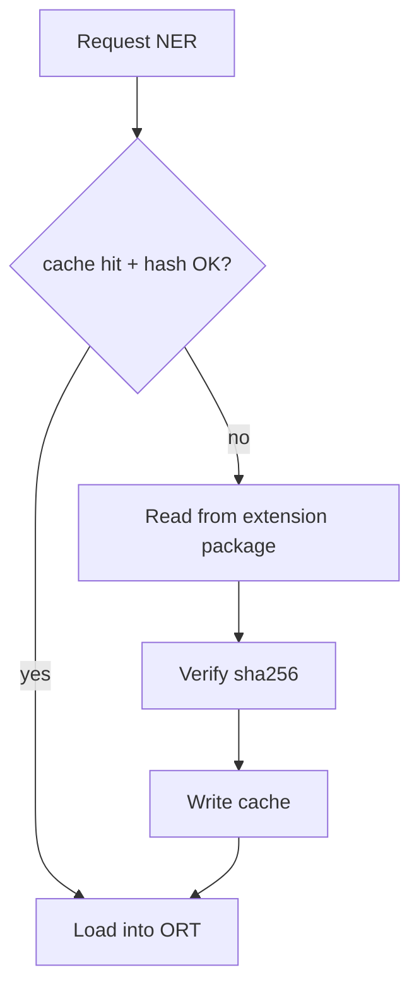

# PART 21 — CONFIGURATION, RULE, SIGNATURE & MODEL MANAGEMENT

**Document ID:** SS-BP-021
**Classification:** Internal Engineering — Principal Review
**Version:** 1.0.0
**Last Updated:** 2026-07-12
**Owner:** Principal Detection Engineer, Staff DevOps Engineer
**Reviewers:** Principal Security Architect, Distinguished AI Engineer

---

## Executive Summary

This document specifies how settings, detection rule packs, signatures, and ML models are versioned, shipped, validated, cached, and rolled back. **Remote code download is forbidden.** Updates ship only via Chrome Web Store (or managed policy **data**). Defaults are maximum security.

---

## 1. Purpose

Provide a single management subsystem so detection behavior is reproducible, auditable, and updatable without expanding the remote-attack surface.

## 2. Responsibilities

- Settings schema + precedence
- Rule/signature pack format + integrity
- Model registry + model cards + eval gates
- Feature flags
- Compatibility matrix vs extension version

## 3. Public Interfaces

```typescript
interface ConfigService {
  getSettings(): Promise<Settings>;
  setUserSettings(patch: Partial<Settings>): Promise<void>;
  getEffectiveSettings(): Promise<EffectiveSettings>; // after managed merge
}

interface RulePackService {
  getActivePack(): RulePack;
  listDetectors(): DetectorMeta[];
}

interface ModelManager {
  ensureModel(modelId: string): Promise<ModelHandle>;
  getModelCard(modelId: string): ModelCard;
  invalidateCache(modelId?: string): Promise<void>;
}
```

## 4. Config Precedence

```
chrome.storage.managed  >  user chrome.storage.local  >  hardcoded defaults
```

If `disableUserOverrides: true`, user cannot weaken: enforcementMode, requiredDetectors, sensitivity floor, telemetryForceOff.

## 5. Settings Schema (Defaults = Max Security)

| Key | Type | Default | Notes |
|---|---|---|---|
| platforms.*.enabled | boolean | true (on grant) | Per host permission |
| sensitivity | enum | maximum | Maps to Risk Z multiplier |
| detectors.secrets | boolean | true | |
| detectors.govId | boolean | true | |
| detectors.payment | boolean | true | |
| detectors.contact | boolean | true | |
| detectors.ner | boolean | **false** | ADR-037 |
| detectors.ocr | boolean | true | |
| detectors.cv | boolean | **false** | ADR-037 |
| historyEnabled | boolean | **false** | ADR-033; when true, retention applies |
| historyRetentionDays | number | 30 | 1–90; only if historyEnabled |
| passphraseEnabled | boolean | false | |
| cloudExplainEnabled | boolean | false | |
| telemetryEnabled | boolean | false | |
| showInformationalFindings | boolean | true | sk_test_ etc. |

Hardcoded defaults live in `packages/shared-types` and are compiled into the extension — not fetched.

## 6. Rule & Signature Packs

### Format

```typescript
interface RulePack {
  packId: string;          // "core"
  version: string;         // semver
  minExtensionVersion: string;
  checksumSha256: string;  // of pack JSON
  rules: Rule[];
}

interface Rule {
  id: string;              // "secret.aws.akia"
  entityType: string;
  regex?: string;          // RE2-safe
  checksum?: 'luhn' | 'verhoeff' | 'mod97' | 'none';
  severity: number;        // S(e) 0..1
  entropy?: { minBits: number; minLength: number };
}
```

### Update Policy

| Channel | Allowed |
|---|---|
| Bundled in extension package | Yes — primary |
| CWS extension update | Yes — only way to change packs for individuals |
| HTTPS download of JS/WASM rules | **No** |
| Managed storage `customPatterns` | Yes — **data only**, validated, size-capped (≤50 patterns, each ≤256 chars) |

**Why no remote rule download:** Remote rules are remote code-equivalent for a security product and would fail Chrome/Apple-class review.

## 7. Model Management

### Model Card (required before ship)

| Field | Example |
|---|---|
| modelId | `ner-distilbert-pii-int8-v3` |
| task | token-classification |
| sizeBytes | 12582912 |
| metrics | P/R on PART_24 corpus |
| training data summary | synthetic + licensed sets (no user data) |
| known failure modes | multilingual gaps |
| sha256 | … |
| minExtensionVersion | 1.0.0 |

### Registry

Bundled manifest `public/models/registry.json` lists models. IndexedDB cache key = modelId+sha256.

### Load Lifecycle



### Eval Gate (CI)

Before bumping model in main:

1. Run PART_24 accuracy suite
2. Structured PII precision ≥ 97% where applicable; NER ≥ 85%/80% P/R
3. Latency P99 within PART_23
4. Security review of card

### Rollback

Ship previous model in same release train if needed; `registry.json` points to prior sha; cache invalidated by hash mismatch.

## 8. Feature Flags

Local flags in settings + managed overlays. Examples: `nerEnabled`, `threadsWasmPhase2`, `cloudExplainEnabled`. Flags never download code.

## 9. Compatibility Matrix

| Extension | Rule pack | NER model | Notes |
|---|---|---|---|
| 1.0.x | core ≥1.0.0 &lt;2.0.0 | ner-*-v3 | v1 launch |
| 1.1.x | core ≥1.1.0 | ner-*-v3 or v4 | pack may add entities |

On mismatch: use bundled compatible pack; show degraded banner if model missing.

## 10. Data Flow / Control Flow / Lifecycle

Settings read on SW activate; subscribe `storage.onChanged`. Packs loaded at build into detection-engine. Models lazy (PART_16).

## 11. Memory / CPU / Latency

| Op | Budget |
|---|---|
| Merge effective settings | &lt; 5ms |
| Load rule pack from memory | &lt; 1ms |
| Model cold load | &lt; 2s |
| Cache hit load | &lt; 200ms |

## 12. Failure Modes

| Failure | Recovery |
|---|---|
| Corrupt pack checksum | Refuse load; use last-known good embedded fallback pack stub (Tier-1 critical only) |
| Model hash fail | Delete cache; reload from package; if fail disable NER |
| Managed JSON invalid | Ignore managed overlay; log; keep safe defaults |

## 13. Security Concerns

- No `eval` of patterns — `new RegExp` only after allowlisted syntax check
- Custom patterns length/count capped
- Model files not user-replaceable

## 14. Privacy Concerns

Settings may reveal which platforms user protects — encrypted at rest. No sync storage.

## 15. Testing Strategy

Schema unit tests; precedence tests; malicious customPatterns rejected; model hash mismatch; eval gate dry-run in CI.

## 16. Production Checklist

- [ ] Defaults max security verified
- [ ] registry.json + rule pack checksums in CI
- [ ] Model cards published internally
- [ ] Managed schema matches PART_10
- [ ] No remote update URLs in code

## 17. Future Improvements

| Item | How |
|---|---|
| Country entity packs | Additional data files in CWS release; user enables pack; still no remote code |
| Enterprise rule IDE | Admin generates JSON; MDM pushes; extension validates |
| A/B models | Not allowed client-side remote; only ship one default per release |
