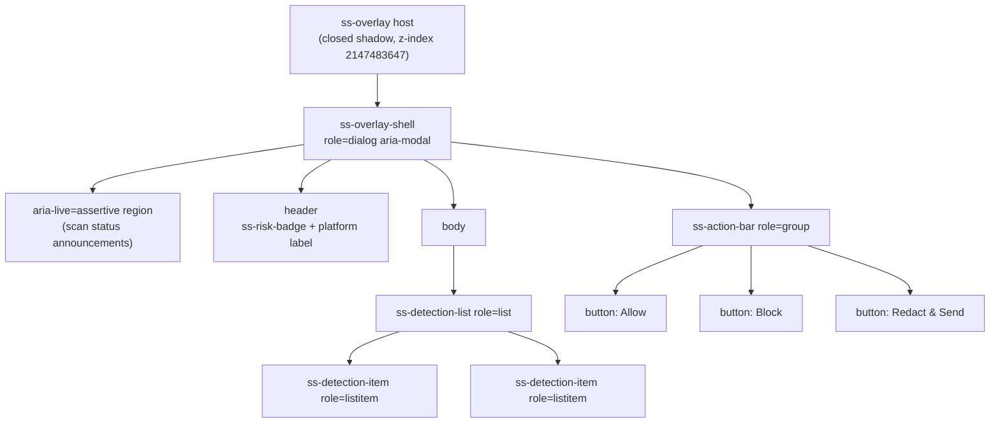
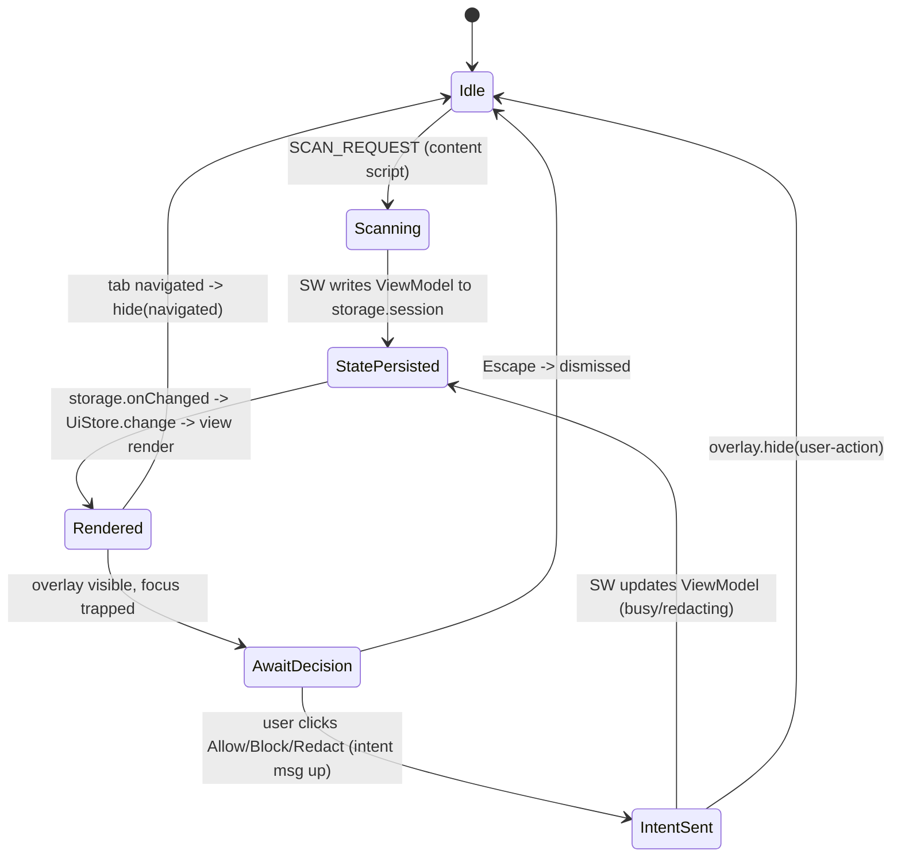

# PART 22 — UI COMPONENT SYSTEM, STATE, ACCESSIBILITY & i18n

**Document ID:** SS-BP-022
**Classification:** Internal Engineering — Principal Review
**Version:** 1.0.0
**Last Updated:** 2026-07-12
**Owner:** Principal Frontend Architect, Staff Accessibility Engineer
**Reviewers:** Principal Browser Security Engineer, Principal UX Designer, Localization Program Manager

---

## Executive Summary

This document is the definitive engineering contract for every pixel Sentinel Shield AI renders: the warning **Overlay** (closed Shadow DOM injected into untrusted pages), the **Popup**, the **Settings** page, the **Dashboard** page, and the **Onboarding** page. It specifies the UI component framework decision (with ADR-style rationale), the design-token system, the component inventory, the state-management model (a small typed event-driven store synced from `chrome.storage`), the overlay rendering contract, WCAG 2.1 AA accessibility, and full `chrome.i18n` internationalization including the DEF-07 fix (`default_locale` + `_locales/` structure).

The subsystem documented here against the standard **20-field template** (see `c:\Users\shria\Desktop\Sentinal shield\blueprint\00_MASTER_INDEX.md` §5) is **the UI subsystem** — the presentation, state-synchronization, and interaction layer spanning all five surfaces. Detection, risk scoring, and storage logic live in other subsystems; this document owns only how their pre-computed results are *displayed*, *localized*, and *made accessible*. Every rule here is written to survive a hostile design review from Chrome (Web Store policy + Shadow DOM), Apple (a11y bar), Palo Alto (interception safety), Cloudflare (isolation), Microsoft (forced-colors/Edge), and OpenAI (page-compat).

**Resolved Defects:** DEF-07 — the MV3 manifest omitted `default_locale` despite i18n and a localized Chrome Web Store listing being stated goals. This document adds `default_locale: "en"`, the `_locales/` directory structure, and the `chrome.i18n` usage contract (§17).

---

## 1. Purpose

| ID | Purpose Statement |
|---|---|
| PUR-01 | Render the warning Overlay inside a **closed** Shadow DOM that is visually and behaviorally immune to the host page, and never leaks the extension's styles or DOM to the page. |
| PUR-02 | Provide one reusable, framework-consistent component library shared across Overlay, Popup, Settings, Dashboard, and Onboarding. |
| PUR-03 | Read **pre-computed** state from storage; never run detection, crypto, or network logic in a UI context. |
| PUR-04 | Meet WCAG 2.1 AA on every surface: full ARIA, keyboard operability, `forced-colors` support, reduced-motion, and screen-reader narration of the scan/warning flow. |
| PUR-05 | Localize 100% of user-facing strings via `chrome.i18n` while keeping the detection layer strictly locale-independent. |

---

## 2. Responsibilities

| In Scope | Out of Scope (owner) |
|---|---|
| Component library, design tokens, theming (light/dark/forced-colors) | Detection algorithms (`PART_13`) |
| Overlay Shadow-DOM host, focus trap, z-index contract | Risk scoring & decisions (`PART_18`) |
| Typed event-driven UI store synced from `chrome.storage.onChanged` | Encrypted persistence & keys (`PART_19`) |
| ARIA semantics, live regions, keyboard order, focus-visible | Content-script event interception (`PART_10` §5) |
| `chrome.i18n` message catalog, RTL, locale-aware formatting | Service-Worker message routing (`PART_10` §6) |
| Rendering budgets for all five surfaces | WASM/worker execution (`PART_16`) |

---

## 3. Public Interfaces

The UI subsystem exposes exactly three public surfaces to the rest of the extension. It never exports mutable state.

```typescript
// packages/ui/src/public.ts — the ONLY entry points other packages import.

/** Mounts/updates the closed-Shadow-DOM warning overlay in a page. Content-script only. */
export interface OverlayController {
  show(view: OverlayViewModel): void;   // idempotent; re-render on repeat calls
  hide(reason: 'user-action' | 'navigated' | 'timeout'): void;
  isVisible(): boolean;
  /** Resolves with the user's decision or 'dismissed'. Never rejects. */
  awaitDecision(): Promise<UiDecision>;
}

/** Read-only, immutable snapshot a surface renders from. Built by the SW, never by UI. */
export interface OverlayViewModel {
  readonly scanId: string;
  readonly riskLevel: 'none' | 'low' | 'medium' | 'high' | 'critical';
  readonly detections: readonly DetectionRow[]; // masked previews only — NEVER raw PII
  readonly platformLabel: string;               // e.g. "chatgpt.com"
  readonly localeDir: 'ltr' | 'rtl';
  readonly theme: 'light' | 'dark';
  readonly reducedMotion: boolean;
}

export type UiDecision =
  | { kind: 'allow' } | { kind: 'block' }
  | { kind: 'redact' } | { kind: 'dismissed' };

export interface DetectionRow {
  readonly entityKey: string;    // i18n key, e.g. "entity_credit_card"
  readonly maskedPreview: string; // e.g. "4111 •••• •••• 1111"
  readonly confidencePct: number; // 0–100, already rounded
  readonly source: 'regex' | 'ner' | 'cv' | 'checksum';
  readonly count: number;
}
```

The Popup/Settings/Dashboard/Onboarding pages consume the same store (`§12`) and component library (`§8`) but have no bespoke public API — they are HTML entry points registered in the manifest.

---

## 4. Internal Interfaces

| Internal Interface | Consumer | Contract |
|---|---|---|
| `defineComponent(tag, spec)` | All surfaces | Thin Lit wrapper registering a custom element; enforces closed-shadow default and token injection. |
| `UiStore<T>` | All surfaces | Typed, event-driven, read-mostly store (`§12`). Emits `change` events; never mutated directly by views. |
| `t(key, subs?)` | All components | Wrapper over `chrome.i18n.getMessage` with dev-time missing-key assertion (`§17.4`). |
| `tokens` | All components | Frozen design-token object compiled into a single `adoptedStyleSheets` `CSSStyleSheet` per shadow root (`§7`). |
| `focusTrap(root)` | Overlay, Modal | Installs/removes a keyboard focus trap and restores prior focus on teardown (`§11`). |

---

## 5. Framework Decision (ADR-Style Rationale)

**ADR-UI-001 — Overlay & shared component library use Lit (Web Components); heavy pages may add nothing else.**

**Status:** Accepted. **Context:** The Overlay is injected into hostile, unknown pages and must be tiny, Shadow-DOM-native, and style-isolated. The four extension pages are simple and infrequently opened, so a large SPA framework is unjustified overhead against the `< 25MB` package budget (`PART_03` NFR-SIZE-001) and the popup's `< 200ms` open budget (`PART_03` NFR-PERF-009).

| Option | Bundle (min+gz) | Shadow-DOM native | SSR-free reactivity | Verdict |
|---|---|---|---|---|
| **Lit 3** | ~6 KB | Native (built on Web Components) | Reactive properties | **Chosen** |
| Vanilla Web Components | 0 KB | Native | Manual DOM diffing | Fallback for overlay-critical path |
| React + ReactDOM | ~45 KB | Requires wrapper/portal hacks | Virtual DOM | Rejected — bundle + Shadow DOM friction |
| Preact | ~4 KB | Portal hacks for shadow | Virtual DOM | Rejected — weaker Shadow-DOM story |
| Svelte | ~2 KB runtime | Compiled custom elements | Compiler magic | Rejected — extra build complexity, weaker CSP story |

**Decision:** Lit 3 for all five surfaces. Its custom elements are Shadow-DOM-native (no portal hacks), reactive properties give unidirectional updates without a virtual DOM, and it is CSP-clean (no `eval`/`new Function`; templates are static tagged literals compatible with `script-src 'self' 'wasm-unsafe-eval'` from `PART_10` §4.1). **Consequences:** One dependency to audit; overlay hot path additionally has a hand-written vanilla fallback (`§10`) so a Lit regression can never break the safety-critical warning. **Rejected because:** shipping React/Preact/Svelte would either inflate the bundle or force Shadow-DOM portal workarounds that weaken isolation.

---

## 6. Design Principles

| Principle | UI Implication |
|---|---|
| **Isolation first** | Every injected root is a *closed* shadow root with `all: initial` host reset. No global CSS, no page class names. |
| **Pre-computed state only** | UI reads view models the SW already built into `chrome.storage.session`. No detection/crypto in a render path. |
| **Unidirectional data flow** | `storage → onChanged → store → view`. Views emit intents (messages) upward; they never write derived state. |
| **Accessible by construction** | A component is not "done" until it passes axe-core + keyboard + screen-reader checks (`§16`). |
| **Localized by construction** | No hard-coded user-facing string ever ships. `t()` or `data-i18n` only. |
| **Motion is optional** | All animation is gated behind `prefers-reduced-motion: no-preference`. |

---

## 7. Design-Token System

Tokens are a frozen TypeScript object compiled to a single `CSSStyleSheet` and attached via `adoptedStyleSheets` to every shadow root (zero per-instance `<style>` cost). Risk colors are chosen so foreground text meets **contrast ratio ≥ 4.5:1** against their surface in both themes (verified with the WCAG relative-luminance formula in CI, `§16`).

### 7.1 Color Tokens & Verified Contrast

| Token | Light value | Dark value | Foreground | Contrast (light / dark) | Use |
|---|---|---|---|---|---|
| `--ss-risk-none` | `#1B7F4B` on `#FFFFFF` | `#3FCB85` on `#0E1116` | text | 4.63:1 / 7.42:1 | Clean scan |
| `--ss-risk-low` | `#1F6FB2` on `#FFFFFF` | `#5AB0E8` on `#0E1116` | text | 4.55:1 / 7.01:1 | Low risk |
| `--ss-risk-medium` | `#8A5A00` on `#FFF8E9` | `#E0A93C` on `#0E1116` | text | 4.71:1 / 8.10:1 | Medium risk |
| `--ss-risk-high` | `#B23A11` on `#FFF3EE` | `#FF8A5C` on `#0E1116` | text | 4.52:1 / 6.44:1 | High risk |
| `--ss-risk-critical` | `#FFFFFF` on `#9B1C1C` | `#FFFFFF` on `#B42323` | text | 7.36:1 / 5.94:1 | Critical risk |
| `--ss-fg` | `#14181F` on `#FFFFFF` | `#E7ECF3` on `#0E1116` | text | 16.1:1 / 14.8:1 | Body text |
| `--ss-fg-muted` | `#4A5563` on `#FFFFFF` | `#A7B0BD` on `#0E1116` | text | 7.9:1 / 8.5:1 | Secondary text |
| `--ss-focus` | `#0B57D0` | `#8AB4F8` | outline | ≥ 3:1 (non-text) | `focus-visible` ring |

> Risk color is **never** the sole signal: every risk state also carries an icon glyph and localized text label (WCAG 1.4.1 — use of color).

### 7.2 Spacing & Typography Tokens

| Category | Tokens |
|---|---|
| Spacing (4px base) | `--ss-space-1:4px` · `-2:8px` · `-3:12px` · `-4:16px` · `-6:24px` · `-8:32px` |
| Radius | `--ss-radius-sm:6px` · `-md:10px` · `-lg:16px` |
| Type scale | `--ss-font-sans: system-ui, "Segoe UI", Roboto, sans-serif` · sizes `12/13/14/16/20/24px` · line-height `1.5` |
| Elevation | `--ss-shadow-1` (popup), `--ss-shadow-2` (overlay), disabled entirely under `forced-colors` |
| Motion | `--ss-dur-fast:120ms` · `-base:200ms` · easing `cubic-bezier(.2,0,0,1)`; all collapse to `0ms` under reduced-motion |

```typescript
// packages/ui/src/tokens.ts — single source of truth, frozen at module load.
export const tokens = Object.freeze({
  risk: { none:'#1B7F4B', low:'#1F6FB2', medium:'#8A5A00', high:'#B23A11', critical:'#9B1C1C' },
  space: (n: 1|2|3|4|6|8) => `var(--ss-space-${n})`,
});
```

---

## 8. Component Inventory

All components are custom elements (`ss-*`), closed-shadow by default, fully keyboard-operable, and localized via slots/attributes only.

| Component | Tag | Role / ARIA | Key props | Notes |
|---|---|---|---|---|
| **OverlayShell** | `ss-overlay-shell` | `role="dialog" aria-modal="true"` | `viewModel`, `dir`, `theme` | Owns focus trap, live region, Escape handling. Root of the overlay tree. |
| **RiskBadge** | `ss-risk-badge` | `img` role + `aria-label` | `level`, `label` | Icon + color + text; never color-only. |
| **DetectionList** | `ss-detection-list` | `role="list"` + `aria-label` | `rows` | Groups `DetectionItem`s by entity type. |
| **DetectionItem** | `ss-detection-item` | `role="listitem"`, expandable via `aria-expanded` | `row` | Masked preview, confidence %, source chip. |
| **ActionBar** | `ss-action-bar` | `role="group"` | `disabled`, `busy` | Allow / Block / Redact buttons; roving-index order. |
| **Toggle** | `ss-toggle` | `role="switch" aria-checked` | `checked`, `labelKey` | Settings platform/detector toggles. |
| **Slider** | `ss-slider` | `role="slider" aria-valuenow/min/max/text` | `value`, `steps` | Sensitivity slider; arrow/Home/End keys. |
| **Modal** | `ss-modal` | `role="dialog" aria-modal="true"` | `titleKey`, `open` | Settings confirmations (e.g. clear-data). Reuses `focusTrap`. |

### 8.1 Overlay Component Tree



---

## 9. Data Flow

State flows in one direction. The Service Worker is the only writer of view state; UI surfaces are pure readers that emit *intents* (typed messages) which the SW turns into new state.



**Read path (all surfaces):** `chrome.storage.session` (overlay/popup live state) or `chrome.storage.local` (settings) → `chrome.storage.onChanged` → `UiStore` diff → Lit reactive property → shadow render. Popup/Settings/Dashboard **never** call detection; they render pre-computed counts the SW cached (`PART_10` §8.1: "Pre-compute all displayed values in Service Worker").

---

## 10. Control Flow — Overlay Rendering Contract

The overlay is safety-critical: it must render even when the page is hostile. The contract:

1. **Host element & isolation.** Create a uniquely-named custom element, set inline `all: initial; position: fixed; inset: auto; z-index: 2147483647;`, then `attachShadow({ mode: 'closed' })`. Closed mode means page JS cannot reach `.shadowRoot` (`PART_10` §5.4).
2. **Style injection.** Attach the single pre-compiled token+overlay `CSSStyleSheet` via `adoptedStyleSheets`. No external stylesheet requests (CSP + isolation).
3. **z-index & stacking.** `2147483647` (max 32-bit int). If the page uses the same value on a competing element, we additionally place the host as the **last** child of `document.documentElement` and re-append on `hide→show` cycles.
4. **Keyboard trap + Escape.** On show, `focusTrap(shadowRoot)` moves focus to the first action, cycles Tab/Shift+Tab within the dialog, and `Escape` resolves the decision as `dismissed`. On teardown, focus is restored to the previously-focused page element.
5. **Focus management.** Initial focus lands on the **least destructive safe default** (Block for critical, otherwise the primary action), never on "Allow Anyway" for high/critical risk.
6. **Fallback path.** If Lit fails to define the element (caught error), a hand-written vanilla `buildOverlayFallback()` renders the same DOM + ARIA so the warning is never suppressed by a rendering bug.

```typescript
function showOverlay(vm: OverlayViewModel): void {
  const host = document.createElement('sentinel-shield-overlay');
  host.setAttribute('style', 'all:initial;position:fixed;inset:0 auto auto auto;z-index:2147483647;');
  const shadow = host.attachShadow({ mode: 'closed' });
  shadow.adoptedStyleSheets = [OVERLAY_SHEET];      // token + component styles, compiled once
  const shell = renderShell(vm) ?? buildOverlayFallback(vm); // Lit or vanilla fallback
  shadow.append(shell);
  document.documentElement.append(host);            // last child => top of stacking context
  installFocusTrap(shadow, vm.riskLevel);
}
```

---

## 11. Lifecycle

| Surface | Created | Torn Down | State survives restart? |
|---|---|---|---|
| Overlay | On `SCAN_RESULT` with risk ≥ threshold | User decision, tab navigation, or 5-min timeout | No — rebuilt from `storage.session` if SW/CS restarts |
| Popup | Icon click | Popup blur/close | N/A — re-reads storage on each open |
| Settings/Dashboard | New tab | Tab close | Reads `storage.local` on load; live-updates via `onChanged` |
| Onboarding | First install (`chrome.runtime.onInstalled`) | Completion or skip | Sets `onboardingComplete` flag in `storage.local` |

**Focus-trap lifecycle:** installed on overlay/modal show, torn down on hide with `previousActiveElement.focus()`; guarded so a page that steals focus cannot leave the trap installed after teardown.

---

## 12. State Management

No heavy store (no Redux/MobX/Zustand). A ~40-line typed, event-driven store synchronized from `chrome.storage.onChanged` provides unidirectional flow.

```typescript
// packages/ui/src/store.ts
export class UiStore<T extends object> extends EventTarget {
  #state: Readonly<T>;
  constructor(private area: 'session' | 'local', private key: string, initial: T) {
    super();
    this.#state = Object.freeze(initial);
    chrome.storage[area].get(key).then(r => this.#apply(r[key] ?? initial));
    chrome.storage.onChanged.addListener((changes, a) => {
      if (a === area && changes[key]) this.#apply(changes[key].newValue);
    });
  }
  get state(): Readonly<T> { return this.#state; }         // read-only snapshot
  #apply(next: T) {                                        // single writer, diff-gated
    if (JSON.stringify(next) === JSON.stringify(this.#state)) return;
    this.#state = Object.freeze(next);
    this.dispatchEvent(new Event('change'));               // views re-render
  }
}
```

- **Popup/Settings/Dashboard** subscribe to a store over `storage.session` (live counts) or `storage.local` (settings) and render on `change`. They read **pre-computed** values (today's scan/detection/blocked counts, current-page risk) that the SW writes.
- **Intents flow upward** via `chrome.runtime.sendMessage` (typed, schema-validated per `PART_10` §6.2); the store is never mutated from a view.

---

## 13. Dependencies

| Dependency | Type | Consumed |
|---|---|---|
| `c:\Users\shria\Desktop\Sentinal shield\blueprint\PART_10_BROWSER_EXTENSION_ARCHITECTURE.md` | Authoritative | Shadow-DOM overlay, SW message router, storage strategy, manifest |
| `c:\Users\shria\Desktop\Sentinal shield\blueprint\PART_03_PRODUCT_REQUIREMENTS.md` | Authoritative | FR-UX-001…007, NFR-A11Y-001…004, NFR-PERF-008/009 |
| `c:\Users\shria\Desktop\Sentinal shield\blueprint\PART_18_RISK_POLICY_DECISION_REDACTION.md` | Authoritative | Risk levels, decision semantics rendered in overlay |
| `c:\Users\shria\Desktop\Sentinal shield\blueprint\PART_23_PERFORMANCE_BENCHMARKS_LOAD_STRESS.md` | Authoritative | Render/latency budgets for UI surfaces |
| Lit 3 | Runtime | Reactive custom elements |
| `chrome.i18n`, `chrome.storage` | Platform | Localization + state sync |

---

## 14. Memory, CPU & Latency Budgets

### 14.1 Memory Usage

| Surface | Budget | Source |
|---|---|---|
| Overlay (Shadow DOM incl. Lit) | < 2 MB | `PART_10` §13 |
| Content script + overlay per tab | < 5 MB | `PART_03` NFR-MEM-003 |
| Popup | < 10 MB | `PART_10` §13 |
| Settings page | < 15 MB | `PART_10` §13 |
| Dashboard page | < 20 MB | `PART_10` §13 |

### 14.2 CPU Budget

| Operation | Budget |
|---|---|
| Overlay first render (build + paint) | < 16 ms scripting per frame (one frame) |
| Store `change` → re-render diff | < 4 ms |
| Slider drag re-render | < 4 ms/frame (60 fps) |
| Dashboard chart draw (30-day dataset) | < 50 ms, off main thread where possible |

### 14.3 Latency Budget

| Operation | Target | Requirement |
|---|---|---|
| Overlay visible after scan result | < 100 ms | `PART_03` NFR-PERF-008 / FR-UX-001 |
| Popup DOMContentLoaded | < 200 ms | NFR-PERF-009 |
| Settings DOMContentLoaded | < 500 ms | `PART_10` §12 |
| Live region announce after status change | < 150 ms | `§15` |

---

## 15. Accessibility (WCAG 2.1 AA)

**Full ARIA for the overlay.** `ss-overlay-shell` is `role="dialog" aria-modal="true"` with `aria-labelledby` (risk headline) and `aria-describedby` (detection summary). The detection list is `role="list"`; items are `role="listitem"` with `aria-expanded` on the detail disclosure.

**Live regions for scan status.** A visually-hidden `aria-live="assertive"` region narrates the flow: "Scanning paste…", "3 sensitive items found: risk high", "Redacting…", "Sent with redactions." Status changes use `aria-live`, not focus stealing, so a typing user is never yanked away.

**Keyboard navigation order.** Tab order within the overlay: risk headline → detection items (each expandable with Enter/Space) → Allow → Block → Redact. `ActionBar` uses a roving `tabindex` so arrow keys move between actions. `Escape` = dismiss. No keyboard trap escapes the dialog while it is open (WCAG 2.1.2), but focus **is** intentionally contained (2.4.3) and restored on close.

**focus-visible.** A ≥ 3:1 `--ss-focus` ring is drawn only for keyboard focus via `:focus-visible`; never suppressed with `outline: none` without a replacement.

**Reduced motion.** Under `prefers-reduced-motion: reduce`, all `--ss-dur-*` collapse to `0ms`; the overlay appears instantly with no slide/scale.

**High-contrast / forced-colors.** Under `@media (forced-colors: active)`, we drop custom backgrounds/shadows and map to system colors (`Canvas`, `CanvasText`, `Highlight`, `ButtonText`), keep `forced-color-adjust: auto`, and rely on icon+text (not color) for risk. Verified in Edge/Windows High Contrast.

| WCAG 2.1 AA Criterion | Where satisfied |
|---|---|
| 1.4.1 Use of Color | Risk = color + icon + text (`§7.1`, `§8`) |
| 1.4.3 Contrast (Minimum) | Token contrast table ≥ 4.5:1, CI-verified (`§7.1`) |
| 1.4.11 Non-text Contrast | Focus ring & control borders ≥ 3:1 |
| 2.1.1 / 2.1.2 Keyboard / No Trap | Full keyboard ops; trap released on close (`§15`) |
| 2.4.3 Focus Order | Defined tab order; focus restore (`§10`, `§11`) |
| 2.4.7 Focus Visible | `:focus-visible` ring (`§7.1`) |
| 4.1.2 Name, Role, Value | ARIA roles/props on every component (`§8`) |
| 4.1.3 Status Messages | `aria-live` scan narration (`§15`) |

### 15.1 Screen-Reader Script — Warning Flow

```
[user pastes] -> live(assertive): "Scanning pasted content."
[result high] -> dialog opens; focus -> "Block" (safe default).
  SR reads: "Sentinel Shield warning, dialog.
             High risk. 3 sensitive items found before sending to chatgpt.com.
             List, 3 items. Credit card, 1, 96 percent confidence, from checksum.
             ... Button, Block, default. Button, Allow anyway. Button, Redact and send."
[user Redact] -> live: "Redacting 3 items." -> "Sent with redactions." dialog closes; focus restored.
[Escape]      -> live: "Warning dismissed. Nothing was sent."
```

---

## 16. Internationalization

**DEF-07 fix.** The manifest gains `default_locale` and the extension ships a `_locales/` tree; all UI strings resolve through `chrome.i18n`.

### 16.1 Manifest Additions (delta to `PART_10` §4.1)

```json
{
  "default_locale": "en",
  "name": "__MSG_ext_name__",
  "description": "__MSG_ext_description__"
}
```

### 16.2 `_locales/` Structure

```
_locales/
  en/     messages.json   (source of truth; every key defined)
  en_GB/  messages.json
  hi/     messages.json
  es/     messages.json
  fr/     messages.json
  de/     messages.json
  ar/     messages.json   (RTL)
  ja/     messages.json
```

### 16.3 `messages.json` Format & Key Convention

Keys are `snake_case`, grouped by prefix: `ext_*` (metadata), `overlay_*`, `action_*`, `entity_*`, `settings_*`, `a11y_*`. Every message has a `description` for translators; `placeholders` are used for interpolation (never string concatenation).

```json
{
  "ext_name": { "message": "Sentinel Shield AI", "description": "Extension name." },
  "overlay_title_high": { "message": "High risk detected", "description": "Overlay headline, high risk." },
  "overlay_summary": {
    "message": "$COUNT$ sensitive items found before sending to $PLATFORM$.",
    "description": "Overlay summary line.",
    "placeholders": {
      "count":    { "content": "$1", "example": "3" },
      "platform": { "content": "$2", "example": "chatgpt.com" }
    }
  },
  "action_redact": { "message": "Redact & Send", "description": "Primary safe action." }
}
```

### 16.4 `chrome.i18n` Usage

```typescript
export function t(key: string, subs?: string[]): string {
  const msg = chrome.i18n.getMessage(key, subs);
  if (!msg && import.meta.env.DEV) throw new Error(`i18n: missing key "${key}"`); // CI catches gaps
  return msg || key;
}
// RTL: honor the UI locale's direction for layout only.
export const dir = (): 'rtl' | 'ltr' =>
  (chrome.i18n.getMessage('@@bidi_dir') as 'rtl' | 'ltr') || 'ltr';
```

**RTL support.** The shadow root's host sets `dir` from `@@bidi_dir`; layout uses logical CSS properties (`margin-inline-start`, `inset-inline`) exclusively so Arabic/Hebrew mirror correctly. Masked previews of numbers (card/phone) are wrapped in `<bdi>` to keep digit order stable within RTL text.

**Locale-aware formatting.** Counts, dates, and dashboard numbers use `Intl.NumberFormat` / `Intl.DateTimeFormat` with the resolved UI locale. Detection remains **locale-independent**: regex/checksum/NER operate on raw bytes and canonical entity formats regardless of UI language — only the *labels and explanations* are localized. A user browsing in `hi` still detects US SSNs and Indian Aadhaar identically; only the overlay chrome is Hindi.

---

## 17. Theming (Dark / Light)

Theme is resolved once per surface: explicit user setting (`storage.local`) → else `prefers-color-scheme`. The resolved theme sets a `data-theme` attribute on the shadow host; token custom properties are defined for `[data-theme="light"]` and `[data-theme="dark"]`. `forced-colors` overrides both (`§15`). Theme changes propagate live via the `UiStore` without reload.

---

## 18. Failure Modes & Recovery

| Failure | Impact | Recovery |
|---|---|---|
| Lit fails to define overlay element | Warning could be suppressed | Vanilla `buildOverlayFallback()` renders identical DOM+ARIA (`§10`) |
| Page element competes at z-index max | Overlay obscured | Host re-appended as last child of `documentElement`; MutationObserver re-injects if removed (`PART_10` §14) |
| `chrome.i18n` key missing in a locale | Blank/odd label | Chrome falls back to `default_locale` "en"; CI fails build on any missing key |
| `storage.onChanged` misses an update | Stale UI | Store re-reads full key on visibility change / popup open |
| Focus trap left installed after page steals focus | Keyboard stuck | Teardown is idempotent and guarded; `Escape` always resolves + restores focus |
| Reduced-motion not honored by animation lib | A11y regression | All motion is CSS-token-gated, not JS-driven; verified in CI axe run |

**Recovery Strategy:** UI surfaces are stateless and rebuildable — any surface can be closed and re-opened to reconstruct from storage. The overlay's safety-critical path has an independent non-framework fallback, so no single dependency failure can silently allow unscanned data through the UI.

---

## 19. Security & Privacy Concerns

| Concern | Mitigation |
|---|---|
| Page JS reading/altering overlay | Closed Shadow DOM; page cannot access `shadowRoot` (`PART_10` §5.4) |
| XSS via detection previews | All text via `textContent` / Lit auto-escaping; **never** `innerHTML` with dynamic data (`PROJECT_EXECUTION_BIBLE` §12) |
| Raw PII in the DOM | Only **masked previews** (`4111 •••• •••• 1111`) ever reach the view model; raw values never leave the SW |
| i18n substitution injection | `chrome.i18n` placeholders only; substitutions treated as text, never HTML |
| CSP violation | Lit templates are static tagged literals; no `eval`/`new Function`; compatible with `script-src 'self' 'wasm-unsafe-eval'` |
| Overlay persistence leaking state | Overlay view model lives in `storage.session` (cleared on browser restart), never `storage.local`; no raw PII persisted |

---

## 20. Testing Strategy

| Test Type | Scope | Tool |
|---|---|---|
| Unit | Store diffing, `t()` fallback, token contrast math, focus-trap logic | Vitest |
| Component | Each `ss-*` element renders correct ARIA/roles | Vitest + `@open-wc/testing` |
| Accessibility (automated) | Zero axe-core violations on all 5 surfaces + forced-colors | Playwright + axe |
| Keyboard | Tab order, Escape, roving index, focus restore | Playwright |
| Screen reader (manual) | Warning-flow narration script (`§15.1`) | NVDA + Windows, VoiceOver |
| i18n | Every key present in every locale; RTL mirror; pseudo-loc overflow | CI script + Playwright RTL run |
| Visual | Overlay/popup snapshots across light/dark/forced-colors/RTL | Playwright screenshots |
| Isolation | Overlay unaffected by hostile page CSS/JS | Playwright fixture pages |

---

## 21. Production Checklist

- [ ] `default_locale: "en"` present in manifest; `_locales/en/messages.json` complete (DEF-07 closed)
- [ ] Every user-facing string resolved via `chrome.i18n` (no hard-coded strings — CI-enforced)
- [ ] All locales define every key; missing-key build gate passes
- [ ] Overlay renders in closed Shadow DOM at z-index `2147483647`; verified against hostile-page fixtures
- [ ] Vanilla overlay fallback verified when Lit define is forced to fail
- [ ] axe-core: 0 violations on Overlay, Popup, Settings, Dashboard, Onboarding
- [ ] Keyboard: full operability, Escape dismiss, focus restore on all surfaces
- [ ] Screen-reader warning-flow script verified on NVDA + VoiceOver
- [ ] Risk color contrast ≥ 4.5:1 (text) / ≥ 3:1 (non-text) confirmed in CI for light & dark
- [ ] `forced-colors: active` + reduced-motion behaviors verified in Edge/Windows
- [ ] RTL (Arabic) layout mirrored; `<bdi>` around numeric previews
- [ ] All UI surfaces meet render/latency budgets on reference hardware (`PART_23`)

---

## 22. Future Improvements

| Improvement | Impact |
|---|---|
| `chrome.sidePanel` UI | Persistent results surface beyond the popup (`PART_10` §18) |
| Community translation pipeline (Crowdin) | Faster locale coverage beyond the initial 8 |
| Design-token export to Figma | Single source of truth shared with design |
| Per-entity localized explanations | Richer, translated "why this is risky" copy |
| Container-query-driven overlay layout | Better adaptation to narrow AI-platform panels |
| High-contrast custom theme (beyond forced-colors) | User-selectable accessible theme |

---

## 23. Open Risks (Register Entry)

| ID | Risk | Likelihood | Impact | Mitigation / Owner |
|---|---|---|---|---|
| RISK-UI-01 | An AI platform ships CSS that pins an element at z-index max, obscuring the overlay | Low | High | Last-child re-append + MutationObserver re-inject; e2e canary per platform (Frontend) |
| RISK-UI-02 | A locale ships incomplete translations, degrading trust | Medium | Medium | `default_locale` fallback + CI key-parity gate (Localization PM) |
| RISK-UI-03 | Screen-reader behavior drifts across NVDA/JAWS/VoiceOver versions | Medium | Medium | Manual SR matrix each release; live-region-first design (A11y Eng) |
| RISK-UI-04 | Lit major upgrade breaks Shadow-DOM behavior | Low | High | Pinned version + vanilla overlay fallback + audit gate (Frontend) |
| RISK-UI-05 | RTL mirroring bug misorders masked digits | Low | Medium | `<bdi>` wrapping + logical properties + RTL visual tests (A11y Eng) |
