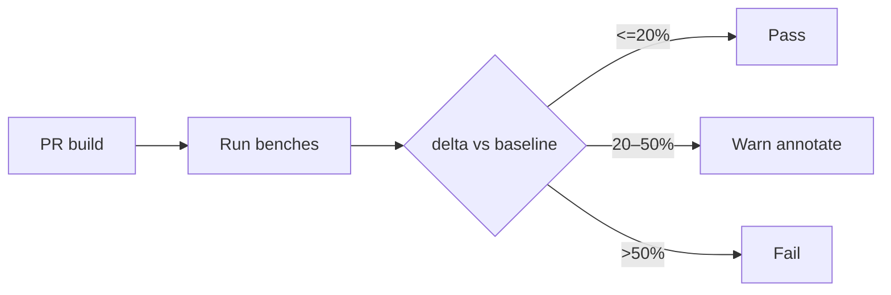

# PART 23 — PERFORMANCE BUDGET, BENCHMARKS, LOAD & STRESS

**Document ID:** SS-BP-023
**Classification:** Internal Engineering — Principal Review
**Version:** 1.0.0
**Last Updated:** 2026-07-12
**Owner:** Staff Performance Engineer
**Reviewers:** Principal Platform Architect, Principal Detection Engineer, Staff QA Engineer

---

## Executive Summary

Single source of truth for latency, memory, size, load, stress, and soak targets. Reference hardware: **Intel Core i5-1235U, 8GB RAM, Chrome Stable, Windows 11**. CI warns on &gt;20% regression vs baseline; fails on &gt;50%.

---

## 1. Purpose

Make performance regressions detectable and budgets enforceable across PART_10/12/13/16/17/18.

## 2. Responsibilities

- Master budget tables
- Benchmark harness design
- Load/stress/soak protocols
- CI integration thresholds
- Ownership of each budget line

## 3. Public Interfaces

```typescript
interface BenchResult {
  name: string;
  p50Ms: number;
  p99Ms: number;
  memMb?: number;
  samples: number;
}
```

Harness: `tools/bench/` run under Vitest + Playwright extension load.

## 4. Master Latency Budgets (P99)

| ID | Operation | Input | P99 |
|---|---|---|---|
| L01 | Regex all patterns | 1KB | 10ms |
| L02 | Regex | 10KB | 50ms |
| L03 | Regex | 100KB | 200ms |
| L04 | Entropy | 10KB | 5ms |
| L05 | NER WASM | 512 tokens | 150ms |
| L06 | OCR SIMD | 1080p | 3000ms |
| L07 | PDF text 10 pages | — | 1000ms |
| L08 | PDF scanned 10 pages | — | 15000ms |
| L09 | Full pipeline text | 10KB | 300ms |
| L10 | CV BlazeFace | 1080p | 50ms |
| L11 | ZXing | 1080p | 20ms |
| L12 | Risk+policy+decision | 100 detections | 10ms |
| L13 | SW cold start ready | — | 500ms |
| L14 | Overlay first paint | after result | 100ms |
| L15 | Popup DCL | — | 200ms |
| L16 | CS init | — | 50ms |

## 5. Memory Budgets

| ID | Scope | Idle | Peak |
|---|---|---|---|
| M01 | Extension total | &lt; 50MB | &lt; **256MB** (canonical `EXT_PEAK_MEM_MB`) |
| M02 | Content script / tab | &lt; 2MB | &lt; 10MB |
| M03 | Service Worker | &lt; 10MB | &lt; 30MB |
| M04 | OCR Worker | 0 | &lt; 120MB |
| M05 | NER Worker | 0 | &lt; 80MB |
| M06 | Soak growth 500 scans | — | &lt; 10MB heap growth |

## 6. Size Budgets

| ID | Artifact | Max |
|---|---|---|
| S01 | CRX compressed | 25MB |
| S02 | NER model | 15MB |
| S03 | OCR eng+core | 8MB |
| S04 | CV stack | 5MB |

## 7. Methodology

1. Warm browser; disable unrelated extensions
2. 30 warmups discarded; 100 measured samples (OCR: 20 samples)
3. Report p50/p99; store JSON artifact in CI
4. Baseline = median of last 10 green main runs
5. Compare PR vs baseline



## 8. Load Testing

| Scenario | Method | Pass |
|---|---|---|
| 3 concurrent scans | 3 tabs ChatGPT mock | Queue fairness; no deadlock |
| 20 tabs protected | Register CS; idle | Idle mem &lt; 50MB + 5MB×active |
| Sustained 60 scans/min | Synthetic IPC | Error rate &lt; 0.5% |

## 9. Stress Testing

| Scenario | Pass |
|---|---|
| 50MB PDF | Completes or PARTIAL within 30s; no SW crash |
| ZIP bomb over ratio | Reject &lt; 100ms decision |
| 100 pastes / 60s | Rate limit; no state corruption |
| 4000px image | Downscale; OCR within budget |
| Worker kill mid-OCR | Partial results; respawn |

## 10. Soak Testing

500 scans over 10 minutes mixing text/image fixtures. Heap snapshots every 50 scans. Growth &lt; 10MB after GC. No detached DOM in CS (navigate between).

## 11. Anti-Patterns

| Anti-pattern | Fix |
|---|---|
| WASM on SW thread | Offscreen Workers only |
| JSON clone large buffers | Transfer ArrayBuffer |
| Blob URLs for secrets | Memory only |
| Unbounded Base64 recurse | PART_12 budget |
| Logging full payloads | PART_26 allowlist |

## 12. Ownership

| Budget family | Owner |
|---|---|
| L01–L04, L12 | Detection eng |
| L05–L11, M04–M05 | Runtime/WASM eng |
| L13–L16, M02–M03 | Extension eng |
| S01–S04 | DevOps |
| M06 soak | QA + Performance |

## 13. Failure Modes

Harness flake → retry once; quarantine if &gt;2 flakes/week. Environment drift → pin Chrome version in CI container.

## 14. Testing Strategy

Benches in CI scheduled daily + on PR paths touching detection/runtime. Manual quarterly on reference laptop.

## 15. Production Checklist

- [ ] Baseline published
- [ ] CI thresholds active
- [ ] OCR simd path meets L06
- [ ] Soak green on release branch
- [ ] Bundle size gate green

## 16. Future Improvements

| Item | How |
|---|---|
| WebGPU NER bench lane | Separate job; non-blocking until stable |
| Continuous profiling | Optional chrome tracing upload of aggregates only |
| Mobile reference device | Add Snapdragon tier budgets in PART_30 when Edge Android ships |
