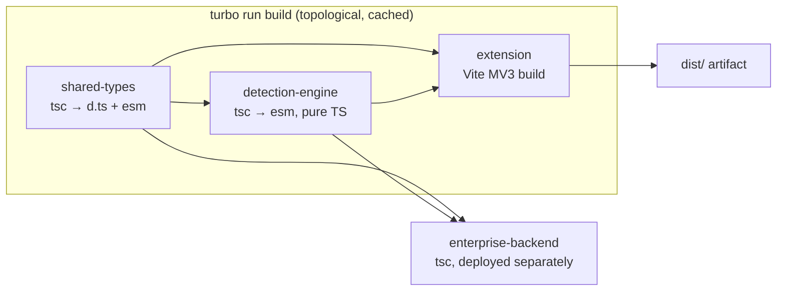
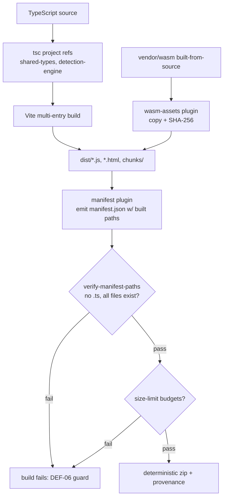
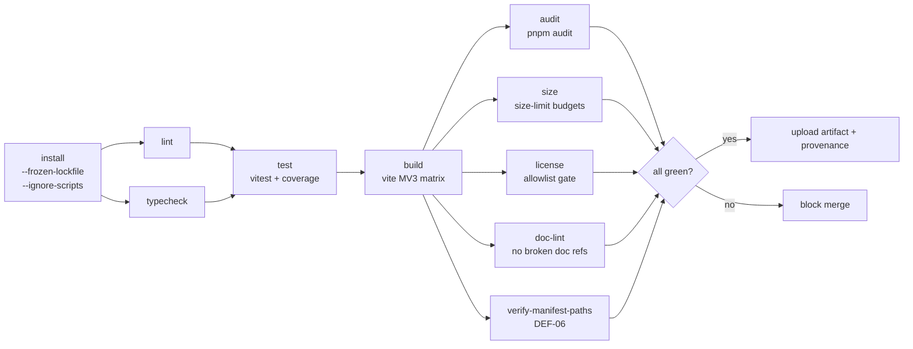
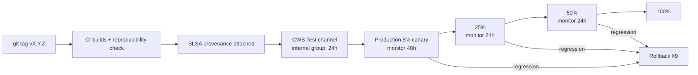
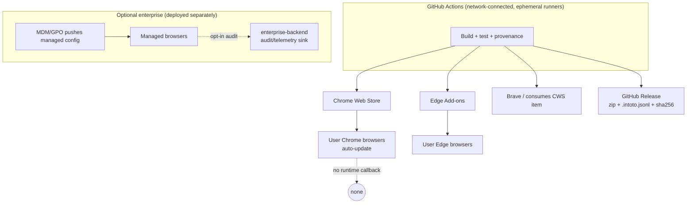
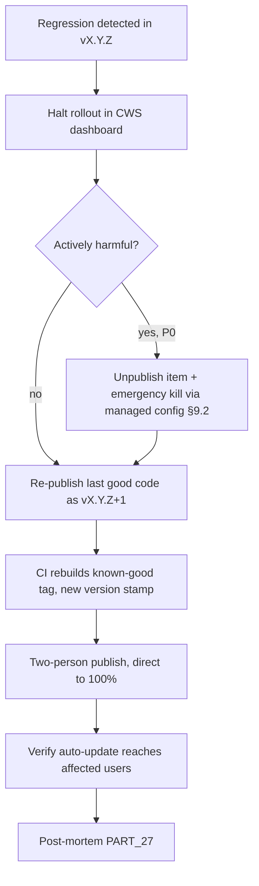

# PART 25 — CI/CD, BUILD, RELEASE ENGINEERING & VERSIONING

**Document ID:** SS-BP-025
**Classification:** Internal Engineering — Principal Review
**Version:** 1.0.0
**Last Updated:** 2026-07-12
**Owner:** Staff DevOps / Release Engineer, Principal Platform Architect
**Reviewers:** Principal Security Architect, Principal Chrome Extension Engineer, Technical Program Manager

---

## Executive Summary

This document is the authoritative build-and-release contract for Sentinel Shield AI. It defines how TypeScript source becomes a Chrome-Web-Store-approved `.zip`, how that artifact is proven reproducible, and how it reaches users through a staged, reversible rollout. Two audit defects are resolved here: **DEF-06** (the shipped `manifest.json` referenced TypeScript source instead of built `dist/*.js`) and the build half of the supply-chain hardening the security team demanded (DEF-04's logging half lives in PART_26). The pipeline is designed to pass review by Chrome Web Store, Microsoft (Edge Add-ons), Apple-grade release discipline, Palo Alto supply-chain scrutiny, and Cloudflare/OpenAI provenance expectations. Every network dependency is confined to CI; the shipped product remains local-first and fetches nothing at runtime. The governing rule is **the manifest never points at source** — it points at deterministic, size-budgeted, integrity-hashed build output.

---

## 1. Objectives

| ID | Objective |
|---|---|
| OBJ-001 | Define the Vite-based MV3 build with all entry points and WASM asset handling |
| OBJ-002 | Generate `manifest.json` referencing **built** `dist/*.js` paths (resolves DEF-06) |
| OBJ-003 | Guarantee deterministic, byte-reproducible builds from a pinned toolchain |
| OBJ-004 | Enforce dependency, license, and open-source policy as CI gates |
| OBJ-005 | Define the full CI pipeline (lint→typecheck→test→build→audit→size→license→doc-lint) |
| OBJ-006 | Define semver policy for the extension, rule packs, and models |
| OBJ-007 | Define the CWS staged-rollout release pipeline with two-person publish + FIDO2 |
| OBJ-008 | Define a data-forward-compatible rollback procedure |
| OBJ-009 | Emit SLSA-style provenance for every shipped artifact |

---

## 2. Build System

### 2.1 Monorepo Build Topology

The repository is a pnpm-workspace + Turborepo monorepo. Turborepo orders and caches package builds; Vite performs the extension bundling. Only `packages/extension` produces a shippable artifact.



`turbo.json` pins the task graph and cache keys:

```json
{
  "$schema": "https://turbo.build/schema.json",
  "globalDependencies": ["pnpm-lock.yaml", ".nvmrc", "tsconfig.base.json"],
  "tasks": {
    "build": {
      "dependsOn": ["^build"],
      "outputs": ["dist/**", "lib/**"],
      "env": ["SS_BUILD_MODE", "SS_TARGET_BROWSER"]
    },
    "typecheck": { "dependsOn": ["^build"], "outputs": [] },
    "test": { "dependsOn": ["^build"], "outputs": ["coverage/**"] },
    "lint": { "outputs": [] }
  }
}
```

### 2.2 Vite Configuration for Manifest V3

MV3 forbids a single bundle: the Service Worker, content scripts, offscreen document, workers, and each extension page are separate execution contexts with separate entry points. The build uses `vite` in library-less multi-entry mode with a custom MV3 plugin that also performs manifest generation (§2.4).

```typescript
// packages/extension/vite.config.ts
import { defineConfig } from 'vite';
import { resolve } from 'node:path';
import { mv3Manifest } from './build/mv3-manifest-plugin';
import { wasmAssets } from './build/wasm-assets-plugin';

const target = process.env.SS_TARGET_BROWSER ?? 'chrome'; // chrome | edge | brave

export default defineConfig({
  define: {
    __IS_DEV__: JSON.stringify(process.env.SS_BUILD_MODE === 'development'),
    __TARGET__: JSON.stringify(target),
    // SOURCE_DATE_EPOCH pins timestamps for reproducibility (see §3)
    __BUILD_EPOCH__: JSON.stringify(process.env.SOURCE_DATE_EPOCH ?? '1752278400'),
  },
  build: {
    target: 'es2022',
    minify: 'esbuild',
    sourcemap: 'hidden',        // maps built, uploaded to CWS, NOT shipped to users
    reportCompressedSize: true,
    modulePreload: false,       // MV3 SW has no document; disable preload injection
    rollupOptions: {
      input: {
        background:  resolve(__dirname, 'src/background/index.ts'),
        content:     resolve(__dirname, 'src/content/index.ts'),
        offscreen:   resolve(__dirname, 'src/offscreen/index.ts'),
        ocrWorker:   resolve(__dirname, 'src/workers/ocr.worker.ts'),
        nerWorker:   resolve(__dirname, 'src/workers/ner.worker.ts'),
        cvWorker:    resolve(__dirname, 'src/workers/cv.worker.ts'),
        popup:       resolve(__dirname, 'src/ui/popup/index.html'),
        settings:    resolve(__dirname, 'src/ui/settings/index.html'),
        dashboard:   resolve(__dirname, 'src/ui/dashboard/index.html'),
        onboarding:  resolve(__dirname, 'src/ui/onboarding/index.html'),
      },
      output: {
        // DEF-06: stable, source-independent filenames the manifest can reference.
        entryFileNames: '[name].js',
        chunkFileNames: 'chunks/[name]-[hash].js',
        assetFileNames: 'assets/[name]-[hash][extname]',
        // No cross-context code sharing: each entry is self-contained to avoid
        // dynamic import() in the SW (MV3 restricts importScripts semantics).
        manualChunks: undefined,
      },
    },
  },
  worker: { format: 'es', plugins: () => [] },
  plugins: [wasmAssets(), mv3Manifest({ target })],
});
```

### 2.3 Entry Point → Output → Manifest Mapping (resolves DEF-06)

This table is the single source of truth for the build→manifest path mapping. **The manifest references only the right-hand column.**

| Context | Source (never shipped, never in manifest) | Built output (referenced by manifest) | Manifest field |
|---|---|---|---|
| Service Worker | `src/background/index.ts` | `dist/background.js` | `background.service_worker` |
| Content Script | `src/content/index.ts` | `dist/content.js` | `content_scripts[].js` |
| Offscreen Doc | `src/offscreen/index.ts` + `index.html` | `dist/offscreen.html` → `dist/offscreen.js` | loaded via `chrome.offscreen` |
| OCR Worker | `src/workers/ocr.worker.ts` | `dist/ocrWorker.js` | `web_accessible_resources` |
| NER Worker | `src/workers/ner.worker.ts` | `dist/nerWorker.js` | `web_accessible_resources` |
| CV Worker | `src/workers/cv.worker.ts` | `dist/cvWorker.js` | `web_accessible_resources` |
| Popup | `src/ui/popup/index.html` | `dist/popup.html` → `dist/popup.js` | `action.default_popup` |
| Settings | `src/ui/settings/index.html` | `dist/settings.html` | `options_ui.page` |
| Dashboard | `src/ui/dashboard/index.html` | `dist/dashboard.html` | opened via `chrome.tabs` |
| Onboarding | `src/ui/onboarding/index.html` | `dist/onboarding.html` | opened on `onInstalled` |
| WASM | `vendor/wasm/*.wasm` (built from source, §5.4) | `dist/wasm/*.wasm` | `web_accessible_resources` |

A CI assertion (`verify-manifest-paths`) fails the build if any manifest value points at a `.ts`/`.tsx` path or at a file absent from `dist/`.

### 2.4 Manifest Generation with Built Paths

`manifest.json` is **generated**, never hand-edited, so drift between source layout and shipped paths is impossible. The plugin reads a typed base config, injects the per-browser deltas, stamps the version, and emits the file into `dist/` after Rollup resolves the real output names.

```typescript
// packages/extension/build/mv3-manifest-plugin.ts
import type { Plugin } from 'vite';
import pkg from '../package.json' assert { type: 'json' };

const BASE = {
  manifest_version: 3,
  name: 'Sentinel Shield AI',
  default_locale: 'en',                        // resolves DEF-07 (owned by PART_22)
  minimum_chrome_version: '116',               // offscreen API GA
  background: { service_worker: 'background.js', type: 'module' },
  action: { default_popup: 'popup.html' },
  options_ui: { page: 'settings.html', open_in_tab: true },
  permissions: ['storage', 'activeTab', 'scripting', 'offscreen', 'alarms'],
  host_permissions: [],                        // requested dynamically (PART_15)
  content_security_policy: {
    extension_pages: "script-src 'self' 'wasm-unsafe-eval'; object-src 'self'",
  },
  web_accessible_resources: [{
    resources: ['ocrWorker.js', 'nerWorker.js', 'cvWorker.js', 'wasm/*', 'models/*'],
    matches: ['<all_urls>'],
    use_dynamic_url: true,                      // rotates URL token, blocks fingerprinting
  }],
} as const;

const BROWSER_DELTA: Record<string, object> = {
  chrome: {},
  edge: { minimum_chrome_version: '116' },
  brave: {},                                    // Brave consumes the Chrome build unchanged
};

export function mv3Manifest({ target }: { target: string }): Plugin {
  return {
    name: 'ss-mv3-manifest',
    apply: 'build',
    generateBundle(_opts, bundle) {
      // Assert every referenced entry actually emitted (DEF-06 guard).
      const required = ['background.js', 'content.js', 'popup.html', 'settings.html'];
      for (const f of required) {
        if (!bundle[f]) this.error(`manifest references missing build output: ${f}`);
      }
      const manifest = {
        ...BASE, ...BROWSER_DELTA[target],
        version: pkg.version,                    // semver, numeric-only for CWS
        version_name: `${pkg.version}+${process.env.SS_GIT_SHA?.slice(0, 7) ?? 'local'}`,
        content_scripts: [{
          matches: [],                           // registered dynamically at runtime
          js: ['content.js'], run_at: 'document_start', world: 'ISOLATED',
        }],
      };
      this.emitFile({ type: 'asset', fileName: 'manifest.json',
        source: JSON.stringify(manifest, null, 2) });
    },
  };
}
```

### 2.5 WASM Asset Handling

WASM binaries (Tesseract OCR core, ONNX Runtime, ZXing) are treated as first-class, integrity-hashed assets. They are copied verbatim into `dist/wasm/`, never bundled or transformed, and their SHA-256 hashes are emitted into a generated `wasm-manifest.json` consumed by the runtime integrity check (PART_14 §2.4).

```typescript
// packages/extension/build/wasm-assets-plugin.ts (excerpt)
import { createHash } from 'node:crypto';
export function wasmAssets(): Plugin {
  const hashes: Record<string, string> = {};
  return {
    name: 'ss-wasm-assets', apply: 'build',
    async generateBundle() {
      for (const file of await listVendorWasm()) {           // vendor/wasm/*.wasm
        const bytes = await readWasm(file);
        hashes[`wasm/${file.name}`] =
          createHash('sha256').update(bytes).digest('hex');
        this.emitFile({ type: 'asset', fileName: `wasm/${file.name}`, source: bytes });
      }
      this.emitFile({ type: 'asset', fileName: 'wasm-manifest.json',
        source: JSON.stringify(hashes, null, 2) });
    },
  };
}
```

### 2.6 Bundle-Size Budgets per Entry

Budgets are enforced by `size-limit` in CI (§7). Sizes are Brotli-compressed bytes; exceeding a budget fails the build.

| Entry (built) | Budget (Brotli) | Rationale |
|---|---|---|
| `background.js` | 300 KB | SW cold-parse < 40 ms on reference i5-1235U (PART_11 §11) |
| `content.js` | 120 KB | Injected at `document_start` into every protected tab |
| `offscreen.js` | 150 KB | Host shell only; WASM/models loaded lazily |
| `ocrWorker.js` | 80 KB | Glue only; Tesseract WASM is a separate asset |
| `nerWorker.js` | 80 KB | Glue only; ONNX WASM + model are separate assets |
| `cvWorker.js` | 80 KB | Glue only |
| `popup.js` | 180 KB | First paint < 200 ms |
| `settings.js` | 220 KB | Not on hot path |
| `dashboard.js` | 260 KB | Not on hot path |
| `onboarding.js` | 200 KB | First-run only |
| **Total JS** | **1.6 MB** | Full extension JS ceiling |

WASM/model assets are budgeted separately: OCR core ≤ 5 MB, ONNX runtime ≤ 9 MB, NER model (quantized INT8) ≤ 65 MB, ZXing ≤ 1 MB, giving a packed `.zip` ceiling of **90 MB** (CWS hard limit is generous; we self-impose 90 MB to protect install time).

### 2.7 Build Pipeline Diagram



---

## 3. Deterministic & Reproducible Builds

Two builds from the same commit must produce byte-identical artifacts. This is a Palo Alto / SLSA requirement and the foundation of provenance verification.

| Non-determinism source | Control |
|---|---|
| Toolchain versions | Node pinned in `.nvmrc` (`20.14.0`); pnpm pinned via `packageManager` field (`pnpm@9.6.0`); esbuild/vite exact-pinned |
| Timestamps | `SOURCE_DATE_EPOCH` exported in CI; zip mtimes normalized to it |
| File ordering | Zip entries sorted lexicographically; `find | sort` before packing |
| Hash salts | Rollup `[hash]` uses content hash only (no build-time salt) |
| Locale / TZ | CI sets `LC_ALL=C`, `TZ=UTC` |
| Absolute paths in sourcemaps | `sourcemap: 'hidden'` + `rollupOptions.output.sourcemapPathTransform` to repo-relative |

```yaml
# Deterministic packaging step
- name: Pack deterministic artifact
  run: |
    export SOURCE_DATE_EPOCH=$(git log -1 --pretty=%ct)
    cd packages/extension/dist
    find . -type f | LC_ALL=C sort > ../.filelist
    TZ=UTC zip -X -9 --names-stdin ../sentinel-shield.zip < ../.filelist
    sha256sum ../sentinel-shield.zip | tee ../artifact.sha256
```

A scheduled `reproducibility` CI job rebuilds the tagged commit on a clean runner and asserts the SHA-256 matches the release artifact. A mismatch blocks publication.

---

## 4. Dependency Management & Policy

| Policy | Rule | Enforcement |
|---|---|---|
| Exact pinning | No `^`/`~` in any `package.json` | `verify-exact-pins` script + ESLint config |
| Lockfile integrity | `pnpm-lock.yaml` committed; CI uses `--frozen-lockfile` | CI install step |
| No install scripts | `.npmrc`: `ignore-scripts=true` | CI + local |
| Direct-dep ceiling | < 20 direct runtime deps across the extension package | `verify-dep-count` gate |
| New dependency | Requires an ADR (PART_08) + security review (handbook §8) | PR template checkbox + CODEOWNERS |
| Transitive audit | `pnpm audit`: zero critical/high | CI audit gate |
| Provenance | Prefer packages publishing npm provenance attestations | Reviewer checklist |

```ini
# .npmrc
ignore-scripts=true
frozen-lockfile=true
save-exact=true
auto-install-peers=false
```

New-dependency ADR gate (excerpt of the required ADR fields): problem the dep solves, alternatives (including "write it ourselves"), bundle-size delta, license, transitive count, maintenance signal (last release, open CVEs), and the removal plan. A dependency without an approved ADR fails `verify-dep-count` if it pushes the count over budget and fails review regardless.

---

## 5. Open-Source & License Compliance

### 5.1 Allowed License List

| Category | Licenses | Status |
|---|---|---|
| Permissive | MIT, ISC, BSD-2-Clause, BSD-3-Clause, Apache-2.0, 0BSD, Unlicense | **Allowed** |
| Weak copyleft | MPL-2.0, LGPL-3.0 (dynamically linked only) | **Allowed with review** |
| Strong copyleft | GPL-2.0, GPL-3.0, AGPL-3.0 | **Forbidden** (would force source release of the extension) |
| Ambiguous / none | `UNLICENSED`, missing `license` field, custom text | **Forbidden** until legally cleared |

### 5.2 License-Checker Gate

```yaml
- name: License compliance gate
  run: |
    pnpm dlx license-checker-rseidelsohn \
      --production --onlyAllow \
      "MIT;ISC;BSD-2-Clause;BSD-3-Clause;Apache-2.0;0BSD;Unlicense;MPL-2.0" \
      --excludePackages "sentinel-shield@$(node -p "require('./package.json').version")" \
      --failOn "GPL-2.0;GPL-3.0;AGPL-3.0"
```

### 5.3 NOTICE File

A generated `NOTICE` file ships in the repository (not in the extension `.zip`, which contains no third-party source text beyond bundled minified code with retained license banners). It is regenerated in CI and committed; a diff means an unaccounted dependency changed.

```yaml
- name: Regenerate NOTICE
  run: pnpm dlx license-checker-rseidelsohn --production --plainVertical > NOTICE
- name: Fail if NOTICE drifted
  run: git diff --exit-code NOTICE
```

### 5.4 WASM Built-From-Source Provenance

Binary WASM is never vendored from an npm tarball. Each WASM artifact is compiled in CI from a pinned upstream Git commit, and the resulting hash is recorded. This defeats a compromised-binary supply-chain attack (a prebuilt `.wasm` could contain exfiltration logic invisible to `npm audit`).

| WASM | Upstream | Pin | Build toolchain |
|---|---|---|---|
| Tesseract core | `tesseract-ocr/tesseract` | commit `5.3.4` tag SHA | Emscripten `3.1.61` (pinned) |
| ONNX Runtime | `microsoft/onnxruntime` | `v1.18.0` tag SHA | Emscripten `3.1.61` |
| ZXing | `zxing-cpp/zxing-cpp` | `v2.2.1` tag SHA | Emscripten `3.1.61` |

```yaml
# .github/workflows/wasm-provenance.yml (excerpt)
- run: git -C tesseract checkout ${{ env.TESSERACT_SHA }}
- run: emcmake cmake -B build -DCMAKE_BUILD_TYPE=Release && cmake --build build
- run: sha256sum build/tesseract-core.wasm | tee provenance/tesseract.sha256
- name: Assert matches committed pin
  run: diff provenance/tesseract.sha256 vendor/wasm/tesseract-core.sha256
```

---

## 6. CI Pipeline

### 6.1 Stage Graph



### 6.2 Browser Matrix

```yaml
# .github/workflows/ci.yml (excerpt)
strategy:
  fail-fast: false
  matrix:
    browser: [chrome, edge, brave]
    include:
      - browser: chrome
        e2e_channel: chrome-stable
      - browser: edge
        e2e_channel: msedge-stable
      - browser: brave
        e2e_channel: chrome-stable   # Brave consumes the Chrome artifact
env:
  SS_TARGET_BROWSER: ${{ matrix.browser }}
  LC_ALL: C
  TZ: UTC
```

### 6.3 Doc-Lint (fails on references to non-existent docs)

The audit's sign-off gate (REPOSITORY_AUDIT_REPORT §6) requires that **no document references a non-existent document**. This CI check enforces it.

```typescript
// scripts/doc-lint.ts — run in CI, exits non-zero on any dangling reference
import { readFileSync, readdirSync } from 'node:fs';
const files = readdirSync('blueprint').filter(f => f.endsWith('.md'));
const known = new Set(files.map(f => f.toUpperCase()));
const partRef = /PART_(\d{2})[A-Z0-9_]*\.md/gi;
let broken = 0;
for (const f of files) {
  const text = readFileSync(`blueprint/${f}`, 'utf8');
  for (const m of text.matchAll(partRef)) {
    // Accept a reference if any file with that PART number exists.
    const num = m[1];
    if (![...known].some(k => k.startsWith(`PART_${num}`))) {
      console.error(`${f}: dangling doc reference ${m[0]}`); broken++;
    }
  }
}
process.exit(broken === 0 ? 0 : 1);
```

The check also validates that every `DEF-0N` marked RESOLVED links to an owner document that exists, and that inline `§`-anchored cross-references resolve to a heading in the target file.

### 6.4 CI Gate Summary

| Stage | Tool | Fail Condition | Blocks Merge |
|---|---|---|---|
| lint | ESLint + Prettier | any error | Yes |
| typecheck | `tsc --noEmit` (strict) | any type error | Yes |
| test | Vitest + Playwright | any failure; coverage < 90% unit / 80% integration | Yes |
| build | Vite (browser matrix) | any build error | Yes |
| audit | `pnpm audit` | any critical/high | Yes |
| size | `size-limit` | any entry over budget (§2.6) | Yes |
| license | `license-checker` | any forbidden/unknown license | Yes |
| doc-lint | `scripts/doc-lint.ts` | any dangling doc reference | Yes |
| manifest | `verify-manifest-paths` | manifest points at `.ts` or missing file (DEF-06) | Yes |
| reproducibility | scheduled rebuild | SHA-256 mismatch | Yes (release only) |

---

## 7. Versioning

### 7.1 Semver Policy — Extension

| Change | Bump | Example |
|---|---|---|
| Breaking storage schema, removed feature, permission added | MAJOR | `1.4.2 → 2.0.0` |
| New feature, new detector family, backward-compatible | MINOR | `1.4.2 → 1.5.0` |
| Bug/security fix, rule tuning, no interface change | PATCH | `1.4.2 → 1.4.3` |

CWS requires a numeric-only `version` (max four dot-separated integers, each < 2^16). The human-readable build id lives in `version_name` (`1.5.0+ab12cd3`). Every version is strictly greater than the last published — a hard constraint that shapes rollback (§9).

### 7.2 Independent Versioning of Rule Packs & Models

Rule packs and models version independently of the extension because they update on different cadences, but they ship **inside** the extension `.zip` (local-first: no runtime fetch).

| Asset | Version scheme | Location | Compatibility contract |
|---|---|---|---|
| Extension | semver | `manifest.version` | — |
| Rule pack | `rules-YYYY.MM.PATCH` | `dist/rules/manifest.json` | Declares `minEngine` semver range it needs |
| Signature set | `sig-YYYY.MM.PATCH` | `dist/signatures/manifest.json` | Declares `minEngine` |
| NER/CV model | `model-<name>-vMAJOR.MINOR` | `dist/models/manifest.json` | Declares input/output schema hash |

The detection engine refuses to load a rule pack whose `minEngine` exceeds the running engine (fail-safe), preventing a mismatched local asset from crashing detection.

### 7.3 CHANGELOG

`CHANGELOG.md` follows Keep-a-Changelog with sections Added/Changed/Fixed/Security/Deprecated/Removed. A CI check fails the PR if `package.json` version changed without a matching `## [x.y.z] - YYYY-MM-DD` heading. Security entries cross-link the advisory id (PART_27 §CVD).

---

## 8. Release Pipeline

### 8.1 Channels & Staged Rollout

Distribution is **Chrome Web Store only** — there is no self-hosted `update_url`. Edge Add-ons and Brave consume equivalent artifacts through their own store submissions. Staged rollout uses the CWS "partial publish" percentage control.



| Stage | Audience | Soak | Promotion gate |
|---|---|---|---|
| Test channel | Internal testers (CWS trusted group) | 24 h | Manual smoke sign-off on Chrome/Edge/Brave |
| Canary 5% | 5% of users | 48 h | Crash-free sessions ≥ 99.5%; no P0/P1 reports |
| 25% | 25% | 24 h | Metrics steady vs. canary baseline |
| 50% | 50% | 24 h | Metrics steady |
| 100% | All users | — | Release marked stable in CHANGELOG |

Because the product ships zero-telemetry-by-default (PART_26), "monitoring" during rollout relies on: CWS dashboard crash/uninstall metrics, opt-in aggregate telemetry (where enabled), enterprise SIEM signals (where deployed), and the public support/CVD intake (PART_27).

### 8.2 Two-Person Publish + FIDO2

| Control | Requirement |
|---|---|
| Publisher accounts | CWS/Edge/Brave developer accounts secured with **FIDO2 hardware keys** (no TOTP fallback) |
| Two-person rule | Release requires a Releaser (uploads + configures rollout) and an Approver (verifies artifact SHA-256 == provenance, clicks publish). Distinct humans. |
| Artifact verification | Approver independently recomputes the `.zip` SHA-256 and matches it to the CI `artifact.sha256` and the provenance subject |
| Audit trail | Every publish recorded in the release log with tag, SHA-256, both operators, rollout % |

### 8.3 Artifact Signing & SLSA-Style Provenance

Every release artifact carries an in-toto/SLSA-style provenance attestation generated by CI and signed via keyless OIDC (Sigstore/`cosign`). This lets any reviewer verify *what source, which builder, and which toolchain* produced the exact `.zip`.

```json
// provenance/sentinel-shield.intoto.jsonl (predicate excerpt, SLSA v1.0)
{
  "predicateType": "https://slsa.dev/provenance/v1",
  "subject": [{ "name": "sentinel-shield.zip",
    "digest": { "sha256": "…" } }],
  "predicate": {
    "buildDefinition": {
      "buildType": "https://sentinelshield.dev/build/vite-mv3@v1",
      "externalParameters": { "gitRef": "refs/tags/v1.5.0",
        "gitSha": "ab12cd3…", "targetBrowser": "chrome" },
      "internalParameters": { "node": "20.14.0", "pnpm": "9.6.0",
        "emscripten": "3.1.61", "sourceDateEpoch": "1752278400" }
    },
    "runDetails": { "builder": {
      "id": "https://github.com/sentinel-shield/actions/.github/workflows/release.yml@refs/tags/v1.5.0" } }
  }
}
```

```yaml
# release.yml provenance + signing (excerpt)
permissions: { id-token: write, contents: read, attestations: write }
- uses: actions/attest-build-provenance@v1
  with: { subject-path: 'packages/extension/sentinel-shield.zip' }
```

CWS does not itself consume SLSA attestations, so the provenance is published alongside the GitHub release and referenced from `SECURITY.md`; it is the primary evidence in a supply-chain incident (PART_27 playbook).

### 8.4 Deployment Diagram



The shipped extension makes **no network call to our infrastructure** at runtime. Updates arrive only through the browser's own CWS auto-update mechanism. The enterprise backend, when deployed, is reached only by managed installs that opt in.

---

## 9. Rollback

Because CWS forbids re-using or lowering a version number, "rollback" means **publishing the previous known-good code under a new, higher version**.



| Step | Action | Owner |
|---|---|---|
| 1 | Halt the staged rollout percentage in the CWS dashboard | Releaser |
| 2 | Decide severity (PART_27 P0–P3) | Incident Commander |
| 3 | Rebuild the last known-good commit; bump only the patch version | Releaser |
| 4 | Two-person publish direct to 100% (skips canary for P0/P1 per PART_14 §4.2) | Releaser + Approver |
| 5 | Confirm affected users auto-updated forward | Releaser |

### 9.1 Data Forward-Compatibility

Rollback must never corrupt user data. This is guaranteed by the forward-compat write discipline in PART_11 §16.3: writers never overwrite whole namespaces, unknown fields are preserved on read-modify-write, and the schema stamp is only ever advanced. An older (rolled-back) build therefore reads a strict subset of newer state without loss and without crashing. Migrations are additive and idempotent; a downgrade never runs a "down" migration.

### 9.2 Emergency Feature Kill

For enterprise/managed installs, a feature can be disabled without any store action by pushing a managed-config flag (`chrome.storage.managed`, read-only to the extension). This is the fastest containment lever and does not require a rebuild. For consumer installs, the equivalent lever is halting rollout + re-publishing; there is no server-side kill switch because there is no server dependency by design.

---

## 10. Production Checklist

- [ ] `manifest.json` is generated and references only `dist/*.js` / `dist/*.html` (DEF-06 guard green in CI)
- [ ] All ten entry points build and stay within size budgets (§2.6)
- [ ] WASM assets built from pinned source; hashes match `wasm-manifest.json` and `vendor/wasm/*.sha256`
- [ ] Reproducibility job: independent rebuild SHA-256 matches release artifact
- [ ] `.npmrc` enforces `ignore-scripts` and exact pinning; `--frozen-lockfile` in CI
- [ ] < 20 direct runtime dependencies; every addition ADR-approved
- [ ] License gate green; `NOTICE` regenerated and un-drifted
- [ ] CI green across Chrome/Edge/Brave matrix (lint→typecheck→test→build→audit→size→license→doc-lint)
- [ ] Doc-lint reports zero dangling document references
- [ ] CHANGELOG updated with version + date; security entries cross-linked
- [ ] Rule-pack / signature / model versions stamped with `minEngine` compatibility
- [ ] CWS/Edge/Brave accounts secured with FIDO2; two-person publish rehearsed
- [ ] SLSA provenance generated, signed, and published with the GitHub release
- [ ] Staged-rollout plan (5→25→50→100) configured with soak gates
- [ ] Rollback rehearsed (re-publish higher version); forward-compat verified
- [ ] Emergency managed-config kill flag verified on a managed test profile

---

## 11. Future Improvements

| Improvement | Impact |
|---|---|
| SLSA Build Level 3 (hermetic, isolated builder) | Stronger tamper-resistance evidence for enterprise procurement |
| Hardware-attested reproducibility (multiple independent rebuilders) | Detects a compromised CI runner producing a divergent artifact |
| Automated canary health scoring from opt-in aggregate metrics | Faster, evidence-based rollout promotion/halt decisions |
| Rule-pack over-the-air update channel (still local-verified, opt-in) | Faster detection updates without a full extension release |
| Binary transparency log for published `.zip` digests | Public, append-only proof of every version ever shipped |
| Edge/Brave submission automation via their partner APIs | Reduces manual multi-store publish toil and human error |

---

**Resolved Defects:** DEF-06 (manifest references built `dist/*.js`, generated by the MV3 manifest plugin with a CI path-verification guard). Contributes to the supply-chain half of the security hardening (DEF-04 logging half resolved in PART_26).
**Cross-references:** PART_10 §4 (manifest fields), PART_11 §16.3 (forward-compat write rule, rollback), PART_14 §2.4–2.5 (WASM integrity, supply chain), PART_16 (WASM runtime, COOP/COEP), PART_22 (`default_locale`, i18n — DEF-07), PART_26 (telemetry-based rollout monitoring), PART_27 (release incidents, rollback runbook).
