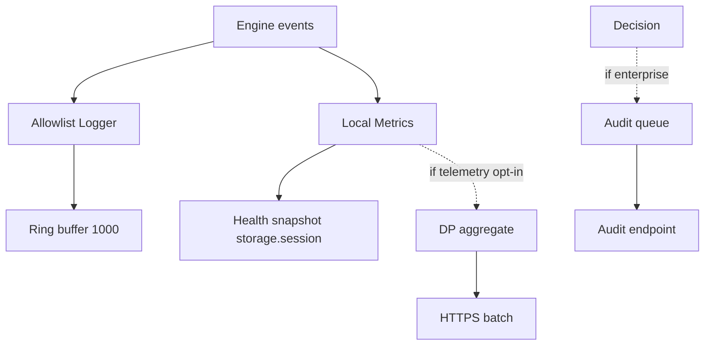

# PART 26 — OBSERVABILITY & TELEMETRY

**Document ID:** SS-BP-026
**Classification:** Internal Engineering — Principal Review
**Version:** 1.0.0
**Last Updated:** 2026-07-12
**Owner:** Staff DevOps Engineer, Principal Privacy Engineer
**Reviewers:** Principal Security Architect, Staff QA Engineer

---

## Executive Summary

Local-first observability with **allowlist structured logging** (resolves **DEF-04**), optional opt-in telemetry with differential privacy, and enterprise audit as a separate admin channel. Detection remains network-free.

---

## Resolved Defects

| ID | Resolution |
|---|---|
| **DEF-04** | **Deny-list PII sanitizer rejected for production logs.** Production logger accepts only enumerated typed fields (`LogEvent`). Free-text `message` strings that could embed user content are **compile-time forbidden** in `packages/extension` production builds via ESLint `no-restricted-syntax` + custom rule `sentinel/no-freeform-log`. Dev builds may use console with sanitizer as defense-in-depth only. |

---

## 1. Purpose

Diagnose failures and measure health without creating a side-channel that leaks PII.

## 2. Responsibilities

- Allowlist logger + ring buffer
- Local metrics histograms/counters
- Health aggregation for badge/popup
- Opt-in telemetry pipeline
- Enterprise audit shipping (schema in PART_07/18)

## 3. Public Interfaces

```typescript
type LogEvent =
  | { code: 'SCAN_START'; scanId: string; inputKind: string; tabId: number }
  | { code: 'SCAN_DONE'; scanId: string; riskLevel: string; tiers: string[]; ms: number }
  | { code: 'SCAN_PARTIAL'; scanId: string; reason: string; ms: number }
  | { code: 'WORKER_CRASH'; worker: string; consecutive: number }
  | { code: 'INTEGRITY_FAIL'; asset: string }
  | { code: 'RATE_LIMIT'; tabId: number }
  | { code: 'POLICY_BLOCK'; platformId: string }
  | { code: 'TELEMETRY_SEND_OK'; batchSize: number }
  | { code: 'TELEMETRY_SEND_FAIL'; httpStatus: number };

interface Logger {
  emit(event: LogEvent): void;
}

interface Metrics {
  timing(name: string, ms: number): void;
  count(name: string, delta?: number): void;
}
```

**Never logged:** raw text, file names that contain PII, detection rawValue, URLs with query secrets, stack frames that include input snippets.

## 4. Data Flow



## 5. Local Metrics (Always On, Local Only)

| Metric | Type | Labels (low cardinality) |
|---|---|---|
| scan_latency_ms | hist | inputKind |
| tier_latency_ms | hist | tier |
| detections_count | counter | entityCategory (not value) |
| worker_error | counter | worker |
| rate_limit_hits | counter | — |

Stored in `chrome.storage.local` encrypted aggregates; purged 7 days.

## 6. Telemetry (OFF by Default)

### Consent

Settings toggle + clear disclosure. Managed `telemetryForceOff` wins.

### Collected

- Extension version, browser major version
- Counts: scans, detections by **category**, errors by code
- Latency histograms (coarse bins)
- Install salt (rotating, non-advertising)

### Never Collected

Raw content, PII values, full host URLs, keystrokes, precise geo, other extension IDs.

### Differential Privacy

Count queries: Laplace noise with **ε = 1.0** per daily cohort batch. Batch ≥ 50 events or 24h before send. Kill switch: managed policy or remote config **not** used — kill via CWS update or managed force-off only (no silent remote kill server required for v1).

### Transport

TLS 1.3; certificate validation; exponential backoff; fail silent to UX.

## 7. Enterprise Audit

See PART_07 §8.2. Observability owns the queue, retry (max 3), and drop metrics (`audit_drop` counter).

## 8. Health Monitoring

Popup reads:

```typescript
interface HealthSnapshot {
  ner: 'READY' | 'DEGRADED' | 'ERROR';
  ocr: 'READY' | 'DEGRADED' | 'ERROR';
  lastErrorCode?: string;
  degradedReasons: string[];
}
```

## 9. Memory / Latency Budgets

| Op | Budget |
|---|---|
| emit() | &lt; 0.2ms |
| Ring buffer | &lt; 2MB |
| Telemetry batch build | &lt; 20ms |

## 10. Failure Modes

| Failure | Recovery |
|---|---|
| Ring overflow | Drop oldest |
| Telemetry 5xx | Backoff; keep local |
| Accidental free-text log in PR | CI lint fail |

## 11. Security / Privacy

Allowlist eliminates DEF-04 class leaks. Telemetry endpoint on CSP connect-src only when enabled.

## 12. Testing Strategy

- Unit: logger rejects unknown codes (typed)
- ESLint rule tests
- Integration: fresh install zero network
- Telemetry fixture: payload schema snapshot without PII fields

## 13. Production Checklist

- [ ] ESLint allowlist rule enforced on main
- [ ] Telemetry default off verified
- [ ] Privacy policy matches collected fields
- [ ] Audit schema forbids raw values (test)
- [ ] Health UI shows degraded OCR/NER

## 14. Future Improvements

| Item | How |
|---|---|
| OpenTelemetry export for enterprise | Optional OTLP over TLS with same allowlist attributes only |
| Crash reports | Collect stack **without** message args; user prompt each time |
| ε budgeting dashboard | Track privacy spend per day server-side |
