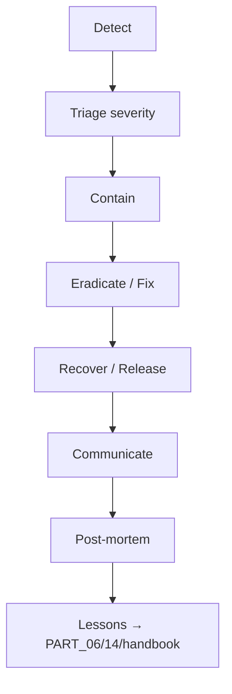

# PART 27 — INCIDENT RESPONSE, RUNBOOKS & POST-MORTEMS

**Document ID:** SS-BP-027
**Classification:** Internal Engineering — Principal Review
**Version:** 1.0.0
**Last Updated:** 2026-07-12
**Owner:** Principal Security Architect, Technical Program Manager
**Reviewers:** Engineering Director, Staff DevOps Engineer

---

## Executive Summary

Operational security and production response for Sentinel Shield AI: severity model, IR lifecycle, security playbooks, production runbooks, rollback, post-mortem template, CVD/SECURITY.md expectations, and seeded risk register.

---

## 1. Severity Model

| Sev | Definition | Acknowledge | Mitigate |
|---|---|---|---|
| P0 | Active user data exposure, malicious CWS update, supply-chain RCE | 15 min | 1 hour |
| P1 | Exploitable vuln without known active exploit; encryption bypass | 1 hour | 4 hours |
| P2 | Security weakness / major accuracy regression | 8 hours | 24 hours |
| P3 | Minor hardening / docs | 2 business days | Next sprint |

---

## 2. IR Lifecycle



### Containment Options

| Situation | Action |
|---|---|
| Malicious extension version | Unpublish; submit previous known-good; notify users |
| npm compromise | Pin revert; `ignore-scripts`; rebuild WASM from source |
| Key material leak | Force passphrase reset guidance; wipe instructions |
| False-negative leak report | Hotfix patterns; accelerated CWS review request |

---

## 3. Security Playbooks

### 3.1 Supply-Chain Compromise

1. Freeze main; revoke tokens
2. Identify blast radius (versions)
3. Rebuild from clean lockfile + audited commits
4. Rotate any publishing credentials
5. Emergency CWS release
6. Advisory in SECURITY.md

### 3.2 CWS Account Compromise

1. Contact Google CWS support immediately
2. Force logout; rotate with FIDO2 only
3. Review publish history; yank bad versions
4. Two-person rule post-incident mandatory

### 3.3 Vulnerability Disclosure Intake

1. Acknowledge reporter ≤ 3 business days
2. Reproduce privately
3. Severity + fix branch
4. Coordinate disclosure date
5. Credit reporter if desired

### 3.4 Suspected PII in Logs/Telemetry

1. Disable telemetry via managed force-off + emergency settings default in next build
2. Scrub vendor retention
3. Root-cause via DEF-04 allowlist audit
4. Notify if breach thresholds met (legal)

---

## 4. Production Runbooks

### 4.1 Crash / Worker OOM Spike

- Check health metrics (PART_26)
- Correlate with file-size distributions
- Tighten PART_12 ceilings if needed
- Canary pause if crash rate &gt; 1%

### 4.2 Detection Accuracy Regression

- Diff rule pack / model versions
- Run PART_24 corpus on release artifact
- Rollback model/pack via PART_21 + CWS previous version

### 4.3 Storage Corruption Reports

- Instruct Clear All / Reset
- If widespread: ship migration repair in SW `onInstalled`

### 4.4 CWS Review Rejection

- Map reject reason → PART_15 permissions justification
- Update listing privacy practices (PART_07)
- Resubmit with single-owner response doc

### 4.5 Emergency Feature Kill

- Prefer CWS update flipping feature flag default off
- Enterprise: managed policy `requiredDetectors` / `telemetryForceOff`
- No silent remote code kill-server in v1

---

## 5. Rollback Procedure

1. Identify last known-good version tag
2. Rebuild identical artifact from tag (reproducible build PART_25)
3. Two-person publish to CWS
4. Staged rollout 100% if P0
5. Confirm crash/error rates
6. Data forward-compat: never ship decrypt-breaking format without migration (PART_11/19)

---

## 6. Post-Mortem Template

```markdown
# Post-Mortem: YYYY-MM-DD Title
## Summary
## Impact (users, versions, duration)
## Timeline (UTC)
## Root Cause (5 Whys)
## What Went Well
## What Went Poorly
## Action Items (owner, due date, linked ticket)
## Detection Gaps
## Prevention (tests, monitors, docs to update)
```

Blameless. Due within 5 business days of P0/P1 resolve.

---

## 7. On-Call & Escalation

| Level | Who |
|---|---|
| L1 | Weekly on-call engineer |
| L2 | Security lead |
| L3 | Engineering Director + Legal if breach |

Pager: P0/P1 only. Handoff checklist in handbook §3.

---

## 8. SECURITY.md Contents (Ship in Repo Root at Code Start)

- Reporting email / form
- Safe harbor
- Response SLA
- Scope (extension, not AI platforms)

---

## 9. Seeded Risk Register

| ID | Risk | L | I | Mitigation | Status |
|---|---|---|---|---|---|
| RK-01 | Supply chain | M | C | Pin + audit + ignore-scripts | Open |
| RK-02 | CWS account | L | C | FIDO2 + two-person | Open |
| RK-03 | Platform DOM drift | H | M | Weekly E2E PART_24 | Open |
| RK-04 | Model/OCR FN | M | H | Multi-tier + corpus | Open |
| RK-05 | Crypto KDF/session key | M | H | PART_19 DEF-01/02 | Mitigated in blueprint |
| RK-06 | Worker OOM | M | M | PART_12 ceilings | Open |
| RK-07 | Clipboard API bypass | M | M | Documented limitation | Accepted |
| RK-08 | Log PII | M | H | PART_26 allowlist | Mitigated in blueprint |

---

## 10. Testing Strategy

Tabletop P0 CWS compromise annually. Rollback dry-run each major release. Verify SECURITY.md link on website.

## 11. Production Checklist

- [ ] On-call rotation published
- [ ] FIDO2 enrolled
- [ ] SECURITY.md live before public launch
- [ ] Rollback dry-run completed
- [ ] Status communication template ready

## 12. Future Improvements

| Item | How |
|---|---|
| Status page | Static page updated manually for P0 |
| Automated yank checklist | Script wrapping CWS API when available |
| Customer notification mailer | Enterprise-only contact list encrypted at rest |
