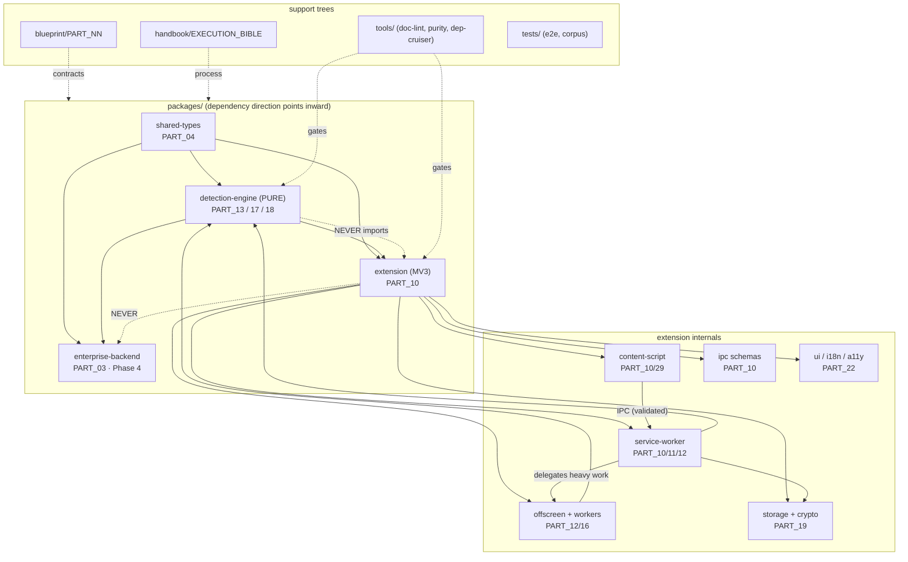
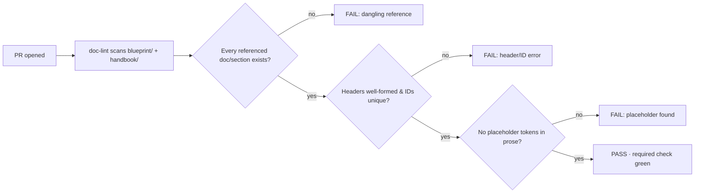

# PART 28 — ENGINEERING HANDBOOK (REFERENCE)

**Document ID:** SS-BP-028
**Classification:** Internal Engineering — Principal Review
**Version:** 1.0.0
**Last Updated:** 2026-07-12
**Owner:** Technical Program Manager, Engineering Director
**Reviewers:** Principal Platform Architect, Principal Security Architect, DevOps Release Engineer

---

## Executive Summary

This document is the **blueprint-series index into the engineering process**. It does not redefine process — it points to the authoritative process document and pins down two things the blueprints must agree on: the **canonical monorepo folder structure** (so every subsystem's code has exactly one home, mapped to its owning `PART_NN`) and the **documentation standard** (header block, required sections, and the CI `doc-lint` rule that forbids dangling references). It closes with a quick-reference index of the engineering commandments so a reviewer can check any PR against them without leaving the blueprint repository.

Read this alongside `handbook/PROJECT_EXECUTION_BIBLE.md`. Where this doc describes *what the repo looks like and how docs are written*, the handbook describes *how the team works day to day*.

---

## 1. Authoritative Process Document

The single source of truth for **how the team works** — build order, gates, reviews, git strategy, risk register, code style — is:

> **`handbook/PROJECT_EXECUTION_BIBLE.md`** (SS-HB-001)

| Question | Handbook Section |
|---|---|
| What do I build first / never first? | SECTION 1, 2 |
| What's my daily/weekly rhythm? | SECTION 3, 4 |
| Debt & dependency policy | SECTION 5, 24 |
| Testing / release / security / perf checkpoints | SECTION 6, 7, 8, 9 |
| Browser & platform compatibility | SECTION 10 |
| Production readiness | SECTION 11 |
| Mistakes & anti-patterns (static catalog) | SECTION 12, 13 |
| Engineering commandments | SECTION 14 |
| Git & branch strategy | SECTION 15 |
| Definition of Done | SECTION 16 |
| Code review process | SECTION 17 |
| Gates (test/security/perf/release) | SECTION 18 |
| Bug triage & severity | SECTION 19 |
| Risk register | SECTION 20 |
| Engineering principles & architecture rules | SECTION 21 |
| Code ownership (CODEOWNERS) | SECTION 22 |
| Refactoring strategy | SECTION 23 |
| Code style guide | SECTION 25 |
| Lessons learned (living log) | SECTION 26 |

**Authority note (per 00_MASTER_INDEX §1):** The handbook is authoritative for *process*. It never overrides a blueprint's technical contract. When a `PART_NN` technical contract and the handbook conflict on a *technical* point, the `PART_NN` wins; when they conflict on *process*, the handbook wins; unresolved conflicts escalate to the Engineering Director.

---

## 2. Canonical Monorepo Folder Structure

This is the **authoritative** layout. Every file has exactly one home. New top-level packages or directories require an ADR (PART_08). The `Owning PART_NN` column is the contract a reviewer opens when changing code in that directory.

```
sentinel-shield/
├── package.json                      # workspace root; scripts: build/test/lint/typecheck
├── pnpm-workspace.yaml               # declares packages/*
├── turbo.json                        # Turborepo pipeline (build→test dependency graph)
├── tsconfig.base.json                # strict base config extended by every package
├── .eslintrc.cjs / .prettierrc       # lint + format (handbook SECTION 25)
├── commitlint.config.cjs             # Conventional Commits (handbook SECTION 15.3)
├── .husky/                           # pre-commit (lint), commit-msg (commitlint)
├── CODEOWNERS                        # ownership map (handbook SECTION 22)
├── CHANGELOG.md                      # semver changelog (handbook SECTION 7/16)
├── SECURITY.md                       # vulnerability disclosure process
├── README.md                         # build/test/contribute
│
├── packages/
│   │
│   ├── shared-types/                 # ── Owning: PART_04 · pure types, zero deps
│   │   ├── src/
│   │   │   ├── detection/            #   Detection, ScanResult, Confidence, offsets
│   │   │   ├── entities/             #   EntityType enum, RiskLevel enum
│   │   │   ├── messages/             #   IPC envelope + MessageType (PART_10 §IPC)
│   │   │   ├── config/               #   Settings schema, policy shapes (PART_21)
│   │   │   ├── constants/            #   MAX_FILE_SIZE, PBKDF2_ITERATIONS, budgets
│   │   │   └── index.ts              #   barrel export
│   │   └── package.json
│   │
│   ├── detection-engine/             # ── Owning: PART_13/17/18 · PURE (AR-1/DR-3)
│   │   ├── src/
│   │   │   ├── detectors/            #   Detector implementations (regex/entropy/ner/cv)
│   │   │   │   ├── regex/            #     patterns per entity type (PART_13)
│   │   │   │   ├── entropy/          #     Shannon entropy secret detection (PART_13)
│   │   │   │   ├── ner/              #     ONNX inference wrapper — pure, no fetch (PART_13)
│   │   │   │   └── cv/               #     face/QR/signature detectors (PART_18)
│   │   │   ├── checksum/             #   Luhn, Verhoeff, MOD-97 validators [SECURITY-GATED]
│   │   │   ├── pipeline/             #   tier orchestration, aggregation (PART_13)
│   │   │   ├── input/                #   ProcessedInput normalization (PART_17)
│   │   │   ├── risk/                 #   risk scoring engine (PART_18)
│   │   │   ├── policy/               #   decision/policy engine (PART_18)
│   │   │   ├── redaction/            #   text/image/PDF redaction [SECURITY-GATED] (PART_18)
│   │   │   ├── explain/              #   template-based explanations (PART_01 §Principle 6)
│   │   │   └── index.ts
│   │   └── package.json              #   NO chrome.*, DOM, fetch, Node built-ins
│   │
│   ├── extension/                    # ── Owning: PART_10 · the product (MV3)
│   │   ├── manifest.json             #   [SECURITY-GATED] permissions/CSP (PART_15)
│   │   ├── src/
│   │   │   ├── service-worker/       #   coordinator, router, rate-limiter (PART_10/12)
│   │   │   ├── content-script/       #   event interception, Shadow DOM overlay (PART_10/29)
│   │   │   ├── offscreen/            #   Offscreen Document + worker pool host (PART_11/16)
│   │   │   │   └── workers/          #   OCR / NER / CV workers (PART_12/16)
│   │   │   ├── ipc/                  #   [SECURITY-GATED] message schemas + validation
│   │   │   │   └── schemas/          #     JSON Schema per MessageType
│   │   │   ├── storage/              #   [SECURITY-GATED] encrypted IndexedDB (PART_19)
│   │   │   │   └── crypto/           #     AES-256-GCM, KDF, key mgmt (PART_19)
│   │   │   ├── input-pipelines/      #   clipboard/paste/drag/upload/archive (PART_17)
│   │   │   ├── wasm/                 #   [SECURITY-GATED] loaders + integrity (PART_16)
│   │   │   ├── ui/                   #   popup, dashboard, overlay, onboarding (PART_22)
│   │   │   │   ├── components/       #     shared UI components + design tokens
│   │   │   │   ├── popup/
│   │   │   │   ├── dashboard/
│   │   │   │   └── i18n/             #     locale message catalogs
│   │   │   └── lifecycle/            #   install/update/migration runner (PART_11)
│   │   ├── assets/
│   │   │   ├── models/               #   *.onnx quantized NER + metadata (PART_21)
│   │   │   ├── wasm/                 #   *.wasm (tesseract, zxing) + SHA-256 pins (PART_16)
│   │   │   └── icons/
│   │   ├── vite.config.ts            #   extension build (PART_25)
│   │   └── package.json
│   │
│   └── enterprise-backend/           # ── Owning: PART_03 §backend · PHASE 4, OPTIONAL
│       ├── src/
│       │   ├── api/                  #   fleet policy API (never imported by extension)
│       │   ├── policy/               #   managed-storage policy authoring (PART_21/PART_30)
│       │   └── admin/               #   admin console
│       └── package.json
│
├── blueprint/                        # ── this repo · PART_NN engineering contracts
│   ├── 00_MASTER_INDEX.md            #   SS-BP-000 · authority + reading order
│   ├── REPOSITORY_AUDIT_REPORT.md
│   └── PART_01..PART_30_*.md         #   SS-BP-0NN · one per subsystem/domain
│
├── handbook/
│   └── PROJECT_EXECUTION_BIBLE.md    #   SS-HB-001 · authoritative process doc
│
├── implementation_plan.md            # onboarding narrative (50 topics), lower authority
│
├── tools/                            # ── Owning: PART_25 · DevOps
│   ├── benchmarks/                   #   perf suite (handbook SECTION 9 / PART_23)
│   ├── doc-lint/                     #   doc reference checker (§4.3)
│   ├── engine-purity/                #   detection-engine purity scanner (DR-3)
│   ├── dep-cruiser/                  #   dependency-direction checker (DR-1..DR-5)
│   ├── bundle-size/                  #   package size gate (handbook SECTION 18.3)
│   └── sbom/                         #   SBOM generation (PART_25)
│
├── tests/                            # ── cross-package suites
│   ├── e2e/                          #   Playwright: platform interception (SECTION 10)
│   ├── integration/                  #   module-boundary tests
│   ├── corpus/                       #   detection TP/TN corpora (golden set)
│   └── fixtures/                     #   sample inputs (NO real PII — synthetic only)
│
├── docs/                             # user-facing documentation
│
└── .github/
    ├── workflows/                    # CI: lint/typecheck/test/build/audit/doc-lint (PART_25)
    ├── pr-size-ignore                # files excluded from PR-size count (SECTION 15.4)
    └── CODEOWNERS -> (root symlink)
```

### 2.1 Folder → Owning PART Map (quick lookup)

| Folder | Subsystem | Owning PART | Handbook owner |
|---|---|---|---|
| `packages/shared-types/**` | Types, enums, IPC envelope | PART_04 | Platform Architecture |
| `packages/detection-engine/detectors/**` | Detectors (regex/entropy/ner/cv) | PART_13, PART_18 | Detection |
| `packages/detection-engine/checksum/**` | Checksum validators | PART_13, PART_19 | Detection + Security |
| `packages/detection-engine/input/**` | Input normalization | PART_17 | Detection |
| `packages/detection-engine/risk|policy/**` | Risk/decision engines | PART_18 | Detection |
| `packages/detection-engine/redaction/**` | Redaction | PART_18 | Detection (security-gated) |
| `packages/extension/manifest.json` | Manifest, permissions | PART_10, PART_15 | Extension + Security |
| `packages/extension/src/service-worker/**` | Coordinator | PART_10, PART_11, PART_12 | Extension |
| `packages/extension/src/content-script/**` | Interception + overlay | PART_10, PART_29 | Extension |
| `packages/extension/src/offscreen/**` | Offscreen + workers | PART_11, PART_12, PART_16 | Runtime |
| `packages/extension/src/ipc/**` | Message schemas | PART_10 | Extension + Security |
| `packages/extension/src/storage/**` | Encrypted storage + crypto | PART_19 | Security |
| `packages/extension/src/input-pipelines/**` | Input pipelines | PART_17 | Detection/Extension |
| `packages/extension/src/wasm/**` | WASM loaders | PART_16 | Runtime + Security |
| `packages/extension/src/ui/**` | UI/state/a11y/i18n | PART_22 | Frontend |
| `packages/extension/src/lifecycle/**` | Lifecycle + migrations | PART_11 | Extension |
| `packages/enterprise-backend/**` | Fleet backend | PART_03 (§backend) | Backend (Phase 4) |
| `tools/**`, `.github/workflows/**` | Build/CI/release | PART_25 | DevOps |
| `tests/e2e/**` | Platform E2E | PART_24, PART_29 | QA |
| `tests/corpus/**` | Detection corpora | PART_24 | Detection/QA |
| `blueprint/**`, `handbook/**` | Docs | PART_28 | TPM + Eng Director |

### 2.2 Module Map (Mermaid)



---

## 3. Where Each Subsystem's Code Lives (Contract Index)

| Subsystem | Code home | Contract |
|---|---|---|
| Regex + checksum detection | `detection-engine/detectors/regex`, `/checksum` | PART_13 |
| Entropy / secrets | `detection-engine/detectors/entropy` | PART_13 |
| NER inference | `detection-engine/detectors/ner` + `assets/models` | PART_13, PART_21 |
| Computer vision | `detection-engine/detectors/cv` | PART_18 |
| Input pipelines (OCR/PDF/paste/drag/archive) | `extension/src/input-pipelines`, `detection-engine/input` | PART_17 |
| Risk / policy / decision | `detection-engine/risk`, `/policy` | PART_18 |
| Redaction | `detection-engine/redaction` | PART_18 |
| Event interception + overlay | `extension/src/content-script` | PART_10, PART_29 |
| Coordinator / router / rate-limit | `extension/src/service-worker` | PART_10, PART_12 |
| Offscreen + worker pool | `extension/src/offscreen` | PART_11, PART_12, PART_16 |
| WASM runtime + integrity | `extension/src/wasm` + `assets/wasm` | PART_16 |
| Storage / encryption / keys | `extension/src/storage` | PART_19 |
| IPC schemas + validation | `extension/src/ipc/schemas` | PART_10 |
| Config / rule / model management | `extension/src/lifecycle`, `assets/models`, `shared-types/config` | PART_21 |
| UI / state / a11y / i18n | `extension/src/ui` | PART_22 |
| Lifecycle + migrations | `extension/src/lifecycle` | PART_11 |
| Guardrails / bypass defense | cross-cuts `content-script` + `detection-engine` | PART_20, PART_29 |
| CI/CD / build / release | `tools`, `.github/workflows` | PART_25 |
| Observability | `extension/src` log middleware + `tools` | PART_26 |
| Incident response / runbooks | `docs`, `handbook` | PART_27 |

---

## 4. Documentation Standard

Enforced in review and by the `doc-lint` CI check (`tools/doc-lint`). This is the same standard 00_MASTER_INDEX §8 refers to.

### 4.1 Header Block Specification

Every blueprint (`PART_NN`) begins with **exactly** this header block, in this order:

```
# PART NN — TITLE IN CAPS

**Document ID:** SS-BP-0NN
**Classification:** Internal Engineering — Principal Review
**Version:** X.Y.Z            (semver; starts at 1.0.0)
**Last Updated:** YYYY-MM-DD  (ISO 8601)
**Owner:** {role(s)}
**Reviewers:** {role, role, role}

---
```

Handbook documents use `SS-HB-0NN` and omit `Reviewers` if none. Rules the `doc-lint` check enforces on the header:

| Field | Rule |
|---|---|
| `Document ID` | Matches `SS-(BP|HB)-\d{3}`; unique across the repo; matches the filename's `PART_NN`. |
| `Version` | Valid semver. |
| `Last Updated` | Valid ISO date, not in the future relative to the commit date. |
| `Owner` | Non-empty. |
| Title | `# PART NN — …` matches the numeric prefix of the filename. |

### 4.2 Required Sections

| Document class | Required sections |
|---|---|
| Subsystem blueprint (11,12,15,16,17,18,19,21,22) | The **20-field** template (00_MASTER_INDEX §5): Purpose … Open Risks. |
| Endpoint blueprint (29) | The **14-field** template (00_MASTER_INDEX §6). |
| Every blueprint | `Executive Summary` (top), `Production Checklist` and `Future Improvements` (bottom). |
| Future Improvements | Each item must state **how** to implement it — no bare "future work" (handbook Style Rules). PART_30 holds the full plans. |

### 4.3 The `doc-lint` CI Rule (No Dangling References)

`tools/doc-lint` runs on every PR (required check, handbook SECTION 15.6). It fails the build if:

| Rule | Failure condition |
|---|---|
| No dangling doc reference | A doc mentions `PART_NN`, `SS-BP-NNN`, `SS-HB-NNN`, or a relative `*.md` link that does not resolve to an existing file. |
| No dangling section reference | A `§N`/`SECTION N` reference points to a section that does not exist in the target doc. |
| Header well-formed | Header block missing or violating §4.1. |
| ID uniqueness | Two docs share a `Document ID`. |
| No placeholders | The tokens `TODO`, `TBD`, `FIXME`, `PLACEHOLDER`, `???`, `XXX` appear in prose (code fences with a ticketed `TODO(SS-###)` are exempt). |
| Filename ↔ ID match | `PART_NN_*.md` header ID ends in the same `NN`. |



This rule is why 00_MASTER_INDEX §9 can assert "no document may reference a non-existent document": it is machine-checked, not a convention.

---

## 5. Quick-Reference Index of Engineering Commandments

The full text lives in handbook SECTION 14 and the architecture rules in SECTION 21. This is the reviewer's at-a-glance card.

| # | Commandment | Enforced by |
|---|---|---|
| 1 | No PII to the cloud | `engine-purity` CI (DR-3), Principle 1 |
| 2 | Encrypt everything at rest | PART_19 review, storage tests |
| 3 | Validate every IPC message | JSON Schema check (AR-6) |
| 4 | Test before implementing | Coverage + TP/TN gates (SECTION 18.1) |
| 5 | Keep detection-engine pure | `engine-purity` + `dep-cruiser` (DR-3/DR-5) |
| 6 | Fail gracefully | Failure-mode tests, degradation tiers |
| 7 | Minimize permissions | Manifest validator + ADR (AR-9) |
| 8 | Never store raw PII | PII-in-logs scan, storage review (AR-2/AR-3) |
| 9 | Measure before optimizing | Perf gate + benchmark diffs (SECTION 18.3) |
| 10 | Keep PRs small (< 400 lines) | `pr-size` CI (SECTION 15.4) |
| 11 | Document decisions (ADR) | Review + PART_08 |
| 12 | Question assumptions | Culture / review |

### 5.1 Reviewer's One-Screen Rulebook

```
BEFORE APPROVING, CONFIRM:
□ Dependency direction inward (shared-types → detection-engine → extension); engine pure
□ No PII in logs/storage/IPC; sanitizer applied; nothing raw persisted
□ Every IPC message schema-validated; unknown types rejected
□ No any / eval / innerHTML-with-user-data / chrome.storage.sync
□ PR < 400 lines, one logical change, Conventional Commit title
□ Tests: coverage gates met; new detection rule ≥ 20 TP + ≥ 10 TN
□ Docs/ADR/CHANGELOG updated; doc-lint green
□ Perf within budget; security review present if security-touching
```

---

## 6. Production Checklist

- [ ] Folder structure in §2 matches the actual repo (drift check in CI via `tools/doc-lint` path assertions)
- [ ] Every `packages/*` directory maps to an owning `PART_NN` in §2.1
- [ ] `CODEOWNERS` paths agree with §2.1 / handbook SECTION 22
- [ ] `doc-lint` passes on the whole `blueprint/` + `handbook/` tree
- [ ] Header block of every blueprint conforms to §4.1
- [ ] No placeholder tokens anywhere in `blueprint/` or `handbook/`
- [ ] Commandments card (§5) matches handbook SECTION 14/21
- [ ] This document referenced from 00_MASTER_INDEX §2 (Part 28)

---

## 7. Future Improvements

| Improvement | How to implement (concrete) | Effort |
|---|---|---|
| Auto-generate §2 from the live tree | Add a `tools/doc-lint/structure.ts` step that walks `packages/`, diffs against a checked-in `structure.json`, and fails on drift; regenerate this section from that JSON via a codegen template. | ~2 days |
| Owning-PART annotations in code | Add a `@part PART_13` JSDoc tag convention; a lint rule verifies each top-level `src` dir declares its owning PART and cross-checks §2.1. | ~1 day |
| Doc-graph visualization | Extend `doc-lint` to emit a Mermaid dependency graph of inter-doc references (superset of 00_MASTER_INDEX §4) as a build artifact. | ~2 days |
| Coverage of handbook↔blueprint links | Add a bidirectional link checker so every `PART_NN` referenced by a handbook section is reachable and vice versa. | ~1 day |

Full extensibility roadmap (Firefox, desktop, VS Code, etc.) is in **PART_30_FUTURE_EXTENSIBILITY.md**.
