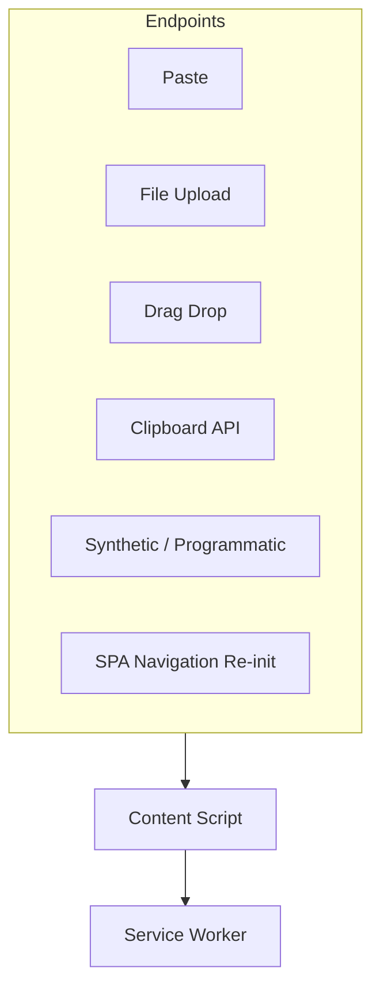

# PART 29 — ENDPOINT INTERCEPTION THREAT MODELS

**Document ID:** SS-BP-029
**Classification:** Internal Engineering — Principal Review
**Version:** 1.0.0
**Last Updated:** 2026-07-12
**Owner:** Principal Chrome Extension Engineer, Principal Security Architect
**Reviewers:** Threat Intelligence Researcher, Staff QA Engineer

---

## Executive Summary

Mandate Step 5: per-interception-endpoint threat models with the full 14-field template. Complements PART_06 (system STRIDE), PART_17 (pipelines), PART_20 (bypasses), PART_24 (tests).

| Priority | Endpoint | Rationale |
|---|---|---|
| P0 | Paste | Highest volume leak path |
| P0 | File Upload | Documents/secrets |
| P0 | Drag Drop | Same as files |
| P1 | SPA Re-init | Missed hooks after client route |
| P2 | Clipboard API | Known gap |
| P2 | Programmatic input | Lower frequency |

---

## A. Text Paste

| Field | Content |
|---|---|
| **Attack Surface** | `paste` on document; clipboardData; contenteditable/textarea/ProseMirror |
| **Threat Model** | Untrusted page JS races/removes listeners; user pastes secrets; adversarial obfuscation in clipboard text |
| **Abuse Cases** | Flood pastes; paste after disabling extension; paste into non-input to confuse `isAIInput` |
| **Known Bypasses** | Zero-width, homoglyph, Base64, spelled-out numbers (PART_20) |
| **Potential Future Bypasses** | Split string concat in code; novel Unicode format chars |
| **Detection Strategy** | Capture phase + preventDefault; normalize; Tier1–3 |
| **Mitigation Strategy** | Nonce re-dispatch; adapter fallback; PART_12 rate limit |
| **Implementation Order** | 1 intercept 2 Tier1 3 overlay 4 NER |
| **Performance Cost** | Handler &lt;5ms; scan per PART_23 |
| **Expected Accuracy** | Structured ≥97% P / ≥95% R |
| **False Positive Analysis** | ISBN/UUID filters; allowlist |
| **False Negative Analysis** | Obfuscation corpus PART_24 |
| **Stress Test Strategy** | 100 pastes/60s |
| **Regression Test Strategy** | `TC-PASTE-*` + every PART_20 text bypass id |

---

## B. File Upload

| Field | Content |
|---|---|
| **Attack Surface** | `input[type=file]` change; MutationObserver; FileReader buffers |
| **Threat Model** | Dynamic inputs; React controlled re-render; ZIP/PDF bombs; password files; polyglot files |
| **Abuse Cases** | Multi-file flood; rename .exe to .pdf; nested ZIP |
| **Known Bypasses** | ZIP bomb, PDF JS, encryption, truncated entities in screenshots |
| **Potential Future Bypasses** | Exotic containers (7z) if added unsafely |
| **Detection Strategy** | Magic sniff; router PART_17; sandbox parsers |
| **Mitigation Strategy** | Limits; DataTransfer clone + block/instruct fallback |
| **Implementation Order** | Observer → change hook → router → overlay |
| **Performance Cost** | Read + analyze per size matrix PART_17 |
| **Expected Accuracy** | Same as text after extract; OCR lower |
| **False Positive Analysis** | Binary false text; EXIF noise stripped |
| **False Negative Analysis** | Scanned low-quality docs |
| **Stress Test Strategy** | 50MB PDF; 1000-file ZIP reject |
| **Regression Test Strategy** | `TC-UPLOAD-*`; PART_20 file section |

---

## C. Drag-and-Drop

| Field | Content |
|---|---|
| **Attack Surface** | drop/dragover document capture; dataTransfer |
| **Threat Model** | Nested zones; directory drops; mixed text+files |
| **Abuse Cases** | Drop huge directories; drop from remote URL files |
| **Known Bypasses** | Same as upload + missed drop if dragover not prevented |
| **Potential Future Bypasses** | Custom MIME types only |
| **Detection Strategy** | Same router as files/text |
| **Mitigation Strategy** | Always preventDefault on dragover for protected pages |
| **Implementation Order** | After paste; share file pipeline |
| **Performance Cost** | Same as upload |
| **Expected Accuracy** | Same as upload/paste |
| **False Positive / Negative** | Same as B/A |
| **Stress Test Strategy** | 500-file folder capped |
| **Regression Test Strategy** | `TC-DROP-*` |

---

## D. Clipboard API (`navigator.clipboard.readText`)

| Field | Content |
|---|---|
| **Attack Surface** | Page-initiated Clipboard API reads (permissioned) |
| **Threat Model** | Bypasses paste event entirely |
| **Abuse Cases** | AI platform “paste from clipboard” button using API |
| **Known Bypasses** | This entire path (PART_20 §4.3) |
| **Potential Future Bypasses** | Async clipboard write hijack |
| **Detection Strategy** | **None in v1** (cannot safely intercept from isolated world) |
| **Mitigation Strategy** | Document limitation; UX guidance; monitor platform adoption |
| **Implementation Order** | Document first; Phase 3 research only |
| **Performance Cost** | N/A |
| **Expected Accuracy** | N/A (uncovered) |
| **False Positive / Negative** | N/A / systematic FN for this channel |
| **Stress Test Strategy** | Manual checklist per platform quarterly |
| **Regression Test Strategy** | `TC-CLIPAPI-KNOWN-GAP` asserts documentation + help link |

---

## E. Programmatic / Synthetic Input

| Field | Content |
|---|---|
| **Attack Surface** | Page sets `textarea.value` / `execCommand` / framework state without paste |
| **Threat Model** | Autofill scripts; “try example” buttons inserting secrets |
| **Abuse Cases** | Demo buttons with live keys; browser password manager autofill into AI box |
| **Known Bypasses** | Value assignment without events |
| **Potential Future Bypasses** | Shadow-DOM open inputs inside page components |
| **Detection Strategy** | Optional `input`/`beforeinput` listeners (Phase 2) with debounce; v1: not full coverage |
| **Mitigation Strategy** | Prefer event-level; Phase 2 sampled input scan with privacy review |
| **Implementation Order** | After P0 endpoints stable |
| **Performance Cost** | Debounced scan ≤1/500ms |
| **Expected Accuracy** | Lower until Phase 2 |
| **False Positive Analysis** | Typing partial numbers — threshold confidence |
| **False Negative Analysis** | Silent value sets |
| **Stress Test Strategy** | Rapid input events |
| **Regression Test Strategy** | `TC-PROG-*` fixtures |

---

## F. SPA Navigation Re-init

| Field | Content |
|---|---|
| **Attack Surface** | History API / framework router without full reload |
| **Threat Model** | Listeners lost; new file inputs unbound |
| **Abuse Cases** | Navigate chat→new chat mid-scan |
| **Known Bypasses** | Stale CS state |
| **Potential Future Bypasses** | Multi-iframe AI shells |
| **Detection Strategy** | `tabs.onUpdated` + in-page MutationObserver + adapter rebind |
| **Mitigation Strategy** | PART_11 CS lifecycle; cancel scan on nav |
| **Implementation Order** | With CS skeleton |
| **Performance Cost** | Rebind &lt; 20ms |
| **Expected Accuracy** | N/A (control plane) |
| **False Positive / Negative** | Spurious rebinds OK |
| **Stress Test Strategy** | 50 client routes/min |
| **Regression Test Strategy** | `TC-SPA-*` Playwright |

---

## G. ML-Evasion (Image Endpoints)

| Attack | Mitigation |
|---|---|
| Adversarial patch vs BlazeFace | Multi-pass; user review on any doc-class image; do not rely on CV alone |
| OCR-defeating noise/blur | Laplacian blur warn; enhanced preprocess; fail to partial + warn |
| Homoglyph in rendered image | OCR unicode normalize same as text path |

Tests: `TC-ML-ADV-*` in PART_24.

---

## Production Checklist

- [ ] Each endpoint has TC IDs in PART_24 matrix
- [ ] Clipboard gap disclosed in UI help
- [ ] SPA rebind verified on ChatGPT/Claude/Gemini
- [ ] Upload fallback path QA'd
- [ ] Stress jobs in CI weekly

## Future Improvements

| Item | How |
|---|---|
| beforeinput scanning | Privacy review → debounce → Tier1 only while typing |
| Clipboard API | Revisit with Chrome capability changes; no page-world hooks without CWS approval memo |
| iframe allFrames per platform | Platform allowlist in adapter config |
