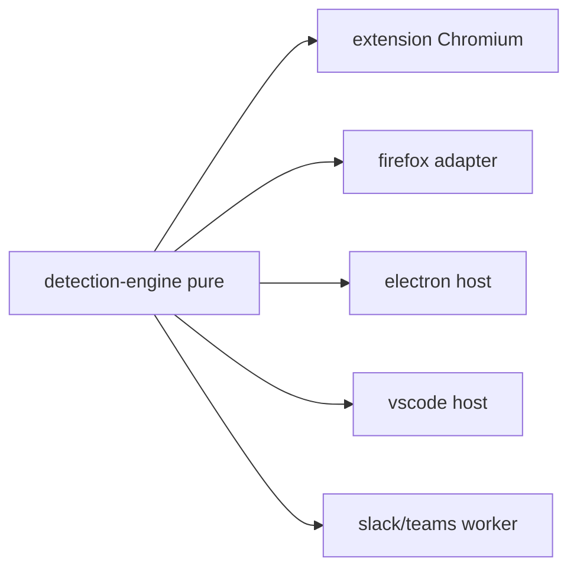

# PART 30 — FUTURE EXTENSIBILITY & ROADMAP

**Document ID:** SS-BP-030
**Classification:** Internal Engineering — Principal Review
**Version:** 1.0.0
**Last Updated:** 2026-07-12
**Owner:** Product Architect, Principal Platform Architect
**Reviewers:** Engineering Director, Principal Security Architect

---

## Executive Summary

Concrete implementation plans for post-v1.0 extensions. Each item states interfaces touched, PART documents extended, effort, risks, and acceptance criteria. No vague “future work.” Core invariant: **`packages/detection-engine` stays pure** and reusable.

---

## 1. Purpose

Define how Sentinel Shield grows without redesigning the Coordinator-Processor architecture (PART_04, PART_09).

## 2. Extensibility Architecture Rules

| Rule | Implication |
|---|---|
| Detection is a library | New hosts = new integration package, not forks of detectors |
| No remote code | New rules/models ship as data in store updates or managed JSON |
| Fail-open/closed preserved | New platforms inherit policy engine |
| Privacy invariant | New channels get PART_07 inventory rows before build |

---

## 3. Firefox WebExtension Port

| Field | Spec |
|---|---|
| **How** | New package `packages/extension-firefox`. Map MV3 SW differences (Firefox event page). Replace `chrome.*` with `browser.*` via thin `packages/webext-shim`. Offscreen: use hidden page / blank DOM page pattern Firefox supports for Workers. |
| **Interfaces** | Shim messaging; manifest v3 Firefox schema; PART_10/15 permission diffs (`scripting` API parity check) |
| **Extends** | PART_10, PART_15, PART_25 (extra CI matrix) |
| **Effort** | 6–8 eng-weeks after Chromium stable |
| **Risks** | Offscreen API gaps; store review |
| **Acceptance** | Paste+upload on Claude/ChatGPT Firefox; Tier1 100%; OCR optional if WASM ok |

---

## 4. Desktop App (Electron or Tauri)

| Field | Spec |
|---|---|
| **How** | Host `detection-engine` in privileged process. Intercept via OS clipboard hooks **opt-in** + file dialogs — not TLS MITM. UI: same Lit overlay patterns in local window. |
| **Interfaces** | `DesktopHostAdapter.scan(RawInput)`; IPC via contextBridge; reuse PART_18/19 with OS keychain for passphrase |
| **Extends** | PART_04, PART_19, PART_30 |
| **Effort** | 12–16 eng-weeks |
| **Risks** | Over-privilege; false marketing as “all apps” — must disclose limits |
| **Acceptance** | Scan clipboard on demand; scan dropped files; zero network detection |

**Rejected:** system-wide HTTPS MITM (fails Apple/Chrome security ethos; PART_01 ADR).

---

## 5. VS Code Extension

| Field | Spec |
|---|---|
| **How** | On paste into chat/composer panels (when APIs allow) or explicit “Scan selection/file” commands. Run `detection-engine` in extension host (Node) — ORT Node binding instead of WASM. |
| **Interfaces** | `vscode.commands`; TextDocument scan; secrets in output channel masked |
| **Extends** | PART_13 (Node runtime note), PART_21 models |
| **Effort** | 8–10 eng-weeks |
| **Risks** | Incomplete hook coverage for Copilot Chat UI changes |
| **Acceptance** | Command palette scan; ≥97% structured precision on fixtures |

---

## 6. Slack / Microsoft Teams

| Field | Spec |
|---|---|
| **How** | Enterprise bot receives file/share events via Events API; runs detection in **customer VPC worker** using same engine; posts ephemeral warning to user. Not a browser extension. |
| **Interfaces** | Webhook ingress; PART_18 decision; audit to customer SIEM |
| **Extends** | PART_07 (new processing location!), PART_18, PART_27 |
| **Effort** | 14–20 eng-weeks |
| **Risks** | Cloud processing contradicts local-first marketing — must be **separate SKU** with clear DPIA |
| **Acceptance** | DPIA signed; no training on content; encryption in transit/rest; customer-hosted option |

---

## 7. Custom Enterprise Entity Types

| Field | Spec |
|---|---|
| **How** | Expand managed `customPatterns` + optional `entityTypes[]` metadata. Severity map in policy. Still data-only; ReDoS CI on push. |
| **Interfaces** | PART_21 schema; PolicyEngine |
| **Effort** | 3–4 eng-weeks |
| **Acceptance** | 50 patterns; invalid regex rejected; audit shows rule id |

---

## 8. Multi-Language NER / OCR Packs

| Field | Spec |
|---|---|
| **How** | Ship `lang-pack-xx` as additional extension assets in CWS update (or optional component). User enables in Settings. Hash in registry. OCR `traineddata` + NER ONNX per language. |
| **Interfaces** | ModelManager; PART_16 cache; PART_22 i18n |
| **Effort** | 6 eng-weeks per language family after pipeline exists |
| **Acceptance** | Offline; integrity verified; size budget documented |

---

## 9. Video Frame Scanning

| Field | Spec |
|---|---|
| **How** | If `File.type` starts with `video/`, demux with constrained wasm demuxer; sample **1 fps first 30s** max 30 frames; each frame → Image Pipeline; global budget PART_12. |
| **Interfaces** | InputRouter new branch; PART_17 |
| **Effort** | 5–7 eng-weeks |
| **Risks** | Size/CPU; codec patents — use browser `video` + canvas capture only |
| **Acceptance** | 10s 720p sample completes &lt; 45s; bombs rejected |

---

## 10. Audio Transcription Scanning

| Field | Spec |
|---|---|
| **How** | Phase 6+. On-device Whisper-class small WASM **or** reject audio with warning in v1 roadmap defer. Prefer warn-unsupported until model &lt; 50MB feasible. |
| **Effort** | 10+ eng-weeks when model fits budget |
| **Acceptance** | Same privacy rules; types-only history |

---

## 11. Federated Model Improvement

| Field | Spec |
|---|---|
| **How** | Opt-in: store **local** confusion labels (entityType, FP/FN flag) without raw text. Periodic DP aggregate (ε≤1) of label counts only. Server updates **training set synthetic generation weights** — never trains on raw user content. New model ships via CWS. |
| **Interfaces** | PART_26 telemetry; PART_21 eval gate |
| **Effort** | 8 eng-weeks + ML ops |
| **Acceptance** | Privacy review; no raw text leaves device |

---

## 12. WebGPU Acceleration

| Field | Spec |
|---|---|
| **How** | ORT WebGPU EP when `navigator.gpu` ok; fallback WASM (PART_16). Bench lane PART_23. |
| **Effort** | 3–4 eng-weeks |
| **Acceptance** | NER P99 ≤50ms on discrete GPU; correct fallback |

---

## 13. Side Panel API

| Field | Spec |
|---|---|
| **How** | `chrome.sidePanel` for persistent scan history UX; overlay remains for in-page warn. |
| **Extends** | PART_22 |
| **Effort** | 2–3 eng-weeks |
| **Acceptance** | A11y AA; &lt;200ms open |

---

## 14. declarativeNetRequest Last Resort

| Field | Spec |
|---|---|
| **How** | Enterprise-only: block known upload URL patterns when policy `networkHardBlock: true`. **Cannot inspect bodies.** Complements — does not replace — content interception. |
| **Risks** | Breaks legitimate traffic; high support cost |
| **Effort** | 4 eng-weeks |
| **Acceptance** | Default off; documented false-block runbook PART_27 |

---

## 15. Implementation Order (Post-v1)

1. WebGPU + Side Panel (low risk UX/perf)
2. Enterprise custom entities
3. Firefox port
4. Language packs
5. VS Code
6. Video frames
7. Desktop app
8. Federated labels
9. Slack/Teams SKU (separate privacy track)
10. Audio / DNR hard block

---

## 16. Production Checklist (Before Starting Any Item)

- [ ] ADR filed in PART_08
- [ ] PART_07 inventory updated if new data
- [ ] PART_06 STRIDE updated if new boundary
- [ ] PART_24 tests planned
- [ ] Size/perf budgets revised in PART_23

## 17. Open Risks

Scope creep into cloud DLP; MITM temptation; SKU confusion on privacy. Mitigate with explicit non-goals from PART_01 restated in each ADR.
