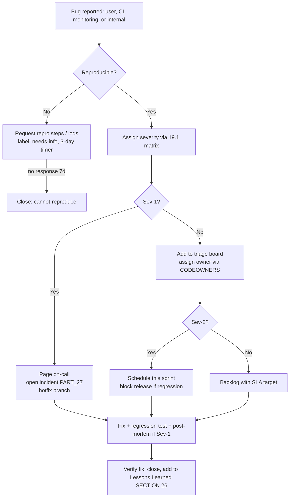
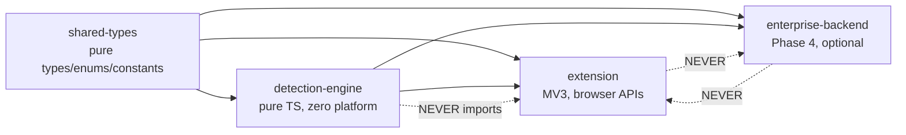

# PROJECT EXECUTION BIBLE

**Document ID:** SS-HB-001
**Classification:** Internal Engineering — All Team Members
**Version:** 1.0.0
**Last Updated:** 2026-07-12
**Owner:** Technical Program Manager, Engineering Director
**Purpose:** This document is the daily operating guide for every engineer on the Sentinel Shield AI team.

---

## How to Use This Document

Read this document on Day 1. Reference it daily. When in doubt about what to work on, how to work, or what order to build things in — this document is the answer. If this document and another document conflict, escalate to the Engineering Director.

---

# SECTION 1: WHAT TO BUILD FIRST

## The Golden Rule of Build Order

**Build the thing that unblocks the most other things.**

### Week 1-2: Foundation (Unblocks Everything)

```
DAY 1-2: Monorepo Setup
  ✓ Initialize pnpm workspace
  ✓ Configure Turborepo
  ✓ Setup TypeScript (strict mode)
  ✓ Setup ESLint + Prettier
  ✓ Setup Husky (pre-commit hooks)
  ✓ Setup Vitest
  ✓ Create packages/shared-types
  ✓ Create packages/detection-engine (empty)
  ✓ Create packages/extension (empty)
  ✓ Verify: `pnpm build` succeeds
  ✓ Verify: `pnpm test` runs (zero tests is OK)
  ✓ Verify: `pnpm lint` passes

DAY 3-4: Shared Types
  ✓ Define all TypeScript interfaces (Detection, ScanResult, Message, etc.)
  ✓ Define all enums (EntityType, RiskLevel, MessageType, etc.)
  ✓ Define all constants (MAX_FILE_SIZE, PBKDF2_ITERATIONS, etc.)
  ✓ Export from packages/shared-types
  ✓ Verify: other packages can import types

DAY 5-7: CI Pipeline
  ✓ GitHub Actions workflow: lint → typecheck → test → build
  ✓ Run on every PR and push to main
  ✓ Fail on: lint errors, type errors, test failures, build failures
  ✓ Add npm audit step (fail on critical/high)
  ✓ Add bundle size check step

DAY 8-10: Extension Skeleton
  ✓ Create manifest.json (see PART_10)
  ✓ Setup Vite build for extension
  ✓ Create Service Worker entry point (empty handler)
  ✓ Create Content Script entry point (empty)
  ✓ Create Popup HTML (minimal)
  ✓ Verify: extension loads in Chrome without errors
  ✓ Verify: popup opens
  ✓ Verify: Service Worker activates
```

### Week 3-4: Core Detection (Unblocks All Scanning)

```
DAY 11-14: Regex Engine
  ✓ Implement regex patterns for ALL entity types (see PART_13)
  ✓ Implement checksum validators (Luhn, Verhoeff, MOD-97)
  ✓ Write unit tests: 20+ true positives per entity type
  ✓ Write unit tests: 10+ true negatives per entity type
  ✓ Run ReDoS analysis on all patterns
  ✓ Verify: 100% test pass rate
  ✓ Verify: < 5ms for 1KB text scan

DAY 15-17: Entropy Engine
  ✓ Implement Shannon entropy calculation
  ✓ Implement context filters (URLs, paths, UUIDs)
  ✓ Implement secret candidate detection
  ✓ Write unit tests
  ✓ Verify: correctly classifies passwords vs. normal text

DAY 18-20: Content Script Event Interception
  ✓ Implement paste event interception (capture phase)
  ✓ Implement file upload interception (change event)
  ✓ Implement drag-drop interception
  ✓ Implement MutationObserver for dynamic inputs
  ✓ Test on ChatGPT, Claude, Gemini
  ✓ Verify: events are intercepted before platform handler
```

### Week 5-6: Integration (Connects Detection to Browser)

```
DAY 21-24: Service Worker Coordinator
  ✓ Implement message router with schema validation
  ✓ Implement rate limiter
  ✓ Implement scan coordinator (calls detection engine)
  ✓ Wire content script → Service Worker → detection → response
  ✓ Verify: paste on ChatGPT triggers scan and returns results

DAY 25-28: Warning Overlay
  ✓ Implement Shadow DOM overlay renderer
  ✓ Implement detection display (entity type, confidence, masked preview)
  ✓ Implement action buttons (Allow, Block, Redact)
  ✓ Style overlay (risk-colored header, clean layout)
  ✓ Test keyboard accessibility
  ✓ Verify: overlay appears after scan, user can interact
```

---

# SECTION 2: WHAT NEVER TO BUILD FIRST

| DO NOT Build First | Why | Build Instead |
|---|---|---|
| Enterprise backend | Zero individual users need it. It's a Phase 4 feature. | Browser extension core |
| Cloud LLM integration | Optional enhancement. Core product works without it. | Local template-based explanations |
| Firefox port | Chromium covers 85%+ market. Firefox has different APIs. | Chrome/Edge/Brave first |
| Desktop app (Electron) | Different platform, different distribution, different UX. | Browser extension |
| Custom NER model training | Expensive, slow feedback loop. Pre-trained models work first. | Pre-trained DistilBERT + fine-tune later |
| Dashboard charts | Pretty but not core functionality. | Warning overlay (the core UX) |
| Telemetry | Privacy risk, not needed for MVP. | Logging (local only) |
| Admin console | Enterprise feature, Phase 4. | Extension settings page |
| VS Code extension | Different platform. | Browser extension |
| Video frame scanning | Edge case. No user uploads videos to ChatGPT. | Image + PDF + text scanning |

---

# SECTION 3: DAILY EXECUTION WORKFLOW

## Morning (First 30 Minutes)

```
1. Pull latest from main branch
2. Run `pnpm install` (if lock file changed)
3. Run `pnpm build` — verify clean build
4. Run `pnpm test` — verify all tests pass
5. Review any CI failures from overnight
6. Check PR queue — review assigned PRs first
```

## During Development

```
1. Create feature branch from main: `feature/SS-{ticket}-{short-description}`
2. Write/update tests BEFORE implementation (TDD for detection rules)
3. Run `pnpm test --watch` during development
4. Lint before committing: Husky pre-commit hook handles this
5. Keep PRs small: < 400 lines of changes per PR
6. Self-review diff before requesting review
```

## PR Submission

```
1. Ensure CI passes (lint + typecheck + test + build + audit)
2. Write meaningful PR description:
   - What: What changes are made
   - Why: What problem is solved or requirement addressed
   - How: Key implementation decisions
   - Testing: How was this tested
   - Security: Any security implications
3. Request 2 reviewers (1 must be from security team for security-related changes)
4. Address all review comments before merge
5. Squash merge to main
```

## End of Day

```
1. Push all work-in-progress to remote branch
2. Update task board with progress
3. Note any blockers for standup tomorrow
```

---

# SECTION 4: WEEKLY MILESTONES

## Phase 1: Foundation (Weeks 1-8)

| Week | Milestone | Deliverable | Verification |
|---|---|---|---|
| 1 | Monorepo + CI | Build system, types, CI pipeline | `pnpm build && pnpm test` passes |
| 2 | Extension skeleton | Loadable extension with SW + CS + popup | Extension installs in Chrome |
| 3 | Regex detection | All regex patterns + checksums + tests | ≥97% precision on test corpus |
| 4 | Event interception | Paste/upload/drop on ChatGPT, Claude, Gemini | Events intercepted, scan triggered |
| 5 | Service Worker coordinator | Full scan pipeline (Tier 1 only) | Paste text → detect → display results |
| 6 | Warning overlay | Shadow DOM overlay with actions | User can Allow/Block |
| 7 | Encrypted storage + settings | Settings UI, encrypted IndexedDB | Settings persist across restarts |
| 8 | Integration + polish | End-to-end flow on all platforms | Alpha release to internal testers |

## Phase 2: Intelligence (Weeks 9-14)

| Week | Milestone | Deliverable | Verification |
|---|---|---|---|
| 9 | Offscreen + Workers | Worker pool, WASM loading | Workers spawn and respond |
| 10 | NER pipeline | ONNX model loading + inference | NER detects names/addresses |
| 11 | OCR pipeline | Tesseract.js + preprocessing | OCR extracts text from images |
| 12 | PDF pipeline | pdf.js + scanned page OCR | PDF text extraction works |
| 13 | Risk scoring + explanations | Risk engine + template engine | Risk levels displayed, explanations shown |
| 14 | Integration + performance | Full Tier 1+2 pipeline | Performance budgets met |

## Phase 3: Vision & Polish (Weeks 15-22)

| Week | Milestone |
|---|---|
| 15-16 | Computer vision (faces, QR, signatures, document classification) |
| 17-18 | Redaction pipeline (text, image, PDF) |
| 19 | Dashboard + file format parsers (DOCX, CSV, JSON, XML, ZIP) |
| 20 | Onboarding + dark/light theme |
| 21 | Browser testing (Chrome, Edge, Brave, Arc) + accessibility |
| 22 | Security audit + v1.0.0 release prep |

---

# SECTION 5: TECHNICAL DEBT STRATEGY

## Debt Classification

| Type | Definition | Action |
|---|---|---|
| **Intentional** | Shortcut taken consciously (documented with TODO + ticket) | Schedule for next sprint |
| **Accidental** | Poor implementation discovered later | Fix immediately if < 1 hour. Create ticket if larger. |
| **Environmental** | Dependency deprecation, API changes | Track in dependency update cadence |

## Debt Rules

1. **Every TODO in code MUST have a ticket number:** `// TODO(SS-123): Optimize regex compilation`
2. **No TODO without a ticket.** Orphaned TODOs are deleted in review.
3. **Debt ceiling:** No more than 20 open debt tickets at any time. If ceiling is hit, next sprint is 50% debt reduction.
4. **Debt review:** Every Friday, review debt backlog. Close stale tickets. Re-prioritize.

## Refactoring Checkpoints

| Checkpoint | Timing | Focus |
|---|---|---|
| Post-Phase 1 | Week 9 | Refactor detection pipeline interfaces based on Phase 1 learnings |
| Post-Phase 2 | Week 15 | Refactor Worker pool based on real performance data |
| Post-Phase 3 | Week 23 | Refactor UI components for reusability. Extract design system. |
| Pre-Enterprise | Week 23 | Refactor storage layer to support enterprise policy overlay |

---

# SECTION 6: TESTING CHECKPOINTS

## Test Cadence

| Frequency | Test Type | Who |
|---|---|---|
| Every commit | Lint + typecheck | Automated (Husky) |
| Every PR | Unit + integration + audit | Automated (CI) |
| Weekly | E2E browser tests on all platforms | Automated (CI, scheduled) |
| Bi-weekly | Performance benchmarks | Automated (CI, scheduled) |
| Monthly | Security scan (OWASP checklist) | Security engineer |
| Per phase | Full regression + exploratory testing | QA team |
| Pre-release | Complete test suite + manual verification | QA team + security |

## Test Quality Rules

1. **No PR merges with test failures.**
2. **Coverage gates:** Unit ≥ 90%, Integration ≥ 80%.
3. **New detection rules require:** 20+ true positive tests, 10+ true negative tests, edge case tests.
4. **New UI components require:** Screenshot tests + keyboard accessibility tests.
5. **Performance changes require:** Before/after benchmark comparison.

---

# SECTION 7: RELEASE CHECKPOINTS

## Pre-Release Checklist

```
□ All CI checks pass (lint, typecheck, test, build, audit, size)
□ All P0/P1 acceptance criteria met
□ Performance budgets met (documented benchmark results)
□ Security review completed (sign-off from security lead)
□ Privacy review completed (no new data collection or storage)
□ Accessibility audit passed (WCAG 2.1 AA)
□ Chrome Web Store listing updated (description, screenshots)
□ CHANGELOG.md updated
□ Version bumped (semver)
□ Extension tested on Chrome Stable, Edge, Brave
□ Extension tested on current versions of all AI platforms
□ Canary release plan documented
```

## Release Process

```
1. Tag release: git tag v1.0.0
2. CI builds release artifact (.zip)
3. Upload to Chrome Web Store (Test channel first)
4. Internal team testing on CWS Test channel (24 hours)
5. Promote to Production (5% canary)
6. Monitor for 48 hours (error rate, crash rate, user feedback)
7. If clean: promote to 25% → 50% → 100% over 1 week
8. If regressions: rollback by publishing previous version
```

---

# SECTION 8: SECURITY REVIEW CHECKPOINTS

| Trigger | Review Scope | Reviewers |
|---|---|---|
| New browser API usage | Permission impact, data access | Security lead |
| New dependency added | License, vulnerability, attack surface | Security lead + 1 engineer |
| Manifest.json change | Permissions, CSP, host permissions | Security lead |
| Storage schema change | Encryption coverage, data classification | Security lead + privacy engineer |
| New IPC message type | Schema validation, source verification | Security lead |
| New WASM binary | Integrity verification, build provenance | Security lead |
| New network call | Data transmitted, TLS configuration | Security lead + privacy engineer |
| Pre-release | Full security checklist | Security lead |

---

# SECTION 9: PERFORMANCE VALIDATION

## Benchmark Cadence

Run performance benchmarks on every CI build. Results are stored in a performance tracking database. Regressions > 20% from baseline trigger a build warning. Regressions > 50% trigger a build failure.

## Reference Hardware

All performance budgets are measured on:
- **CPU:** Intel Core i5-1235U (mid-range laptop, 2022)
- **RAM:** 8GB DDR4
- **Browser:** Chrome Stable (latest)
- **OS:** Windows 11

## Benchmark Suite

| Benchmark | Input | Metric | Budget |
|---|---|---|---|
| regex_1kb | 1KB text with 5 entities | Latency P99 | < 10ms |
| regex_10kb | 10KB text with 20 entities | Latency P99 | < 50ms |
| regex_100kb | 100KB text with 100 entities | Latency P99 | < 200ms |
| ner_512tokens | 512 tokens | Latency P99 | < 200ms |
| ocr_1080p | 1920×1080 PNG | Latency P99 | < 3000ms |
| pdf_10pages | 10-page text PDF | Latency P99 | < 1000ms |
| full_pipeline_text | 10KB text | Latency P99 | < 300ms |
| memory_idle | Extension loaded, no activity | Heap size | < 50MB |
| memory_500scans | 500 scans over 10 minutes | Heap growth | < 10MB |

---

# SECTION 10: BROWSER COMPATIBILITY VALIDATION

## Test Matrix

| Browser | Version | Frequency | Scope |
|---|---|---|---|
| Chrome Stable | Latest | Every PR (CI) | Full suite |
| Chrome Beta | Latest | Weekly (CI) | Smoke tests |
| Chrome Canary | Latest | Weekly (CI) | API compatibility only |
| Edge Stable | Latest | Every PR (CI) | Full suite |
| Brave Stable | Latest | Weekly (CI) | Full suite |
| Arc | Latest | Monthly (manual) | Smoke tests |

## Platform Test Matrix

| AI Platform | Frequency | Scope |
|---|---|---|
| ChatGPT | Weekly (CI) | Paste, upload, drag-drop |
| Claude | Weekly (CI) | Paste, upload, drag-drop |
| Gemini | Weekly (CI) | Paste, upload, drag-drop |
| Copilot | Weekly (CI) | Paste, upload |
| DeepSeek | Weekly (CI) | Paste, upload |
| Perplexity | Bi-weekly | Paste, upload |
| Grok | Bi-weekly | Paste |

---

# SECTION 11: PRODUCTION READINESS CHECKLIST

```
FUNCTIONALITY
□ All P0 requirements implemented and tested
□ All P1 requirements implemented and tested
□ Detection accuracy meets targets (≥97% precision for structured PII)
□ All supported file formats processed correctly
□ All supported AI platforms intercepted correctly
□ Redaction works for text, images, and PDFs
□ Encrypted storage works (with and without passphrase)
□ Extension works 100% offline

SECURITY
□ External security audit completed
□ All critical/high findings remediated
□ Manifest permissions minimized
□ WASM integrity verification active
□ IPC message validation active
□ PII sanitizer active on all log output
□ Supply chain audit completed
□ FIDO2 key for Web Store account

PERFORMANCE
□ All performance budgets met
□ No memory leaks over sustained usage
□ Extension cold start < 500ms
□ Extension idle memory < 50MB

QUALITY
□ Unit test coverage ≥ 90%
□ Integration test coverage ≥ 80%
□ E2E tests pass on all browsers and platforms
□ Accessibility audit passed (WCAG 2.1 AA)
□ No known critical or high-severity bugs

OPERATIONS
□ Monitoring dashboard configured
□ Incident response plan documented
□ On-call rotation established
□ Canary release plan documented
□ Rollback procedure tested

COMPLIANCE
□ Privacy policy published
□ SECURITY.md with disclosure process
□ License compliance verified
□ GDPR/CCPA assessment completed
□ Chrome Web Store review passed
```

---

# SECTION 12: COMMON IMPLEMENTATION MISTAKES

| Mistake | Why It's Wrong | What To Do Instead |
|---|---|---|
| **Storing raw PII in IndexedDB** | Defeats the purpose of the product | Store only entity type, confidence, masked preview |
| **Using `chrome.storage.sync`** | Sends data to Google servers | Use `chrome.storage.local` only |
| **Using `eval()` or `Function()`** | Blocked by CSP, security risk | Use direct function calls |
| **Hardcoding platform DOM selectors** | AI platforms change DOM frequently | Use event-level interception (document-level listeners) |
| **Logging detection results** | PII in logs is a data leak | Use PII sanitizer on all log output |
| **Importing browser APIs in detection-engine** | Makes detection engine untestable without browser | Keep detection-engine pure (zero browser imports) |
| **Blocking Service Worker on long operations** | SW has 5-minute timeout, single-threaded | Offload to Offscreen Document + Workers |
| **Using `innerHTML` with user data** | XSS vulnerability | Use `textContent` or DOM API |
| **Not validating IPC messages** | Malformed messages can crash handlers | JSON Schema validation on every message |
| **Using `window.postMessage` for IPC** | Interceptable by page JavaScript | Use `chrome.runtime.sendMessage` (internal only) |
| **Loading WASM without integrity check** | Compromised WASM could exfiltrate data | SHA-256 verification before instantiation |
| **Creating Blob URLs for sensitive data** | Persists to disk via browser temp files | Process in memory (ArrayBuffer), never create Blob URLs |
| **Using `setTimeout(string)` instead of function** | Equivalent to eval(), blocked by CSP | Always use `setTimeout(function)` |
| **Not handling Service Worker restarts** | State is lost on restart | Externalize state to `chrome.storage.session` |

---

# SECTION 13: ANTI-PATTERNS

| Anti-Pattern | Correct Pattern |
|---|---|
| **God Service Worker** — all logic in one file | **Module per responsibility** — message router, coordinator, storage manager as separate files |
| **Polling for events** — setInterval to check for changes | **Event-driven** — listen for events, react to messages |
| **Global mutable state** — `let scanResults = {}` at module level | **Externalized state** — `chrome.storage.session` for ephemeral, `chrome.storage.local` for persistent |
| **Chatty IPC** — many small messages for one operation | **Batched IPC** — single SCAN_REQUEST with complete payload |
| **Synchronous file reading** — `FileReader.readAsBinaryString` | **Async ArrayBuffer** — `FileReader.readAsArrayBuffer` with transfer |
| **Catch-and-swallow** — `catch(e) {}` | **Catch-and-handle** — log, report to user, degrade gracefully |
| **Version-checking** — `if (chrome.runtime.getManifest().version > ...)` | **Feature-detecting** — `if (typeof chrome.offscreen !== 'undefined')` |
| **Over-engineering abstractions** — factory of factory of builder | **Simple interfaces** — Detector interface, direct instantiation |
| **Premature optimization** — WASM for simple string operations | **Measure first** — profile before optimizing. Regex is fast enough for text. |

---

# SECTION 14: ENGINEERING COMMANDMENTS

1. **Thou shalt not send PII to the cloud.** The detection pipeline has zero network calls. If you find yourself writing `fetch()` in the detection engine, stop.

2. **Thou shalt encrypt everything at rest.** If data touches `chrome.storage.local` or IndexedDB, it is encrypted first. No exceptions.

3. **Thou shalt validate every message.** Every IPC message is schema-validated. Unknown types are rejected. Invalid payloads are rejected.

4. **Thou shalt test before implementing.** Write the test case first. Then write the implementation. This is not optional for detection rules.

5. **Thou shalt keep the detection engine pure.** Zero browser imports in `packages/detection-engine`. It is a pure TypeScript library testable with `vitest` alone.

6. **Thou shalt fail gracefully.** No component's failure should crash the extension. Workers crash? Return partial results. NER times out? Return regex results. IndexedDB full? Purge old data.

7. **Thou shalt minimize permissions.** Every permission in manifest.json must be justified in writing. New permissions require ADR approval.

8. **Thou shalt never store raw PII.** Detected values are held in memory during the user's review, then discarded. They are NEVER persisted to any storage.

9. **Thou shalt measure before optimizing.** Profile with Chrome DevTools Performance panel before rewriting anything. Intuition about performance is usually wrong.

10. **Thou shalt keep PRs small.** < 400 lines of changes. Large PRs hide bugs. If the feature is large, break it into multiple PRs.

11. **Thou shalt document decisions.** If you made a non-obvious choice, write an ADR. Future engineers (including future you) will thank you.

12. **Thou shalt question assumptions.** If this document says something that doesn't make sense for the current situation, raise it. No document is infallible.

---

# SECTION 15: GIT & BRANCH STRATEGY

## 15.1 Branching Model Decision

**Decision: Trunk-Based Development with short-lived feature branches. GitFlow is rejected.**

| Criterion | Trunk-Based (chosen) | GitFlow (rejected) | Why It Matters Here |
|---|---|---|---|
| Integration frequency | Daily merges to `main` | Long-lived `develop` + release branches | We ship a single artifact (the extension). Long divergence hides platform-DOM and detection regressions. |
| Release cadence | Continuous; release is a tag + CWS submission | Ceremonial release branches | Chrome Web Store publishing is a promotion of an already-green `main`, not a separate integration effort. |
| Merge conflict surface | Small (< 400-line PRs, < 2-day branches) | Large (weeks of divergence) | The detection-engine and shared-types are touched by many streams; frequent integration prevents type drift. |
| Hotfix path | Branch from `main`, fix, tag | Branch from `main`, back-merge to `develop` | Simpler, fewer back-merge mistakes. |
| Cognitive overhead | Low | High | A small team should not spend cycles on branch bookkeeping. |

**Rationale in one sentence:** `main` is always releasable; every change is small, reviewed, gated by CI, and merged within two days, so the branch graph stays linear and auditable — a hard requirement for a security product that must reconstruct exactly what shipped in any CWS version.

## 15.2 Branch Naming Convention

| Branch Type | Pattern | Example |
|---|---|---|
| Feature | `feature/SS-{ticket}-{kebab-description}` | `feature/SS-142-luhn-validator` |
| Bug fix | `fix/SS-{ticket}-{kebab-description}` | `fix/SS-207-paste-race` |
| Hotfix (prod) | `hotfix/SS-{ticket}-{kebab-description}` | `hotfix/SS-311-cws-csp-reject` |
| Chore/tooling | `chore/SS-{ticket}-{kebab-description}` | `chore/SS-090-bump-vitest` |
| Security | `sec/SS-{ticket}-{kebab-description}` | `sec/SS-260-wasm-integrity` |
| Docs | `docs/SS-{ticket}-{kebab-description}` | `docs/SS-028-handbook-ref` |
| Release prep | `release/v{semver}` | `release/v1.0.0` |

Rules: lowercase, hyphen-separated; every branch carries a ticket ID (no ticket → no branch); max branch lifetime **2 working days** before it must merge or be split.

## 15.3 Commit Convention — Conventional Commits

Format: `type(scope): subject` (imperative, ≤ 72 chars), optional body, optional footer.

| Type | Use | Triggers version bump |
|---|---|---|
| `feat` | New capability | MINOR |
| `fix` | Bug fix | PATCH |
| `perf` | Performance improvement (with benchmark in body) | PATCH |
| `refactor` | No behavior change | none |
| `test` | Tests only | none |
| `docs` | Docs only | none |
| `build` / `ci` | Build system / pipeline | none |
| `chore` | Maintenance | none |
| `sec` | Security fix (paired with advisory) | PATCH/MINOR |

Scopes map to packages/areas: `engine`, `ext`, `types`, `backend`, `ci`, `ocr`, `ner`, `cv`, `ui`, `storage`, `crypto`, `docs`.

Example:
```
feat(engine): add Verhoeff checksum for Aadhaar

Adds Verhoeff validator gating the Aadhaar regex candidate so that
random 12-digit sequences no longer produce false positives.

Refs: SS-142
```

Breaking changes use a `!` (`feat(types)!: rename Detection.value → maskedPreview`) and a `BREAKING CHANGE:` footer. Commit messages are linted by `commitlint` in the Husky `commit-msg` hook; the same rules feed semantic-release version calculation (cross-ref SECTION 7 and PART_25).

## 15.4 Pull Request Size

| Metric | Limit | Enforcement |
|---|---|---|
| Net changed lines (excl. lockfiles, snapshots, generated) | **< 400** | CI `pr-size` check warns at 400, fails at 600 |
| Files touched | < 20 | Reviewer discretion |
| Packages touched | ≤ 2 (except mechanical renames) | Reviewer discretion |

A PR over budget must be split. The only sanctioned exceptions: generated model-metadata files, vendored WASM checksums, and lockfile updates, all of which are excluded from the count via `.github/pr-size-ignore`.

## 15.5 Merge Strategy

| Rule | Value |
|---|---|
| Merge method | **Squash merge only** (rebase and merge-commit disabled in repo settings) |
| Squash commit message | The PR title (Conventional Commit format), body links the ticket |
| Result | Linear history on `main`; one commit per PR; trivially bisectable |
| `main` rebase | Feature branches rebase on `main` before merge; no back-merges |

## 15.6 Protected Branches & Required Checks

`main` (and any `release/*`) is protected:

| Protection | Setting |
|---|---|
| Direct pushes | Blocked (including admins) |
| Force push | Blocked |
| Deletion | Blocked |
| Required approvals | 2 (see SECTION 17) |
| Required security approval | 1, for security-touching PRs (CODEOWNERS-driven, see SECTION 22) |
| Dismiss stale approvals on new commits | On |
| Required status checks (must be green) | `lint`, `typecheck`, `test:unit`, `test:integration`, `build`, `audit`, `bundle-size`, `doc-lint`, `engine-purity`, `pr-size`, `commitlint` |
| Require branches up to date | On |
| Require linear history | On |
| Require signed commits | On (GPG/SSH signature verification) |

The `engine-purity` check is the CI static-analysis gate that fails if `packages/detection-engine` imports any browser or network API (cross-ref Commandment 5 and PART_09). The `doc-lint` check fails if any doc references a non-existent doc (cross-ref 00_MASTER_INDEX §9 and PART_28).

---

# SECTION 16: DEFINITION OF DONE

A work item is **Done** only when every applicable box below is checked. "Applicable" is decided at triage; N/A items are struck through in the PR description with a one-line reason. Partial completion is **not** Done — it is a new, smaller ticket.

## 16.1 Definition-of-Done Checklist (per work item)

| # | Dimension | Criterion |
|---|---|---|
| 1 | **Code** | Implements the ticket's acceptance criteria; passes lint, typecheck, `strict` TS; no `any` (see SECTION 25); no orphaned TODOs (see SECTION 5). |
| 2 | **Tests** | New/changed logic covered; detection rules have ≥ 20 TP + ≥ 10 TN + edge cases (SECTION 6); unit ≥ 90%, integration ≥ 80%; tests are deterministic (no time/network flakiness). |
| 3 | **Docs** | Owning `PART_NN` updated if a contract changed; ADR written for non-obvious decisions (SECTION 8 / PART_08); public interfaces have TSDoc; user-facing change noted in `docs/`. |
| 4 | **Performance** | Relevant benchmark run; result within budget (SECTION 9 / PART_23); `perf` PRs include before/after numbers; no > 20% regression. |
| 5 | **Security** | Threat delta considered; security review done if triggered (SECTION 8); no PII in logs; inputs validated; no new permission without ADR. |
| 6 | **Accessibility** | UI changes pass axe-core; keyboard-navigable; focus management verified; contrast ≥ WCAG 2.1 AA (cross-ref PART_22). |
| 7 | **Privacy** | No new data collection/storage; no raw PII persisted; storage additions encrypted (cross-ref PART_07 / PART_19). |
| 8 | **Changelog** | `CHANGELOG.md` entry under the correct semver section, or the commit is `type` that semantic-release maps to a changelog line. |
| 9 | **Compatibility** | Verified on Chrome + Edge for UI/interception changes; platform smoke test if content-script touched (SECTION 10). |
| 10 | **Rollback** | Change is reversible; if it includes a storage migration, a downgrade path is documented (cross-ref PART_11). |

## 16.2 Definition of Done by Work-Item Class

| Work-Item Class | Additional bars |
|---|---|
| New detection rule | ReDoS analysis; corpus precision/recall report attached; false-positive review by a second engineer. |
| New IPC message type | JSON Schema added and registered; schema-validation test; security review (SECTION 8). |
| New dependency | License + `npm audit` + attack-surface note; ADR; added to SBOM (PART_25). |
| New WASM binary | SHA-256 pinned; build provenance documented; integrity-check test. |
| UI component | Screenshot test; a11y test; dark/light theme verified; i18n keys (no hardcoded strings). |

---

# SECTION 17: CODE REVIEW PROCESS

## 17.1 Reviewer Assignment

| Rule | Detail |
|---|---|
| Minimum approvals | **2** approving reviews before merge to `main`. |
| Security requirement | Security-touching PRs require **1 additional approval from the security team** (total ≥ 3 distinct approvers, ≥ 1 security). |
| Assignment | CODEOWNERS (SECTION 22) auto-requests the owning area; author adds one non-owner for cross-pollination. |
| Author cannot approve | The author's own review never counts toward the 2. |
| Bus-factor rule | At least one reviewer must be someone who did not pair on the change. |

"Security-touching" (any one triggers the security reviewer): manifest.json, permissions/CSP, crypto/KDF/key management, storage schema, IPC schema, WASM loading, network calls, content-script injection, redaction correctness, dependency additions. This mirrors SECTION 8 triggers and is enforced via CODEOWNERS paths.

## 17.2 Review SLA

| Priority | First response | Full review |
|---|---|---|
| Hotfix (Sev-1/Sev-2 prod) | 30 min | 2 hours |
| Normal | 4 business hours | 1 business day |
| Large/complex (flagged by author) | 1 business day | 2 business days |

Reviewing assigned PRs is the **first** task of the day (SECTION 3). A PR blocked on review > SLA is raised at standup.

## 17.3 Reviewer Checklist

```
CORRECTNESS
□ Does it do what the ticket says? Acceptance criteria met?
□ Edge cases handled? Failure modes degrade gracefully (Commandment 6)?
□ Tests actually assert behavior (not just execute code)?

ARCHITECTURE
□ Dependency direction respected (SECTION 21 / PART_09)?
□ detection-engine stays pure — zero browser/network imports?
□ No new global mutable state; SW state externalized (SECTION 13)?

SECURITY & PRIVACY
□ Any PII risk in logs, storage, or IPC? Sanitizer applied?
□ Inputs validated? Schema on new messages?
□ Permissions unchanged, or ADR present?

QUALITY
□ Readable names; no dead code; no narrating comments (making_code_changes)?
□ Errors caught-and-handled, never swallowed?
□ PR < 400 lines; single logical change?

TESTS & DOCS
□ Coverage gates met? Detection-rule TP/TN counts met?
□ Docs/ADR/CHANGELOG updated?
```

## 17.4 What Blocks Merge

| Blocker | Severity |
|---|---|
| Any required CI check red | Hard block |
| < 2 approvals (or missing security approval when required) | Hard block |
| Unresolved "requested changes" review | Hard block |
| Coverage below gate | Hard block |
| PII in logs, `any`, `eval`, `innerHTML` with user data | Hard block |
| Unaddressed review comment | Soft block (author must resolve or reply) |
| Nit-only comments (prefix `nit:`) | Non-blocking; author's discretion |

Reviewers use conventional comment prefixes: `blocker:`, `question:`, `nit:`, `praise:`, `suggestion:` to make severity explicit and keep the SLA honest.

---

# SECTION 18: GATES

Each gate is a pass/fail boundary a change must clear. Gates are automated where possible and enforced as required checks (SECTION 15.6). A red gate is a hard block on merge or release.

## 18.1 Testing Gate

| Criterion | Pass | Fail |
|---|---|---|
| Unit coverage | ≥ 90% line, ≥ 85% branch | below |
| Integration coverage | ≥ 80% module-boundary | below |
| Test result | 100% pass | any failure |
| Flakiness | 0 retries needed in 3 consecutive runs | any flaky test |
| New detection rule | ≥ 20 TP + ≥ 10 TN + edge cases | below |
| E2E (weekly + pre-release) | all critical journeys green on Chrome/Edge/Brave | any red |

## 18.2 Security Gate

| Criterion | Pass | Fail |
|---|---|---|
| `npm audit` | 0 critical, 0 high | any critical/high unwaived |
| Secret scan (gitleaks) | 0 findings | any secret committed |
| `engine-purity` static check | no network/browser import in engine | any import |
| PII-in-logs scan | 0 raw-PII log sinks | any |
| Manifest permissions | unchanged, or ADR-approved | unjustified new permission |
| WASM integrity | all binaries SHA-256 pinned & verified | any unpinned binary |
| Security review (if triggered) | signed off by security lead | missing |

## 18.3 Performance Gate

| Criterion | Pass | Fail |
|---|---|---|
| Benchmark vs baseline | ≤ 20% regression (warning zone) | > 50% regression (build fail) |
| Text scan 1KB P99 | < 50ms | above |
| Text scan 10KB P99 | < 200ms | above |
| Full pipeline (text) P99 | < 300ms | above |
| Idle memory | < 50MB | above |
| Heap growth over 500 scans | < 10MB | above (leak) |
| Bundle size | < 25MB packaged | above |

## 18.4 Release Gate

| Criterion | Pass | Fail |
|---|---|---|
| All Testing/Security/Performance gates green on the release commit | yes | any red |
| Pre-release checklist (SECTION 7) fully checked | 100% | any unchecked |
| P0/P1 acceptance criteria (PART_01 §21) | all met | any unmet |
| Accessibility audit | WCAG 2.1 AA pass | fail |
| Security lead sign-off | present | absent |
| Privacy review | no new data flows | new flow unreviewed |
| CHANGELOG + version bump | present & correct semver | missing/incorrect |
| CWS listing & assets | complete | incomplete |
| Rollback rehearsed | yes | no |

---

# SECTION 19: BUG TRIAGE & SEVERITY

## 19.1 Severity Matrix

| Sev | Definition | Examples | Response SLA | Fix SLA |
|---|---|---|---|---|
| **Sev-1 (Critical)** | Data leak, security breach, or extension-wide breakage in production | PII sent to network; encryption bypass; extension crashes on all platforms; false-negative on credit card | Acknowledge < 15 min; page on-call | Hotfix < 24h; CWS emergency publish |
| **Sev-2 (High)** | Core function broken on a major platform, or degraded protection | Paste interception fails on ChatGPT; NER worker OOM loops; storage fails to encrypt on one path | Acknowledge < 2h | Fix < 3 business days |
| **Sev-3 (Medium)** | Partial/edge failure with a workaround | False positive on a rare format; overlay misrender in one theme; slow OCR on huge image | Acknowledge < 1 business day | Fix in current or next sprint |
| **Sev-4 (Low)** | Cosmetic or minor, no protection impact | Copy typo; tooltip alignment; log verbosity | Acknowledge < 3 business days | Backlog, best-effort |

## 19.2 Severity Decision Rule

A bug's severity is the **max** across three axes: privacy/security impact, protection impact (false negatives are always ≥ Sev-2), and blast radius (all users/platforms vs. one edge). When in doubt, round up; downgrade only after triage confirms.

## 19.3 Triage Workflow



Triage runs daily (async) plus a weekly grooming. Every bug fix ships with a **regression test** that fails without the fix — no exceptions. Sev-1s always produce a post-mortem (PART_27) and a Lessons Learned entry (SECTION 26).

---

# SECTION 20: RISK REGISTER

Living register. Likelihood/Impact are Low/Med/High/Critical. Score = Likelihood × Impact (rough priority). Reviewed every Friday alongside the debt backlog (SECTION 5). Each risk maps to an owning `PART_NN` where the technical mitigation lives.

| ID | Risk | Likelihood | Impact | Owner | Mitigation (how) | Cross-ref | Status |
|---|---|---|---|---|---|---|---|
| RSK-01 | **Model drift** — NER accuracy decays as language/entities evolve; recall silently drops | Medium | High | Detection Lead | Quarterly re-evaluation on a versioned corpus; ship model-pack updates via extension update (PART_21); regression alert if recall < 80% on golden set; Tier-1 regex is the deterministic floor if model degrades | PART_13, PART_21 | Open |
| RSK-02 | **Platform DOM drift** — ChatGPT/Claude/Gemini change DOM, breaking interception | High | High | Extension Lead | Event-level (document-capture) interception, never selector-coupled (SECTION 12); weekly platform E2E (SECTION 10); synthetic canary pastes; alert on interception-rate drop | PART_10, PART_29 | Open |
| RSK-03 | **KDF/crypto weakness** — passphrase KDF too weak or misconfigured, enabling offline brute force | Low | Critical | Security Lead | PBKDF2 ≥ 600k iters (or Argon2id when available); AES-256-GCM; per-item IV; parameters version-tagged for upgrade; crypto changes require 3 approvers | PART_19, PART_14 | Open |
| RSK-04 | **Worker OOM** — OCR/NER/CV workers exceed memory on large inputs, crash loop | Medium | Medium | Runtime Lead | Per-worker memory cap; input size pre-checks; single-flight + backpressure; respawn with exponential backoff; return Tier-1 partial results on crash | PART_12, PART_16 | Open |
| RSK-05 | **CWS review rejection/removal** — Chrome Web Store rejects or delists the extension | Medium | Critical | Release Eng | Minimal permissions with written justification (Commandment 7); no remote code; CSP-clean; pre-submission policy checklist; staged canary; maintain appeal contact | PART_25, PART_15 | Open |
| RSK-06 | **Supply-chain compromise** — malicious npm/WASM dependency exfiltrates data | Medium | Critical | Security Lead | Minimal deps; pinned versions + lockfile; `npm audit`/Snyk in CI; SHA-256-pinned WASM; SBOM; provenance checks; Dependabot with review | PART_14, PART_25 | Open |
| RSK-07 | **False negative on structured PII** — a valid card/ID slips through | Low | Critical | Detection Lead | Deterministic checksum tier first (Principle 3); ≥ 20 TP tests per entity; corpus recall gate ≥ 95%; treated as Sev-2+ bug | PART_13 | Open |
| RSK-08 | **Service Worker termination mid-scan** — MV3 kills SW, scan lost | High | Medium | Extension Lead | Checkpoint state to `chrome.storage.session`; idempotent resume; content-script re-request on timeout | PART_11 | Open |
| RSK-09 | **Key rotation / lost passphrase** — user data unrecoverable or migration breaks | Medium | Medium | Security Lead | Documented no-passphrase default; versioned key schema; explicit "reset clears data" UX; migration tests | PART_19 | Open |
| RSK-10 | **Bundle size exceeds CWS limit** — models push package over 50MB | Low | High | Runtime Lead | Quantized/distilled models; on-demand model packs (PART_30); 25MB budget with headroom; size gate in CI | PART_23, PART_30 | Open |
| RSK-11 | **Regulatory shift** — new DLP/privacy law changes obligations | Low | Medium | Product/Legal | Quarterly legal review; local-first posture minimizes exposure; GDPR/CCPA assessment maintained | PART_07 | Open |
| RSK-12 | **Redaction incompleteness** — redacted output still leaks (e.g., PDF text layer under a black box) | Medium | High | Detection Lead | Redact at content layer not overlay; re-scan redacted output; visual + text-layer verification tests | PART_18 | Open |

New risks are appended (never renumbered). Closing a risk requires the owner to record the closing evidence (test, control, or accepted-and-why) in the Status cell.

---

# SECTION 21: ENGINEERING PRINCIPLES & ARCHITECTURE RULES

These are the load-bearing rules that keep the codebase reviewable by Chrome/Apple/Palo Alto/Cloudflare/Microsoft/OpenAI-grade reviewers. They are enforced by CI where a `✓ CI` appears. Full rationale and pattern catalog live in **PART_09**.

## 21.1 Dependency Direction



| Rule | Statement | Enforcement |
|---|---|---|
| DR-1 | Dependencies point **inward** toward purity: `extension` → `detection-engine` → `shared-types`. Never the reverse. | ✓ CI (`dep-cruiser`) |
| DR-2 | `shared-types` depends on **nothing** (no runtime deps, only types/enums/constants). | ✓ CI |
| DR-3 | `detection-engine` is **pure**: zero imports of `chrome.*`, DOM, `fetch`, `XMLHttpRequest`, `WebSocket`, `navigator.*`, Node built-ins. | ✓ CI (`engine-purity`) |
| DR-4 | `extension` never imports `enterprise-backend`, and vice versa (Principle 4). | ✓ CI |
| DR-5 | No circular imports anywhere. | ✓ CI (`dep-cruiser`) |

## 21.2 Non-Negotiable Rules

| ID | Rule | Cross-ref |
|---|---|---|
| AR-1 | **detection-engine is pure.** All I/O (file reads, workers, storage, network) lives in `extension`; the engine receives `ProcessedInput` and returns `Detection[]`. | Commandment 5, PART_13 |
| AR-2 | **No PII in logs.** Every log call passes through the PII sanitizer; raw detected values are never logged, serialized to telemetry, or persisted. | PART_07, SECTION 12 |
| AR-3 | **No raw PII at rest.** Only entity type, confidence, offsets, and masked preview may persist — encrypted. | NOBJ-005, PART_19 |
| AR-4 | **Zero network in the detection path.** Only the optional, user-initiated cloud-explanation feature may call out, and only with entity-type metadata. | Principle 1 |
| AR-5 | **Deterministic before probabilistic.** Tier-1 (regex+checksum+entropy) completes before Tier-2 (NER) is awaited. | Principle 3, PART_13 |
| AR-6 | **Validate every IPC message.** JSON Schema on every message; unknown types rejected. | Commandment 3, PART_10 |
| AR-7 | **Externalize Service Worker state.** No module-level mutable state that must survive; use `chrome.storage.session`/`local`. | SECTION 13, PART_11 |
| AR-8 | **Fail open for individuals, fail closed for enterprise-block.** Degraded detection never silently drops protection without user awareness. | Principle 2/7, PART_01 §12 |
| AR-9 | **Minimal permissions.** New permission ⇒ ADR ⇒ security review. | Commandment 7, PART_15 |
| AR-10 | **Interfaces over inheritance.** Detectors implement the `Detector` interface (PART_01 §9); no deep class hierarchies. | PART_09 |

Any change that must violate a rule requires an ADR (PART_08) approved by the Principal Security Architect, and the violation is logged in the Risk Register (SECTION 20).

---

# SECTION 22: CODE OWNERSHIP

Ownership is expressed as a `CODEOWNERS` file at repo root. Owners are auto-requested on PRs touching their paths (SECTION 17). Security-owned paths trigger the mandatory security approval (SECTION 15.6 / 17.1).

## 22.1 Ownership Map

| Path / Area | Owner (team) | Owning PART | Security-gated |
|---|---|---|---|
| `packages/shared-types/**` | Platform Architecture | PART_04 | No |
| `packages/detection-engine/**` | Detection | PART_13, PART_17, PART_18 | No (but rule changes need FP review) |
| `packages/detection-engine/crypto/**`, `**/checksum/**` | Detection + Security | PART_13, PART_19 | **Yes** |
| `packages/extension/manifest.json` | Extension + Security | PART_10, PART_15 | **Yes** |
| `packages/extension/src/service-worker/**` | Extension | PART_10, PART_11, PART_12 | No |
| `packages/extension/src/content-script/**` | Extension | PART_10, PART_29 | No |
| `packages/extension/src/offscreen/**`, `**/workers/**` | Runtime | PART_12, PART_16 | No |
| `packages/extension/src/storage/**`, `**/crypto/**` | Security | PART_19 | **Yes** |
| `packages/extension/src/ipc/**`, `**/schemas/**` | Extension + Security | PART_10 | **Yes** |
| `packages/extension/src/ui/**` | Frontend | PART_22 | No |
| `packages/extension/src/redaction/**` | Detection | PART_18 | **Yes** |
| `packages/enterprise-backend/**` | Backend (Phase 4) | PART_03 (backend §) | Yes |
| `.github/workflows/**`, `tools/**` | DevOps | PART_25 | Yes (release) |
| `blueprint/**`, `handbook/**` | TPM + Eng Director | PART_28 | No |
| `**/*.wasm`, `**/*.onnx`, model metadata | Runtime + Security | PART_16, PART_21 | **Yes** |

## 22.2 Ownership Rules

1. Every path must resolve to at least one owner; the root `* @eng-director` catch-all guarantees this.
2. Security-gated paths list a security-team owner so GitHub enforces the extra approval.
3. Owners are responsible for: reviewing PRs in their area within SLA, keeping the owning `PART_NN` current, and the area's risk-register entries.
4. When ownership changes, update both `CODEOWNERS` and this table in the same PR.

---

# SECTION 23: REFACTORING STRATEGY

## 23.1 Principles

| Principle | Rule |
|---|---|
| **Boy-Scout Rule** | Leave code cleaner than you found it — but only within the PR's blast radius. Opportunistic cleanup that touches unrelated files is a separate PR. |
| **Refactor ≠ behavior change** | A `refactor` commit changes no observable behavior; tests are unchanged and stay green. If behavior changes, it is `feat`/`fix`, not `refactor`. |
| **Separate refactor PRs** | Never mix a refactor with a feature in one PR — it defeats review and bisection. Refactor first (green), then build on top. |

## 23.2 Refactor Budget

| Rule | Value |
|---|---|
| Per-sprint refactor budget | **~15% of capacity** reserved for refactoring + debt paydown |
| Scheduled checkpoints | Post-Phase 1/2/3 refactors already planned (SECTION 5) |
| Debt-ceiling trigger | If open debt tickets hit 20 (SECTION 5 / SECTION 24), next sprint goes 50% refactor |
| Large refactor (> 400 lines or cross-package) | Requires an ADR (PART_08) describing before/after and migration |

## 23.3 Safe-Refactor Checklist

```
BEFORE
□ Characterization tests exist and pass (add them first if missing)
□ Behavior is captured by tests, not just by hope
□ Ticket references the debt/risk being paid down

DURING
□ One transformation type per commit (rename, extract, inline, move)
□ Keep the branch < 2 days; keep the PR < 400 lines
□ Run test:watch continuously; keep green at every commit

AFTER
□ Public interfaces unchanged, or all call sites updated + types recompiled
□ Benchmarks unchanged within noise (perf-neutral) or improved
□ engine-purity / dep-cruiser still pass (no new illegal edges)
□ No new any/eval/innerHTML introduced
□ CHANGELOG only if a public contract moved
```

---

# SECTION 24: DEPENDENCY & TECHNICAL-DEBT POLICY

Extends SECTION 5 (Technical Debt Strategy) with dependency lifecycle.

## 24.1 Dependency Upgrade Cadence

| Class | Cadence | Rule |
|---|---|---|
| Security patch (advisory) | Immediate | Merge within 48h of a critical/high advisory; hotfix if in prod |
| Patch/minor (Dependabot) | Weekly batch | Auto-PR, CI must be green, one reviewer |
| Major | Quarterly, deliberate | ADR required; test in a spike branch; check bundle-size + license + purity impact |
| ML models / WASM | Per model-pack release | SHA-256 re-pin; re-run detection corpus; size gate |
| Tooling (TS, Vite, Vitest, ESLint) | Quarterly | Pin exact versions; verify deterministic build |

## 24.2 Dependency Admission Rules

New dependency requires ALL of: (1) ADR justifying it over building in-house; (2) license in the allowed set (MIT/Apache-2.0/BSD/ISC — GPL/AGPL rejected for shipped code); (3) `npm audit` clean; (4) attack-surface note; (5) pinned exact version; (6) added to SBOM (PART_25); (7) security approval if it runs in the detection path or handles PII. Dependency **count** is a tracked CI metric — adding one is a deliberate act.

## 24.3 Technical-Debt Classification & Ceiling

Debt is classified per SECTION 5 (Intentional / Accidental / Environmental). Additional policy:

| Rule | Value |
|---|---|
| Debt ceiling | **20 open debt tickets** max. Hitting it forces a 50%-debt next sprint (SECTION 5). |
| Every `TODO(SS-###)` | Must reference a live ticket; orphaned TODOs are deleted in review (SECTION 5). |
| Debt aging | Any debt ticket > 90 days is re-triaged: fix, re-scope, or explicitly accept as a risk (SECTION 20). |
| Environmental debt | Tracked against the upgrade cadence table above. |
| Weekly review | Friday debt + risk review; close stale, re-prioritize (SECTION 5 / SECTION 20). |

---

# SECTION 25: CODE STYLE GUIDE

TypeScript, enforced by ESLint + Prettier + `tsc --strict`. Style below is what reviewers check beyond the linter.

## 25.1 TypeScript Strictness

| Rule | Requirement |
|---|---|
| `strict` mode | On (`strict`, `noImplicitAny`, `strictNullChecks`, `noUncheckedIndexedAccess`, `exactOptionalPropertyTypes`). |
| `any` | **Banned** (`@typescript-eslint/no-explicit-any` = error). Use `unknown` + narrowing at boundaries. |
| Type assertions | Avoid `as`; prefer type guards. `as` allowed only for `unknown`→known after validation, with a comment stating the invariant. |
| Non-null `!` | Banned except in tests; narrow instead. |
| `enum` | Use `const enum`-free string unions or plain `enum` from `shared-types`; never duplicate enum values. |
| Return types | Explicit on all exported functions. |

## 25.2 Naming

| Kind | Convention | Example |
|---|---|---|
| Types/interfaces/enums | `PascalCase` (no `I` prefix) | `Detection`, `EntityType` |
| Functions/variables | `camelCase` | `scanText`, `maskedPreview` |
| Constants | `UPPER_SNAKE_CASE` | `PBKDF2_ITERATIONS` |
| Files | `kebab-case.ts`; one primary export per file | `luhn-validator.ts` |
| Test files | `*.test.ts` next to source | `luhn-validator.test.ts` |
| Booleans | `is`/`has`/`should` prefix | `isReady`, `hasPii` |

## 25.3 Error Handling

| Rule | Requirement |
|---|---|
| No swallowing | `catch {}` banned. Catch, then handle: log (sanitized), degrade, or rethrow a typed error (SECTION 13). |
| Typed errors | Domain errors extend a base `SentinelError` with a `code`; no throwing strings. |
| Boundaries | Validate at trust boundaries (IPC, file input, storage read) and convert to typed results. |
| Result vs throw | Detection paths return typed results (`{ ok, value } | { ok:false, error }`) rather than throwing across worker boundaries. |
| Graceful degradation | Every failure has a defined fallback tier (Commandment 6). |

## 25.4 Async Patterns

| Rule | Requirement |
|---|---|
| `async/await` | Preferred over raw `.then` chains. |
| No floating promises | `@typescript-eslint/no-floating-promises` = error; `await` or explicitly `void`. |
| Concurrency | Use `Promise.all` for independent work; single-flight + backpressure for workers (RSK-04). |
| Timeouts | Every cross-context await (IPC, worker) has a timeout and a fallback (PART_01 §8). |
| Cancellation | Long tasks accept an `AbortSignal`; navigation/cancel aborts them (PART_01 §12). |

## 25.5 Immutability & File Organization

| Rule | Requirement |
|---|---|
| Immutability | `const` by default; `readonly` on interface fields; no in-place mutation of shared structures; return new objects. |
| No global mutable state | See AR-7; externalize to storage. |
| Pure functions | detection-engine functions are pure and side-effect-free (AR-1). |
| File size | Soft cap ~300 lines; split by responsibility (SECTION 13, "module per responsibility"). |
| Barrel exports | `index.ts` re-exports the public surface of a directory; internal files not imported across package boundaries. |
| Imports | Ordered: node/builtins → external → internal packages → relative; enforced by `import/order`. |

---

# SECTION 26: LESSONS LEARNED / COMMON MISTAKES

SECTION 12 (Common Implementation Mistakes) and SECTION 13 (Anti-Patterns) are the **static** catalog. This section is the **living log**: every Sev-1/Sev-2, every surprising bug, and every "we'd do it differently" gets an entry. Reviewed monthly; recurring themes are promoted into SECTION 12/13, the reviewer checklist (SECTION 17), or a CI gate (SECTION 18).

## 26.1 Living-Log Entry Format

Each entry uses this fixed template so the log stays queryable:

```
### LL-{NNN}: {Short title}
- Date: YYYY-MM-DD
- Severity / Origin: Sev-N | CI | review | audit | user report
- Ticket / Incident: SS-### / INC-###
- What happened: 1-2 sentences, no PII.
- Root cause: the real cause, not the symptom (5-whys result).
- Fix: what changed, with the regression test that now guards it.
- Systemic action: gate/checklist/rule added so it cannot recur (link SECTION 12/13/17/18).
- Owner: name/team.
```

## 26.2 Seed Entries

### LL-001: Selector-coupled interception broke on ChatGPT redesign
- Date: 2026-05-14
- Severity / Origin: Sev-2 | user report
- Ticket / Incident: SS-207 / INC-004
- What happened: A DOM-selector-based paste hook stopped firing after ChatGPT restructured its composer.
- Root cause: Interception was coupled to a CSS selector instead of a document-level capture-phase listener.
- Fix: Moved to `document.addEventListener('paste', …, { capture: true })`; added synthetic-paste E2E canary.
- Systemic action: Promoted to SECTION 12 ("Hardcoding platform DOM selectors") and RSK-02; weekly platform E2E (SECTION 10).
- Owner: Extension team.

### LL-002: Redacted PDF still leaked via text layer
- Date: 2026-06-02
- Severity / Origin: Sev-1 | audit
- Ticket / Incident: SS-244 / INC-006
- What happened: A "redacted" PDF rendered a black box but retained the original text in the PDF text layer.
- Root cause: Redaction drew an overlay instead of removing content from the document model.
- Fix: Redaction now edits the content stream and re-scans output; added text-layer verification test.
- Systemic action: New RSK-12; redaction path made security-gated (SECTION 22); Definition of Done bar for redaction (SECTION 16.2).
- Owner: Detection team.

### LL-003: NER worker OOM on a 40MB pasted log
- Date: 2026-06-20
- Severity / Origin: Sev-2 | monitoring
- Ticket / Incident: SS-261 / INC-008
- What happened: Pasting a huge log crashed the NER worker in a respawn loop, freezing scans on that tab.
- Root cause: No input-size pre-check or backpressure before dispatch to the worker.
- Fix: Added input size cap + chunking + single-flight; worker respawn uses exponential backoff; returns Tier-1 partial results.
- Systemic action: RSK-04; performance gate heap-growth check (SECTION 18.3); async backpressure rule (SECTION 25.4).
- Owner: Runtime team.

New entries append with the next `LL-###`; never renumber. An entry is only "closed" once its systemic action is merged and referenced.
